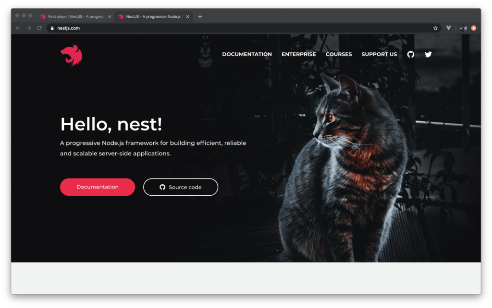
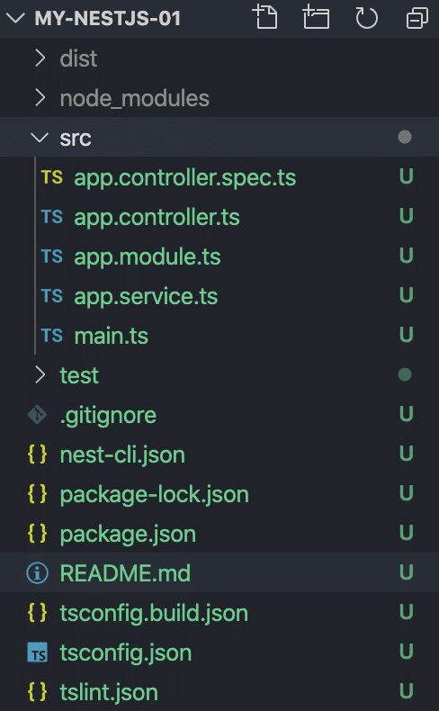
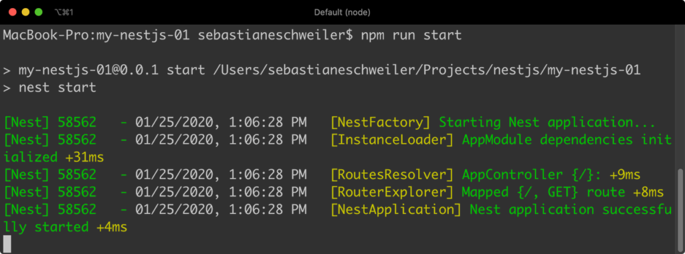
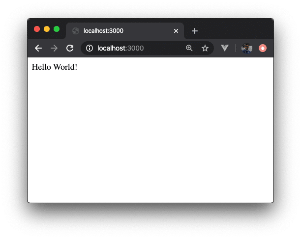
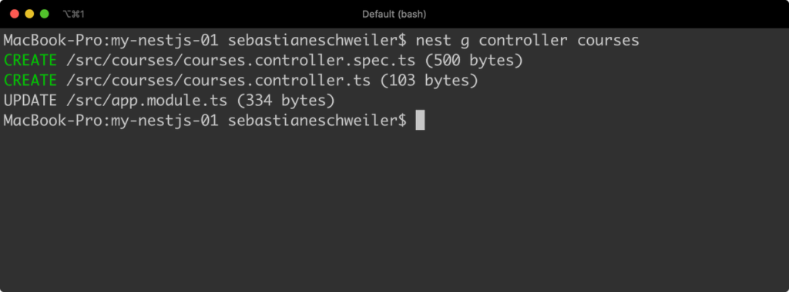
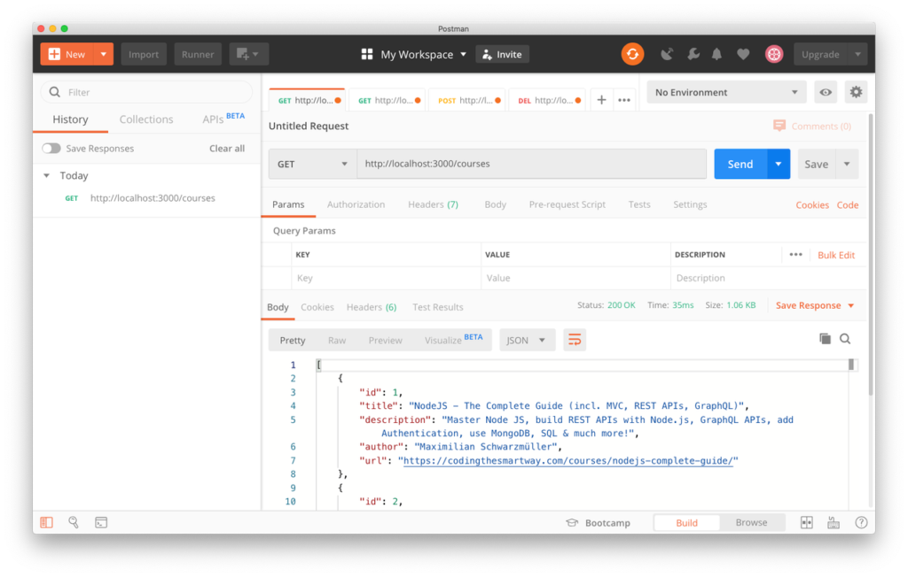
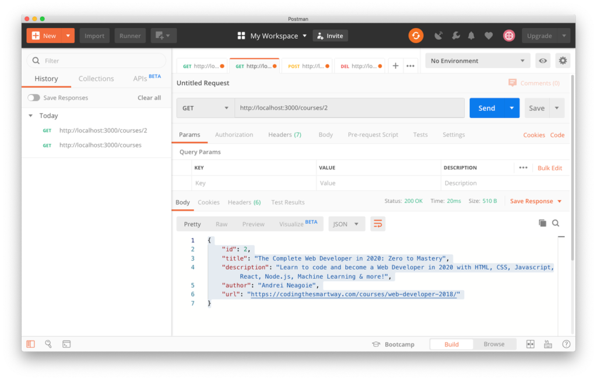
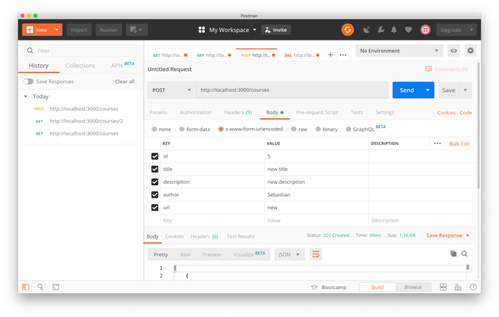
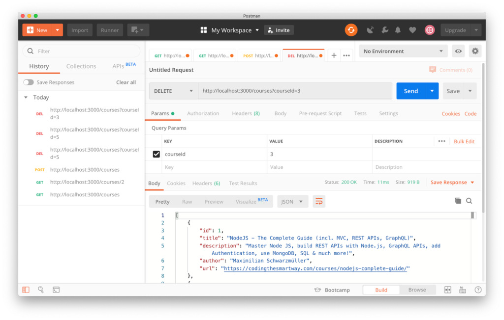

import { Image } from '@astrojs/image/components';
import YouTube from '~/components/widgets/YouTube.astro';
export const components = { img: Image };


<YouTube url="https://youtu.be/4RkMAt8-u8g" />

Welcome to this NestJS tutorial for absolute beginners. In the following you’ll learn NestJS from the ground up which means that we’ll go through all steps which are necessary to get NestJS installed, create a new NestJS project from scratch and implement a first example from start to finish.  
  
NestJS is a progressive Node.js framework for building efficient, reliable and scalable server-side applications. The framework fully supports TypeScript and under the hood it makes use of the Node.js framework Express.  
  
NestJS introduces another level of abstraction on top of Node.js and Express and further helps you to structure your back-end codebase. The project’s website can be found at [https://nestjs.com/](https://nestjs.com/):



## Installing NestJS

Before you can use NestJS to create your back-end application we need to make sure that the Nest CLI (Command Line Interface) is installed on your system. This can be done by using the Node.js Package Manager NPM in the following way:

```
$ npm i -g @nestjs/cli
```

Of course, you need to make sure that Node.js and NPM is already installed on your system. If this is not the case yet, just follow the instructions on [https://nodejs.org/](https://nodejs.org/) to install Node.js and NPM on your computer.  
  
Once the installation of the Nest CLI is completed the `nest` command will be available. You can use this command in the following way to initiate a new NestJS project:

```
$ nest new my-nestjs-01
```

Executing this command creates a new folder _my-nestjs-01_ in the current location and downloads the default project template into this folder.  
  
Let’s take a closer look at the initial project structure.

## Project Structure

The initial structure of the project consists of the following folders and files:



The most important folder of the project is the _src_ folder. This is the place where you’ll find the TypeScript files which is application code inside. Later, when implementing our first example we’ll spend most of the time working in this directory.  
  
Inside the _src_ folder you can find five files in the initial project setup:

- _main.ts:_ Entry point of application. By using the _NestFactory.create()_ method a new Nest application instance is created.
- _app.module.ts:_ Contains the implementation of the application’s root module.
- _app.controller.ts:_ Contains the implementation of a basic NestJS controller with just one route.
- _app.service.ts:_ Contains the a basic service implementation.
- _app.controller.spec.ts:_ Testing file for controller.

Let’s take a closer look at the code:  
  
In file main.ts you’ll find the following default implementation:

```typescript
import { NestFactory } from '@nestjs/core';
import { AppModule } from './app.module';

async function bootstrap() {
  const app = await NestFactory.create(AppModule);
  await app.listen(3000);
}
bootstrap();
```

This is the entry point of the application. First of all _NestFactory_ is imported from the _@nestjs/core_ library. Furthermore _AppModule_ is imported from the _app.module.ts_ file of our project.  
  
Second, the _bootstrap_ function is implemented and marked as _async_. Inside this function the _NestFactory.create()_ method is called and the root application module _AppModule_ is passed into that function call as an argument. This is creating a new NestJS application instance with the module attached. To start up the server the next step is to call the _listen_ method and pass in the port on which the web server should be running, e.g. port 3000. Because the listen method is returning a promise when the server has been started successfully we’re using the await keyword here.  
  
Finally the file contains the call of the bootstrap function, so that the code is executed.  
  
Next let’s take a look at the implementation of the root application module which you can find inside the file _app.module.ts_:

```typescript
import { Module } from '@nestjs/common';
import { AppController } from './app.controller';
import { AppService } from './app.service';

@Module({
  imports: [],
  controllers: [AppController],
  providers: [AppService],
})
export class AppModule {}
```

To declare class _AppModule_ as a module the _@Module_ decorator is used which is imported from the _@nestjs/common_ library. An object with three properties is passed into the @Module decorator. The three properties are:

- imports
- controllers
- providers

All controllers which should be part of _AppModule_ needs to be part of the array which is assigned to the _controllers_ property (in the initial state of the application there is only one controller which is assigned to the root module: _AppController_).  
  
Services which should be available in _AppModule_ must be listed in the array which is assigned to the _providers_ property.  
  
Next we’re taking a closer look at the _AppController_ implementation in _app.controller.ts_:

```typescript
import { Controller, Get } from '@nestjs/common';
import { AppService } from './app.service';

@Controller()
export class AppController {
  constructor(private readonly appService: AppService) {}

  @Get()
  getHello(): string {
    return this.appService.getHello();
  }
}
```

This is a very simple implementation of a NestJS controller which consists of just one GET route. In order to make a class a controller you need to add the _@Controller_ decorator. This decorator is imported from the _@nestjs/common_ library.  
  
A controller of relies on a service class. In this default example _AppController_ makes use of a service named _AppService_. _AppService_ is being implemented in file _app.service.ts_ and therefore a corresponding import statement needs to be added on top.  
  
By using the concept of Dependency Injection _AppService_ is inserted into AppController (by adding a constructor parameter of that type).  
  
A default route is implemented by implementing the _getHello_ method. In order to declare that this method handles a HTTP GET request the _@Get_ docorator is added to this method. The method is using the _getHello_ method from _AppService_ to retrieve data and at the same time return that data as a response.  
  
Let’s move on and see what’s inside _app.service.ts_:

```typescript
import { Injectable } from '@nestjs/common';

@Injectable()
export class AppService {
  getHello(): string {
    return 'Hello World!';
  }
}
```

This file is containing the implementation of the _AppService_ class. In order to make _AppService_ a service class (which can be injected in a controller like seen before) the _@Injectable_ decorator needs to added before that class. Again this decorator type is imported from the _@nestjs/common_ package.  
  
The service class implementation is very simple and only consists of the implementation of the _getHello_ method. This method is just returning the static string “Hello World!”. In a real world scenario a service method would of course be used to retrieve data e.g. from database, a web service or some other data source.  
  
Now, that’ve a first impression of the most important building blocks of the default NestJS application we’re ready to start up the server and see what we’re getting as a result.

## Running The Application

To start the the server you simply need to execute the following command within the project folder:  
  
`$ npm run start`  
  
You should then see the following output on the command line:



Finally you should see the message “Nest application successfully started”. This message informs you that the server is ready and you can try sending the first GET request to the default endpoint by simply using the browser and opening URL http://localhost:3000. The result can be seen in the following screenshot:



No surprises here: The text which is being returned is “Hello World!”. This string is retrieved from the _getHello_ service method and then return as a response of the HTTP GET request by the corresponding controller method.  
  
There is another option to start up the server:  
  
`$ npm run start:dev`  
  
If you’re using the _start:dev_ script _nodemon_ is used to start up the server which means that all of your code files are being monitored for changed. The server is automatically restarted when changes in your source code are detected.

## Adding A New Endpoint

In the next step we’re going to use the new NestJS project to add a new endpoint. The endpoint which we’re going to add should accept the HTTP GET, POST, and DELETE requests and will be used to manage data of online courses. The following endpoints will be created to cover those requirements:

- _/courses_ - Endpoint accepting HTTP GET requests to retrieve a list of all available online courses
- _/courses/\[courseId\]_ - Endpoint accepting HTTP GET request to retrieve the online course with a specific course ID
- _/courses_ - Endpoint accepting HTTP POST requests to add new courses
- _/courses_ \- Endpoint accepting HTTP DELETE request to remove courses. The course which should be removed needs to be specified by it’s ID which is added to the request by using a query parameter

### Creating A New Module

As NestJS allows us to organize our code in modules it’s a good idea to start the implementation with the creation of a new module:  
  
`$ nest generate module courses`  
  
Executing this command is adding a new file to the project: _/src/courses/courses.module.ts_:  
  
Inside this file you can find the following default implementation of an empty module named _CoursesModule_:

```typescript
import { Module } from '@nestjs/common';

@Module({})
export class CoursesModule {}
```

The following import statement is added into _app.module.ts_ automatically, so that CoursesModule is added to the NestJS application:

```typescript
import { CoursesModule } from './courses/courses.module';
```

Furthermore you’ll notice that _CoursesModule_ is added to the array which is assigned to the _imports_ property of the _@Module_ decorator:

```typescript
@Module({
  imports: [CoursesModule],
  controllers: [AppController],
  providers: [AppService],
})
export class AppModule {}
```

### Creating A New Controller

Let’s add a new controller to _CoursesModule_ by using the following command:  
  
`$ nest g controller courses`  
  
Executing this command will show you the following output:



Here you can see which files have been added to the project. The main controller implementation is available in file _courses.controller.ts_:

```typescript
import { Controller } from '@nestjs/common';
@Controller('courses')
export class CoursesController {}
```

This is just an empty controller implementation. We can now use this file to add code which is needed to cover our requirements.  
  
Again, _CoursesController_ is added automatically to _CoursesModule_ like you can see in the following:

```typescript
import { Module } from '@nestjs/common';
import { CoursesController } from './courses.controller';

@Module({
  controllers: [CoursesController]
})
export class CoursesModule {}
```

### Mock Data

Of course we need to prepare some sample courses data which can be returned when the user is accessing the corresponding endpoints:  
  
Create a new file inside of the src/courses folder within your project structure: _courses.mock.ts_ and insert the following content:

```typescript
export const COURSES = [
    { id: 1, title: 'NodeJS - The Complete Guide (incl. MVC, REST APIs, GraphQL)', description: "Master Node JS, build REST APIs with Node.js, GraphQL APIs, add Authentication, use MongoDB, SQL & much more!", author: 'Maximilian Schwarzmüller', url: 'https://codingthesmartway.com/courses/nodejs-complete-guide/' },
    { id: 2, title: 'The Complete Web Developer in 2020: Zero to Mastery', description: "Learn to code and become a Web Developer in 2020 with HTML, CSS, Javascript, React, Node.js, Machine Learning & more!", author: 'Andrei Neagoie', url: 'https://codingthesmartway.com/courses/web-developer-2018/' },
    { id: 3, title: 'Learn and Understand NodeJS', description: "Dive deep under the hood of NodeJS. Learn V8, Express, the MEAN stack, core Javascript concepts, and more.", author: 'Anthony Alicea', url: 'https://codingthesmartway.com/courses/learn-understand-nodejs/' },
];
```

### Setting Up A New Service

Data access will be management by a service, so the next step is to generate a service class by using the nest command again:  
  
`$ nest generate service courses`  
  
This command is adding a new file _courses.service.ts_ to the project and inserting the following code into this file:  

```typescript
import { Injectable } from '@nestjs/common';

@Injectable()
export class CoursesService {}
```

In order to make CoursesService part of CoursesModule the service is automatically added in file _courses.module.ts_:

```typescript
import { Module } from '@nestjs/common';
import { CoursesController } from './courses.controller';
import { CoursesService } from './courses.service';

@Module({
  controllers: [CoursesController],
  providers: [CoursesService]
})
export class CoursesModule {}
```

Let’s start to implement CoursesService step by step. First we need to get access to the courses sample data array available in file _courses.mock.ts_:

```typescript
import { Injectable, HttpException } from '@nestjs/common';
import { COURSES } from './courses.mock';

@Injectable()
export class CoursesService {
    courses = COURSES;
}
```

### Get Courses

The two service methods _getCourses()_ and _getCourse(courseId)_ are being implement to retrieve data:

```typescript
    getCourses(): Promise<any> {
        return new Promise(resolve => {
            resolve(this.courses);
        });
    }

    getCourse(courseId): Promise<any> {
        let id = Number(courseId);
        return new Promise(resolve => {
            const course = this.courses.find(course => course.id === id);
            if (!course) {
                throw new HttpException('Course does not exist', 404)
            }
            resolve(course);
        });
    }
```

The _getCourses()_ method is used to return the complete list of courses via a Promise. The _getCourse(courseId)_ method is retrieving just one single course by its id. Again the result is returned via Promise. In case the id which is passed into that method via the _courseId_ parameter is not existing a HTTP Status Code 404 response is returned.  

### Add Course

The next service method which needs to be implemented is _addCourse(course)_. This method is used to add new courses to the courses array. The return type of this method is again a Promise which is resolved once the data has been added successfully:

```typescript
    addCourse(course): Promise<any> {
        return new Promise(resolve => {
            this.courses.push(course);
            resolve(this.courses);
        });
    }
```

### Delete Course

Last but not least a service method _deleteCourse(courseId)_ is implemented to remove a specific course item from the list of courses. The corresponding implementation can be seen in the following:

```typescript
    deleteCourse(courseId): Promise<any> {
        let id = Number(courseId);
        return new Promise(resolve => {
            let index = this.courses.findIndex(course => course.id === id);
            if (index === -1) {
                throw new HttpException('Course does not exist', 404);
            }
            this.courses.splice(index, 1);
            resolve(this.courses);
        });
    }
```

### Updating CoursesController:

CoursesService can now be used to retrieve, add, or remove courses data. This is exactly the functionality which is needed for the endpoints which should be implemented. Let’s make use of CoursesService and use the CoursesController class to add the needed endpoints:

```typescript
import { Controller, Get, Param, Post, Body, Delete, Query } from '@nestjs/common';
import { CoursesService } from './courses.service';
import { CreateCourseDto } from './create-course.dto';

@Controller('courses')
export class CoursesController {
    constructor(private coursesService: CoursesService) {}

    @Get()
    async getCourses() {
        const courses = await this.coursesService.getCourses();
    }

    @Get(':courseId')
    async getCourse(@Param('courseId') courseId) {
        const course = await this.coursesService.getCourse(courseId);
        return course;
    }

    @Post()
    async addCourse(@Body() createCourseDto: CreateCourseDto) {
        const course = await this.coursesService.addCourse(createCourseDto);
        return course;
    }

    @Delete()
    async deleteCourse(@Query() query) {
        const courses = await this.coursesService.deleteCourse(query.courseId);
        return courses;
    }
}
```

This is the complete source code which is needed in _courses.controller.ts_ to cover our requirements. Let’s go through it step by step:  
  
The first thing you should notice is that _CoursesService_ is injected into _CoursesController_, so that we’re able to make use of the service methods.  
  
The first endpoint _/courses_ is implemented by adding the _getCourses()_ Method. To specify that this method should handle an incoming HTTP GET request the _@Get()_ decorator is added. Inside this method we’re using the _getCourses_ service method from _CoursesService_ to retrieve the list of courses. As the service method is returning a Promise, we need to use the _await_ keyword here and also at the same time declare the method as _async_.  
  
The second GET endpoint _/courses/\[courseId\]_ is implemented using the controller method _getCourse_. The _@Get_ method decorator is used. This time the string ':courseId' is passed into the decorator to specify that the GET request is accepting a URL parameter. This URL is passed into the method by adding the courseId parameter to the method declaration and using the _@Param_ decorator.  
  
To retrieve the course dataset for the given id the service method _getCourse_ is used.  
  
The third method which is being implemented in _CoursesController_ is _addCourse_. This method is handling incoming HTTP Post request for the default controller endpoint _/courses_. This is being specified by using the _@Post()_ decorator in front of the method declaration.  
  
As the HTTP Post request to that endpoint should be used to create a new course dataset the data of the new course is passed in the request body. To get access to the request body a method parameter is introduced and the parameter decorator _@Body()_ is used. In order to define the structure of the body data a so called Data Transfer Object (DTO) type is used: _CreateCourseDto_. This custom class is implemented in file _create-course.dto.ts_:

```typescript
 export class CreateCourseDto {
    readonly id: number;
    readonly title: string;
    readonly description: string;
    readonly author: string;
    readonly url: string;
}
```

This is a class just consisting of the five courses properties.  
  
As the body parameter _createCourseDto_ of method _addCourse_ is then passed into the call of service method _addCourse_ diectly.  
  
Last controller method which is being implemented is handling the HTTP DELETE request and is named _deleteCourse_. To indicate that this method is handling an DELETE request the _@Delete_ decorator is added. The identifier of course which needs to be deleted is passed via query parameter. Here is an example for the delete URL for course with identifier 1:  
  
https://localhost:3000/courses?courseId=1  
  
As you can see the _query_ Parameter is added by attaching a question mark at the end of the URL following by the value assignment to the parameter. To get access to query parameters a parameter is added to the method definition. The _@Query_ decorator is used for this _query_ parameter and the value of _courseId_ can be accessed by `query.courseId`.

## Testing The New Endpoint With Postman

Now, we’ve added to code which is needed to full-fill the requirements. Let’s test out the API by using a tool called Postman. You can download a free version of Postman at [https://www.getpostman.com/](https://www.getpostman.com/).  
  
First let’s try out to retrieve the complete list of courses by executing an HTTP GET request for endpoint http://localhost:3000/courses:



The result we’re getting back is the list of courses in JSON format. Next let’s just retrieve one single course by using the identifier:



Again the result is returned in JSON format. This time the result is just consisting of one course dataset.  
  
Next we need to test to send a POST request to create a new course. In Postman you can use the Body tab to enter the course data in a table (by using the _x-www-form-urlencoded_ option):



Sending out this request created a new course and as a response you get back the newly created dataset in JSON format.  
  
Finally let’s try to delete a course by sending an HTTP DELETE request to _http://localhost:3000/courses/courseId=3_. Here we’re using the _courseId_ query Parameter to specify the identifier of the course which should be removed.



