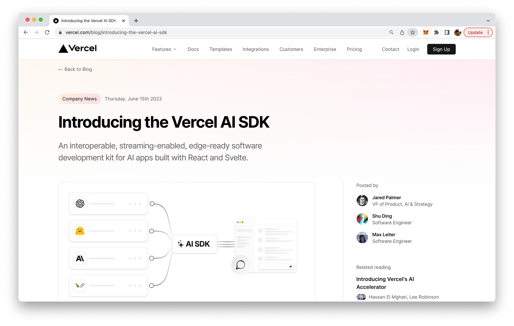
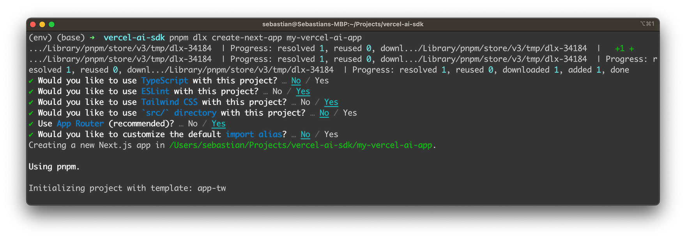
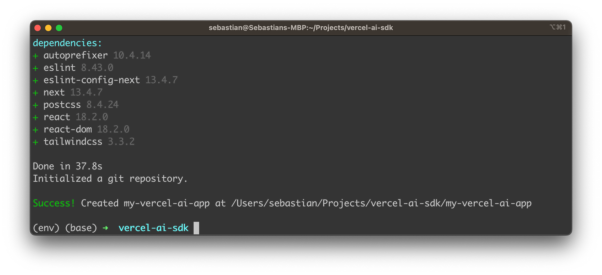
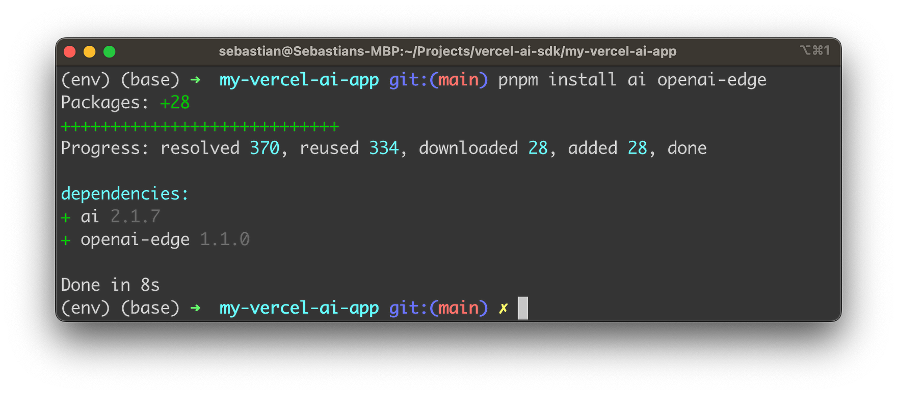
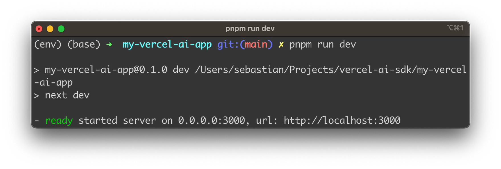
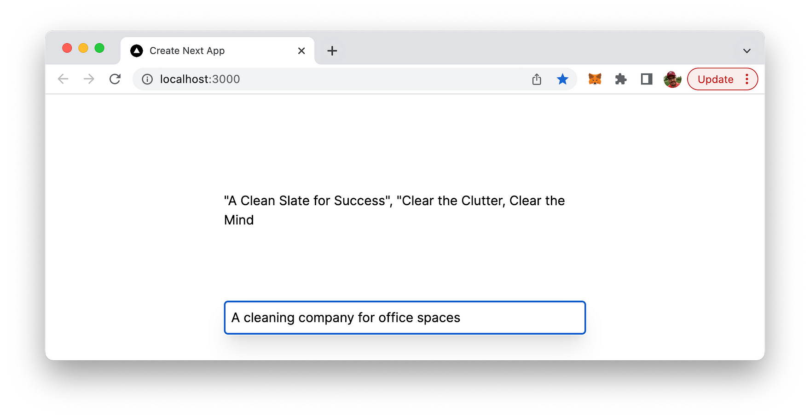

import { Image } from '@astrojs/image/components';
import YouTube from '~/components/widgets/YouTube.astro';
export const components = { img: Image };

Hello, fellow AI fans! Today, I want to share with you an exciting development in the world of AI-powered web development. I've been exploring the Vercel AI SDK, an open-source library that's been making waves in the tech community. This powerful toolset allows developers to build edge-ready AI-powered streaming text and chat web apps with ease, and I'm thrilled to share my findings with you.

## Getting Started with Vercel AI SDK

The Vercel AI SDK is a collection of tools designed to help you build AI-powered web-based user interfaces. To give you a taste of what it can do, let's walk through a quickstart tutorial where we'll build a simple AI-powered slogan generator with a streaming user interface.



First, you'll need to set up your project. You'll need Node.js 18+ installed on your local development machine and an OpenAI API key. Once you've got these prerequisites, you can start by creating a new Next.js application. The SDK provides some starter code to get you up and running quickly.

Use the following command to create the new project:

```bash
pnpm dlx create-next-app my-vercel-ai-app
```

This command start the project creation project and guides you through answering a few questions regrading the project configuration:



After that the project template and dependencies are being downloaded and installed:



Once the setup project is concluded you can directly enter the newly created project folder:

```bash
cd my-vercel-ai-app
```

Next, you'll install the necessary dependencies, ai and openai-edge. The latter is preferred over the official OpenAI SDK due to its compatibility with Vercel Edge Functions. Adding those dependencies is quite easy by using the following command:

```bash
pnpm install ai openai-edge
```



You'll then configure your OpenAI API Key in a .env.local file in your project root. Here the first step is to create this file by using the following command:

```bash
touch .env.local
```

Open the file in your favorite code or text editor and insert your OpenAI API key in the following format:

```
OPENAI_API_KEY=[YOUR OPEN AI API KEY]
```

## Implementing The Application

The next step is to create an API route. This route handler will use the Edge Runtime to generate a text completion via OpenAI, which will then be streamed back to Next.js. The SDK provides a neat example of what the route handler should look like:

```js
import { Configuration, OpenAIApi } from 'openai-edge';
import { OpenAIStream, StreamingTextResponse } from 'ai';
 
const config = new Configuration({
  apiKey: process.env.OPENAI_API_KEY,
});
const openai = new OpenAIApi(config);
 
export const runtime = 'edge';
 
export async function POST(req ) {
  const { prompt } = await req.json();
 
  const response = await openai.createCompletion({
    model: 'text-davinci-003',
    stream: true,
    temperature: 0.6,
    prompt: `Create three slogans for a business with unique features.
 
    Business: Bookstore with cats
    Slogans: "Purr-fect Pages", "Books and Whiskers", "Novels and Nuzzles"
    Business: Gym with rock climbing
    Slogans: "Peak Performance", "Reach New Heights", "Climb Your Way Fit"
    Business: ${prompt}
    Slogans:`,
  });
  const stream = OpenAIStream(response);
  return new StreamingTextResponse(stream);
}
```

Insert this new file in a new file app/api/completion/route.js within the Next.js project structure.

Let's break down this code snippet:

First, we import the necessary modules:

```js
import { Configuration, OpenAIApi } from 'openai-edge';
import { OpenAIStream, StreamingTextResponse } from 'ai';
```

`Configuration` and `OpenAIApi` are imported from the `openai-edge` package. Configuration is used to set up the configuration for the OpenAI API client, and `OpenAIApi` is the client itself. `OpenAIStream` and `StreamingTextResponse` are imported from the ai package. `OpenAIStream` is used to convert the response from the OpenAI API into a stream, and `StreamingTextResponse` is used to return the stream as a response.

Next, we set up the OpenAI API client:

```js
const config = new Configuration({
  apiKey: process.env.OPENAI_API_KEY,
});
const openai = new OpenAIApi(config);
```

We create a new `Configuration` instance, passing in an object that contains the API key for OpenAI, which is stored in an environment variable. We then create a new `OpenAIApi` instance, passing in the configuration we just created.

We also set the runtime to 'edge' for best performance:

```js
export const runtime = 'edge';
```

Next, we define an asynchronous function `POST` that takes a `Request` object as a parameter:

```js
export async function POST(req) {
  const { prompt } = await req.json();
```

This function is designed to handle POST requests. It extracts the `prompt` from the JSON body of the request.

Then, we ask OpenAI for a streaming completion given the prompt:

```js
const response = await openai.createCompletion({
  model: 'text-davinci-003',
  stream: true,
  temperature: 0.6,
  prompt: `Create three slogans for a business with unique features.
 
  Business: Bookstore with cats
  Slogans: "Purr-fect Pages", "Books and Whiskers", "Novels and Nuzzles"
  Business: Gym with rock climbing
  Slogans: "Peak Performance", "Reach New Heights", "Climb Your Way Fit"
  Business: ${prompt}
  Slogans:`,
});
```

We call the `createCompletion` method on the `openai` client, passing in an object that specifies the model to use (`text-davinci-003`), that we want a streaming response (`stream: true`), the temperature setting for the AI (which controls the randomness of the output), and the prompt that the AI should respond to.

Next, we convert the response into a friendly text-stream:

```js
const stream = OpenAIStream(response);
```

We call `OpenAIStream`, passing in the response from the `createCompletion` call, which converts the response into a stream.

Finally, we return the stream as a response:

```js
return new StreamingTextResponse(stream);
}
```

We create a new `StreamingTextResponse`, passing in the stream, and return it. This is the response that will be sent back to the client.

In summary, this code sets up an OpenAI API client, defines a function to handle POST requests, asks OpenAI for a streaming completion given a prompt, converts the response into a stream, and returns the stream as a response.

Finally, you'll create a client component with a form to collect the prompt from the user and stream back the completion. The SDK provides a `useCompletion` hook to handle user input and form submission. This hook provides multiple utility functions and state variables, including `completion`, `input`, `handleInputChange`, and `handleSubmit`.

Replace the default code in `app/page.js` with the following code snipped:

```js
'use client'
 
import { useCompletion } from 'ai/react';
 
export default function SloganGenerator() {
  const { completion, input, handleInputChange, handleSubmit } = useCompletion();
 
  return (
    <div className="mx-auto w-full max-w-md py-24 flex flex-col stretch">
      <form onSubmit={handleSubmit}>
        <input
          className="fixed w-full max-w-md bottom-0 border border-gray-300 rounded mb-8 shadow-xl p-2"
          value={input}
          placeholder="Describe your business..."
          onChange={handleInputChange}
        />
      </form>
      <div className="whitespace-pre-wrap my-6">{completion}</div>
    </div>
  );
}
```

Let's break down this React component:

First, we import the necessary hook from the `ai/react` package:

```js
import { useCompletion } from 'ai/react';
```

`useCompletion` is a custom React hook provided by the `ai/react` package. It's designed to handle user input and form submission for AI-powered completions.

Next, we define a functional component `SloganGenerator`:

```js
export default function SloganGenerator() {
```

This is a standard way to define a functional component in React.

Inside this component, we call the `useCompletion` hook:

```js
const { completion, input, handleInputChange, handleSubmit } = useCompletion();
```

The `useCompletion` hook returns an object that contains several properties: `completion`, `input`, `handleInputChange`, and `handleSubmit`. `completion` is the current completion result, a string value representing the generated text. `input` is the current value of the user's input field. `handleInputChange` and `handleSubmit` are functions that handle user interactions such as typing into the input field and submitting the form, respectively.

Next, we return the JSX for the component:

```js
return (
    <div className="mx-auto w-full max-w-md py-24 flex flex-col stretch">
      <form onSubmit={handleSubmit}>
        <input
          className="fixed w-full max-w-md bottom-0 border border-gray-300 rounded mb-8 shadow-xl p-2"
          value={input}
          placeholder="Describe your business..."
          onChange={handleInputChange}
        />
      </form>
      <div className="whitespace-pre-wrap my-6">{completion}</div>
    </div>
  );
```

This JSX represents the UI of the component. It consists of a form with an input field and a div to display the completion. The `onSubmit` prop of the form is set to `handleSubmit`, which means that when the form is submitted, the `handleSubmit` function will be called. The `value` prop of the input field is set to `input`, which means that the value of the input field will be the current value of the user's input. The `onChange` prop of the input field is set to `handleInputChange`, which means that when the user types into the input field, the `handleInputChange` function will be called. The completion is displayed inside the div.

Once you've set everything up, you can start your application and test it by entering a business description to see the AI-generated slogans in real-time.

Use the following command to start the web application:

```bash
pnpm run dev
```



And voila! You've built a streaming slogan generator using the Vercel AI SDK.



## The Power of Streaming

One of the key features of the Vercel AI SDK is its support for streaming interfaces. Streaming conversational text UIs, like ChatGPT, have gained massive popularity over the past few months. This is because they can provide a better user experience, especially in conversational applications like chatbots.

Large Language Models (LLMs) are extremely powerful, but when generating long outputs, they can be slow. If you try to build a traditional blocking UI, your users might find themselves staring at loading spinners for a significant amount of time. Streaming UIs can help mitigate this issue by displaying parts of the response as they become available.

The SDK provides examples of both blocking and streaming UIs. The streaming UI starts displaying the response much faster than the blocking UI, which has to wait for the entire response to be generated before it can display anything.

## Caching Responses

Depending on the type of application you're building, you may want to cache the responses you receive from your AI provider, at least temporarily. The Vercel AI SDK provides special lifecycle callbacks you can use for this purpose. The onCompletion callback is particularly useful, as it is called when the stream is closed. This is where you can cache the full response.

The SDK provides an example of how to use Vercel KV and Next.js to cache the OpenAI response for 1 hour. This can be particularly useful for applications where the same or similar requests are made frequently.

## Wrapping Up

The Vercel AI SDK is a powerful tool for building AI-powered user interfaces. Its support for streaming interfaces and response caching, along with its compatibility with popular frameworks like Next.js, makes it a versatile and efficient tool for developers. Whether you're building a chatbot, a slogan generator, or any other AI-powered application, the Vercel AI SDK can help you create a smooth and responsive user experience.

Remember, your imagination is the limit when it comes to using AI to build apps. So, feel free to experiment and extend the functionality of your applications. The Vercel AI SDK is designed to make implementing streaming UIs as simple as possible, allowing you to focus on what matters most - creating amazing applications for your users.

That's all for today, folks! I hope you found this exploration of the Vercel AI SDK as exciting as I did. Stay tuned for more deep dives into the world of tech and programming. Until next time, happy coding!


