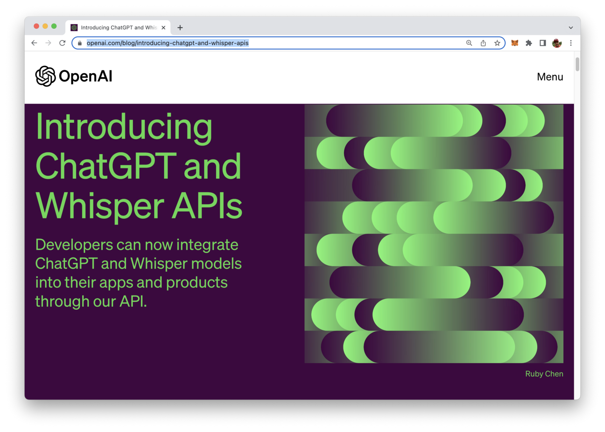
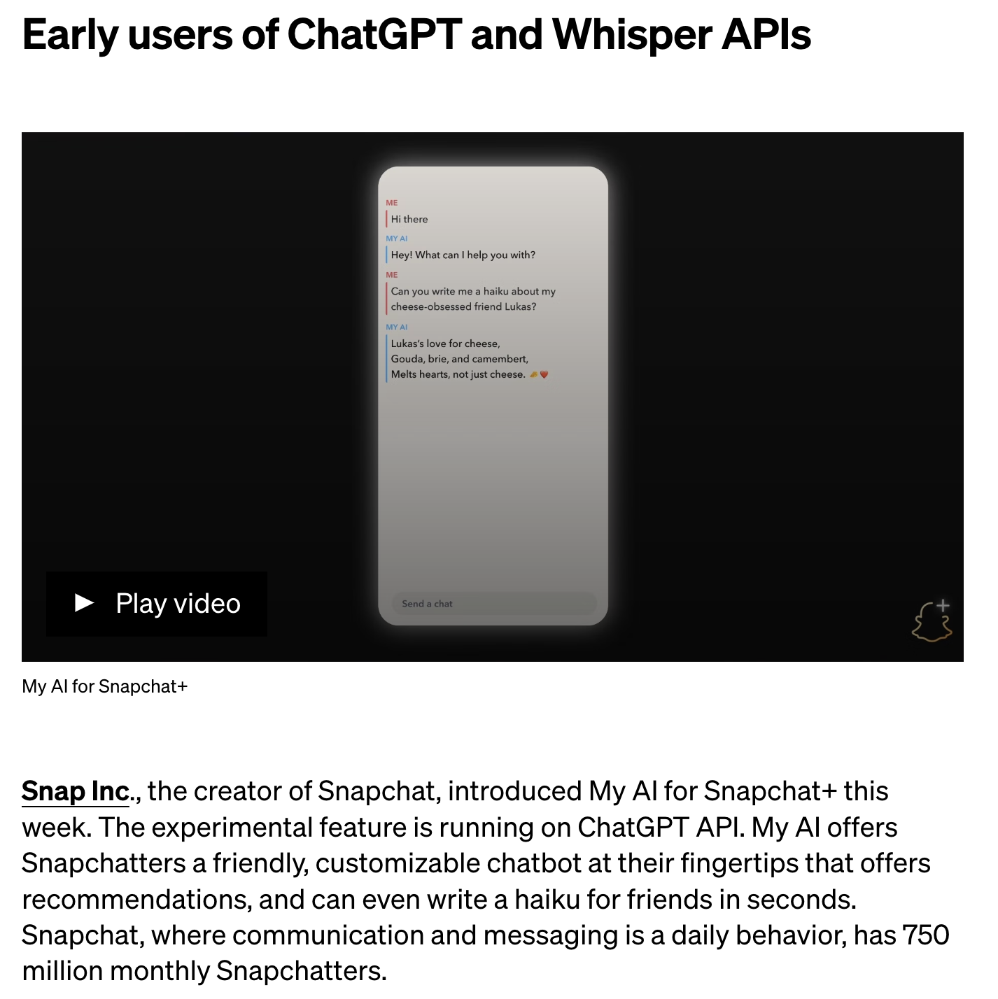
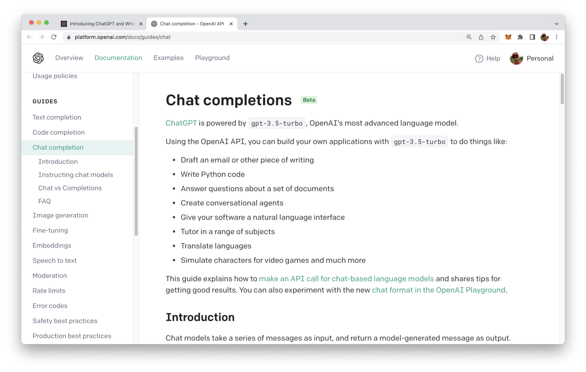
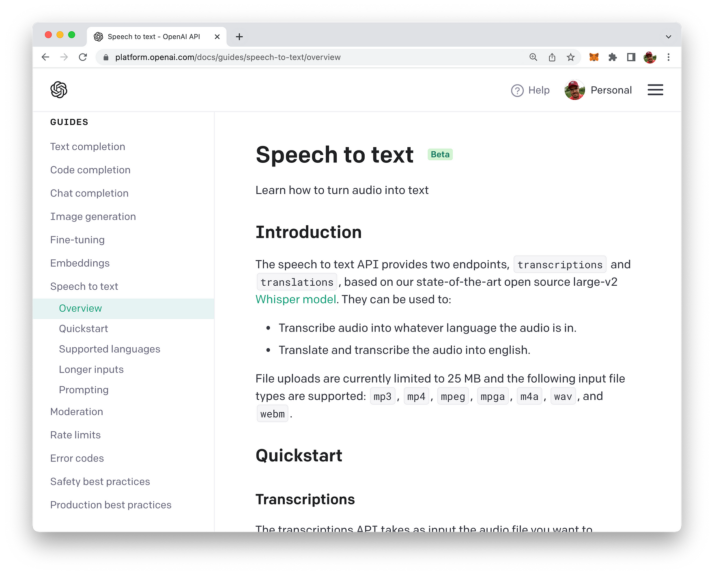

import { Image } from '@astrojs/image/components';
import YouTube from '~/components/widgets/YouTube.astro';
export const components = { img: Image };

<YouTube url="https://youtu.be/_du7vxxhGaQ" />

Welcome everyone to this exciting post where we'll be taking a first look at the latest release by OpenAI, the ChatGPT and Whisper API. The release of the ChatGPT and Whisper API marks a significant milestone in the field of natural language processing, as it enables developers and businesses to integrate state-of-the-art language models into their applications with ease.

The ChatGPT API provides access to OpenAI's cutting-edge language model, which can generate natural language responses to a wide range of prompts, making it ideal for chatbots, virtual assistants, and other conversational applications.

On the other hand, the Whisper API provides advanced speech-to-text capabilities. It is designed to help individuals and businesses save time and increase productivity by eliminating the need to manually transcribe spoken content. In the following you'll learn how to make use of Whisper AI! The software is able to recognize and transcribe speech in multiple languages and accents, and it offers features such as punctuation and formatting options to improve the accuracy of transcriptions.

In this post, we'll take a first quick look at the features and capabilities of both the ChatGPT and Whisper API.

## Availability Of New APIs Announced March 1st

OpenAI has announced the availability of ChatGPT API and Whisper API on March 1st with the following blog post: https://openai.com/blog/introducing-chatgpt-and-whisper-apis



Here you can find some general introduction to the new APIs and links to the corresponding section in OpenAI's documentation.

Some use cases of early API adopters are presented as well, e.g. the integration of My AI into Snapchat+ which is based on the ChatGPT API in the background:



## ChatGPT API

The ChatGPT API is based on a new model which is made available by OpenAI and which is named gpt-3.5-turbo.

The pricing for this model is reduced significantly in comparison to models like text-davinci-003. The costs is calculated based on tokens and is initially set to $0.002 per 1k tokens, which means that it is 10x cheaper as the previously existing language models.

The new ChatGPT models work differently then the previous ones. They process a series of messages along with additional information about them, such as who sent them and when they were sent. Essentially, instead of just looking at the individual words or phrases, ChatGPT models can consider the context and structure of a conversation.

The new API endpoint which nees to be used to send requests to the gpt-3.5-turbo model is https://api.openai.com/v1/chat/completions. E.g. you can use the curl command line tool to send a request to this endpoint as you can see in the following example:

```bash
curl https://api.openai.com/v1/chat/completions \
 -H "Authorization: Bearer $OPENAI_API_KEY" \
 -H "Content-Type: application/json" \
 -d '{
 "model": "gpt-3.5-turbo",
 "messages": [{"role": "user", "content": "What is the OpenAI mission?"}] 
 }'
```

The request body is is written in JSON format and contains an object with two properties:

* model: needs to be set the "gpt-3.5-turbo"
* messages: an array of message objects, here each object consists of two properties: role and content

The messages array is the replacement for the prompt property which had been used in old models to pass over the text prompt. By using an array it's now possible to provide conversation context for the request.

The role property can be set to three possible values:

* system: A system message is typically used as the first message object on a conversation. This system message can be used to tell the GPT model how it should behave. E.g. you can tell the model to generate answers in the style of a helpful assistant by using

```json
{"role": "system", "content": "You are a helpful assistant."}
```

* user: The user role is used to send messages which helps to instruct the model. E.g. you can use that message type to specify previous questions and instructutions which should be considers to be part of the conversation (and therefore set the context)
* assistant: The assistant role can be used to include previous answers generated by the GPT model.

Take a look at the following Python code which uses the messages array to set behaviour and context of the conversion:

```
import openai

openai.ChatCompletion.create(
  model="gpt-3.5-turbo",
  messages=[
        {"role": "system", "content": "You are a helpful assistant."},
        {"role": "user", "content": "Who won the world series in 2020?"},
        {"role": "assistant", "content": "The Los Angeles Dodgers won the World Series in 2020."},
        {"role": "user", "content": "Where was it played?"}
    ]
)
```

By first providing some context to the conversion we're able to finally address the user question Where was it played? to ChatGPT's API. The AI is then able to provide an answer to that question which wouldn't be possible without context.

If you'd like to read more about this new API you can take a look at the Chat completion guide in the OpenAI documentation:



## Whisper API

The Whisper API provides advanced speech-to-text capabilities which can be consumed by using the new endpoint: https://api.openai.com/v1/audio/transcriptions.

In the following you can see how you can use curl on the command line to send a request to this API endpoint:

```bash
curl https://api.openai.com/v1/audio/transcriptions \
  -H "Authorization: Bearer $OPENAI_API_KEY" \
  -H "Content-Type: multipart/form-data" \
  -F model="whisper-1" \
  -F file="@/path/to/file/openai.mp3"
```

In this example the content type of this request is set to multipart/form-data by adding a respective header field. This enables us to set the the model parameter to "whisper-1" and the file parameter to the path to an audio file. This audio file must contain the spoken language recording for which a transcription should be provided.

More information about the new Whisper API can be found in the Speech to text guide in OpenAI's documentation:



## Conclusion

In conclusion, the release of the ChatGPT and Whisper API by OpenAI is a game-changer for natural language processing and speech recognition technology. The ChatGPT API provides access to a state-of-the-art language model that can generate natural language responses to a wide range of prompts, while the Whisper API offers advanced speech-to-text capabilities. These APIs are powerful tools that can be easily integrated into applications to enhance productivity and improve user experience. With the release of these APIs, OpenAI is once again pushing the boundaries of what is possible with artificial intelligence and machine learning. Developers and businesses alike now have access to cutting-edge technology that will allow them to take their applications to the next level. We can't wait to see the incredible applications and products that will be built using the ChatGPT and Whisper API.