import { Image } from '@astrojs/image/components';
import YouTube from '~/components/widgets/YouTube.astro';
export const components = { img: Image };

Hey there, AI language model enthusiasts! Today, we'll dive deep into the fascinating world of Prompt Engineering. With the rise of powerful AI language models like GPT-4, GPT-3, and Codex, we now have an incredible opportunity to harness their potential for a vast range of applications. However, to get the most out of these models, we need to master the art of Prompt Engineering.

In this blog post, we'll explore best practices, tips, and practical examples to help you become a Prompt Engineering pro.

## Prompt Engineering Best Practices:

1. Use the latest model: Keep up with the newest models, as they're usually more capable. As today, consider use OpenAI models "gpt-4" "gpt-3.5-turbo", or "text-davinci-003" model for text generation.
2. Put instructions at the beginning of the prompt: To make your instructions more effective, place them at the beginning and separate them from the context with ### or """.
3. Be specific and descriptive: Provide clear and detailed instructions, mentioning the desired context, outcome, length, format, and style.
4. Articulate the desired output format through examples: Show the model specific format requirements, making it easier to parse multiple outputs reliably.
5. Reduce "fluffy" and imprecise descriptions: Opt for concise and precise instructions.
6. Instead of just saying what not to do, say what to do instead: Provide clear guidance on how the model should approach a task.

## Using ChatGPT and The OpenAI Playground

There are two ways to execute prompts with OpenAI's language models.

__Option 1__: Use OpenAI's ChatGPT website at https://chat.openai.com/chat

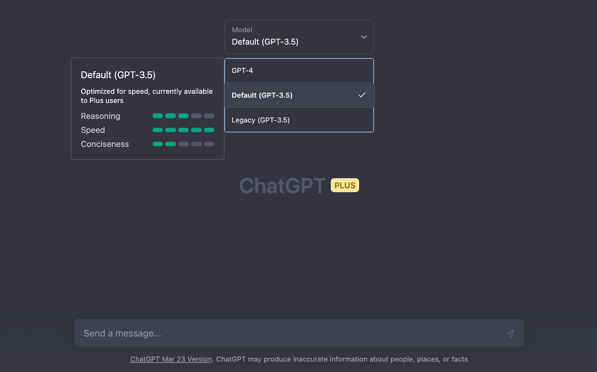

ChatGPT gives you direct access to OpenAI's chat models GPT-3.5 and GPT-4.

__Option 2__: Use OpenAI's Playground at https://platform.openai.com/playground

1. Sign up or log in to your OpenAI account if you haven't already.
2. Once you're logged in, you will see a text box where you can input your prompt.
3. Enter your prompt, including any instructions, context, and separators, as we discussed earlier.
4. If you want to adjust the model parameters, you can do so in the settings or options panel. You can typically modify parameters such as temperature and max tokens. In ChatGPT, you can usually find a gear icon to access these settings.
5. Click the "Submit" or "Generate" button to execute the prompt. The AI will process the prompt and generate a response based on the given instructions and context.
6. Review the generated output, and if necessary, modify your prompt or model parameters to refine the results.

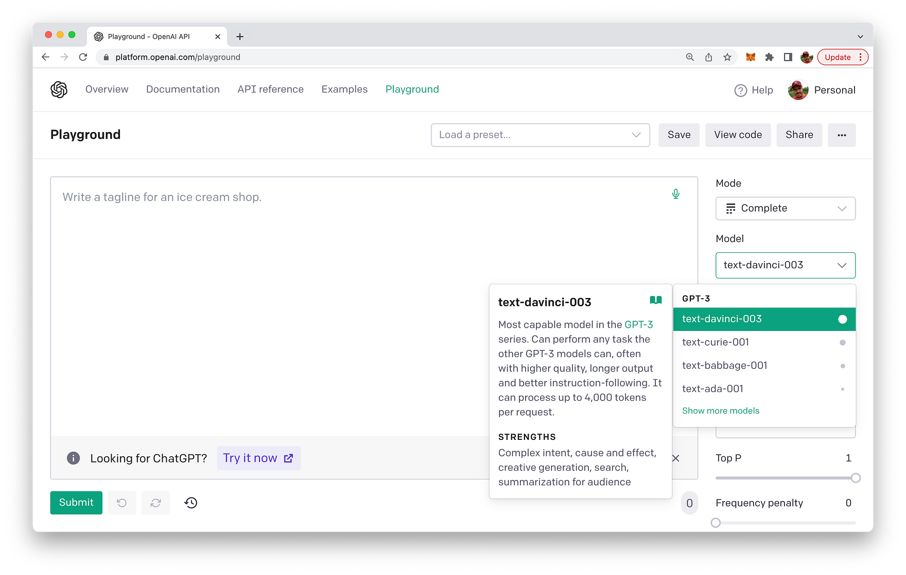

From the OpenAI Playground you can use all available Chat and Completion AI models.

## Tips for Effective Prompts

When designing prompts, consider the following aspects:

__Tip 1: Identity - Give the language model an identity.__

When giving the language model an identity, you can create a prompt that introduces the AI as a specific character or expert in a certain field. This can help guide the model to respond in a manner consistent with that identity. Here's an example:

Prompt: *"Hello, I am ChatGPT, an AI historian specializing in the history of ancient civilizations. Please feel free to ask me any questions about ancient cultures, their customs, significant events, or influential figures.
What can you tell me about the ancient Egyptians?"*

By giving the language model an identity as an AI historian, you set the context for the AI to generate responses related to history, specifically ancient civilizations. Users are likely to engage with the AI in a way that aligns with this identity, resulting in a more focused and relevant conversation.

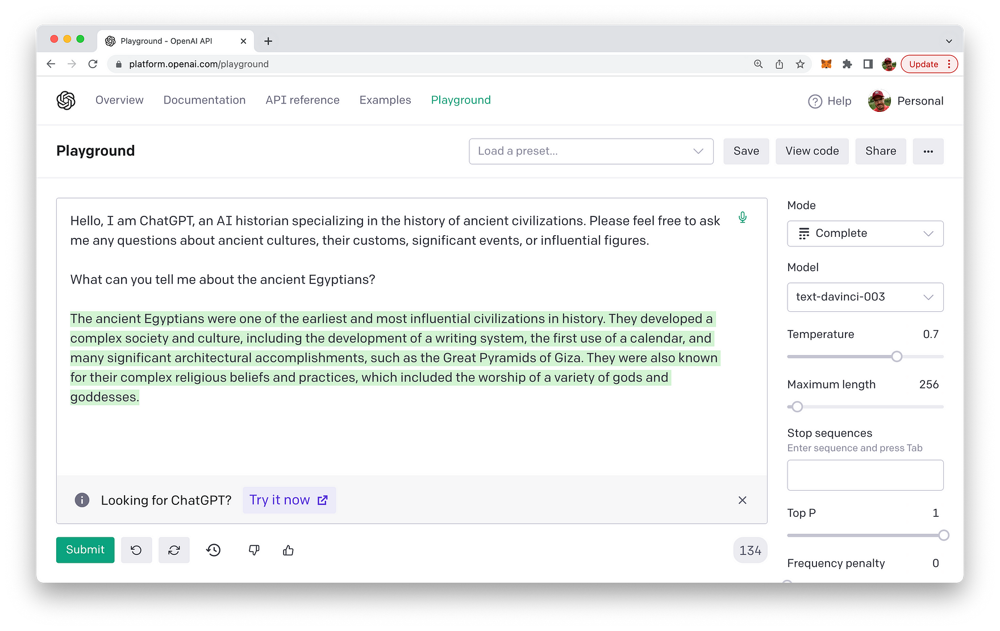

You can also provide even more structure to your prompt input you can also use labels like "Question" and answer like you can see in the following:

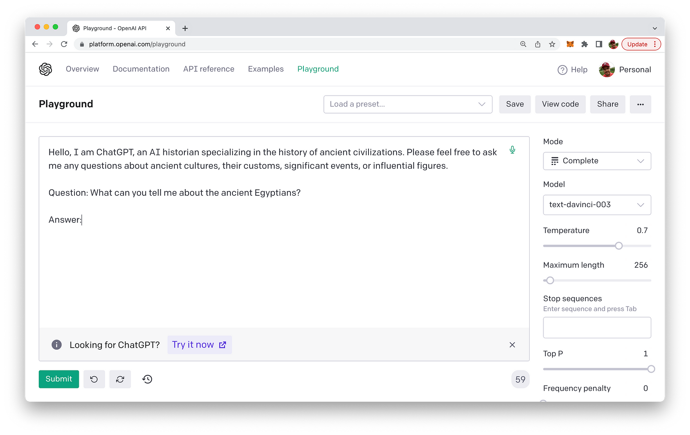

The resulting text completion is then done in the following way:

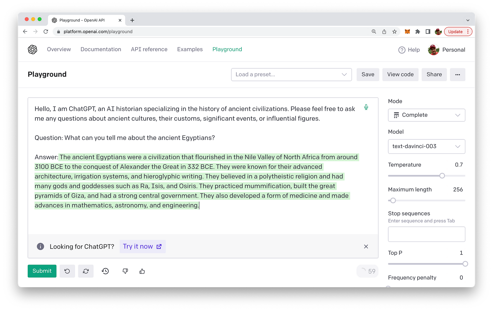

By providing such a structure you can also include questions and full answers in the prompt to provide more guidance on how an answer to a question must look like.

With GPT chat-models (like _gpt-3.5-turbo_ or _gpt-4_) you need to use the system message field for the purpose of setting the identity:

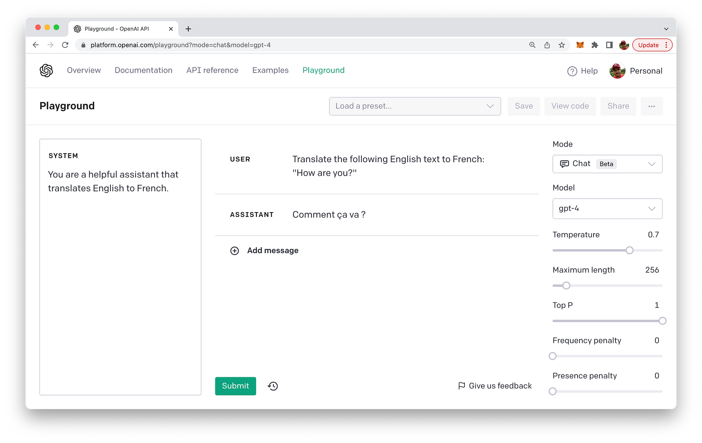

__Tip 2: Context - Provide relevant context for the task__

When providing relevant context for the task, the prompt should include necessary background information that helps the language model understand the situation and generate a more accurate response. Here's an example:

Prompt: *"In the late 18th century, the Industrial Revolution began in Britain, transforming the economy and society with the development of new machinery and innovations. What were some key inventions and their impact during this period?"*

In this prompt, the context is provided by describing the time and location (late 18th century, Britain) and the event (the Industrial Revolution). By including this information, the language model is better equipped to generate a relevant response about the key inventions and their impact during the Industrial Revolution.

__Tip 3: Task: Describe the model's job__

When creating a prompt that clearly describes the model's job, it's essential to be specific about the task and the desired format of the response. Here's an example:

Prompt: *"List three positive and three negative effects of social media on mental health, and provide a brief explanation for each."*

In this prompt, the model's job is clearly described: it must generate a list of three positive effects and three negative effects of social media on mental health, along with brief explanations for each effect. This level of specificity helps guide the model towards generating a more focused and relevant response.

__Tip 4: Conditions: Set conditions to prevent hallucination or incorrect responses__

When constructing a prompt that includes conditions to prevent hallucinations or incorrect responses, you can incorporate phrases that encourage the model to be cautious and accurate. Here's an example:

Prompt: *"Based on the available scientific evidence, list three possible health benefits of moderate coffee consumption. If there isn't enough evidence for three benefits, mention as many as you can find with a brief explanation for each. Please avoid speculating or making assumptions."*

This prompt sets conditions by asking the model to rely on available scientific evidence and discourages speculation or assumptions. By emphasizing the importance of evidence-based information, the prompt helps guide the model to generate more accurate responses.

__Tip 5: Labels: Use labels to set expectations and structure__

Incorporating labels into your prompt can help set expectations and provide structure for the model's response. Here's an example:

```
Please provide information about the Great Barrier Reef in the following categories:
Location: [Location]
Size: [Size]
Biodiversity: [Biodiversity]
Threats: [Threats]
Conservation efforts: [Conservation]
```

By using labels (e.g., `[Location]`, `[Size]`, etc.), this prompt sets clear expectations for the format of the response, ensuring the model organizes its answer into the specific categories requested. The labels also guide the model to generate a more structured and relevant output.

Let's test this prompt in the OpenAI Playground with the text-davince-003 model:

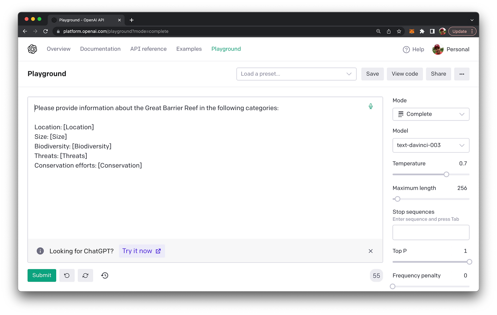

Once the query is submitted the output is generated according to the given output format and the provided labels as you can see in the following screenshot:

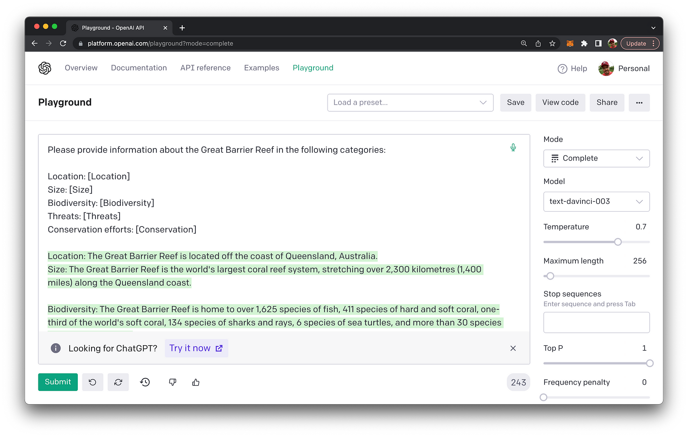

You can also enhance the prompt and further specify the format. E.g. specify to output the Threads section in bullet points:

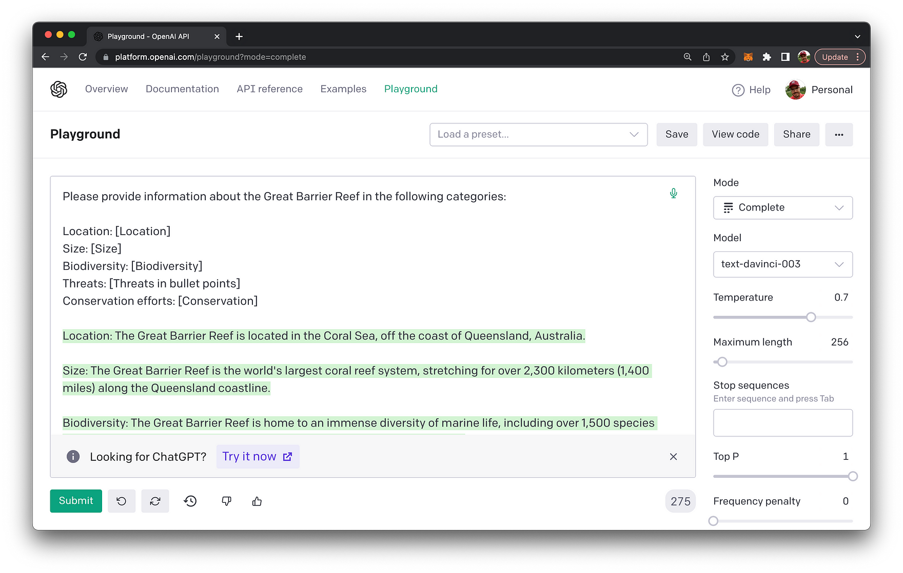

The output of this section is now containing a list of bullet points:

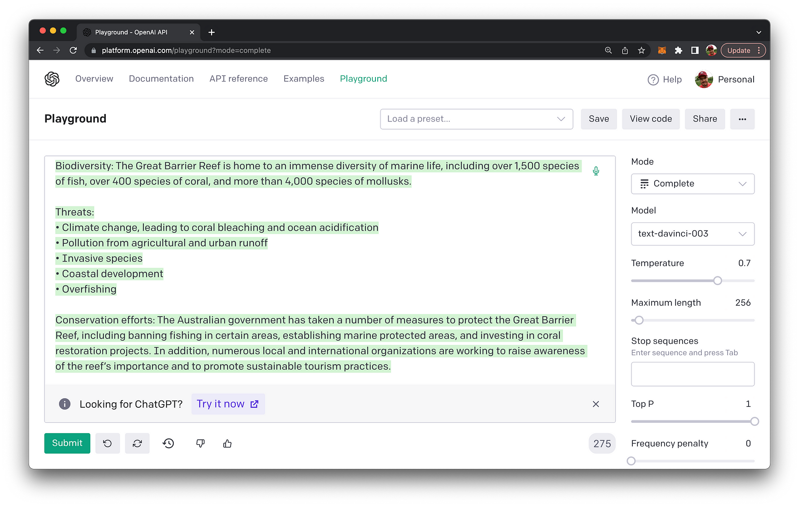

The same prompt is also working for the chat-based model gpt-3.5-turbo as you can see in the following:

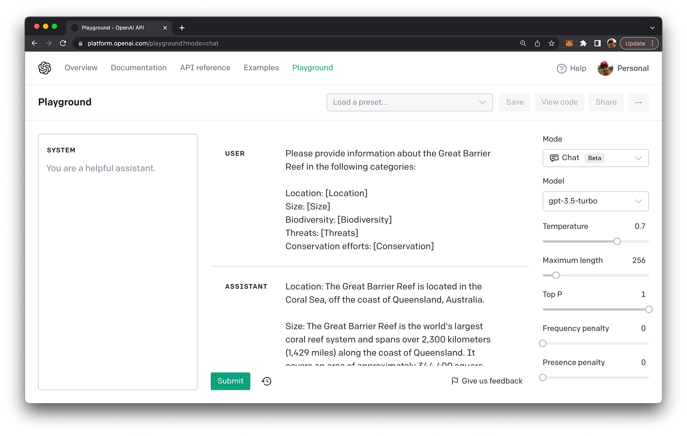

__Tip 6: Injecting Context__

Here's a prompt example for injecting context using ### (you can also use """) as a separator:

```
Please provide a brief analysis of the strengths and weaknesses of the company mentioned in the text below.

Text: ###
The XYZ Corporation is a leading technology company specializing in the development of cutting-edge software solutions. Over the past decade, they have grown exponentially, securing numerous high-profile clients and earning a reputation for innovation.

However, some challenges still exist for the company. Their rapid growth has led to organizational issues, as well as difficulties in retaining top talent. Additionally, XYZ Corporation has been criticized for a lack of focus on environmental sustainability in their operations.

Despite these challenges, the company has made strides to address these concerns, investing in employee retention programs and launching a new initiative to reduce their carbon footprint.
###
```
In this example, the instruction is given at the beginning of the prompt, and the context (text) is separated using the ### delimiter. The language model will provide an analysis of the strengths and weaknesses of the company based on the given context.

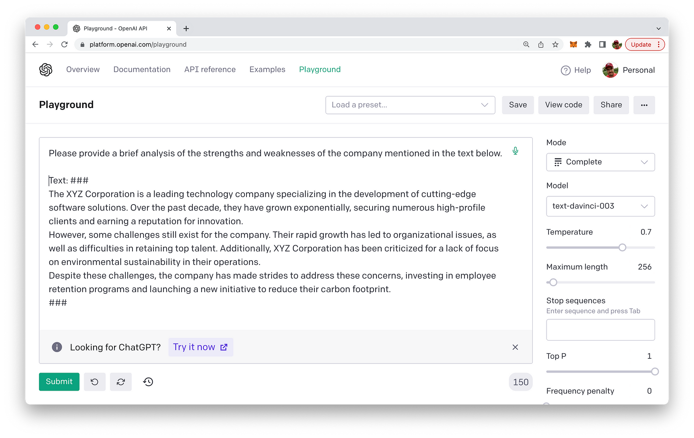

Result of this prompt:

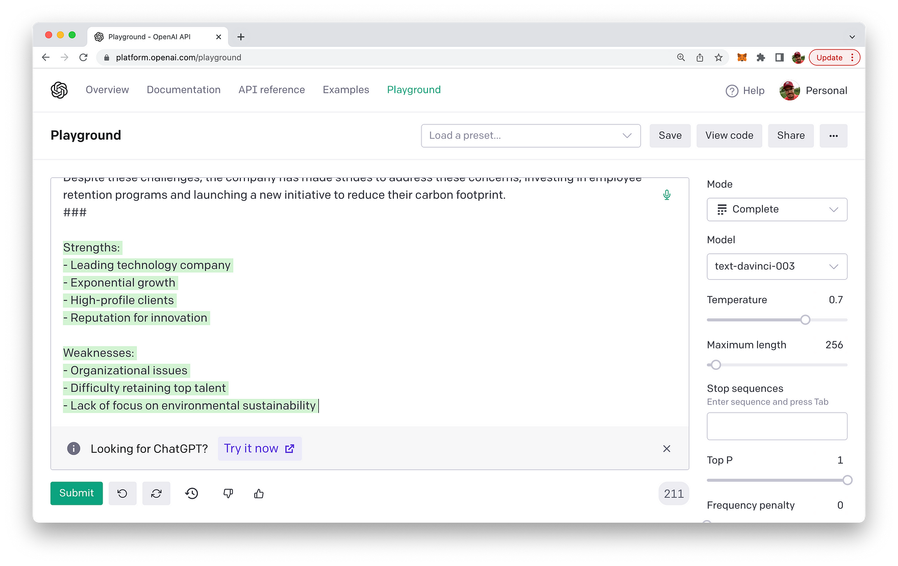

## Conclusion

Prompt engineering is the key to unlocking the full potential of powerful language models. By understanding and applying the best practices and techniques we've discussed in this blog post, you'll be well on your way to becoming a prompt engineering expert. Remember, practice makes perfect! So go ahead, start crafting those prompts, and unleash the true power of language models. Happy prompting!