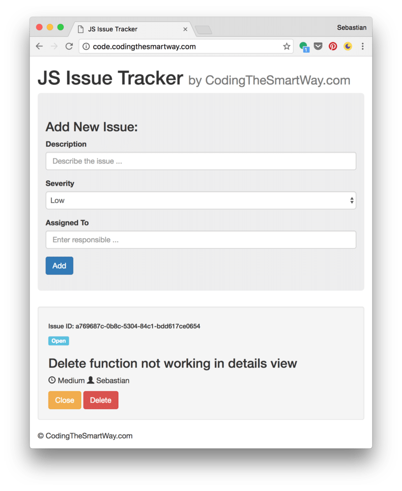

import { Image } from '@astrojs/image/components';
import YouTube from '~/components/widgets/YouTube.astro';
export const components = { img: Image };


<YouTube url="https://youtu.be/NYq9J-Eur9U" />

Modern JavaScript Frameworks like Angular, React and Vue.js makes it very easy to build complex single page web applications. However, using a those frameworks is not mandatory and you can also go with plain and pure JavaScript. This tutorial guides you through building a web application in pure JavaScript step-by-step.

## What We're Going To Build

The application we're going to build in this tutorial looks like the following:

 This is a simple issue tracker application and as you can see the user interface is split up into two sections. On top an input form is visible. By using the input fields for _Description_, _Severity_ and _Assigned To_ the user is able to enter new issues. The issues are stored in the Browser's Local Storage. The list of existing issues is printed out in the bottom area. Here you can see that each issue is printed out with the details of description, severity and assigned to. In addition you can see that the issue is identified by a unique issue id. The issue is a GUID which is generated when the issue is created and stored in the Local Storage as well. Furthermore each issue has a status assigned. By default the status is “Open”. If an issue is resolved the user is able to set the status to “Closed” by using the Close button. The issue can be deleted from the list (and from Local Storage) by clicking on button Delete.

## Setting Up The Project

The project setup is really simple. Because we only want to use pure JavaScript we do not need to install frameworks or dependencies. Start by creating a new project folder and inside that new folder create two empty new files: _index.html_ and _main.js_.

The file _index.html_ is the entry point for our application and contains the HTML code. The file _main.js_ will be included in _index.html_ is contains the corresponding JavaScript code which is needed to implement the sample application.

### Creating index.html

We're starting by creating a basic HTML structure in index.html as you can see in the following listing:

```html
<!DOCTYPE html>
<html>
  <head>
    <meta charset="utf-8">
    <title>JS Issue Tracker</title>
  </head>
  <body>
    <script src="main.js"></script>
  </body>
</html>
```

### including JQuery, Bootstrap and Chance.js

We'll use Bootstrap CSS classes for applying styling to the user interface components. The easiest way to include Bootstrap is to add it from CDN.

First add the following in the head section:

```html
<link rel="stylesheet" href="https://maxcdn.bootstrapcdn.com/bootstrap/3.3.7/css/bootstrap.min.css" integrity="sha384-BVYiiSIFeK1dGmJRAkycuHAHRg32OmUcww7on3RYdg4Va+PmSTsz/K68vbdEjh4u" crossorigin="anonymous">
```

Then include the following in the body section (right before the closing `</body>` tag):

```html
<script src="https://ajax.googleapis.com/ajax/libs/jquery/1.12.4/jquery.min.js"></script>
<script src="https://maxcdn.bootstrapcdn.com/bootstrap/3.3.7/js/bootstrap.min.js" integrity="sha384-Tc5IQib027qvyjSMfHjOMaLkfuWVxZxUPnCJA7l2mCWNIpG9mGCD8wGNIcPD7Txa" crossorigin="anonymous"></script>
```

We're going to use a small JS library (ChanceJS) to generate unique identifiers for issues. Include that library by adding the following line as well:

```html
<script src="http://chancejs.com/chance.min.js"></script>
```

### Using live-server

As a development web server we're using _live-server_ in this tutorial. _live-server_ is a small web server with reload capabilities. It's available as an _npm_ package, so installation can be done with:

```
$ npm install -g live-server
```

Having completed the installation the command live-server is available. If you execute this command in the project directory the web server starts and our application opens in the browser.

## Implementating the UI

Let's add the HTML code to _index.html_ which is needed to implement the user interface:

```html
<!DOCTYPE html>
<html lang="en">
  <head>
    <meta charset="utf-8">
    <meta http-equiv="X-UA-Compatible" content="IE=edge">
    <meta name="viewport" content="width=device-width, initial-scale=1">
    <!-- The above 3 meta tags \*must\* come first in the head; any other head content must come \*after\* these tags -->
    <title>JS Issue Tracker</title>

    <!-- Bootstrap -->
    <!-- Latest compiled and minified CSS -->
    <link rel="stylesheet" href="https://maxcdn.bootstrapcdn.com/bootstrap/3.3.7/css/bootstrap.min.css" integrity="sha384-BVYiiSIFeK1dGmJRAkycuHAHRg32OmUcww7on3RYdg4Va+PmSTsz/K68vbdEjh4u" crossorigin="anonymous">

  </head>
  <body onload="fetchIssues()">
    <div class="container">
      <h1>JS Issue Tracker <small>by CodingTheSmartWay.com</small></h1>
      <div class="jumbotron">
        <h3>Add New Issue:</h3>
        <form id="issueInputForm">
          <div class="form-group">
            <label for="issueDescInput">Description</label>
            <input type="text" class="form-control" id="issueDescInput" placeholder="Describe the issue ...">
          </div>
          <div class="form-group">
            <label for="issueDescInput">Severity</label>
             <select class="form-control" id="issueSeverityInput">
              <option value="Low">Low</option>
              <option value="Medium">Medium</option>
              <option value="High">High</option>
            </select> 
          </div>
          <div class="form-group">
            <label for="issueDescInput">Assigned To</label>
            <input type="text" class="form-control" id="issueAssignedToInput" placeholder="Enter responsible ...">
          </div>

          <button type="submit" class="btn btn-primary">Add</button>
        </form>
      </div>
      <div class="row">
        <div class="col-lg-12">
          <div id="issuesList">
          </div>
        </div>
      </div>
      <div class="footer">
        <p>&copy CodingTheSmartWay.com</p>
      </div>

    </div>
   

    <script src="https://ajax.googleapis.com/ajax/libs/jquery/1.12.4/jquery.min.js"></script>
    <script src="http://chancejs.com/chance.min.js"></script>

    <script src="https://maxcdn.bootstrapcdn.com/bootstrap/3.3.7/js/bootstrap.min.js" integrity="sha384-Tc5IQib027qvyjSMfHjOMaLkfuWVxZxUPnCJA7l2mCWNIpG9mGCD8wGNIcPD7Txa" crossorigin="anonymous"></script>
    <script src="main.js"></script>
  </body>
</html>
```

First notice, that we've attached the onload _fetchIssues()_ event handler to the `<body>` element. This makes sure that the JavaScript function _fetchIssues()_ is called each time the application loads. _fetchIssues()_ will be implemented later on in file _main.js_ and will load all issues from Local Storage, generates the HTML output for the issues list and attaches the output to the DOM.

Within the body section one `<div>` element with the Bootstrap CSS class _containe_r is used to contain all other HTML elements.

Let's take a look at the form implementation. It's important to notice that all input elements and the `<form>` element itself get an id assigned. By using that identifier we can later on retrieve a reference to that element within the JavaScript code.

Furthermore it's important to notice that the HTML code which is needed to output the list of existing issues is not included in index.html. The reason is obvious. The HTML which is needed for the list output is dynamic and depends on the issue records retrieved from Local Storage. So the only thing you can find here is a `<div>` element with id _issuesList_. This element gives us the possibility of generating the needed HTML code with JavaScript and then place the result within that element.

## Fetching Issue Data From Local Storage

Let's switch over to _main.js_ and start implementing the JavaScript part of our application. The issue data should be saved in the Browser's Local Storage. The first thing we're going to implement is the code which is needed to retrieve issues from the Local Storage. We do that we adding function _fetchIssues()_:

```js
function fetchIssues () {
  var issues = JSON.parse(localStorage.getItem('issues'));
  var issuesList = document.getElementById('issuesList');
  
  issuesList.innerHTML = '';
  
  for (var i = 0; i < issues.length; i++) {
    var id = issues\[i\].id;
    var desc = issues\[i\].description;
    var severity = issues\[i\].severity;
    var assignedTo = issues\[i\].assignedTo;
    var status = issues\[i\].status;
    
    issuesList.innerHTML +=   '<div class="well">'+
                              '<h6>Issue ID: ' + id + '</h6>'+
                              '<p><span class="label label-info">' + status + '</span></p>'+
                              '<h3>' + desc + '</h3>'+
                              '<p><span class="glyphicon glyphicon-time"></span> ' + severity + ' '+
                              '<span class="glyphicon glyphicon-user"></span> ' + assignedTo + '</p>'+
                              '<a href="#" class="btn btn-warning" onclick="setStatusClosed(\\''+id+'\\')">Close</a> '+
                              '<a href="#" class="btn btn-danger" onclick="deleteIssue(\\''+id+'\\')">Delete</a>'+
                              '</div>';
  }
}
```

The first line of code is retrieving issues from Local Storage. This is done by executing `localStorage.getItem('issues')` and parse the string result into a JSON object.

With the second line of code we're retrieving the reference to the `<div>` element with id _issuesList_. The HTML content of that element can be accessed by property _innerHTML_. First we're using that property to set the content to an empty string. Next we're looping over the elements in issues by using a for loop and adding the HTML output for that element to _issuesList.innerHTML_.

## Saving Issue Data To Local Storage After Form Submit

First we need to attach an event handler to the submit event of the form. That is done by using the following line of code:

```js
document.getElementById('issueInputForm').addEventListener('submit', saveIssue);
```

A reference to the form element is retrieved by using _getElementById_. We're passing in the string _issueInputForm_ which is the id of the `<form>` element. The _addEventListener_ method is called to attach the submit event of the form to the _saveIssue_ event handler function. Let's implement this function next:

```js
function saveIssue(e) {
  var issueId = chance.guid();
  var issueDesc = document.getElementById('issueDescInput').value;
  var issueSeverity = document.getElementById('issueSeverityInput').value;
  var issueAssignedTo = document.getElementById('issueAssignedToInput').value;
  var issueStatus = 'Open';

  var issue = {
    id: issueId,
    description: issueDesc,
    severity: issueSeverity,
    assignedTo: issueAssignedTo,
    status: issueStatus
  }
  
  if (localStorage.getItem('issues') === null) {
    var issues = \[\];
    issues.push(issue);
    localStorage.setItem('issues', JSON.stringify(issues));
  } else {
    var issues = JSON.parse(localStorage.getItem('issues'));
    issues.push(issue);
    localStorage.setItem('issues', JSON.stringify(issues));
  }
  
  document.getElementById('issueInputForm').reset();
 
  fetchIssues();
  
  e.preventDefault(); 
}
```

First, the input values from the form controls are retrieved and stored in local variables. The _issueStatus_ is set to _Open_ and _issueId_ is generated by calling function _chance.guid()_. Next, the new _issue_ object is inserted into the _issues_ object in Local Storage.

Having inserted the issues object into Local Storage we need to empty the form by calling the _reset()_ method. We're calling _fetchIssues()_ again to make sure that the list output is re-generated and that the new issue item will be visible.

Finally, we need to execute _e.preventDefault()_ to avoid that the default submission of the form is taking place.

## Setting The Closed Status

The HTML output which is generated for each issue item in function _fetchIssues_ contains a button which can be used to set the issue status to _Closed_:

```html
<a href="#" class="btn btn-warning" onclick="setStatusClosed(\\''+id+'\\')">Close</a>
```

Here we're attaching the click event to the event handler method _setStatusClosed_. The implementation of this method is available in the following listing:

```js
function setStatusClosed (id) {
  var issues = JSON.parse(localStorage.getItem('issues'));
  
  for(var i = 0; i < issues.length; i++) {
    if (issues\[i\].id == id) {
      issues\[i\].status = "Closed";
    }
  }
    
  localStorage.setItem('issues', JSON.stringify(issues));
  
  fetchIssues();
}
```

The id of the current issue item is passed in as a parameter. To retrieve the corresponding item from Local Storage we first need to retrieve the issue items in JSON format. This is done by calling `localStorage.getItem('issues')` and passing the result to the `JSON.parse()` method.

## Deleting An Issue

Another button is generated for each issue item:

```html
<a href="#" class="btn btn-danger" onclick="deleteIssue(\\''+id+'\\')">Delete</a>
```

By clicking on this button the user should be able to delete the current issue item from the list and from Local Storage. The click event is bound to the _deleteIssue_ event handler function. The implementation of this method can be seen in the following:

```js
function deleteIssue (id) {
  var issues = JSON.parse(localStorage.getItem('issues'));
  
  for(var i = 0; i < issues.length; i++) {
    if (issues\[i\].id == id) {
      issues.splice(i, 1);
    }
  }
  
  localStorage.setItem('issues', JSON.stringify(issues));
  
  fetchIssues();
}
```

The implementation is similar to the implementation of the _setStatusClosed_ function we saw before. The main difference is that we're using the _splice_ method to delete the current item from the array _issues_. After having removed the current issue item from the array we're writing it back to Local Storage and execute function _fetchIssues_ again to update the list output.

## Summary

Modern JavaScript frameworks like Angular, React and Vue.js makes it easy and convenient to write single page web application. However those frameworks are not essential and you can achieve the same results with plain & pure JavaScript. Furthermore, understanding the basics of JavaScript will help you to learn and use JS frameworks.

In this tutorial you've learned the basics of JavaScript by following a practical example, the issue tracker demo.