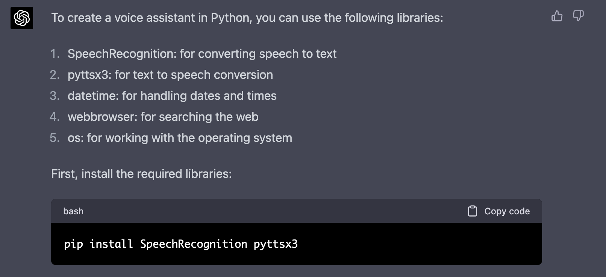
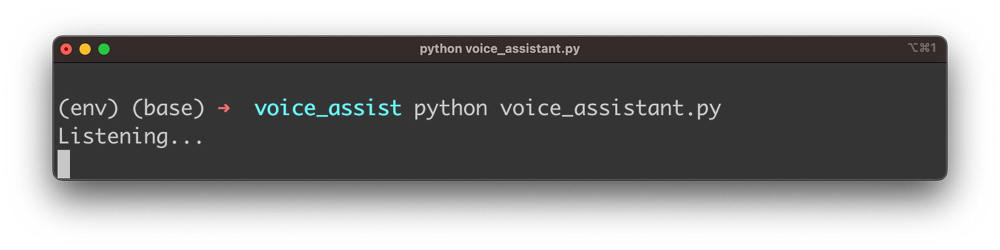
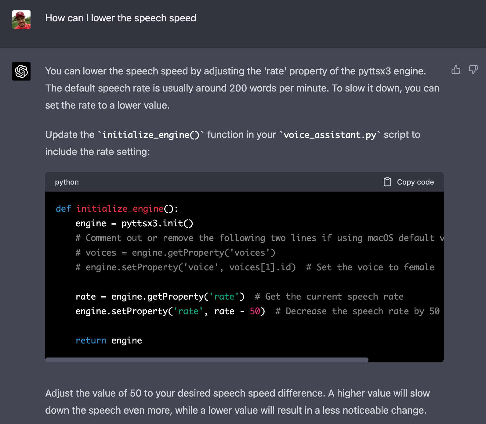

import { Image } from '@astrojs/image/components';
import YouTube from '~/components/widgets/YouTube.astro';
export const components = { img: Image };

In today's fast-paced world, voice assistants have become a ubiquitous presence in our daily lives, making tasks more manageable and our interactions with technology more intuitive. From setting reminders and creating to-do lists to searching the web, voice assistants have evolved to become our reliable digital companions. As artificial intelligence continues to advance, OpenAI's GPT-4 stands as a groundbreaking language model capable of generating highly accurate and relevant content, including code snippets for various applications.

In this blog post, we'll delve into the fascinating world of GPT-4 and explore how you can leverage its immense capabilities to implement your very own voice assistant. We'll guide you through the process of using GPT-4 to generate code for essential features such as speech recognition, text-to-speech conversion, and task execution. By the end of this post, you'll have a solid foundation for developing a state-of-the-art voice assistant that can seamlessly integrate with your projects and elevate your user experience to new heights.

Join us on this exciting journey as we unlock the potential of GPT-4 and revolutionize the way we interact with technology through voice assistants. Let's get started!

Provide the following prompt text to ChatGPT 4:

_Implement a voice assistant with Python. The voice assistant must be able to help with the following tasks:_
* _Setting reminders_
* _Creating to-do lists_
* _Searching the web_
* _Provide an overview of available commands as help to the user_

_The assistant must use speech recognition to accept all commands via voice recording._

As a response ChatGPT 4 is providing you with detailed instructions of how to get the Python voice assistant implemented.

## Creating A New Python Project With Virtual Environment

In order to start creating a new Python project start with creating a new project folder:

```bash
$ mkdir voice_assist
$ cd voice_assist
```

Next, create a new Python virtual environment:

```bash
$ python3 -m venv env
```

The command `python3 -m venv env` creates a new virtual environment named `env` using the Python 3 venv module.

Here's a breakdown of the command:
* `python3`: This specifies that the command should use Python 3 as the interpreter.
* `-m venv`: This flag indicates that the command should run the built-in venv module, which is used for creating virtual environments.
* `env`: This is the name of the virtual environment you want to create. In this case, the virtual environment will be named env.

A virtual environment is an isolated Python environment that allows you to install packages and dependencies specific to a particular project, without interfering with your system-wide Python installation or other projects. This isolation helps maintain consistency and avoid potential conflicts between different project requirements.

Once the virtual environment is created, you can activate it using the following command:

```bash
$ source env/bin/activate
```

## Install Packages

With the virtual Python environment setup in place we're ready to install the Python packages according to the instructions which have been provided from ChatGPT:



Copy and paste the command to the command line and hit return to execute:

```bash
$ pip install SpeechRecognition pyttsx3
```

PyAudio, which is required by the SpeechRecognition library to access your microphone needs to be installed as well. On MacOS you just need to execute the following commands:

```bash
$ brew install portaudio
$ pip install pyaudio
```

## Implement The Voice Assistant

In order to copy and paste the Python code which has been provided by ChatGPT you need to create a new Python file first:

```bash
$ touch voice_assistant.py
```

In the first step, ChatGPT is telling us that we start the implementation by adding the following import statements in *voice_assistant.py*:

```python
import os
import datetime
import webbrowser
import speech_recognition as sr
import pyttsx3
```

This block of code imports several Python modules that are necessary for implementing a voice assistant. Each line imports a different module:

1. `import os`: Imports the `os` module, which provides a way to interact with the operating system. This module includes functions to work with directories, files, processes, and environment variables, among other tasks.
2. `import datetime`: Imports the `datetime` module, which supplies classes to manipulate dates and times. This module is useful for setting reminders or working with timestamps in the context of a voice assistant.
3. `import webbrowser`: Imports the `webbrowser` module, which provides a high-level interface for displaying web-based documents and navigating the web. With this module, you can open URLs in a web browser, which is helpful for the voice assistant's web searching functionality.
4. `import speech_recognition as sr`: Imports the `speech_recognition` module and assigns it the alias `sr`. This module is used for performing speech recognition tasks, such as converting the user's voice commands into text. The alias `sr` is used to reference the module more concisely in the code.
5. `import pyttsx3`: Imports the `pyttsx3` module, which is a text-to-speech conversion library. This module allows the voice assistant to convert text (responses or prompts) into audible speech, enabling it to communicate with the user vocally.

Next, ChatGPT is instructing you to create a function to set up the text-to-speech engine:

```python
def initialize_engine():
    engine = pyttsx3.init()
    return engine
```

Next a function is provided by ChatGPT which is able to read out any text:

```python
def speak(engine, text):
    engine.say(text)
    engine.runAndWait()
```

The `speak` function is a simple helper function designed to convert text into speech using the pyttsx3 library. It takes two arguments: `engine` and `text`.

Here's a description of the function's components:

1. `def speak(engine, text)`: Defines a function called `speak` with two parameters: `engine` and `text`. The `engine` parameter represents a pyttsx3 engine instance, which is responsible for handling text-to-speech conversion. The `text` parameter represents the text that should be converted into speech.
2. `engine.say(text)`: Calls the `say` method of the pyttsx3 engine instance, passing the `text` parameter as an argument. This method schedules the provided text to be spoken by the engine.
3. `engine.runAndWait()`: Calls the `runAndWait` method of the pyttsx3 engine instance. This method processes the speaking tasks queued by the `say` method and blocks further execution of the program until all tasks are completed. Essentially, it ensures that the text-to-speech conversion is finished before the program continues with other tasks.

The `speak` function is used in the voice assistant implementation to provide audible feedback or responses to the user's voice commands. It simplifies the process of converting text to speech, making it easier to use the pyttsx3 library throughout the program.

Next, create a function for speech recognition:

```python
def listen():
    r = sr.Recognizer()
    with sr.Microphone() as source:
        print("Listening...")
        audio = r.listen(source)

    try:
        command = r.recognize_google(audio)
        print(f"User said: {command}\n")
    except Exception as e:
        print("Sorry, I didn't catch that. Could you please repeat?")
        return "None"

    return command.lower()
```

The `listen` function captures the user's voice input using the `speech_recognition` library and converts it into text. It is designed to facilitate voice command processing in the voice assistant implementation.

Here's a description of the function's components:

1. `r = sr.Recognizer()`: Creates a `Recognizer` instance from the `speech_recognition` library (aliased as `sr`). The Recognizer class is responsible for recognizing speech from audio sources.
2. `with sr.Microphone() as source`: Opens the default microphone as the audio source, using the `Microphone` class from the `speech_recognition` library.
3. `print("Listening...")`: Prints a message to the console to indicate that the program is listening for user input.
4. `audio = r.listen(source)`: Captures the audio input from the microphone source using the `listen` method of the `Recognizer` instance. The captured audio is saved in the `audio` variable.
5. `try`: Begins a try-except block to handle potential exceptions during the speech recognition process.
6. `command = r.recognize_google(audio)`: Calls the `recognize_google` method of the `Recognizer` instance, which sends the captured audio to the Google Web Speech API for speech-to-text conversion. The resulting text is saved in the `command` variable.
7. `print(f"User said: {command}\n")`: Prints the recognized text to the console to provide a visual confirmation of the captured command.
8. `except Exception as e`: Catches any exceptions that may occur during the speech recognition process.
9. `print("Sorry, I didn't catch that. Could you please repeat?")`: If an exception occurs, prints a message to the console asking the user to repeat their command.
10. `return "None"`: If an exception occurs, returns the string "None" to indicate that the voice command was not successfully recognized.
11. `return command.lower()`: If the speech recognition is successful, returns the recognized command in lowercase format. This ensures that the command can be easily compared with other strings in the program, regardless of the original capitalization.

The `listen` function is used in the voice assistant implementation to capture and recognize the user's voice commands, enabling the assistant to respond to user requests.

Next you need to implement copy and paste the implementation of four functions in order to implement the commands for the voice assistant:

```python
def set_reminder(engine, command):
    speak(engine, "What should I remind you about?")
    reminder = listen()
    speak(engine, "When do you want to be reminded? Please say the time in hours and minutes.")
    reminder_time = listen()
    try:
        hour, minute = map(int, reminder_time.split())
        now = datetime.datetime.now()
        reminder_datetime = now.replace(hour=hour, minute=minute)
        if now > reminder_datetime:
            reminder_datetime += datetime.timedelta(days=1)
        speak(engine, f"Alright, I will remind you about '{reminder}' at {hour:02d}:{minute:02d}.")
        while True:
            if datetime.datetime.now() >= reminder_datetime:
                speak(engine, f"Reminder: {reminder}")
                break
    except ValueError:
        speak(engine, "Sorry, I couldn't understand the time you provided. Please try again.")

def create_todo_list(engine, command):
    todo_list = []
    speak(engine, "Let's create a to-do list. Please say the tasks one by one. Say 'done' when you're finished.")
    while True:
        task = listen()
        if task == "done":
            break
        todo_list.append(task)
        speak(engine, f"Added: {task}")
    speak(engine, "Here's your to-do list:")
    for task in todo_list:
        speak(engine, task)

def search_web(engine, command):
    search_terms = command.replace("search", "").strip()
    if search_terms:
        url = f"https://www.google.com/search?q={search_terms}"
        speak(engine, f"Searching for '{search_terms}'")
        webbrowser.open(url)
    else:
        speak(engine, "Please provide a search term.")

def show_help(engine):
    help_text = """
    I can help you with the following tasks:
    1. Set reminders: Say 'set reminder' followed by the reminder and time.
    2. Create to-do lists: Say 'create to-do list' and then list your tasks one by one.
    3. Search the web: Say 'search' followed by the search terms.
    4. Show available commands: Say 'help'.
    5. To exit, say 'exit' or 'quit'.
    """
    print(help_text)
    speak(engine, help_text)
```

1. `set_reminder`: This function helps set a reminder for the user. It prompts the user to provide a reminder description and the time at which they want to be reminded. The function then waits until the specified time is reached and audibly reminds the user about their task.
2. `create_todo_list`: This function creates a to-do list by asking the user to provide tasks one by one. When the user says 'done', the function stops accepting tasks and reads the complete to-do list back to the user.
3. `search_web`: This function takes a voice command containing search terms and performs a web search using Google. It opens the search results in the default web browser.
4. `show_help`: This function displays and audibly reads a help text that explains the available voice commands and tasks the assistant can help with, such as setting reminders, creating to-do lists, searching the web, showing available commands, and exiting the assistant.

The last part of the code which you need to take from ChatGPT's response is the main function:

```python
def main():
    engine = initialize_engine()
    speak(engine, "Hello, I am your voice assistant. How can I help you today?")
    
    while True:
        command = listen()
        
        if "reminder" in command:
            set_reminder(engine, command)
        elif "to-do" in command or "todo" in command:
            create_todo_list(engine, command)
        elif "search" in command:
            search_web(engine, command)
        elif "help" in command:
            show_help(engine)
        elif "exit" in command or "quit" in command:
            speak(engine, "Goodbye!")
            break
```

The `main` function serves as the entry point of the program and manages the workflow of the voice assistant. The voice assistant will continuously listen for user commands and call the appropriate functions to handle each command until the user chooses to exit the program.

Here's a step-by-step explanation of the code:

1. `engine = initialize_engine()`: The `initialize_engine` function is called to set up the pyttsx3 text-to-speech engine. The engine instance is then assigned to the `engine` variable.
2. `speak(engine, "Hello, I am your voice assistant. How can I help you today?")`: The voice assistant greets the user with a welcome message using the `speak` function.
3. `while True`: An infinite loop is initiated, which will keep the voice assistant running and listening for user commands.
4. `command = listen()`: The `listen` function is called to capture and recognize the user's voice command. The recognized `command` text is assigned to the command variable.
5. The following conditional statements check for specific keywords in the user's command and call the corresponding functions:

* If "reminder" is in the command, the `set_reminder` function is called.
* If "to-do" or "todo" is in the command, the `create_todo_list` function is called.
* If "search" is in the command, the `search_web` function is called.
* If "help" is in the command, the `show_help` function is called.

6. `elif "exit" in command or "quit" in command`: If the user's command contains "exit" or "quit", the voice assistant will say "Goodbye!" using the `speak` function and terminate the loop with a `break` statement.

In summary, the `main` function orchestrates the voice assistant's workflow by continuously listening for voice commands and calling the appropriate functions to handle each command. The assistant runs in an infinite loop until the user says "exit" or "quit".

The final lines of code which needs to be added are:

```python
if __name__ == "__main__":
    main()
```

This code snippet is a common Python idiom used to check if the script is being run as the main program (as opposed to being imported as a module in another script). When a Python script is run, the interpreter sets a special variable called `__name__` to `"__main__"` for the script that is being executed. If the script is imported as a module in another script, the `__name__` variable is set to the module's name instead.

In this case, the code checks if `__name__` is equal to `"__main__"`. If it is, this means the script is being run as the main program, and the `main()` function is called to start the voice assistant.

By using this construct, you can create Python scripts that can act both as standalone programs and as importable modules, depending on how they are run. When the script is imported as a module, the code inside the if `__name__ == "__main__"`: block is not executed, which is useful for separating the script's functionality from its execution when imported.
Finally, let's take a look at the complete code:

```python
import os
import datetime
import webbrowser
import speech_recognition as sr
import pyttsx3

def initialize_engine():
    engine = pyttsx3.init()
    return engine

def speak(engine, text):
    engine.say(text)
    engine.runAndWait()

def listen():
    r = sr.Recognizer()
    with sr.Microphone() as source:
        print("Listening...")
        audio = r.listen(source)

    try:
        command = r.recognize_google(audio)
        print(f"User said: {command}\n")
    except Exception as e:
        print("Sorry, I didn't catch that. Could you please repeat?")
        return "None"

    return command.lower()

def set_reminder(engine, command):
    speak(engine, "What should I remind you about?")
    reminder = listen()
    speak(engine, "When do you want to be reminded? Please say the time in hours and minutes.")
    reminder_time = listen()
    try:
        hour, minute = map(int, reminder_time.split())
        now = datetime.datetime.now()
        reminder_datetime = now.replace(hour=hour, minute=minute)
        if now > reminder_datetime:
            reminder_datetime += datetime.timedelta(days=1)
        speak(engine, f"Alright, I will remind you about '{reminder}' at {hour:02d}:{minute:02d}.")
        while True:
            if datetime.datetime.now() >= reminder_datetime:
                speak(engine, f"Reminder: {reminder}")
                break
    except ValueError:
        speak(engine, "Sorry, I couldn't understand the time you provided. Please try again.")

def create_todo_list(engine, command):
    todo_list = []
    speak(engine, "Let's create a to-do list. Please say the tasks one by one. Say 'done' when you're finished.")
    while True:
        task = listen()
        if task == "done":
            break
        todo_list.append(task)
        speak(engine, f"Added: {task}")
    speak(engine, "Here's your to-do list:")
    for task in todo_list:
        speak(engine, task)

def search_web(engine, command):
    search_terms = command.replace("search", "").strip()
    if search_terms:
        url = f"https://www.google.com/search?q={search_terms}"
        speak(engine, f"Searching for '{search_terms}'")
        webbrowser.open(url)
    else:
        speak(engine, "Please provide a search term.")

def show_help(engine):
    help_text = """
    I can help you with the following tasks:
    1. Set reminders: Say 'set reminder' followed by the reminder and time.
    2. Create to-do lists: Say 'create to-do list' and then list your tasks one by one.
    3. Search the web: Say 'search' followed by the search terms.
    4. Show available commands: Say 'help'.
    5. To exit, say 'exit' or 'quit'.
    """
    print(help_text)
    speak(engine, help_text)

def main():
    engine = initialize_engine()
    speak(engine, "Hello, I am your voice assistant. How can I help you today?")
    
    while True:
        command = listen()
        
        if "reminder" in command:
            set_reminder(engine, command)
        elif "to-do" in command or "todo" in command:
            create_todo_list(engine, command)
        elif "search" in command:
            search_web(engine, command)
        elif "help" in command:
            show_help(engine)
        elif "exit" in command or "quit" in command:
            speak(engine, "Goodbye!")
            break

if __name__ == "__main__":
    main()
```

## Execute The Application

Let's execute the program by entering:

```bash
$ python voice_assistant.py
```



## Lower The Speech Speed

When you execute the voice assistant you may notice the fast speech rate of the voice output. Be default the speech rate is set to 200 words per minute which is quite fast. If you'd like to adapt the speech rate you can ask ChatGPT again to provide you with the necessary instructions:



With the instruction provided by ChatGPT it's easy to change the implementation of the initialize_engine function to the following to lower the speech rate:

```python
def initialize_engine():
    engine = pyttsx3.init()
    rate = engine.getProperty('rate')
    engine.setProperty('rate', rate - 50) 
    return engine
```

## Conclusion

In conclusion, using ChatGPT to implement a Python voice assistant has proven to be a highly effective and efficient approach. By leveraging the power of GPT-4, we were able to obtain valuable insights and code snippets that form the building blocks of our voice assistant. The process not only saves time but also provides a solid foundation for understanding the code and its functionality.

The resulting voice assistant is capable of handling a variety of tasks such as setting reminders, creating to-do lists, searching the web, and providing an overview of available commands. Through a combination of various Python libraries, like speech_recognition, pyttsx3, and webbrowser, we have built an assistant that demonstrates the potential of integrating GPT-4 into the development process.