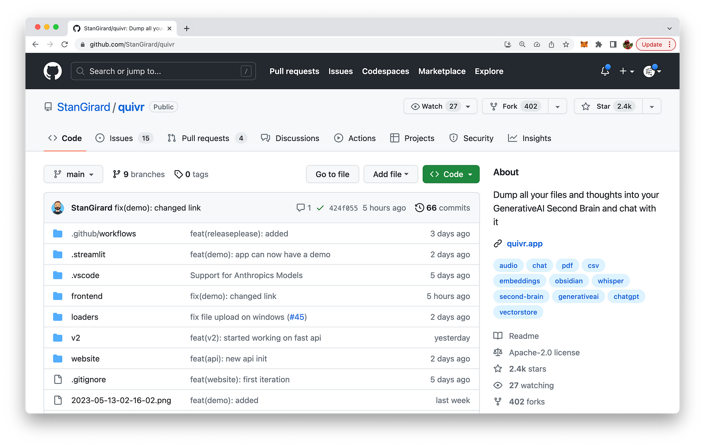
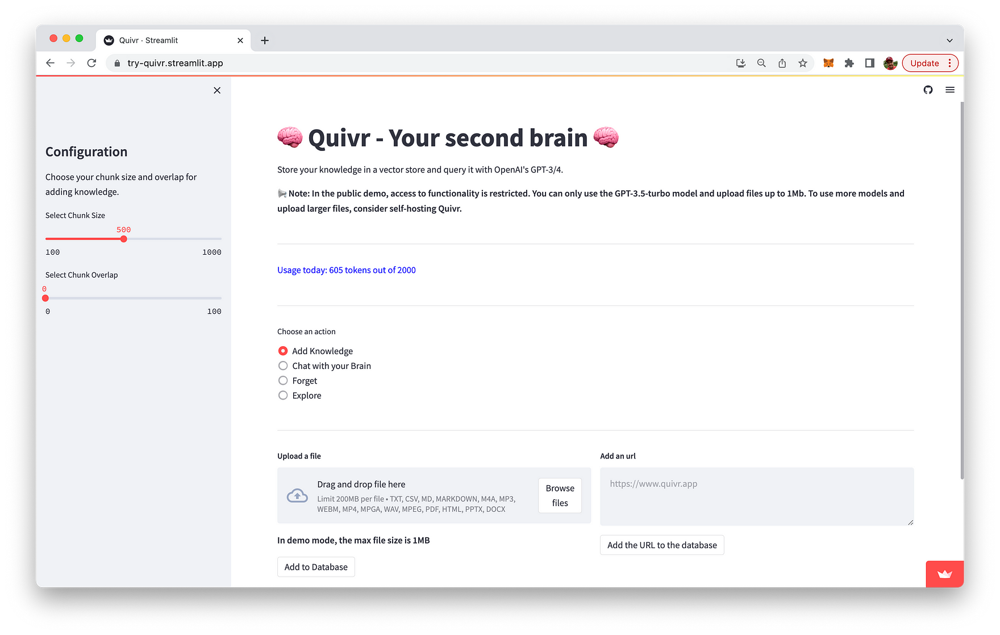
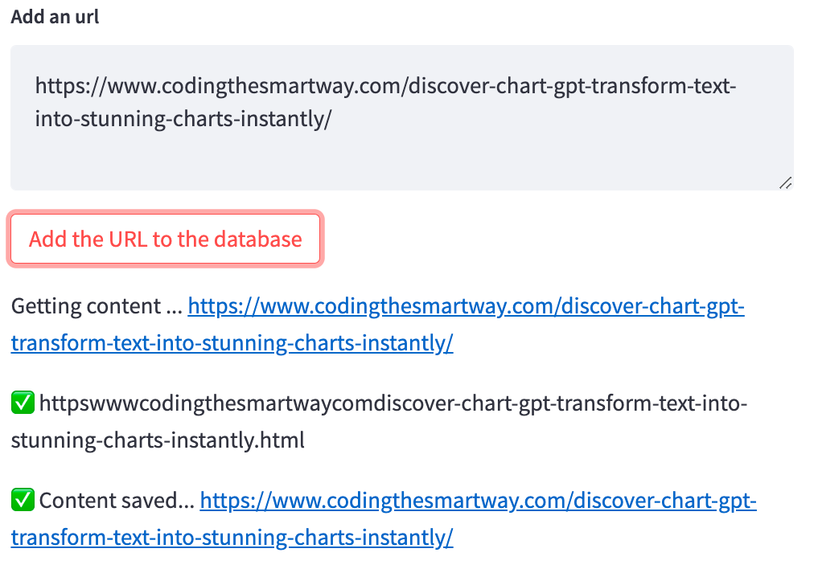
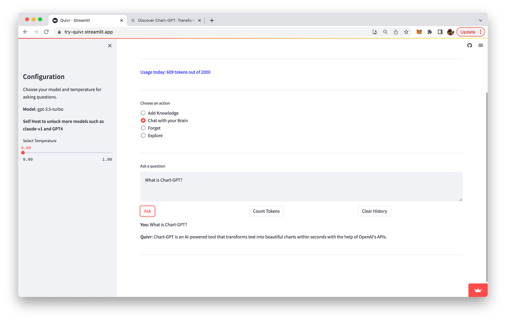

import { Image } from '@astrojs/image/components';
import YouTube from '~/components/widgets/YouTube.astro';
export const components = { img: Image };

Hello, tech enthusiasts! Today, I’m excited to share with you a fascinating project I stumbled upon recently. It’s called Quivr, and it’s designed to be your “second brain” in the cloud. Now, I know what you’re thinking: “Another productivity tool? Really?” But trust me, this one is worth your attention.

## What is Quivr?

Quivr is an open-source project developed by Stan Girard. It's designed to store and retrieve unstructured information, much like a second brain. The concept is similar to Obsidian, a popular knowledge base that works on top of a local folder of plain text Markdown files. But Quivr takes it a step further by leveraging the power of generative AI.

You can find the Quivr project on GitHub: https://github.com/StanGirard/quivr

You can also go to Quivr website at quivr.app:

From the website you can directly access a limited and hosted version of Quivr by clicking on button "Try Demo".

In order to be able to use Quivr without any limits, you can setup your own Quivr installation locally. We'll cover the steps which are necessary to setup Quivr locally below.

## Features of Quivr

1. Quivr is packed with features that make it a versatile tool for anyone looking to store and retrieve information efficiently. Here's a quick rundown:
2. Store Anything: Quivr can handle almost any type of data you throw at it. Text, images, code snippets - you name it.
3. Generative AI: Quivr uses advanced AI to help you generate and retrieve information. This is where it truly stands out from other similar tools.
4. Fast and Efficient: Quivr is designed with speed and efficiency in mind. It ensures you can access your data as quickly as possible.
5. Secure: Your data is stored securely in the cloud and is always under your control.
6. Compatible Files: Quivr supports a variety of file types including Text, Markdown, PDF, Audio, and Video.

When you run Quivr you can use the "Add Knowledge" mode to add documents or websites to the database, so that you can later on chat with these knowledge assets:

E.g. adding a website is quick and easy:

Once you've added content to the database you're ready to switch to the "Chat with your Brain" mode and start asking questions about the content you've provided:

## Built With

Quivr is built with Python and uses Streamlit as the web framework. It leverages Supabase, an open-source Firebase alternative, for backend services.

## Setting Up Quivr Locally: A Step-by-Step Guide

Setting up Quivr on your local machine is a fairly straightforward process. Here's a step-by-step guide to get you started:

### Prerequisites

Before you begin, make sure you have the following installed on your machine:

1. Python 3.10 or higher: You can download the latest version of Python from the official Python website.
2. Pip: This is a package manager for Python. It usually comes pre-installed with Python.
3. Virtualenv: This is a tool to create isolated Python environments. You can install it using pip with the command `pip install virtualenv`.

Additionally, you'll need a Supabase account for the following:

1. A new Supabase project
2. Supabase Project API key
3. Supabase Project URL

### Installation Steps

Once you have the prerequisites in place, follow these steps to set up Quivr:

1. Clone the repository: Use the command `git clone git@github.com:StanGirard/Quivr.git` to clone the Quivr repository to your local machine. Then, navigate to the Quivr directory using the command `cd Quivr`.
2. Create a virtual environment: Use the command `virtualenv venv` to create a new virtual environment in the Quivr directory.
3. Activate the virtual environment: Use the command `source venv/bin/activate` to activate the virtual environment.
4. Install the dependencies: Use the command `pip install -r requirements.txt` to install all the necessary dependencies for Quivr.
5. Copy the Streamlit `secrets.toml` example file: Use the command `cp .streamlit/secrets.toml.example .streamlit/secrets.toml` to copy the example secrets file.
6. Add your credentials to the `secrets.toml` file: Open the `.streamlit/secrets.toml` file and add your Supabase URL, Supabase service key, and OpenAI API key. If you have an Anthropic API key, you can add that as well.
7. Run the migration scripts on the Supabase database: Navigate to the SQL Editor in the Supabase web interface and run the provided migration scripts. These scripts will enable the pgvector extension and create the necessary tables in your database.
8. Run the app: Finally, use the command `streamlit run main.py` to run the Quivr app.

And that's it! You now have Quivr set up on your local machine.

##Final Thoughts

Quivr is a promising project that combines the power of generative AI with the convenience of cloud storage. It's a versatile tool that can handle a variety of data types, making it an excellent choice for anyone looking to enhance their productivity.

Remember, Quivr is open-source and free to use. So, why not give it a try and see how it can serve as your second brain in the cloud? I'm certainly excited to see how this project evolves and the impact it will have on the way we store and retrieve information.

Until next time, keep exploring and stay curious, tech enthusiasts!