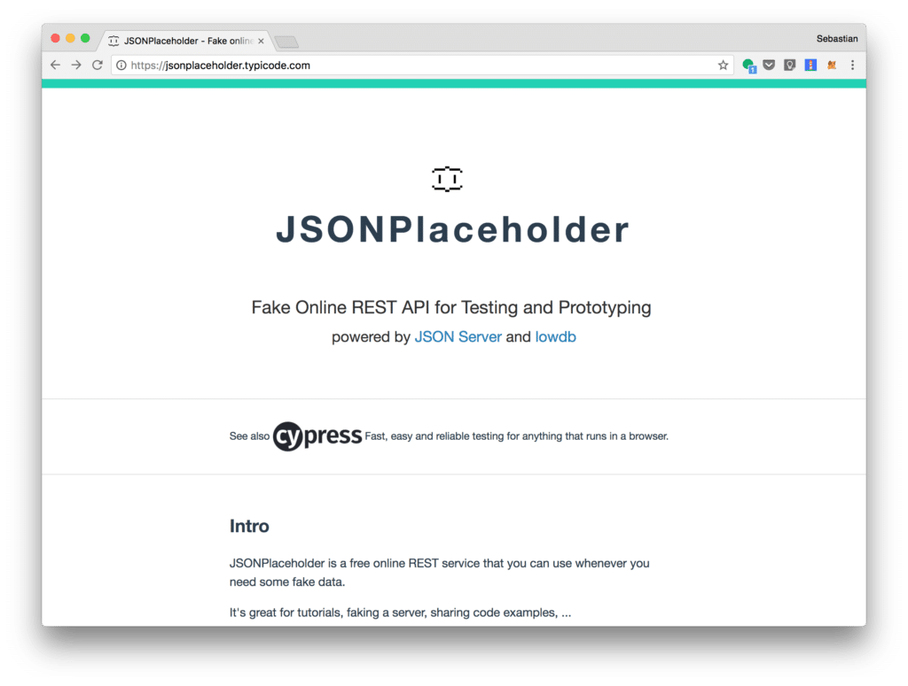
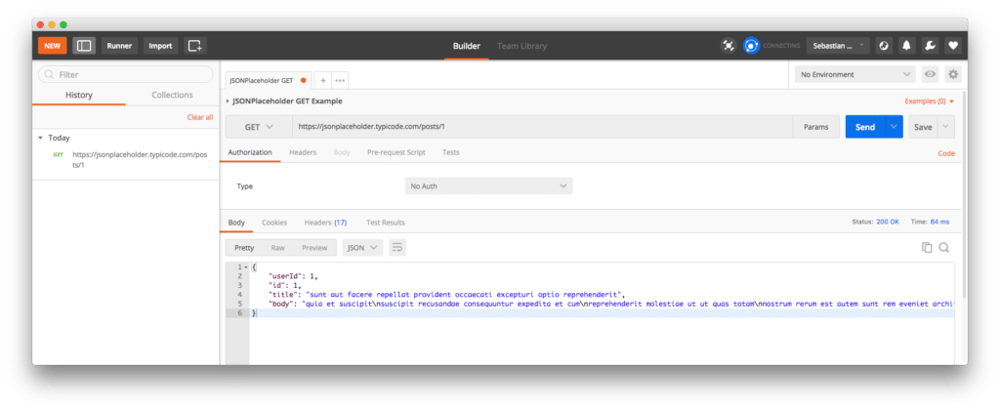
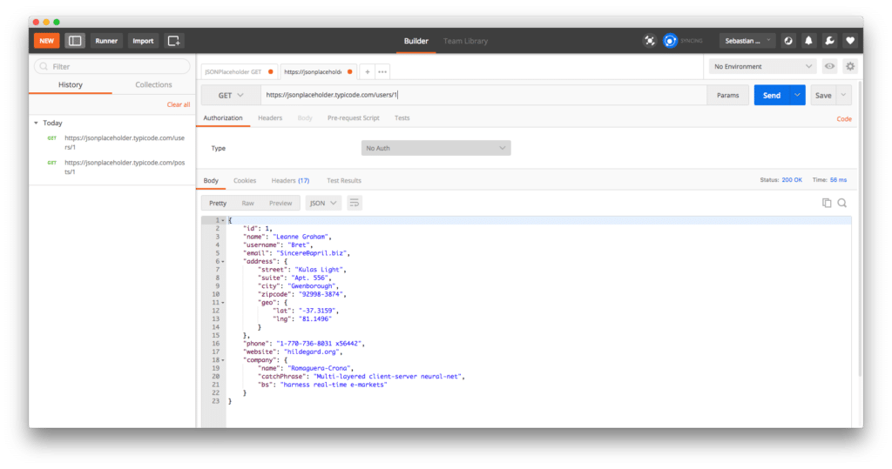
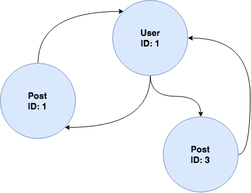

import { Image } from '@astrojs/image/components';
import YouTube from '~/components/widgets/YouTube.astro';
export const components = { img: Image };


<YouTube url="https://youtu.be/UnHGlHXglJQ" />


REST and GraphQL are two ways to send data over HTTP. The REST-based approach is the traditional way of doing so and has gained a very high adoption rate in many application stacks in the last years.

GraphQL is often presented as a revolutionary new way to think about APIs. Indeed GraphQL is able to overcome major shortcomings of REST. In this tutorial you'll learn the differences between both technologies and by using many practical examples you'll be able to understand how GraphQL can help you to build highly flexible APIs for you applications. Let's get started ...

## REST And It's Limitation

REST (Representational State Transfer) is an API design architecture used to implement web services. REST-compliant web services allow the requesting systems to access and manipulate textual representations of web resources by using a uniform and predefined set of stateless operations. When HTTP is used, the most common operations available are GET, POST, PUT, and DELETE.

The core concept of REST is that everything is a resource. While REST was a great solution when it was first proposed, there are some pretty significant issues that the architecture suffers from right now. Let's explore some of the most significant limitations of REST today:

### Multiple Round Trips To Fetch Related Resources

Today's web and mobile applications are often data-driven and require large sets of data combining related resources. Accessing those data by using a REST-based API often requires us to do multiple round-trips to collect everything what is needed. E.g. imagine you'd like to request information from a post entity. At the same time you'd like to request information of post author (which is a different entity). Typically this is done by sending two request to the REST API (e.g. by using HTTP GET). First to retrieve the post object and second to retrieve the user object.

Endpoints for posts and suers:

_mydomain.com/posts/:id_

_mydomain.com/users/:id_

### Over Fetching / Under Fetching

Another common problem which occurs when using RESTful services is the problem of over / under fetching. So what does that exactly mean? Let's get back to the previous example. By using endpoint _mydomain.com/posts/:id_ we're fetching data for a specific post. Each post might comprise the following properties: _id_, _title_, _user_, and _body_. You'll always get back the complete set of data. There is no way to limit the response to only contain a subset of data like _title_ and _user_.

### Example

A REST API which you can use for testing purposes is available at https://jsonplaceholder.typicode.com/:


The JSONPlaceholder API is exposing various endpoints (resources), e.g.:

- _/posts_
- _/comments_
- _/users_
- _..._

To request a specific post you can initiate a HTTP GET request to the following URI: https://jsonplaceholder.typicode.com/posts/1. This is requesting the post with ID 1. You can use the free Postman app to send the request to the server:

 The JSON object which is returned contains the following post data: _userId_, _id_, _title_, _body_. Requesting a specific post will always return the complete set of data as already explained.

If you now want to retrieve the related user information for the post author you need to send another GET request to the server and request the details for the user with id 1. Therefore you need to send your request to the following endpoint: https://jsonplaceholder.typicode.com/users/1:

Two server round trips are needed to retrieve the post and the corresponding author information from the REST endpoints.

## GraphQL - A Different Approach

As REST, GraphQL is an API design architecture, but with a different approach which is much flexible. The main and most important difference is that GraphQL is not dealing with dedicated resources. Instead everything is regarded as a graph and therefore is connected. This means that you can tailor the request (query) to your exact needs by using the GraphQL query language and describing what you would like to get as an answer. You can combine different entities in one query and you are able to specific which attributes should be included in the response on every level, e.g.:

```
{
     post(id: 1) {
        title
        user {
            name
            email
            courses {
                title
            }
        }
     }
}
```

### Example

Let's take a look at some practical examples. First we need to setup a GraphQL server which providers post and user data (so that we're able to compare the GraphQL query examples to what we retrieved from the REST endpoints before).

Creating a new GraphQL server form scratch is easy by using Apollo Launchpad. The project’s website can be found at https://launchpad.graphql.com.

Launchpad is an in-browser GraphQL server playground. You can write a GraphQL schema example in JavaScript, and instantly create a serverless, publicly-accessible GraphQL endpoint.

The Apollo Launchpad server configuration we'll be using in the following examples is available at:

[https://launchpad.graphql.com/7lv95vwj0j](https://launchpad.graphql.com/7lv95vwj0j)

You can use this link directly or implement the server by your own. You can find the JavaScript code which is needed in the following code listing:

```js
// graphql-tools combines a schema string with resolvers.
import { find, filter } from 'lodash';
import { makeExecutableSchema } from 'graphql-tools';

// Construct a schema, using GraphQL schema language
const typeDefs = `
    type Query {
        post(id: Int!): Post
                user(id: Int!): User
    },

        type Post {
            id: Int
            user: User
            title: String
            body: String
        },

        type User {
            id: Int
            name: String
            email: String
            posts: [Post]
        },
`;

var postsData = [
    {
    id: 1,
    userId: 1,
    title: 'sunt aut facere repellat provident occaecati excepturi optio reprehenderit',
    body: 'quia et suscipitsuscipit recusandae consequuntur expedita et cumreprehenderit molestiae ut ut quas totamnostrum rerum est autem sunt rem eveniet architecto'
  },
  {
    userId: 2,
    id: 2,
    title: 'qui est esse',
    body: 'est rerum tempore vitae\nsequi sint nihil reprehenderit dolor beatae ea dolores neque\nfugiat blanditiis voluptate porro vel nihil molestiae ut reiciendis\nqui aperiam non debitis possimus qui neque nisi nulla'
  },
  {
    userId: 1,
    id: 3,
    title: 'ea molestias quasi exercitationem repellat qui ipsa sit aut',
    body: 'et iusto sed quo iure\nvoluptatem occaecati omnis eligendi aut ad\nvoluptatem doloribus vel accusantium quis pariatur\nmolestiae porro eius odio et labore et velit aut'
  },
  {
    userId: 2,
    id: 4,
    title: 'eum et est occaecati',
    body: 'ullam et saepe reiciendis voluptatem adipisci\nsit amet autem assumenda provident rerum culpa\nquis hic commodi nesciunt rem tenetur doloremque ipsam iure\nquis sunt voluptatem rerum illo velit'
  }
];

var usersData = [
  {
    id: 1,
    name: 'Leanne Graham',
    email: 'Sincere@april.biz'
  },
  {
    id: 2,
    name: 'Ervin Howell',
    email: 'Shanna@melissa.tv'
  }
];

var getPost = function(root, {id}) { 
    return postsData.filter(post => {
        return post.id === id;
    })[0];
};

var getUser = function(root, {id}) {
      return usersData.filter(user => {
          return user.id === id;
    })[0];
};


// Provide resolver functions for your schema fields
const resolvers = {
  Query: {
    post: getPost,
    user: getUser,
  },
    User: {
    posts: (user) => filter(postsData, { userId: user.id }),
  },
  Post: {
    user: (post) => find(usersData, { id: post.userId }),
  },
};

// Required: Export the GraphQL.js schema object as "schema"
export const schema = makeExecutableSchema({
  typeDefs,
  resolvers,
});
```

Now we're ready to execute some queries to retrieve data from the SQL server. The query code can be entered directly in Launchpad:

```
query PostsAndUser {
  post(id:1){
    id
    title
  }
}
```

With that query executed we can expect to get the following result back from the server:

```json
 "data": {
    "post": {
      "id": 1,
      "title": "sunt aut facere repellat provident occaecati excepturi optio reprehenderit"
    }
  }
```

The post with ID 1 is returned and the _id_ and _title_ information is included in the resulting JSON object. Note, the _body_ field of the post entity is not included in the query and therefore not including in the result as well.

Now, let's extend the query to also include the _body_ field:

```
query PostsAndUser {
  post(id:1){
    id
    title
    body
  }
}
```

The resulting JSON object is now containing the value for the _body_ field too:

```json
"data": {
    "post": {
      "id": 1,
      "title": "sunt aut facere repellat provident occaecati excepturi optio reprehenderit",
      "body": "quia et suscipitsuscipit recusandae consequuntur expedita et cumreprehenderit molestiae ut ut quas totamnostrum rerum est autem sunt rem eveniet architecto"
    }
  }
```

Let's extend the query even further and include the _user_ information:

```
query PostsAndUser {
  post(id:1){
    id
    title
    user {
      name
    }
  }
}
```

The result contains now the _user_ entity with the requested _name_ value:

```json
 "data": {
    "post": {
      "id": 1,
      "title": "sunt aut facere repellat provident occaecati excepturi optio reprehenderit",
      "user": {
        "name": "Leanne Graham"
      }
    }
  }
```

With only one request we've been able to retrieve information from two entities, _post_ and _user_, at the same time.

Of course we can request even more user data by adding more fields to the corresponding section:

```
query PostsAndUser {
  post(id:1){
    id
    title
    user {
      id
      name
      email
    }
  }
}
```

The result is comprising the requested data:

```json
"data": {
    "post": {
      "id": 1,
      "title": "sunt aut facere repellat provident occaecati excepturi optio reprehenderit",
      "user": {
        "id": 1,
        "name": "Leanne Graham",
        "email": "Sincere@april.biz"
      }
    }
  }
```

To close the circle we can even extend the query to include the list of post for the user:

```
query PostsAndUser {
  post(id:1){
    id
    title
    user {
      id
      name
      email
      posts {
        id
        title
      }
    }
  }
}
```

The result should then look like the following:

```json
"data": {
    "post": {
      "id": 1,
      "title": "sunt aut facere repellat provident occaecati excepturi optio reprehenderit",
      "user": {
        "id": 1,
        "name": "Leanne Graham",
        "email": "Sincere@april.biz",
        "posts": [
          {
            "id": 1,
            "title": "sunt aut facere repellat provident occaecati excepturi optio reprehenderit"
          },
          {
            "id": 3,
            "title": "ea molestias quasi exercitationem repellat qui ipsa sit aut"
          }
        ]
      }
    }
  }
```

And for the lists of posts which is displayed for the user associated with the original post we can now extend the query and request for each post the id, title and user information:

```
query PostsAndUser {
  post(id:1){
    id
    title
    user {
      id
      name
      email
      posts {
        id
        title
        user {
          name
        }
      }
    }
  }
}
```

The result should then correspond to what you can see in the following:

```json
"data": {
    "post": {
      "id": 1,
      "title": "sunt aut facere repellat provident occaecati excepturi optio reprehenderit",
      "user": {
        "id": 1,
        "name": "Leanne Graham",
        "email": "Sincere@april.biz",
        "posts": [
          {
            "id": 1,
            "title": "sunt aut facere repellat provident occaecati excepturi optio reprehenderit",
            "user": {
              "name": "Leanne Graham"
            }
          },
          {
            "id": 3,
            "title": "ea molestias quasi exercitationem repellat qui ipsa sit aut",
            "user": {
              "name": "Leanne Graham"
            }
          }
        ]
      }
    }
  }
```

Having executed the query examples from above you now should have a basic understanding of how entities in GraphQL are connected and you can use the connections in the “Graph” to combine data from different entities. The following figure gives you a graphical representation of the graph which has been used in the examples so for:



For all query examples seen so far we've chosen the same entry point in the graph: the post with ID 1. Of course we can use any other entry point as you can see in the following query example:

```
query UsersAndPosts {
    user(id:2) {
    id
    name
  }
}
```

Here we're starting with the user entity and requesting the _id_ and _name_ value for user with ID of 2. The result should then look like the following:

```json
"data": {
    "user": {
      "id": 2,
      "name": "Ervin Howell"
    }
  }
```

From the user entry point we can then navigate in the graph to the posts:

```
query UsersAndPosts {
    user(id:2) {
    id
    name
    posts {
      title
    }
  }
}
```

As a result we're now seeing a list of posts included for the requested user:

```json
"data": {
    "user": {
      "id": 2,
      "name": "Ervin Howell",
      "posts": [
        {
          "title": "qui est esse"
        },
        {
          "title": "eum et est occaecati"
        }
      ]
    }
  }
```

## Conclusion

Both, REST and GraphQL, are API design architectures which can be used to build web services for data-driven applications. In this tutorial you've learned the main difference between those two concepts. The RESTful approach is always limited to deal with single resources. If you need data which is coming from two or more resources (like posts and users) you need to do multi round trips to the server. Furthermore REST requests are always returning the full set of data which is available for a certain resource. There is no way to limit the request to only retrieve a subset of data fields.

The GraphQL approach is much more flexible and is able to overcome the major shortcomings of REST as demonstrated in this tutorial. By using the GraphQL query language you can exactly describe what the response should look like. You're able to specify which fields should be included to limit the response to the data which is needed. Furthermore you can use the graph and combine connected entities within one GraphQL data query. No additional server round trips needed.
