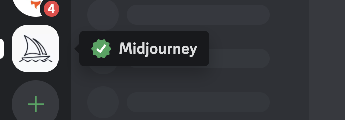

import { Image } from '@astrojs/image/components';
import YouTube from '~/components/widgets/YouTube.astro';
export const components = { img: Image };

AI-generated artwork is on the rise. With the advances in machine learning and neural networks, AI is becoming increasingly capable of creating high-quality, realistic images. One of the most popular AI image generation tools right now is Midjourney. Midjourney provides you with powerful capabilities of generating stunning und unique AI art based on your descriptive input. This article provides you with all the information you need to get started with Midjourney quickly.

## 1. Sign Up For Discord

Midjourney comes as a Discord chatbot. Discord is a popular real-time messaging platform with great support for programmable bots. In order to make you of Midjourney and interact with the respective bot you need to have a Discord user account. So the first step is download the Discord application and create a new user account at: https://discord.com/


## 2. Join The Midjourney Server

Midjourney is currently in Beta. You can join the Midjourney Discord server by clicking on the "Join the Beta" button on the project's website: https://midjourney.com/


Clicking on this button takes you to the invite to Midjourney's Discord server:


Here you need to accept the invite (and sign in with the Discord user account you have just created). When you then enter the Discord application you should be able to see the icon of the Midjourney server on the left side of your application window:



Click on this sailing ship icon and you can see that all the channels are of this server are loaded:


## 3. Enter Any Of The Newcomer Rooms On The Midjourney Server

From the list of Midjourney server channels you need to locate the Newcomer rooms:


In this section you can find multiple newcomer rooms each named *newbies-#*. You can select any of those rooms to start interacting with the Midjourney bot.

## 4. Making Yourself Familiar With the Midjourney Prompt

Midjourney's functionality is controlled completely by using the chat prompt. So the first step is to make yourself familiar with the most useful Midjourney prompt commands. In any of the newcomers channels type in the following:

```
/help
```

Each command is stating with a slash followed by the command keyword. The help command displaying the following helpful information about Midjourney in general and about the usage of the bot:


If you want to get more information about your profile, plan, and usage you can use the info command:

```
/info
```

The output should then look similar to what you can see in the following screenshot:


## 5. Generating AI Images With Midjourney

Ok, it's time to tell Midjourney to generate a first piece of AI image art. Therefore we need to use the /imagine command. Typing in

```
/imagine
```

will add a prompt section to the command where you can then start entering your description and your instruction for the AI graphic you'd like to get generated by Midjourney. Let's start with a simple example:


Now we have to wait a few seconds. After that the bot is responding with a proposal of four different generated graphics as you can see in the following screenshot:


If you don't like any of the proposals you can request Midjourney to generate new images by simple clicking on the redo button:


Furthermore you have the option to use any of the following buttons:


The U# buttons are for choosing to upscale one of the four proposed graphics. The graphic in the top left corner is graphic 1 and the graphic in the right bottom corner is number 4.

The V# buttons are used to select one of the four proposed graphics for generating another four variations.

## 6. Generate New Image Based On Provided Results

Let's say we want to continue with graphic 4 (bottom right) and want to generate four more images based on that result. Therefore we need to click on button V4:


Again we need to wait a couple of seconds until we're receiving the response:


Here we have four new images which are all based on the image number 4 from the first set.

## 7. Upscaling Images

Next, let's try to upscale one of new newly generated images. Clicking on button U4 will (after a few seconds) present an upscaled version of image number 4:


In order to download the graphic you can simply click on the image, open it in the browser and download it as a file.

## 9. PRO TIP: Generating High-Resolution AI Images

Midjourney has provided us with an upscaled version of our image already. However, there might be the need to have versions of the graphic with an even higher resolution. For example this might be the case if you plan to print this graphic.

Fortunately there is another web service available which is able to increase the resolution of your downloaded image file from Midjourney even further. This service is called AI Image Enlarger and can be found at: https://imglarger.com/

