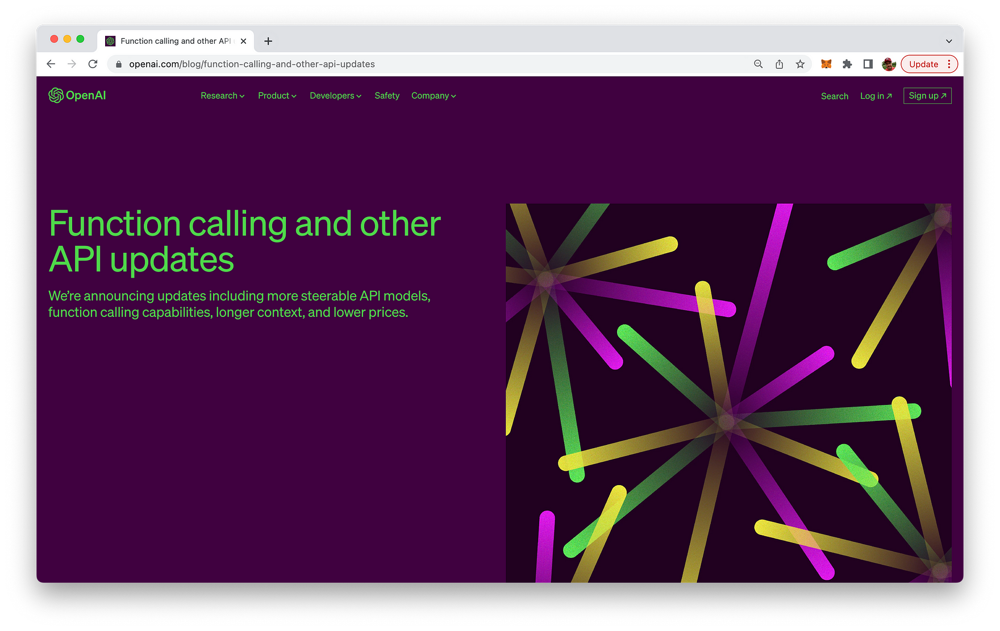

import { Image } from '@astrojs/image/components';
import YouTube from '~/components/widgets/YouTube.astro';
export const components = { img: Image };

Hello, tech enthusiasts! Today, I'm thrilled to dive into a fascinating update from OpenAI that's set to revolutionize how we interact with AI models. OpenAI has introduced a new function calling capability in their Chat Completions API, and it's a game-changer. This feature allows developers to describe functions to the AI models, which can then intelligently decide to output a JSON object containing arguments to call those functions.

## What is Function Calling?

In the context of OpenAI's Chat Completions API, function calling is the ability of the AI model to understand and respond to a function described in an API call. The model can output a JSON object that adheres to the function signature, which can then be used to call the function in your code.

This feature is currently available in the latest models, gpt-3.5-turbo-0613 and gpt-4-0613. It's important to note that the Chat Completions API does not actually call the function; instead, it generates the JSON that you can use to call the function in your code.



## Why is Function Calling Important?

Function calling allows you to get more structured data back from the model. It opens up a world of possibilities for creating more interactive and dynamic applications. For instance, you can create chatbots that answer questions by calling external APIs, convert natural language into API calls, or extract structured data from text.

However, with this new capability comes potential risks. OpenAI strongly recommends building in user confirmation flows before taking actions that impact the world on behalf of users, such as sending an email, posting something online, or making a purchase.

## How to Implement Function Calling: A Step-by-Step Python Example

Let's dive into a simple Python example to illustrate how to implement function calling with the OpenAI API.

1. Import the necessary libraries.

```python
import openai
import json
```

2. Define a dummy function.

For this example, we'll create a dummy function that returns the same weather information every time it's called. In a real-world application, this could be your backend API or an external API.

```python
def get_current_weather(location, unit="fahrenheit"):
    """Get the current weather in a given location"""
    weather_info = {
        "location": location,
        "temperature": "72",
        "unit": unit,
        "forecast": ["sunny", "windy"],
    }
    return json.dumps(weather_info)
```

## 3. Call the model with the user query and a set of functions.

We'll send the model the user query and the functions it has access to. The model can choose to call a function; if so, the content will be a stringified JSON object adhering to your custom schema.

```python
def run_conversation():
    response = openai.ChatCompletion.create(
        model="gpt-3.5-turbo-0613",
        messages=[{"role": "user", "content": "What's the weather like in Boston?"}],
        functions=[
            {
                "name": "get_current_weather",
                "description": "Get the current weather in a given location",
                "parameters": {
                    "type": "object",
                    "properties": {
                        "location": {
                            "type": "string",
                            "description": "The city and state, e.g. San Francisco, CA",
                        },
                        "unit": {"type": "string", "enum": ["celsius", "fahrenheit"]},
                    },
                    "required": ["location"],
                },
            }
        ],
        function_call="auto",
    )
```

4. Check if the model wants to call a function.

If the model decides to call a function, we'll extract the function name and arguments from the response.

```python
message = response["choices"][0]["message"]
    if message.get("function_call"):
        function_name = message["function_call"]["name"]
```

5. Call the function.

We'll call our dummy function with the arguments provided by the model.

```python
function_response = get_current_weather(
            location=message.get("location"),
            unit=message.get("unit"),
        )
```

6. Send the model the info on the function call and function response.
   
We'll call the model again, appending the function response as a new message. The model will then summarize the results back to the user.

```python
second_response = openai.ChatCompletion.create(
            model="gpt-3.5-turbo-0613",
            messages=[
                {"role": "user", "content": "What is the weather like in Boston?"},
                message,
                {
                    "role": "function",
                    "name": function_name,
                    "content": function_response,
                },
            ],
        )
        return second_response
```

7. Run the conversation.

Finally, we'll run our conversation and print the response.

```python
print(run_conversation())
```

This is a simple example, but it illustrates the power of function calling in the OpenAI API. Depending on the query, the model may choose to call a function again or generate a user-facing message.

## Wrapping Up

OpenAI's function calling capability in the Chat Completions API is a significant step forward in making AI models more interactive and dynamic. It allows developers to create more complex applications and get more structured data back from the model. As always, it's important to handle this new capability responsibly and ensure user confirmation before taking actions that impact the world on behalf of users.

Stay tuned for more exciting updates from the world of AI and machine learning on CodingTheSmartWay!