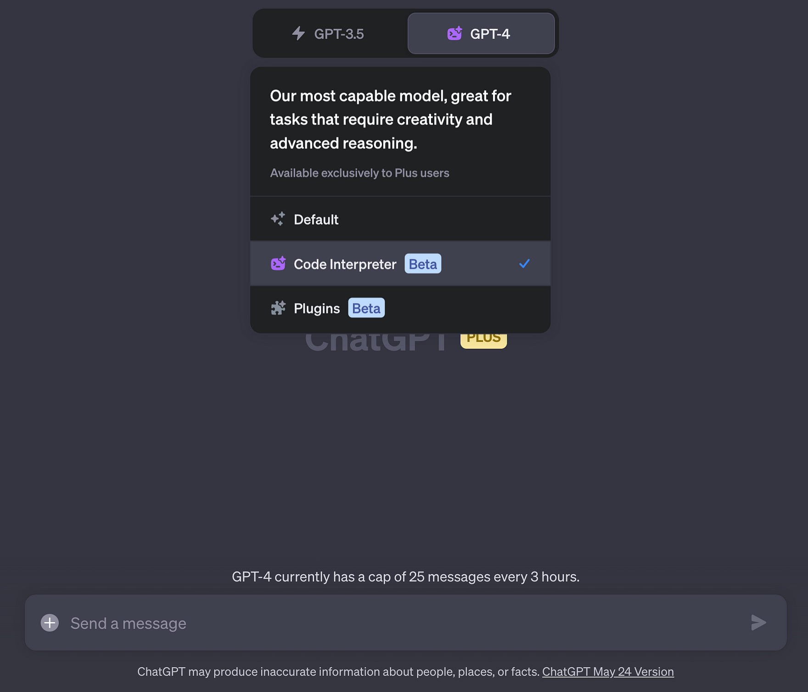
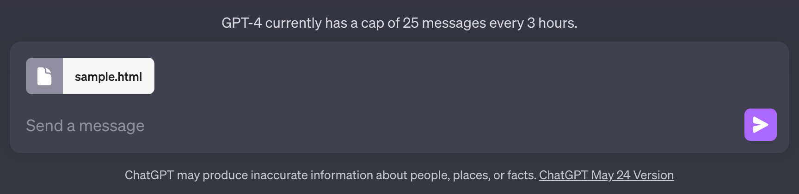
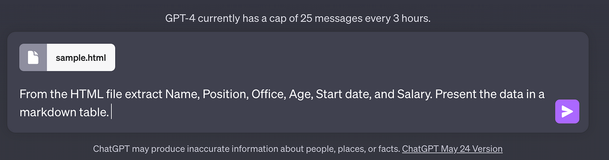
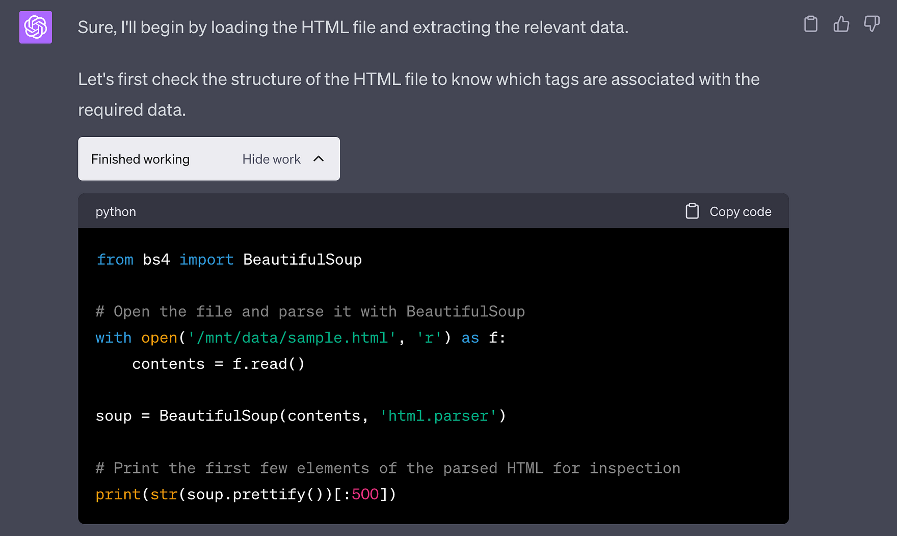
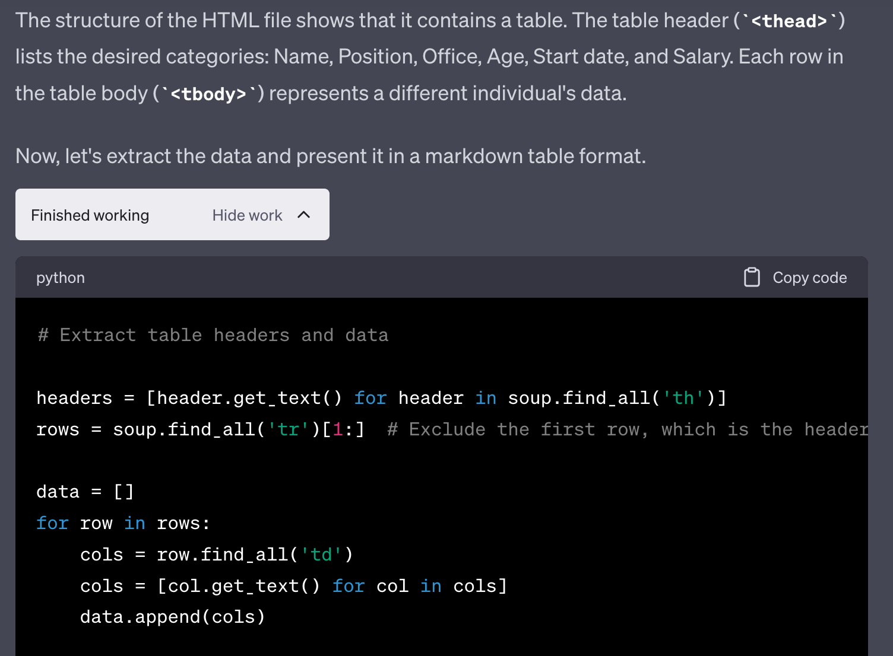
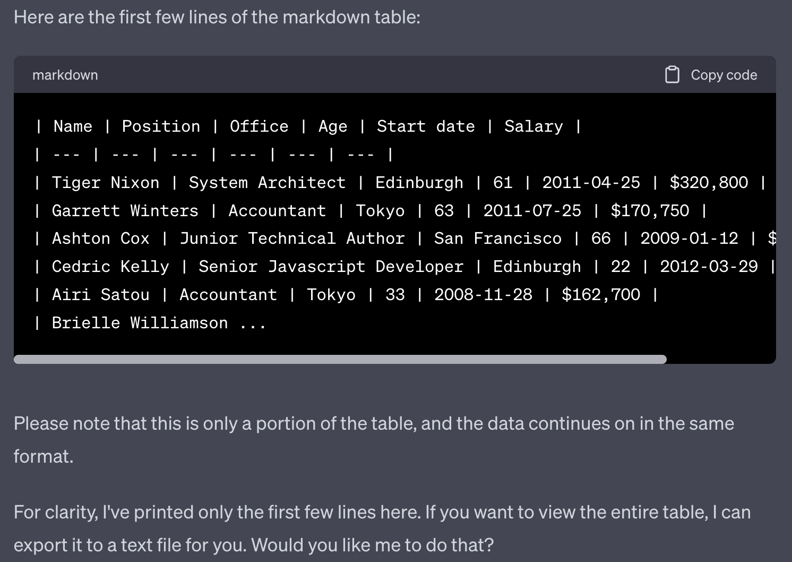
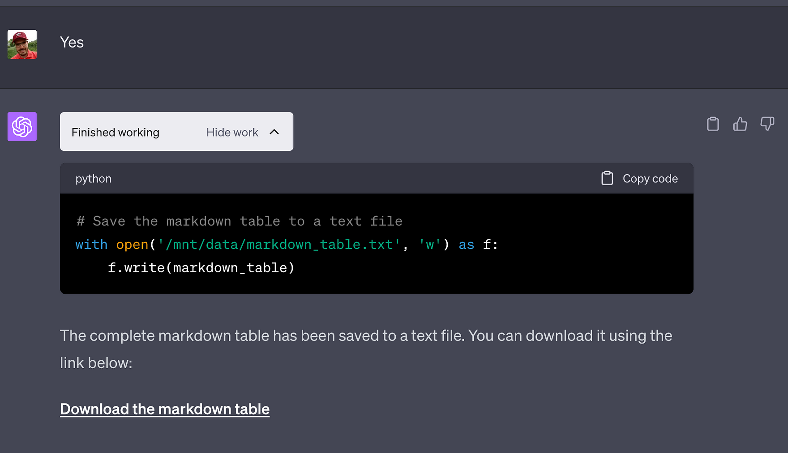

import { Image } from '@astrojs/image/components';
import YouTube from '~/components/widgets/YouTube.astro';
export const components = { img: Image };

Welcome, dear friends and fellow data enthusiasts! Today, I have some truly exciting news to share with you. If you’re anything like me, you’ve undoubtedly found yourself immersed in the world of web scraping — that incredible, albeit at times a tad daunting, realm where data extraction, HTML parsing, and intricate algorithms collide. Well, let me tell you — today, that world is about to get a whole lot more approachable.

Imagine this - a tool that simplifies your web scraping tasks, making HTML parsing and data extraction not just accessible, but downright easy. No more grappling with complex code, no more untangling intricate strings of HTML. Does that sound too good to be true? It isn't, thanks to OpenAI's latest game-changer, the innovative feature called Code Interpreter in their phenomenal AI model - ChatGPT.

That's right - the already impressive ChatGPT is now boasting a new capability that's bound to make your life as a data enthusiast that much smoother. You simply right-click to save a website into HTML, upload that HTML file by dragging, and ask Code Interpreter to parse it and do the heavy lifting for you. Oh, and did I mention it has the BeautifulSoup package integrated into it? We're talking next-level simplicity and efficiency here, folks!

So, if you're ready to take your web scraping skills to new heights, join me as we delve into the wonders of HTML parsing and data extraction with ChatGPT's Code Interpreter. Let's get started!

## Code Interpreter In Action

Let's see Code Interpreter in action. First you need to make sure that Code Interpreter is activated for a new GPT-4 chat window in ChatGPT:

Next use the upload function in the prompt input field to upload the HTML file you'd like to extract data from:

Now enter your prompt text:

Hot "Enter" and let ChatGPT and Code Interpreter solve this task. The first response you'll get back is the following:

Here you can see that Code Interpreter uses a Python script (making use of web scraping library Beautiful Soup) to extract the requested data from the HTML file.

Next Code Interpreter is generating the source code which is needed to generate a markdown table presenting the extracted data:

After the code is executed ChatGPT gives you the sample markdown output for the first 5 datasets:

Furthermore the AI is asking if the complete markdown table should be provided in a markdown file for download. Answer with "Yes" to receive the final output:

## Conclusion

And there we have it, dear data enthusiasts! A comprehensive look at how ChatGPT's new feature, Code Interpreter, can drastically simplify your web scraping tasks. HTML parsing and data extraction have never been so accessible or easy. Gone are the days of wrestling with complex code or intricately nested HTML structures. Now, all you need to do is save a webpage as HTML, upload it, and let Code Interpreter work its magic.

Remember, the beauty of this feature lies not only in its efficiency but also in the potential it holds. With BeautifulSoup integrated, your opportunities for entity extraction and data parsing are virtually limitless. Whether you're just dipping your toes into the world of web scraping or you're an experienced data wrangler, Code Interpreter is an invaluable tool in your data extraction toolbox.