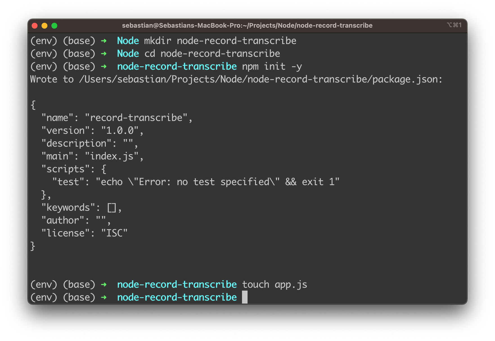
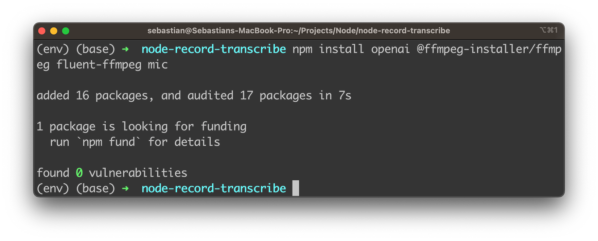
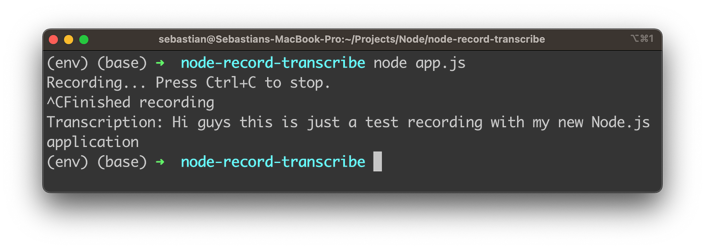

import { Image } from '@astrojs/image/components';
import YouTube from '~/components/widgets/YouTube.astro';
export const components = { img: Image };

Harnessing the power of speech-to-text technology can revolutionize the way we communicate, document, and interact with various applications. In this blog post, we will guide you through the process of creating a simple yet effective Node.js application that leverages OpenAI's Whisper API to record and transcribe audio in a single step.

Whether you're a seasoned developer or just starting your journey in the world of programming, this tutorial is designed to be straightforward and easy to follow. We'll walk you through the process of setting up a new Node.js project, installing necessary dependencies, implementing the application logic, and finally, running the application.

By the end of this post, you'll have a solid understanding of how to record and transcribe audio using Node.js and OpenAI's Whisper API, and you'll be well-equipped to explore the exciting possibilities that speech-to-text technology can bring to your projects. So, let's dive right in and start building our application!

## Create A New Node.js Project

Let's start the new Node.js project by using the following commands:

```bash
mkdir node-record-transcribe
cd node-record-transscribe
npm init -y
touch app.js
```



These command-line commands are used to create and set up a new Node.js project for the audio recording and transcription application:

* `mkdir node-record-transcribe`: This command creates a new directory named `node-record-transcribe`. This directory will be used to store all the files related to the Node.js project.
* `cd node-record-transscribe`: This command navigates to the newly created `node-record-transcribe` directory. All the following commands will be executed inside this directory.
* `npm init -y`: This command initializes a new Node.js project by creating a `package.json` file in the current directory. The `-y` flag automatically sets the default values for the project configuration, skipping the interactive setup process. The `package.json` file is used to manage the project's dependencies, scripts, and other configurations.
* `touch app.js`: This command creates a new file named `app.js` in the current directory. This file will serve as the entry point for the Node.js application, where you'll write the code for recording and transcribing audio using OpenAI's Whisper API.

With this project in place, we're ready to install needed dependencies:

```bash
npm install openai @ffmpeg-installer/ffmpeg fluent-ffmpeg mic
```



This command installs the required Node.js packages (dependencies) for the audio recording and transcription application using OpenAI's Whisper API. Here's a brief description of each package:

1. `openai`: This is the official OpenAI Node.js package that provides an easy-to-use interface to interact with OpenAI's API, including the Whisper Speech-to-Text API. By installing this package, you can easily access the Whisper API for transcribing audio files.
2. `@ffmpeg-installer/ffmpeg`: This package provides an FFmpeg binary, which is a popular multimedia framework for handling various audio and video formats. The package ensures that the correct FFmpeg binary is installed for your operating system. It will be used in conjunction with `fluent-ffmpeg` for working with audio files.
3. `fluent-ffmpeg`: This package is a fluent API to work with FFmpeg, the multimedia framework. It provides a convenient and easy-to-use interface for handling audio and video processing tasks, such as converting formats, extracting metadata, and more. In this project, it can be used for processing the recorded audio before sending it to the Whisper API.
4. `mic`: This package is a simple and lightweight module for recording audio using a microphone in a Node.js application. It provides a straightforward interface for accessing the system's microphone and capturing audio input, which will be used for recording the user's voice in this project.

By running the `npm install` command followed by these package names, you're adding these dependencies to your `package.json` file, making them available to use in your Node.js application.

Furthermore we need to install the SoX package:

```bash
brew install sox
```

This command is used to install the SoX (Sound eXchange) audio processing software on macOS systems using the Homebrew package manager. SoX is a powerful command-line utility that can be used to convert, process, and play various audio file formats.

## Implementing The Application Logic

Let's use `app.js` to add the main logic of our Node.js application:

__Step 1: Import required modules__

```js
const fs = require("fs");
const ffmpeg = require("fluent-ffmpeg");
const mic = require("mic");
const { Readable } = require("stream");
const ffmpegPath = require("@ffmpeg-installer/ffmpeg").path;

const { Configuration, OpenAIApi } = require("openai");
```

__Step 2: Set your OpenAI API key__

Replace `YOUR_OPENAI_API_KEY` with your actual OpenAI API key:

```js
const configuration = new Configuration({
  apiKey: "YOUR_OPENAI_API_KEY",
});
const openai = new OpenAIApi(configuration);
```

__Step 3: Configure FFmpeg__

Set the FFmpeg path using the `@ffmpeg-installer/ffmpeg` package:

```bash
ffmpeg.setFfmpegPath(ffmpegPath);
```

__Step 4: Create the recordAudio function__

This function handles audio recording using the `mic` package. The audio will be saved to the specified filename.

```js
// Record audio
function recordAudio(filename) {
  return new Promise((resolve, reject) => {
    const micInstance = mic({
      rate: '16000',
      channels: '1',
      fileType: 'wav',
    });

    const micInputStream = micInstance.getAudioStream();
    const output = fs.createWriteStream(filename);
    const writable = new Readable().wrap(micInputStream);

    console.log('Recording... Press Ctrl+C to stop.');

    writable.pipe(output);

    micInstance.start();

    process.on('SIGINT', () => {
      micInstance.stop();
      console.log('Finished recording');
      resolve();
    });

    micInputStream.on('error', (err) => {
      reject(err);
    });
  });
}
```

The function accepts one parameter, `filename`, which specifies the name of the file where the recorded audio will be saved. Here's a breakdown of the function:

1. The function returns a new Promise that will either resolve or reject based on the success or failure of the recording process.
2. A new `micInstance` is created using the `mic` package with the specified configuration: a sample rate of 16,000 Hz, one audio channel (mono), and a file type of WAV.
3. The `micInputStream` is obtained from the `micInstance` using the `getAudioStream()` method.
4. A writable stream, `output`, is created using the `fs.createWriteStream()` method with the provided `filename`.
5. A `Readable` stream is created and wrapped around the `micInputStream`, resulting in the `writable` stream.
6. The `writable` stream is piped to the output stream, effectively connecting the microphone input to the output file.
7. The `micInstance` starts recording audio using the `start()` method.
8. A message is printed to the console to inform the user that recording has begun and that they can press Ctrl+C to stop the recording.
9. A listener is added for the 'SIGINT' event (usually triggered by pressing Ctrl+C), which stops the `micInstance`, prints a message indicating that recording has finished, and resolves the Promise.
10. An error listener is added to the `micInputStream`. If an error occurs during recording, the Promise is rejected with the error.

When this function is called, it records audio from the user's microphone and saves it to the specified file. The recording process can be stopped by pressing Ctrl+C, at which point the Promise will resolve, allowing further processing of the recorded audio.

__Step 5: Create the transcribeAudio function__

This function takes the filename of the recorded audio and transcribes it using OpenAI's Whisper Speech-to-Text API.

```js
// Transcribe audio
async function transcribeAudio(filename) {
  const transcript = await openai.createTranscription(
    fs.createReadStream(filename),
    "whisper-1"
  );
  return transcript.data.text;
}
```

This `transcribeAudio` function is responsible for transcribing a recorded audio file using OpenAI's Whisper API. The function accepts a single parameter, `filename`, which specifies the name of the file containing the recorded audio. Here's a breakdown of the function:

1. The function is defined as an `async` function to allow the use of the `await` keyword for asynchronous operations within the function.
2. The `transcribeAudio` function takes the filename parameter and creates a readable file stream using the `fs.createReadStream(filename)` method. This stream is then passed to the `openai.createTranscription()` method along with the model ID "whisper-1".
3. The `openai.createTranscription()` method is an asynchronous function call that sends the audio data to OpenAI's Whisper ASR API for transcription. The `await` keyword is used to wait for the transcription API call to complete and return the transcript object.
4. The returned `transcript` object contains a `data` property, which in turn has a `text` property that holds the transcribed text.
5. The function returns the transcribed text (`transcript.data.text`) as its final output.

When this function is called with a valid audio file, it sends the audio data to the Whisper Speech-To-Text API and returns the transcribed text as a string.

__Step 6: Implement the main function__

Create the main function that calls the `recordAudio` and `transcribeAudio` functions:

```js
async function main() {
  const audioFilename = 'recorded_audio.wav';
  await recordAudio(audioFilename);
  const transcription = await transcribeAudio(audioFilename);
  console.log('Transcription:', transcription);
}
```

The `main` function is the primary entry point for the Node.js application, orchestrating the recording and transcribing processes. The function is defined as `async` to support the use of `await` for asynchronous operations. Here's a step-by-step explanation of the function:

1. The `audioFilename` constant is defined and set to `'recorded_audio.wav'`. This will be the name of the file where the recorded audio will be stored.
2. The `await` keyword is used to call the `recordAudio()` function and wait for it to complete before moving on. This function records the user's audio input and saves it as a file with the name specified by `audioFilename`. The recording process can be stopped by pressing Ctrl+C.
3. Once the audio recording is complete, the `transcribeAudio()` function is called with the `audioFilename` as its argument. The function sends the audio data to the Whisper Speech-to-Text API and returns the transcribed text. The `await` keyword is used to wait for the transcription process to complete.
4. The transcribed text is stored in the `transcription` constant.
5. Finally, the transcribed text is printed to the console with the label "Transcription:".

When the `main` function is executed, it records audio input from the user, transcribes it using OpenAI's Whisper API, and displays the transcribed text on the console.

__Complete code of app.js__

Finally, let's again take a complete code which should now be available in app.js:

```js
const fs = require("fs");
const ffmpeg = require("fluent-ffmpeg");
const mic = require("mic");
const { Readable } = require("stream");
const ffmpegPath = require("@ffmpeg-installer/ffmpeg").path;

const { Configuration, OpenAIApi } = require("openai");
const configuration = new Configuration({
  apiKey: "YOUR_OPENAI_API_KEY",
});
const openai = new OpenAIApi(configuration);
ffmpeg.setFfmpegPath(ffmpegPath);

// Record audio
function recordAudio(filename) {
  return new Promise((resolve, reject) => {
    const micInstance = mic({
      rate: "16000",
      channels: "1",
      fileType: "wav",
    });

    const micInputStream = micInstance.getAudioStream();
    const output = fs.createWriteStream(filename);
    const writable = new Readable().wrap(micInputStream);

    console.log("Recording... Press Ctrl+C to stop.");

    writable.pipe(output);

    micInstance.start();

    process.on("SIGINT", () => {
      micInstance.stop();
      console.log("Finished recording");
      resolve();
    });

    micInputStream.on("error", (err) => {
      reject(err);
    });
  });
}

// Transcribe audio
async function transcribeAudio(filename) {
  const transcript = await openai.createTranscription(
    fs.createReadStream(filename),
    "whisper-1"
  );
  return transcript.data.text;
}

// Main function
async function main() {
  const audioFilename = "recorded_audio.wav";
  await recordAudio(audioFilename);
  const transcription = await transcribeAudio(audioFilename);
  console.log("Transcription:", transcription);
}

main();
```

## Running The Application

Run the app using:

```bash
node app.js
```

The app will start recording audio. Press Ctrl+C to stop the recording. Once the recording is stopped, the app will transcribe the audio using OpenAI's Whisper API and print the transcription to the console.



By following these steps, you've successfully built a Node.js application that records and transcribes audio using OpenAI's Whisper Speech-to-Text API. This powerful tool can be customized and adapted for a wide range of applications, opening up new possibilities for enhancing your projects and exploring the exciting world of AI-driven applications.