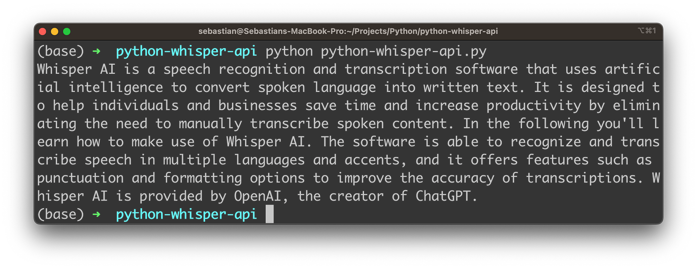

import { Image } from '@astrojs/image/components';
import YouTube from '~/components/widgets/YouTube.astro';
export const components = { img: Image };

Are you tired of manually transcribing hours of audio recordings? Do you want to save time and increase your productivity? Then, you’ll be excited to hear about OpenAI’s NEW Whisper API for speech-to-text conversion! With the help of this cutting-edge AI technology, you can now easily convert audio files into text within your Python program. Let’s explore how this works in the following!

Create a new file _python-whisper-api.py_ and start by inserting the following lines of python code:

```python
import os
import openai
openai.api_key = "[INSERT YOUR OPENAI API KEY HERE]"
audio_file = open("sample.mp3", "rb")
transcript = openai.Audio.transcribe("whisper-1", audio_file)
print(transcript.text)
```

The Python code above is an example of how to use OpenAI's Whisper API to transcribe an audio file using Python. Here's a breakdown of what each line of the code does:

1. `import os`: This imports the built-in os module, which allows us to interact with the operating system and perform tasks like opening files.
2. `import openai`: This imports the `openai` module, which provides access to OpenAI's APIs. If you've not installed the module in your local Python development environment yet you need to use the following command to get it installed: `pip install openai`
3. `openai.api_key = "[INSERT YOUR OPENAI API KEY HERE]"`: This sets the API key for the OpenAI API, which is required to make API calls.
4. `audio_file = open("sample.mp3", "rb")`: This opens the audio file "sample.mp3" in read-binary mode and assigns it to the variable `audio_file`.
5. `transcript = openai.Audio.transcribe("whisper-1", audio_file)`: This uses the `openai.Audio.transcribe()` method to transcribe the audio file. The first argument is the name of the model to use ("whisper-1"), and the second argument is the audio file that we opened in step 4. The `transcribe()` method returns a `Transcription` object, which we assign to the variable `transcript`.
6. `print(transcript.text)`: This prints out the `text` of the transcription, which is accessed through the text attribute of the `Transcription` object.

In summary, this code uses the OpenAI Whisper API to transcribe an audio file and print out the resulting text transcription.

## Let's Run The Application

Let's run the Python application by typing in:

```bash
$ python python-whisper-api.py
```

You need to make sure that you've stored the audio file in the same folder with name sample.mp3. You'll then receive the text transcript which is provided by Whisper:



## Conclusion

OpenAI's Whisper API has opened up a world of possibilities for speech-to-text conversion in Python programming. By utilizing this new technology, you can increase your productivity and save time by automating the transcription process. Whether you're a journalist, researcher, or someone who needs to handle audio content regularly, Whisper API can be a valuable tool to have in your arsenal. With its impressive accuracy and ease of use, Whisper API promises to revolutionize the way we handle audio content in the future. So why wait? Start exploring Whisper API today and discover all the amazing things you can achieve with this groundbreaking technology.