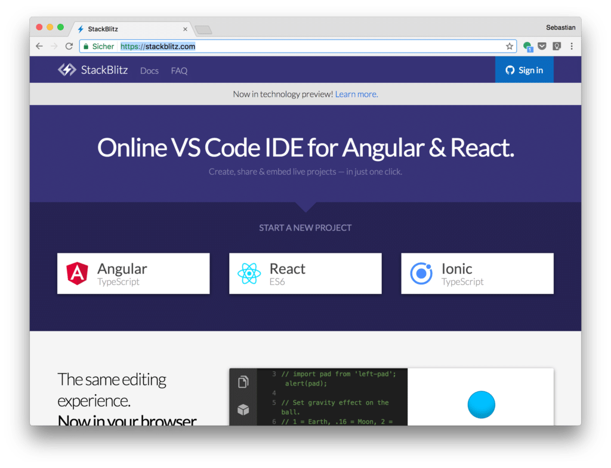
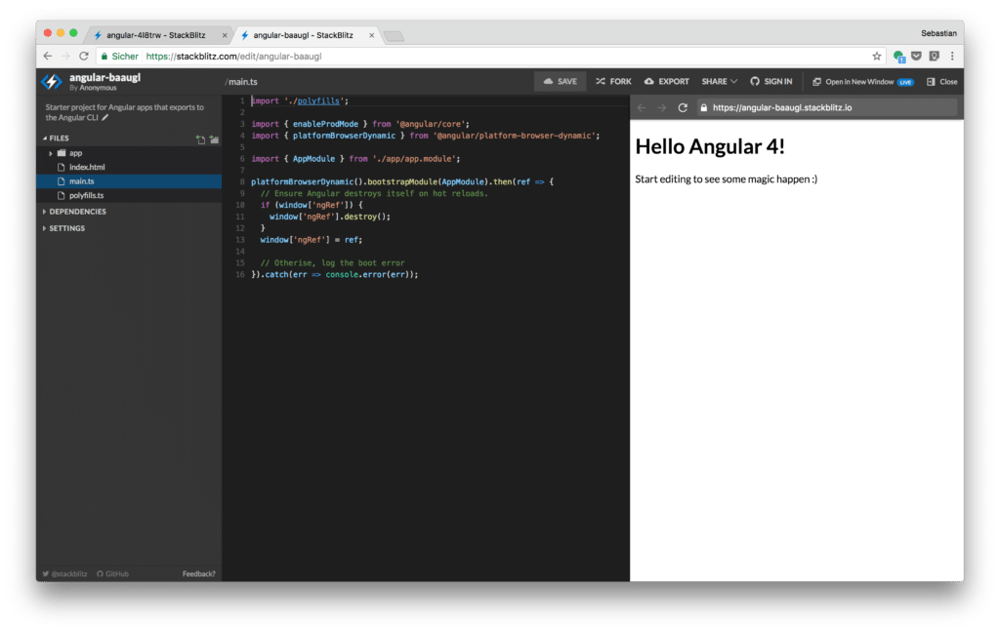
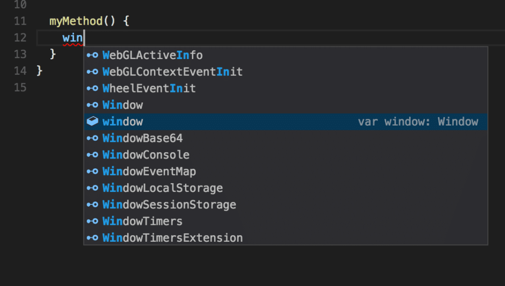
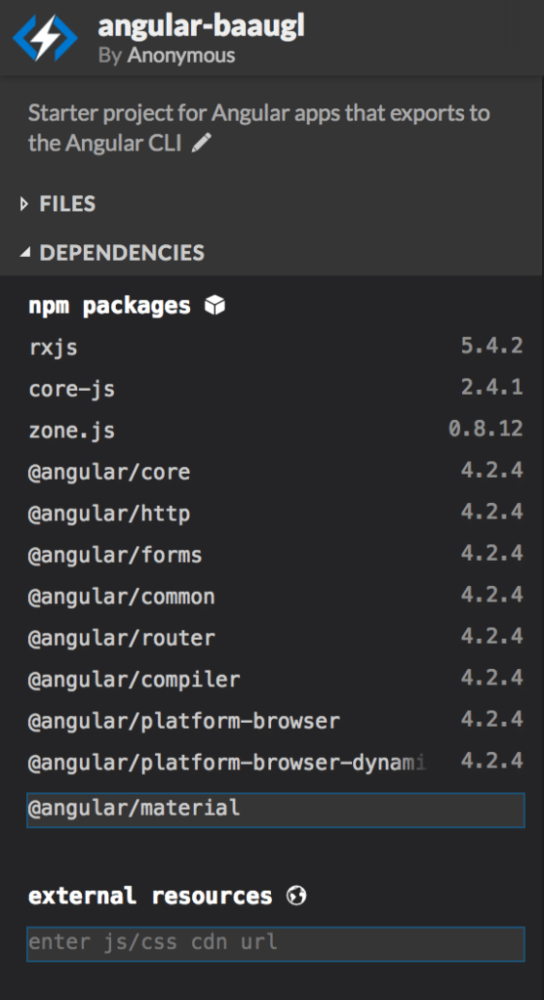
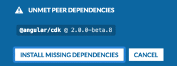
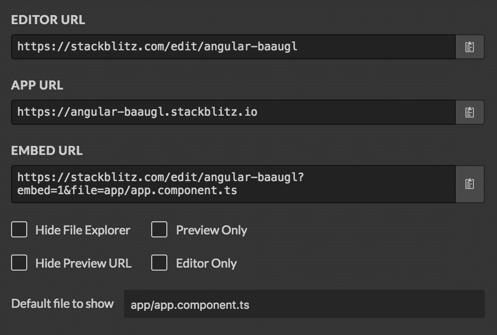

import { Image } from '@astrojs/image/components';
import YouTube from '~/components/widgets/YouTube.astro';
export const components = { img: Image };

<YouTube url="https://youtu.be/P15es1sGb4A" />

StackBlitz is an online IDE which supports Angular and React development projects out-of-the box. The guys from thinkster.io have created that great project to make it as easy as possible to get started with your Angular or React project without the need to deal with installation of dependencies or create a build configuration.

StackBlitz has many great and outstanding features which no other online code editor has to offer at the moment. So it's worth taking a deeper look at StackBlitz and see what this online IDE has to offer.

## Setting Up A Project

Setting up a new project is as easy as opening up the project's website at [https://stackblitz.com](https://stackblitz.com) and clicking on one of the following options:

- Angular
- React
- Ionic

to start a new project:

The online code editor view is opened immediately and the project is pre-configured. The following screenshot shows the editor view after having started a new Angular project:

The view is split up into three sections.

- _**Files, Dependencies und Settings**_: On the left side you can find the Files, Dependencies and Settings view.
- **_Code Editor_**: The code editor is placed in the middle of the window. Clicking on one of the files in the project structure on the left opens that file for editing. The editor supports automatic code highlighting and smart completion.
- **_Application Preview_**: The application preview on the right side shows the application's output in the browser. The preview supports live-reloading. If you change the code in the editor you can see the result on the right side without needing to refresh the view. The browser preview can also be opened in another browser window, so that you can use the browser development tools (e.g. Debugger) without any limitations.

## Smart Completions Of Code

The code editor supports smart code completions as you type, as you can see in the following screenshot:

This feature is similar to IntelliSense which is known from Visual Studio Code. Starting typing in keywords or expressions brings up a list with all suggestions. You can select one entry from the list and hit return to complete the code.

## Installing Dependencies

Installing libraries with StackBlitz is easy by using the in-browser NPM client. The client is available by extending the DEPENDENCIES entry from the tree structure which is displayed in the left view:

You'll get a list of already installed NPM packages. An input field is available which can be used to typing in a NPM package name (e.g. @angular/material). Hitting return will automatically install that dependency.

If there are any unmet peer dependencies you'll be informed in the following way:

Clicking on button INSTALL MISSING DEPENDENCIES will add those libraries as well.

Another very cool feature is: If you paste in existing code into the StackBiz editor, it will automatically detect missing packages. You will be able to install those missing packages by simply clicking on one button.

## Offline Support

StackBlitz is a Progressive Web App (PWA) which let's you continue your work even when your network connection is lost. You can still make changes to the project and even the development web server and the live preview will still be available.

Once the network connection is back again, everything is synced to the server again without the need to do anything manually.

## Share Links To Your Projects

StackBlitz allows to share your project very easily by providing just an URL to your audience. You simply need to click on button SHARE from the top menu and you'll see the following dialog:

This dialog offers three URLs you can use to share your project:

- **Editor URL**: Gives direct access to the code editor
- **App URL**: Opens the live preview of your application
- **Embed URL**: URL which can be used to embed the StackBlitz view in your web site or blog post. With the checkbox elements below you can configure what this embed view will look like.

## What's Next

StackBlitz has just been release for the first time and already looks very promising. It has lots of cool features which makes developing in the browser a breeze. Beside the support of Angular and React the project team has already promised to extend StackBlitz to support Vue.js in the near future.