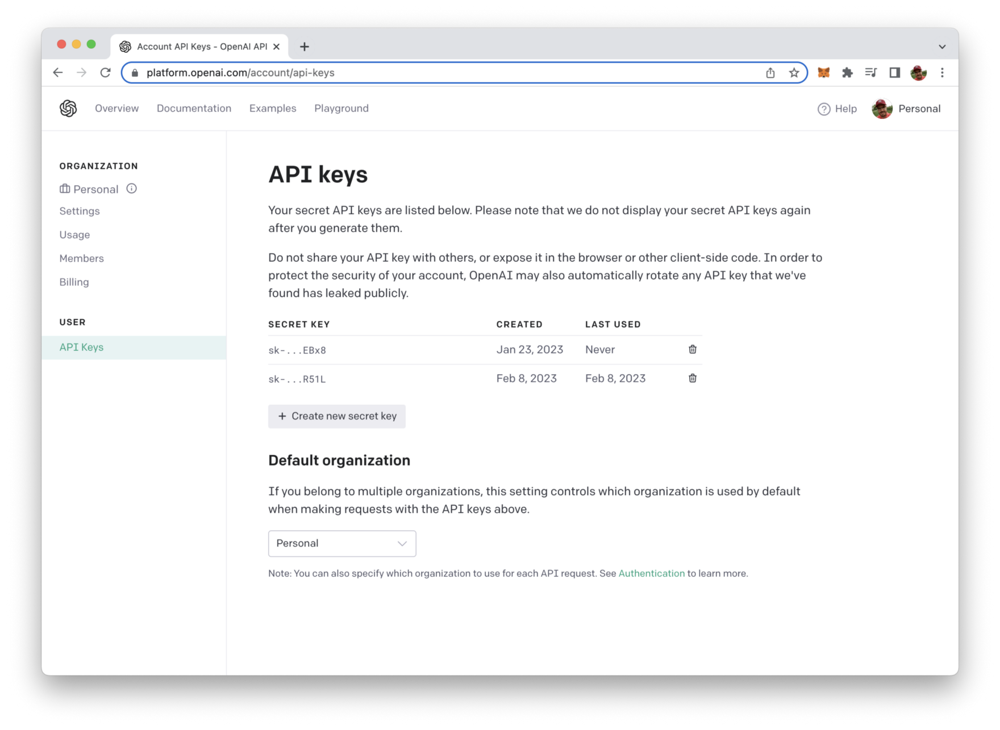

import { Image } from '@astrojs/image/components';
import YouTube from '~/components/widgets/YouTube.astro';
export const components = { img: Image }; 

OpenAI API provides a vast array of cutting-edge AI models that can be used to perform various NLP tasks. However, simply making API requests to OpenAI may not be enough in certain situations, such as when real-time updates are needed. This is where Server Sent Events (SSE) comes into play.

SSE is a simple and efficient technique for streaming data from the server to the client in real-time. In this post, we will explore how to stream responses from the OpenAI API in real-time using Python and SSE. By the end of this tutorial, you will have a solid understanding of how to implement this technique, and you will be able to stream responses from the OpenAI API to your application with ease.

## Retrieve Your OpenAI API Key

In order to be able to access the OpenAI API from within your Python script we need to use an API key.

To retrieve your OpenAI API key you need to create a user account at https://openai.com/ and access the API Keys section in the OpenAI dashboard to create a new API key.



This key is secret and must not shared with anybody else. We'll need to use this key later of when implementing the Python script to access OpenAI`s API.

## Implement The Script

In a new folder create a file main.py and start the implementation by inserting the following four lines of code:

```python
import requests
import json
import sseclient
 
API_KEY = '[INSERT YOUR OPENAI API KEY HERE]'
```

This code imports three modules in Python: requests, json, and sseclient.

requests is a popular Python library used to send HTTP requests to a server and receive responses.

json is a library that provides functions to work with JSON data. It allows you to encode and decode JSON data.
sseclient is a library used to handle Server-Sent Events (SSE) - a type of event-driven communication between a client and a server over HTTP.

If you have not installed those libraries before in your Python development environment you first need to use the pip command to get those packages installed:

```bash
pip install requests json sseclient-py
```

The code also defines a variable API_KEY which is intended to store an OpenAI API key. Please replace the placeholder text [INSERT YOUR OPENAI API KEY HERE] with the API key you have retrieved from your OpenAI account before.

Next add further complete the implementation by implementing and executing the performRequestWithStreaming() function which is containing all the logic which is needed to perform a POST request to the OpenAI API completion endpoint and receive the answer in streaming mode:

```python
import requests
import json
import sseclient
 
API_KEY = '[INSERT YOUR OPENAI API KEY HERE]'

def performRequestWithStreaming():
    reqUrl = 'https://api.openai.com/v1/completions'
    reqHeaders = {
        'Accept': 'text/event-stream',
        'Authorization': 'Bearer ' + API_KEY
    }
    reqBody = {
      "model": "text-davinci-003",
      "prompt": "What is Python?",
      "max_tokens": 100,
      "temperature": 0,
      "stream": True,
    }
    request = requests.post(reqUrl, stream=True, headers=reqHeaders, json=reqBody)
    client = sseclient.SSEClient(request)
    for event in client.events():
        if event.data != '[DONE]':
            print(json.loads(event.data)['choices'][0]['text'], end="", flush=True),

if __name__ == '__main__':
    performRequestWithStreaming()
```

The function makes a POST request to the URL https://api.openai.com/v1/completions using the requests module. The request header includes Accept and Authorization fields, with the Authorization header using the API_KEY variable that was defined earlier in the code.

The request body, defined as the reqBody variable, contains several parameters for the API request, including the model name, prompt text, maximum number of tokens to return, temperature, and the requirement for the response to be streamed.

The response from the API request is assigned to the request variable. Then, the sseclient library is used to handle the response, and the SSEClient constructor is passed the request object to create a new client object.

The code then uses a for-loop to iterate over the events in the client object. For each event, the event data is printed to the console, unless the event data is equal to '[DONE]', in which case nothing is printed. The json.loads() function is used to parse the JSON data in the event, and the choices field of the resulting dictionary is extracted to get the text of the completion. The end and flush parameters of the print() function are used to ensure the output is not buffered and is immediately displayed on the console.

## Execute The Script

Execute the script with

```bash
$ python main.py
```

You should then be able to see that the answered provided by OpenAI (to the prompt "What is Python?") is streamed to the command line.

## Conclusion

In conclusion, streaming responses from the OpenAI API in real-time using SSE and Python is a powerful and efficient way to access AI models in your applications. By following the step-by-step guide in this post, you should now be able to implement this technique and receive real-time updates from the OpenAI API. SSE is a simple and effective solution for streaming data from the server to the client and is a great option for those looking to take their application's AI capabilities to the next level.