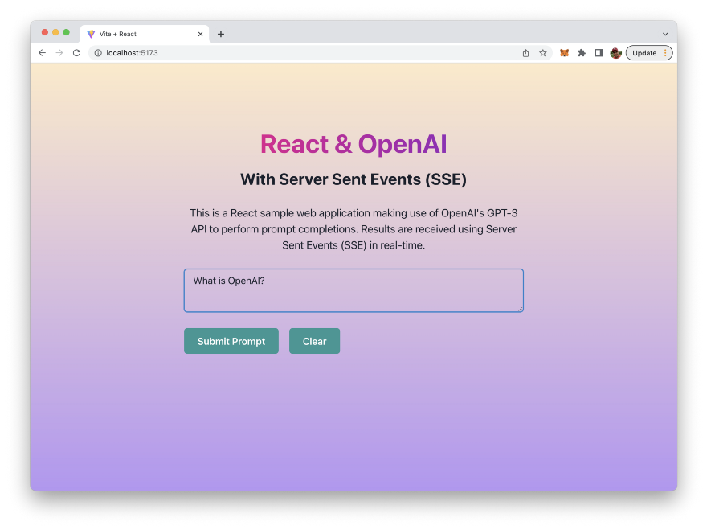

import { Image } from '@astrojs/image/components';
import YouTube from '~/components/widgets/YouTube.astro';
export const components = { img: Image }; 

In this guide, we’ll explore how to stream real-time results in a React web application using OpenAI’s GPT-3 API and Server Sent Events (SSE). With the rise of AI and machine learning, OpenAI’s GPT-3 has become one of the most powerful and versatile tools for natural language processing and text generation. By combining this with the simplicity and performance of React, and the real-time capabilities of SSE, you can create a truly outstanding web application.

In this step-by-step guide, we’ll take you through the process of setting up your React environment, integrating OpenAI’s GPT-3 API, and using SSE to stream real-time results. Get ready to enhance your web application development skills and create a truly dynamic and engaging user experience.

## What Are We Going To Build

Let’s take a quick glimpse on the web application we’re going to build in this step-by-step guide …


The application we’re building will be able to deliver real-time text responses retrieved from OpenAI’s GPT-3 language model.

In order to build this web application we’ll be making use of the following technologies:

* Yarn: Yarn is a package manager for JavaScript. It is an alternative to the widely used npm (Node Package Manager) and provides a number of benefits over it.
* Vite: Vite is a fast, optimized build tool and development server for modern web projects. It was created to address some of the challenges faced by traditional build tools like slow build times, large bundle sizes, and the difficulty of setting up a development environment.
* React: React is one of the most popular JavaScript library for building user interfaces developed by Facebook. It is well-suited for building complex, dynamic user interfaces.
* Chakra UI: Chakra UI is a UI library for React that provides a set of reusable and accessible components for building modern user interfaces.
* OpenAI GPT-3 API: OpenAI GPT-3 (Generative Pretrained Transformer 3) is an advanced language processing AI model developed by OpenAI. It is one of the largest and most powerful language models to date, capable of generating high-quality text for a wide range of tasks, including language translation, question answering, and summarization. We’ll use the API to integrate some of the model’s capabilities in our React web application.
* sse.js: Is a small JavaScript Server Sent Events library which we well use to communicate with the OpenAI API in streaming mode and receive server sent events in our front-end application. The library is available at: https://github.com/mpetazzoni/sse.js

## Step 1: Obtain The OpenAI API Key

In order to be able to access the OpenAI API from within your Python script we need to use an API key.

To retrieve your OpenAI API key you need to create a user account at https://openai.com/ and access the API Keys section in the OpenAI dashboard to create a new API key.


This key is secret and must not shared with anybody else. We’ll need to use this key later of when implementing the Python script to access OpenAI`s API.

## Step 2: Create The React Project Using Yarn And Vite

Let’s now create a new React project with vite. Type in the following command to start the creation process on the command line:

```bash
$ yarn create vite
```

You’ll then be prompted to enter a new project name next:


Type in react-openai-sse and hit return to continue. Vite will then provide you with a list of JavaScript frameworks you can choose from. Use the arrow key to select the entry “React” and hit return again:


Once you’ve selected “React” you’re asked to specify the variant of the React project. You have four options to choose from:


* JavaScript
* TypeScript
* JavaScript + SWC
* TypeScript + SWC

So you can decide to create a React project which is using just plain JavaScript or which is supporting Typescript as well. In addition you can choose to use SWC which is a new Rust-based bundler, which claims to be a lot of faster then JS-based bundlers. For the example of this article we’re choosing option “JavaScript +SWC”.

Once selected the project setup is completed:


You can now enter the new project directory (with the name of the project you’ve entered:

```bash
$ cd react-openai-sse
```

Next you need to execute the yarn command:

```bash
$ yarn
```

This makes sure that all the needed dependencies of the project are being downloaded and installed:


## Step 3: Installing Dependencies

The next step is to install the needed dependencies: Chakra UI and sse.js. Let’s start with Chakra UI. In order to install the UI library you need to execute the following command inside the project folder:

```bash
$ yarn add @chakra-ui/react @emotion/react @emotion/styled framer-motion
```

Second make sure to install the sse.js libraray into our project by using the following command:

```bash
$ yarn add sse@https://github.com/mpetazzoni/sse.js
```

## Step 4: Cleaning Up The Project

In file src/App.js you can already find a lot of default code. Let’s clean this code up to only contain an empty implementation for App component which we’re using as a starting point:

```js
function App() {
  return (
  );
}

export default App;
```

## Step 5: Implementing The User Interface (UI)

In order to activate Chakra UI for our React application we need to embed the main application component into `<ChakraProvider></ChakraProvider>`. There the ChakraProvider component must first be imported from @chakra-ui/react. Adapt the code in src/main.jsx to the following:

```js
import React from 'react'
import ReactDOM from 'react-dom/client'
import { ChakraProvider } from '@chakra-ui/react'
import App from './App'
import './index.css'

ReactDOM.createRoot(document.getElementById('root')).render(
  <React.StrictMode>
    <ChakraProvider>
      <App />
    </ChakraProvider>
  </React.StrictMode>
)
```

Next open src/App.jsx. First let’s add an import statement on top of the file which imports all Chakra UI components which we will be using the following:

```js
import { Heading, Text, Box, Flex, Button, Textarea } from "@chakra-ui/react";
```

Now start implementing the user interface by adding the Chakra UI's `Flex` component to the return statement of App component in the following way:

```js
  return (
    <Flex
      width={"100vw"}
      height={"100vh"}
      alignContent={"center"}
      justifyContent={"center"}
      bgGradient="linear(to-b, orange.100, purple.300)"
    >
    </Flex>
);
```

This code creates a `Flex` component using the Chakra UI library in React. A Flex component is used to create flexible and responsive layout containers.

The code sets the width and height of the `Flex` container to `100vw` and `100vh`, respectively. This means that the container will take up the full width and height of the viewport.

The `alignContent` property is set to `center`, which aligns the content along the cross axis (vertically) in the center of the container. The `justifyContent` property is also set to `center`, which aligns the content along the main axis (horizontally) in the center of the container.

Finally, the `bgGradient` property is set to `linear(to-b, orange.100, purple.300)`. This sets the background gradient of the container to a linear gradient that starts with the color `orange.100` and transitions to `purple.300`.

So, in short, the code creates a full-page container that has a centered layout and a background gradient that transitions from orange to purple.

Inside of the `Flex` component we do need to add a few more Chakra UI elements like you can see in the following listing:

```js
return (
    <Flex
      width={"100vw"}
      height={"100vh"}
      alignContent={"center"}
      justifyContent={"center"}
      bgGradient="linear(to-b, orange.100, purple.300)"
    >
      <Box maxW="2xl" m="0 auto" p="20px">
        <Heading
          as="h1"
          textAlign="center"
          fontSize="5xl"
          mt="100px"
          bgGradient="linear(to-l, #7928CA, #FF0080)"
          bgClip="text"
        >
          React & OpenAI
        </Heading>
        <Heading as="h2" textAlign="center" fontSize="3xl" mt="20px">
          With Server Sent Events (SSE)
        </Heading>
        <Text fontSize="xl" textAlign="center" mt="30px">
          This is a React sample web application making use of OpenAI's GPT-3
          API to perform prompt completions. Results are received using Server
          Sent Events (SSE) in real-time.
        </Text>
        <Textarea
          value={prompt}
          onChange={handlePromptChange}
          placeholder="Insert your prompt here ..."
          mt="30px"
          size="lg"
        />
        <Button
          isLoading={isLoading}
          loadingText="Loading..."
          colorScheme="teal"
          size="lg"
          mt="30px"
          onClick={handleSubmitPromptBtnClicked}
        >
          Submit Prompt
        </Button>
        <Button
          colorScheme="teal"
          size="lg"
          mt="30px"
          ml="20px"
          onClick={handleClearBtnClicked}
        >
          Clear
        </Button>
        {result != "" && (
          <Box maxW="2xl" m="0 auto">
            <Heading as="h5" textAlign="left" fontSize="lg" mt="40px">
              Result:
            </Heading>
            <Text fontSize="lg" textAlign="left" mt="20px">
              {result}
            </Text>
          </Box>
        )}
      </Box>
    </Flex>
  );
```

This code creates a `Box` component using the Chakra UI library in React. A `Box` component is used to create a layout container.

The `Box` component has the properties `maxW` set to `"2xl"`, `m` set to `"0 auto"`, and p set to `"20px"`. This sets the maximum width of the container to `2xl`, centers the container horizontally and vertically with a `0` margin on the top and bottom and an `auto` margin on the left and right, and adds a padding of `20px` around the container's contents.

The code then creates several `Heading` components, which are used to display headings in different sizes, with `fontSize` properties set to `5xl`, `3xl`, and `lg`, respectively. The first Heading component has a background gradient set using the `bgGradient` property, and the text is clipped to the gradient using the `bgClip` property.

There are also two `Text` components used to display text with a `fontSize` of `xl` and `lg`, respectively. The text is aligned to the center of the container using the `textAlign` property.

A `Textarea` component is used to allow the user to input text, with the `value` property bound to the `prompt` state and the `onChange` property set to the `handlePromptChange` function. The `placeholder` property provides a hint to the user of what to input.

Two `Button` components are used for user interaction, with one for submitting the prompt and another for clearing the result. The `onClick` properties of the buttons are bound to the `handleSubmitPromptBtnClicked` and `handleClearBtnClicked` functions, respectively. The `isLoading` property of the submit button is used to display a loading state while the result is being processed.

Finally, the code conditionally displays a `Box` component with a heading and a text component to show the result of the API call. The result is displayed only if it is not an empty string.

In short, this code creates a centered layout container with headings, text, a text input area, and buttons for user interaction. The result of an API call is displayed if it is not an empty string.

## Step 6: Implementing OpenAI API Access By Using Server Sent Events

In the next step we need to write the code which is needed to implement the communication logic with the OpenAI API. From our React application we'd like to send the text which was entered by the user to the HTTP POST Completion's endpoint which is available at

```
https://api.openai.com/v1/completions
```

From this endpoint we expect to receive the text completion for the given prompt. We'll use the sse.js library to receive the response by listing to Server-Sent Events. This will allow us to receive the text response as it gets generated word by word.

Let's start by adding some more import statements to App.jsx first:

```js
import { useState, useRef, useEffect } from "react";
import { SSE } from "sse";
```

This code imports three hooks from the React library: `useState`, `useRef`, and `useEffect`. These hooks allow you to add state and side effects to your functional components in React.

Additionally, the code imports an object SSE from a module called `sse`. SSE (Server-Sent Events) is a standard for real-time communication between a client and a server. With Server-Sent Events, the server can send data to a client without the client having to request it, which is useful for building real-time applications like chat rooms, stock tickers, and other types of applications where updates need to be pushed from the server to the client.

Next we need to make the OpenAI API key available in our application. In our Vite-based React project we'll be using the .env.local file in the root folder of our project to contain the definition of an environment variable which is holding the API key:

```
VITE_OPENAI_API_KEY=[INSERT YOUR OPENAI API KEY HERE]
```

In App.jsx we are then able to retrieve the key from the environment variable by the following line of code:

```js
const API_KEY = import.meta.env.VITE_OPENAI_API_KEY;
```

Let's continue with defining our state and ref variables with the App component function:

```js
function App() {
  let [prompt, setPrompt] = useState("");
  let [isLoading, setIsLoading] = useState(false);
  let [result, setResult] = useState("");

  const resultRef = useRef();

  useEffect(() => {
    resultRef.current = result;
  }, [result]);
...
```

This code defines a functional React component called `App`. The component uses several React hooks to manage its state and side effects.

The `useState` hook is used three times to manage the state of the component. The first time, it creates a state variable `prompt` and its updater function `setPrompt`. The initial value of `prompt` is an empty string.

The second time, it creates a state variable `isLoading` and its updater function `setIsLoading`. The initial value of `isLoading` is `false`.

The third time, it creates a state variable `result` and its updater function `setResult`. The initial value of `result` is an empty string.

The `useRef` hook is used to create a ref called `resultRef`. Refs are a way to access the properties of DOM elements and can be used to maintain a reference to a value across multiple renders of a component. In this case, `resultRef.current` is assigned the value of `result` every time `result` changes, effectively making it a way to persist the value of `result` across renders.

The `useEffect` hook is used to run a side effect whenever the `result` value changes. The side effect is to update `resultRef.current` with the new value of `result`, allowing it to persist across renders.

Finally we're ready to implement to logic which is needed to interact with the OpenAI Completion endpoint and receive the answer as Server-Send Events by using the sse.js library. This logic is implemented in the `handleSubmitPromptBtnClicked` function which is invoked everytime the user clicks on the _Submit Prompt_ button:

```js
let handleSubmitPromptBtnClicked = async () => {
    if (prompt !== "") {
      setIsLoading(true);
      setResult("");
      let url = "https://api.openai.com/v1/completions";
      let data = {
        model: "text-davinci-003",
        prompt: prompt,
        temperature: 0.75,
        top_p: 0.95,
        max_tokens: 100,
        stream: true,
        n: 1,
      };

      let source = new SSE(url, {
        headers: {
          "Content-Type": "application/json",
          Authorization: `Bearer ${API_KEY}`,
        },
        method: "POST",
        payload: JSON.stringify(data),
      });

      source.addEventListener("message", (e) => {
        if (e.data != "[DONE]") {
          let payload = JSON.parse(e.data);
          let text = payload.choices[0].text;
          if (text != "\n") {
            console.log("Text: " + text);
            resultRef.current = resultRef.current + text;
            console.log("ResultRef.current: " + resultRef.current);
            setResult(resultRef.current);
          }
        } else {
          source.close();
        }
      });

      source.addEventListener("readystatechange", (e) => {
        if (e.readyState >= 2) {
          setIsLoading(false);
        }
      });

      source.stream();
    } else {
      alert("Please insert a prompt!");
    }
  };
```

The function is an asynchronous arrow function, which allows it to use the `await` keyword to wait for a promise to resolve.

The function first checks if the `prompt` value is not equal to an empty string. If it is not, the function continues to execute. If it is, an alert message is displayed to the user saying "Please insert a prompt!".

The function then sets the state value of `isLoading` to `true` and the state value of `result` to an empty string.

Next, it constructs a URL and an object `data` that contains the data to be sent to the API endpoint.

It then creates a new instance of the `SSE` class, which is the sse.js library's class for working with Server-Sent Events. The class is instantiated with the `url`, `headers`, `method`, and `payload` options.

The function adds two event listeners to the `source` instance. The first listens for the `message` event and updates the value of `resultRef.current` and the state value of `result` with the response text received from the API. The second listens for the `readystatechange` event and sets the state value of `isLoading` to `false` when the ready state of the `source` changes to 2 or higher.

Finally, it calls the `stream` method on the `source` instance to initiate the API request.

In short, this function makes an API request to the OpenAI API with the given prompt and updates the state values and refs accordingly with the response data. As our UI components are bound to the respective state variables, the output on the website is updated everytime a new chunk of data is received from the OpenAI GPT-3 language model.

## Step 7: Implementing Clear Input Functionality

Finally we need to implement the click event handler function for the Clear button as well:

```js
let handleClearBtnClicked = () => {
    setPrompt("");
    setResult("");
};
```

This code defines a JavaScript function `handleClearBtnClicked`. The function is an arrow function, which is a shorthand for writing anonymous functions in JavaScript. The function is executed when the clear button is clicked.

The function does two things when it is executed:

1. It calls the `setPrompt` function and passes an empty string as an argument. `setPrompt` is the state updater function that updates the state value of the `prompt` in your React component.
2. It calls the `setResult` function and passes an empty string as an argument. `setResult` is the state updater function that updates the state value of the `result` in your React component.

The purpose of this function is to clear the values of both the `prompt` and the `result` in the state of your React component and therewith is resetting the inputs and outputs in the user interface.

## Step 8: Testing The Application

Finally we're ready to test the application by starting the development web server by executing the following command in the project folder:

```bash
$ yarn dev
```

The response on the command line informs you about the port on which the web server is running:


When accessing the local URL in the browser you should be able to see the output of the React application in the browser:


You can start entering your prompt in the text input field right away:



Clicking on button "Submit Prompt" will initiate the OpenAI request and you'll be able to see the output once the first chunk of data is received from the API:


The button will indicate a loading state as long ad the final chunk of data has been received and the answer is fully available


## Conclusion

This guide has shown you how to bring together the power of OpenAI's GPT-3 API, the simplicity and performance of React, and the real-time capabilities of Server Sent Events (SSE) to create a truly outstanding web application. By following the step-by-step instructions, you now have the knowledge and tools necessary to stream real-time results in your own React web application. Whether you're a beginner or an experienced developer, this guide has given you the foundation to take your web application development skills to the next level. So what are you waiting for? Start exploring and integrating these amazing technologies into your own projects today!