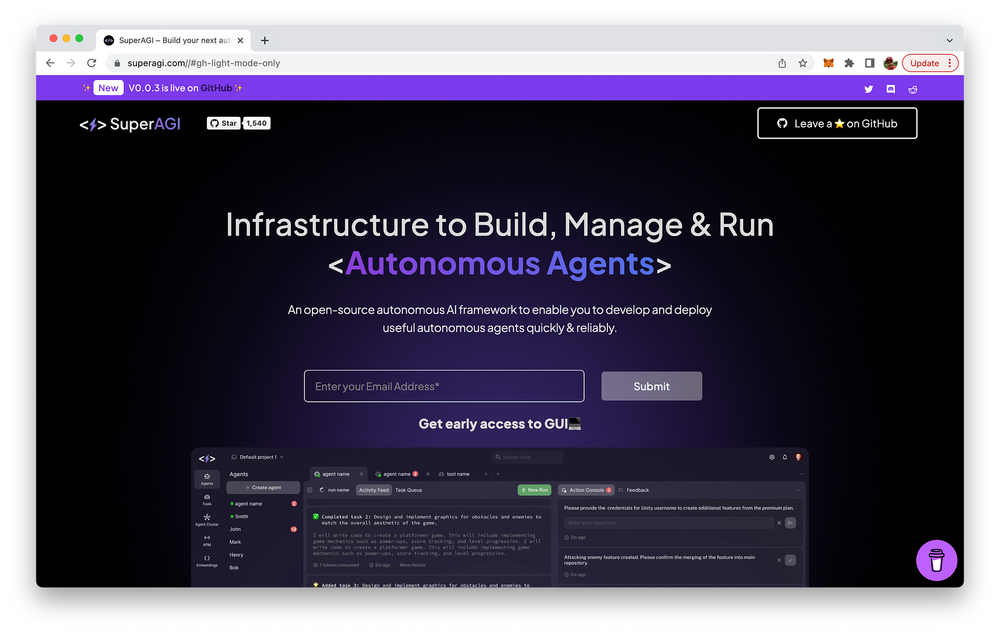

import { Image } from '@astrojs/image/components';
import YouTube from '~/components/widgets/YouTube.astro';
export const components = { img: Image };

Hello, tech enthusiasts! Today, I’m excited to share with you a groundbreaking open-source project that I’ve been exploring recently. It’s called SuperAGI, and it’s a dev-first autonomous AI agent framework. This powerful tool enables developers to build, manage, and run useful autonomous agents quickly and reliably.

## What is SuperAGI?

SuperAGI is an open-source framework designed to facilitate the development of autonomous AI agents. It's a project that has been gaining traction in the AI community due to its robust features and user-friendly approach. The framework is designed to be developer-first, meaning it's built with the needs and preferences of developers in mind.

The SuperAGI framework provides a wide array of features that make it a versatile tool for AI development. Some of these features include:

* Provision, Spawn & Deploy Autonomous AI Agents: SuperAGI allows developers to create and manage AI agents with ease.
* Extend Agent Capabilities with Tools: Developers can enhance the abilities of their AI agents using a variety of tools provided by the framework.
* Run Concurrent Agents Seamlessly: SuperAGI supports the simultaneous operation of multiple AI agents.
* Graphical User Interface: The framework comes with a user-friendly GUI, making it easier for developers to interact with their AI agents.
* Action Console, Multiple Vector DBs, Multi-Modal Agents, Agent Trajectory Fine-Tuning, Performance Telemetry, Optimized Token Usage, Agent Memory Storage, Looping Detection Heuristics, Concurrent Agents, and Resource Manager: These are some of the other advanced features offered by SuperAGI.

The project's website can be found at: https://superagi.com/:

## Getting Started with SuperAGI

Now that we've covered what SuperAGI is, let's dive into how you can get started with this fantastic framework. Here's a step-by-step guide:

### Step 1: Download the Repository

First, you need to download the SuperAGI repository. You can do this by running the command git clone https://github.com/TransformerOptimus/SuperAGI.git in your terminal. Alternatively, you can download it directly from the GitHub page in zip format.

### Step 2: Navigate to the Directory

Once you've downloaded the repository, navigate to the directory using the command cd SuperAGI.

### Step 3: Create a Copy of the Config Template

In the SuperAGI directory, you'll find a file named config_template.yaml. Create a copy of this file and name it config.yaml.

### Step 4: Enter Your Unique Keys

Open the config.yaml file and enter your unique OpenAI API Key, Google key, Custom search engine ID, and Pinecone API key without any quotes or spaces. If you don't have these keys, you can obtain them by following the links provided in the SuperAGI GitHub page.

### Step 5: Install Docker

Ensure that Docker is installed on your system. If not, you can download it from the official Docker website.

### Step 6: Run Docker Compose

Once you have Docker Desktop running, run the command docker-compose up --build in the SuperAGI directory. This command will build and start the SuperAGI application.

### Step 7: Open SuperAGI in Your Browser

Finally, open your browser and go to localhost:3000 to see SuperAGI running.

And voila! You're now ready to start building, managing, and running your autonomous AI agents using SuperAGI.

## Conclusion

SuperAGI is a powerful tool that can significantly streamline the process of developing autonomous AI agents. Its dev-first approach, coupled with its robust features, makes it a must-have tool for any developer working inthe AI field.

While the project is still under active development and may have some issues, the community behind SuperAGI is very active and responsive. If you encounter any problems, you can check the open issues on the GitHub page or create a new issue detailing the error or problem you experienced.

Remember, open-source projects thrive on community support. If you find SuperAGI useful, consider contributing to the project or sharing it with your peers.

Happy coding, and I can't wait to see the amazing AI agents you'll create with SuperAGI!