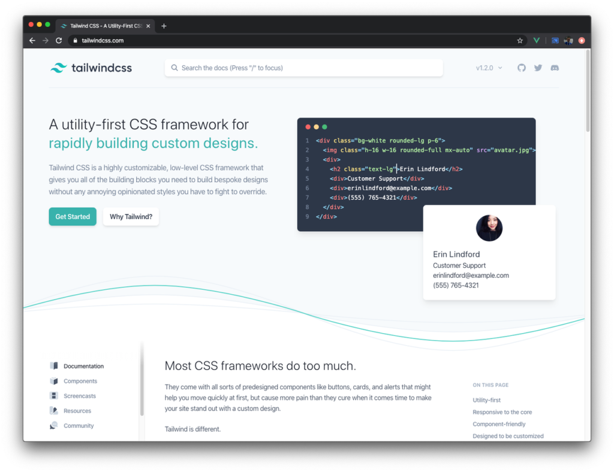
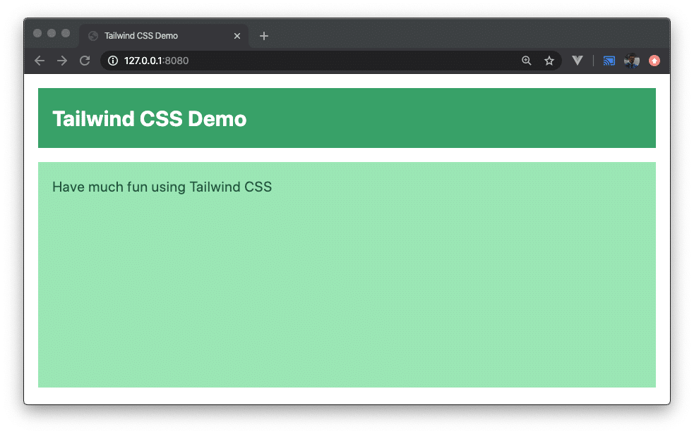
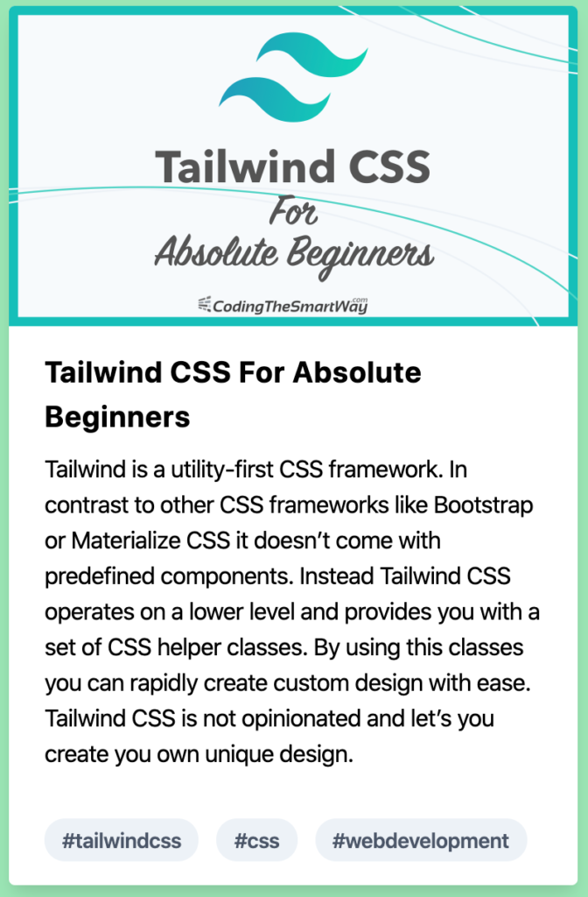

import { Image } from '@astrojs/image/components';
import YouTube from '~/components/widgets/YouTube.astro';
export const components = { img: Image };

<YouTube url="https://youtu.be/j_5-LISy9Qg" />

## What is Tailwind CSS

Tailwind is a utility-first CSS framework. In contrast to other CSS frameworks like Bootstrap or Materialize CSS it doesn’t come with predefined components. Instead Tailwind CSS operates on a lower level and provides you with a set of CSS helper classes. By using this classes you can rapidly create custom design with ease. Tailwind CSS is not opinionated and let’s you create you own unique design.  
  
The project’s website can be found at [https://tailwindcss.com/](https://tailwindcss.com/):  



## Setting Up A Project With Tailwind CSS

So let’s get started with Tailwind CSS. To get Tailwind CSS installed we’ll start with a new project from scratch. Create a new project folder by using the following command:  
  
`$ mkdir tailwind-sample-01`  
  
Change into that newly created folder  
  
`$ cd tailwind-sample-01`  
  
and create a new _package.json_ file by using the npm command in the following way:  
  
`$ npm init -y`  
  
This enables us to use the Node.js Package Manager (NPM) in the following steps to manage our dependencies within this project.  
  
The first dependency which needs to be added to the project is the _tailwindcss_ package. Use the following command to install it:  
  
`$ npm install tailwindcss`  
  
This command makes sure that the _tailwindcss_ package is downloaded and saved in the _node\_modules_ folder and that the dependency is added to the _package.json_ file.  
  
The next step is to add Tailwind to the project’s CSS. This is being done by creating a new file _css/styles.css_ and inserting the _@tailwind_ directive three times to import Tailwind’s _base_, _components_, and _utilities_ styles.:  

```css
@tailwind base;

@tailwind components;

@tailwind utilities;
```

Later on, when executing the Tailwind CSS build process, those directives will be replaced by the corresponding Tailwind CSS code.

## Creating The Tailwind Configuration File

To complete the Tailwind setup we can create an initial configuration file by using the following command within the project folder:  
  
`$ npx tailwindcss init`  
  
This command is creating a new file named _tailwind.config.js_ with the following content inside:

```javascript
module.exports = {
  theme: {
    extend: {},
  },
  variants: {},
  plugins: [],
}
```

Creating this file is optional and is only needed if you want to use it to insert additional settings here. Later on we’ll see an example of how to use this file.

## Processing CSS with Tailwind

Tailwind CSS requires a build process which is processing CSS files and making sure that the Tailwind CSS code is inserted according to the directives used and the Tailwind configuration in place.  
  
To setup a build process one option is to use PostCSS. PostCSS is a tool for transforming CSS with JavaScript. It works with plugins, so it’s easy to perform the TailwindCSS processing steps by using the TailwindCSS PostCSS plugin.  
  
In addition we’ll also use a plugin which is called _autoprefixer_. This plugin parses CSS code and adds vendor prefixes. Let’s install PostCSS and the _autoprefixer_ plugin by using the following command:  
  
`$ npm install postcss-cli autoprefixer`  
  
With those packages installed let’s create a PostCSS configuration file in the project directory:  
  
`$ touch postcss.config.js`  
  
Insert the following content into the new file:

```javascript
module.exports = {
    plugins: [
        require('tailwindcss'),
        require('autoprefixer'),
    ]
}
```

Here we're specifying that the PostCSS process should perform CSS processing with the _tailwindcss_ and the _autoprefixer_ plugins.  
  
In _package.json_ insert the following build script:

```json
"build": "postcss css/styles.css -o build/styles.css"
```

This script is executing PostCSS processing for file _css/styles.css_ (this is the CSS file in which we’ve inserted the Tailwind directives) and outputting the result to file build_/styles.css_. To execute this script just type in:  
  
`$ npm run build`

## Creating An index.html File

So far our project consist just of CSS files. Of course, an HTML file is needed to include our custom HTML code and to include the CSS code which is now available in _build/styles.css_.  
  
Let’s create a new file _index.html_ in the build folder and insert the following HTML code as a starting point:

```html
<!DOCTYPE html>
<html lang="en">
<head>
    <meta charset="UTF-8">
    <meta name="viewport" content="width=device-width, initial-scale=1.0">
    <link rel="stylesheet" href="styles.css">
    <title>Tailwind CSS Demo</title>
</head>
<body>
    <div class="h-64">
        <div class="p-4 m-4 bg-green-600">
            <h1 class="text-2xl font-bold text-white">Tailwind CSS Demo</h1>
        </div>
        <div class="p-4 m-4 bg-green-300 h-full">
            <h2 class="text-green-900">Have much fun using Tailwind CSS</h2>
        </div>  
    </div>
</body>
</html>
```

## Using live-server

Finally we’re ready to start up a web server on order to serve our project. We’re going to use _live-server_ which needs to be installed first:  
  
`$ npm install -g live-server`  
  
live-server is a web server with live-reloading capabilities. Once it is running live-server continuously checks you codebase for changes and automatically reloads the result which is displayed in the browser.  
  
Start up the server by using the _live-server_ command and passing over the folder from which content should be served:  
  
`$ live-server build`  
  
You should then be able to open the website by pointing the browser to URL 127.0.0.1:8080. The result can be seen in the following:  



## Components With Tailwind CSS

Unlike other CSS Frameworks like Bootstrap or Materialize CSS, Tailwind doesn’t come with predefined components for buttons, notification bars, cards etc. In the following you’ll learn how to style such components by using the Tailwind CSS utility classes.

### How To Style A Button Component

Let’s first style a button:

```html
<button class="bg-blue-500 hover:bg-blue-700 text-white font-bold py-2 px-4 rounded">My Tailwind Button</button>
```

The following utility classes are applied:

- _bg-blue-500_: to use blue as the button’s background color
- _hover:bg-blue-700_: to change the blue color when hovering over the button
- _text-white_: to display the button text in white color
- _font-bold_: to use a bold font
- _py-2_: to a assign a padding of 0.5rem to the bottom and to the top
- _px-4_: to assign a padding of 1rem to the left and to the right
- _rounded_: to style the button with rounded corners

The result should then look like the following:


### How To Style A Notification Bar Component

Let’s take a look at another example, the styling of a notification bar component with Tailwind CSS utility classes:

```html
<div class="bg-blue-900 text-center py-4 lg:px-4">
    <div class="p-2 bg-blue-800 items-center text-blue-100 leading-none lg:rounded-full flex lg:inline-flex" role="alert">
        <span class="flex rounded-full bg-blue-500 uppercase font-bold px-2 py-1 text-xs mr-3">New</span>
        <span class="font-semibold mr-2 text-left flex-auto">Use Tailwind CSS to implement your own unique design!</span>
    </div>
</div>
```

The notification bar consists of an outer _div_ section that uses utility classes to assign a dark blue background (_bg-blue-900_), to center text (_text-center_), and to assign a padding to the top and to the bottom of 1rem (_py-4_). On larger screens and above in addition a paddding to the left and to the right is specified.  
  
Inside the outer div you can find an inner _div_ element that uses the following Tailwind utility classes:

- _p-2_: adding a padding of 0.5rem
- _bg-blue-800_: assigning a blue background color
- _items-center_: centering flex items along the container’s cross axis
- _text-blue-100_: displaying text in light blue color
- _leading-none_: setting the line height of the element to 1
- _lg:rounded-full_: assigning a border radius of 9999px to the element in case of large screens
- _flex_: applying flex layout to the container
- l_g:inline-flex_: on large screens and above an inline flex layout is used

Inside the inner _div_ element you can find two _span_ elements that are used for

- displaying a badge element with the text _NEW_ in front of the notification text
- displaying the notification text

The styling which is applied here is built by using the following utility classes:  

- _flex_: applying flex layout to the container
- _rounded-full_: assigning a border radius of 9999px to the element
- _bg-blue-500_: assigning a blue background color
- _uppercase_: displaying text in uppercase only
- _font-bold_: displaying text with a bold font (font weight of 700)
- _px-2_: assigning a padding of 0.5rem to the left and to the right of the container
- _py-1_: to a assign a padding of 0.25rem to the bottom and to the top
- _text-xs_: displaying text with a font size of 0.75rem
- _mr-3_: assigning a margin to the right of 0.75rem

Utility classes that are applied to the second _span_ element which is used to display the notification text:

- _font-semibold_: displaying the text with a font weight of 600
- _mr-2_: assigning a margin to the right of 0.5rem
- _text-left_: setting the text alignment to left
- _flex-auto_: allowing a flex item to grow and shrink, taking into account its initial size

The result you should see in the browser should look like the following on large-size screens:


For smaller screens the result should look like:


### How To Style A Card Component

Finally let’s take a look at how to style a card component with Tailwind’s utility classes:

```html
<div class="pt-5">
    <div class="max-w-sm rounded overflow-hidden shadow-lg bg-white">
        
        <div class="px-6 py-4">
            <div class="font-bold text-xl mb-2">Tailwind CSS For Absolute Beginners</div>
            <p class="text-grey-700 text-base">
                Tailwind is a utility-first CSS framework. In contrast to other CSS frameworks like Bootstrap or Materialize CSS it doesn’t come with predefined components. Instead Tailwind CSS operates on a lower level and provides you with a set of CSS helper classes. By using this classes you can rapidly create custom design with ease. Tailwind CSS is not opinionated and let’s you create you own unique design.
            </p>
        </div>
        <div class="px-6 py-4">
            <span class="inline-block bg-gray-200 rounded-full px-3 py-1 text-sm font-semibold text-gray-700 mr-2">#tailwindcss</span>
            <span class="inline-block bg-gray-200 rounded-full px-3 py-1 text-sm font-semibold text-gray-700 mr-2">#css</span>
            <span class="inline-block bg-gray-200 rounded-full px-3 py-1 text-sm font-semibold text-gray-700 mr-2">#webdevelopment</span>
        </div>
    </div>
</div>
```

Again, we’re using several Tailwind CSS utility classes to style the card component which is consisting of

- an image which is displayed at the top
- a headline text
- a description text
- badges containing hashtags

The result should look like the following:



### Extracting Components

Tailwind CSS provides you with a large set of CSS utility classes that helps you to apply styling quickly and implement custom design with ease.  
  
However, if you project grows, you’ll most likely end up in a situation where you are repeating the same set of utility classes over and over again (e.g. for styling multiple buttons). It also becomes increasingly difficult to make sure that a all elements which need the same styling are in sync.  
  
To solve that problem Tailwind lets you extract a CSS component by using the _@apply_ directive in _css/styles.css_:

```css
@tailwind base;

@tailwind components;

.btn-blue {
    @apply bg-blue-500 text-white font-bold py-2 px-4 rounded;
}
.btn-blue:hover {
    @apply bg-blue-700;
}

@tailwind utilities;
```

Here you can see that the CSS class _btn-blue_ is being defined by using the _@apply_ directive. It’s important to place this additional CSS code right after the `@tailwind components;` statement and before the `@tailwind utilities;` statement.  
  
Changing the code inside of _css/styles.css_ requires us to perform the build process once again:  
  
`$ npm run build`  
  
This makes sure that the new CSS class _btn-blue_ will be part of the generated CSS code in _build/styles.css_ and you can use it inside _index.html_:

```markup
<button class="btn-blue">My Tailwind Button</button>
```

The resulting button should then look like the button we’ve seen before.  

## Using The Tailwind Configuration File

Another way of pre-defining components is to use the previously create configuration file _tailwind.config.js_. Here you can write your own component which is defining a new CSS class in the following way:

```javascript
const plugin = require('tailwindcss/plugin')

module.exports = {
  theme: {
    extend: {},
  },
  variants: {},
  plugins: [
    plugin(function({ addComponents }){
      const buttons = {
        '.btn-red': {
          padding: '.5rem 1rem',
          borderRadius: '.25rem',
          fontWeight: '600',
          backgroundColor: '#e3342f',
          color: '#fff',
          '&:hover': {
            backgroundColor: '#cc1f1a'
          }
        }
      }
      
      addComponents(buttons)
    })
  ],
}
```

After having made changes to this configuration file you need to run the CSS build process again:  
  
`$ npm run build`  
  
The new CSS class _btn-red_ can now be used within your HTML code:

```markup
<button class="btn-red">My Tailwind Button</button>
```

As a result you should now see a red button:


## Conclusion

Tailwind CSS introduces a different way of how a CSS framework works. It provides you with a set of utility classes which can be used to create you unique and custom design with ease.  
  
Tailwind CSS is not opinionated, so you’re completely free in choosing the design of elements and components on your website.  