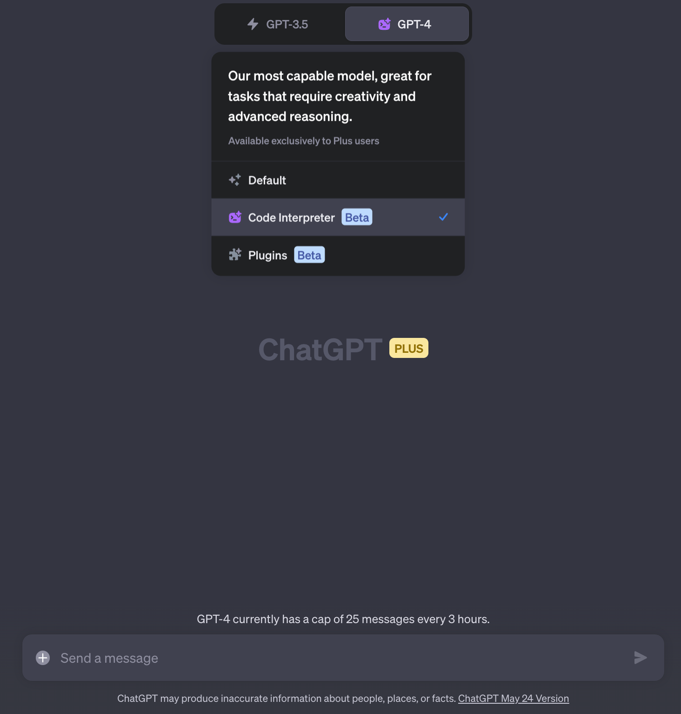
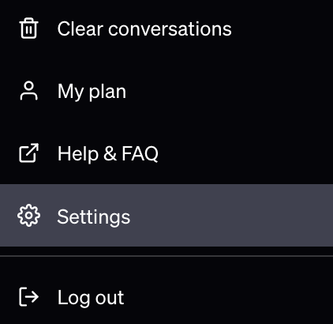
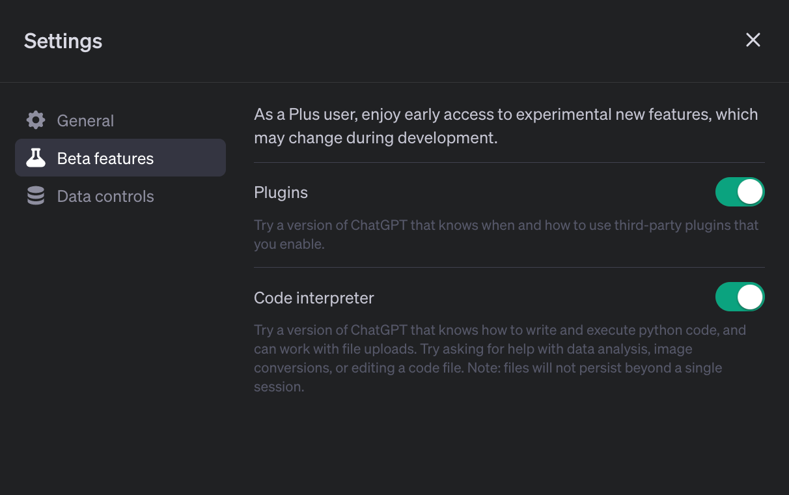
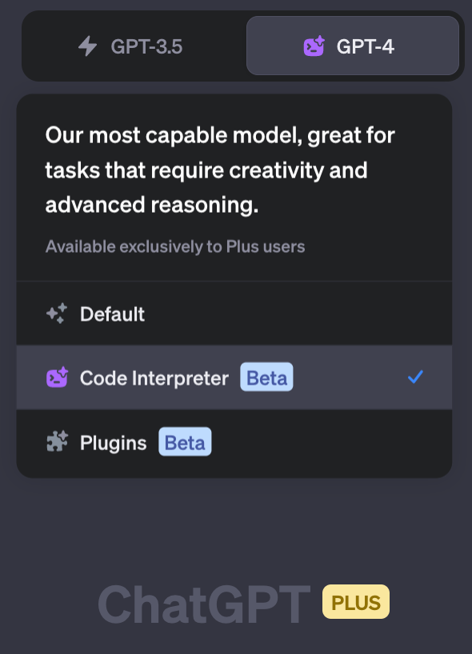
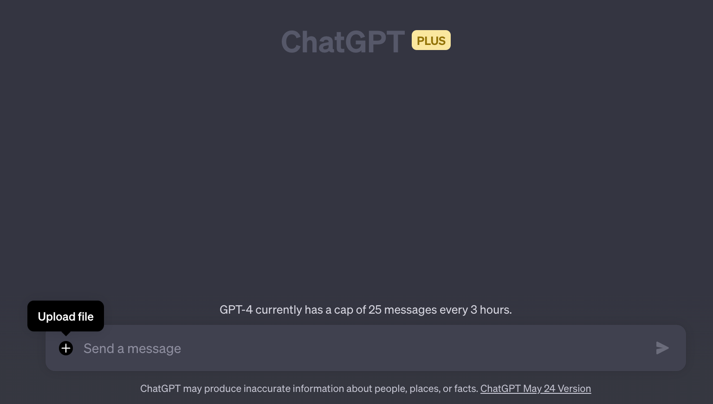
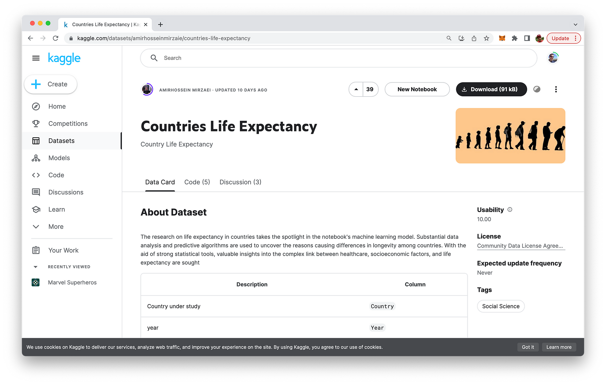
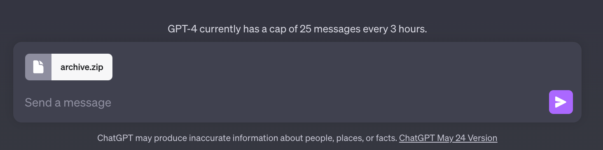
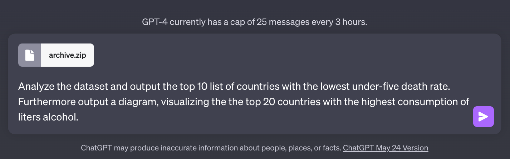
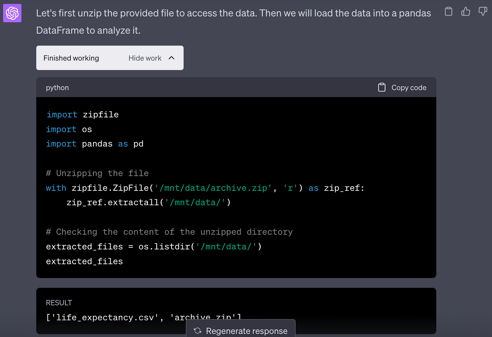

import { Image } from '@astrojs/image/components';
import YouTube from '~/components/widgets/YouTube.astro';
export const components = { img: Image };

Today, I'm thrilled to share with you an exciting development in the world of artificial intelligence. OpenAI, the organization behind the revolutionary language model, ChatGPT, has introduced a new feature that's set to change the game: the Code Interpreter. This feature is not just a step forward; it's a quantum leap in the capabilities of AI.

## What is the Code Interpreter?

The Code Interpreter is a plugin for ChatGPT that allows the AI to run code, analyze data, create charts, edit files, and perform mathematical operations. It's like having a personal data scientist at your disposal, ready to help you make sense of complex data and provide actionable insights.

The Code Interpreter is available to all ChatGPT Plus subscribers and can be enabled through the account settings. It's a powerful tool that can write code in Python and manipulate files up to 100MB in size.

## The Power of Code Interpreter

The Code Interpreter is not just a tool for running code; it's a tool for unlocking possibilities. It allows ChatGPT Plus users to generate charts, maps, data visualizations, and graphics, analyze music playlists, create interactive HTML files, clean datasets, and even extract color palettes from images.

For example, a user can upload a CSV file of every lighthouse location in the US and ask ChatGPT to create a GIF map of the lighthouse locations, where the map is very dark but each lighthouse twinkles. A few seconds later, ChatGPT produces an accurate map with twinkling lights atop based on the data uploaded.

## How Code Interpreter Can Revolutionize Work

The Code Interpreter is not just a tool for data scientists; it's a tool for anyone who needs to analyze data. It can automate complex quantitative analyses, merge and clean data, and even reason about data in a human-like manner.

For instance, digital marketing professionals have found unique ways to use Code Interpreter for search engine optimization (SEO). They can feed campaign and ad data into ChatGPT and ask it to analyze the data and report on key performance metrics. It will identify weak spots, strengths, and areas for testing.

## The Future of Data Science

While the Code Interpreter is a powerful tool, it's not without its critics. Some fear that it could render many data scientists jobless. However, others see it as a tool that can enhance the work of data scientists, not replace them.

The Code Interpreter is clearly setting a new standard for the future of AI and data science. With this tool, OpenAI is pushing the boundaries of what's possible with large language models.

## How To Get Started With ChatGPT Code Interpreter

To access Code Interpreter in ChatGPT you first need to log into your ChatGPT account and then access the settings view:

In the settings view you need to select Beta features and the you need to activate the Code interpreter option:

Once the the beta feature is activated you are able to select the Code Interpreter option in any new GPT-4 chat instance, like you can see in the following:

Once Code Interpreter is active you can see that the prompt input field is extended with an option to also upload files:

By using the upload function you can supply Code Interpreter with additional data, like datasets e.g. which are needed to solve a coding task.

## Let's See Code Interpreter in Action

Finally, let's test Code Interpreter. First let's choose a dataset from Kaggle:

For our first Code Interpreter test we're downloaded the Countries Life Expectancy dataset from kaggle.com.

Now let's use the upload feature to first upload the Kaggle dataset into ChatGPT:

Next, type in the prompt describing what should be analyzed:

Hit "Enter" and you should be able to see how ChatGPT with Code Interpreter is working to solve the task in multiple steps:

As you can see ChatGPT and Code Interpreter is able to automatically solve the task by interpreting the providing dataset, writing and executing the needed python code and outputting the results as requested.

## Wrapping Up

The Code Interpreter is a testament to the power of AI and its potential to revolutionize the way we work with data. It's an exciting time to be in the tech world, and I can't wait to see what other innovations are on the horizon.

Remember, the future is not something that happens to us; it's something we create. So, let's embrace these new tools and use them to build a better future.