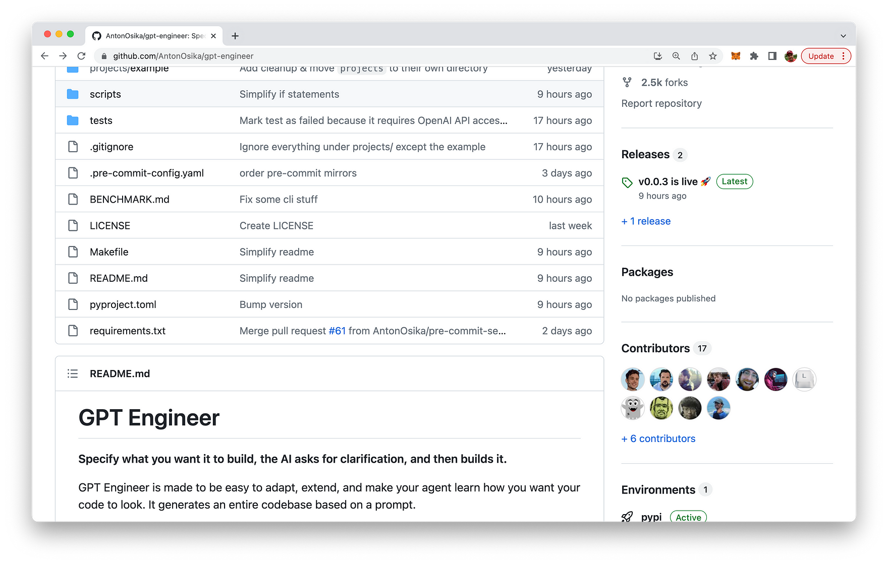

import { Image } from '@astrojs/image/components';
import YouTube from '~/components/widgets/YouTube.astro';
export const components = { img: Image };

Hello, tech enthusiasts! Today, I'm thrilled to introduce you to a groundbreaking innovation in the realm of artificial intelligence (AI) - the GPT Engineer. This tool is a game-changer, enabling you to specify what you want it to build, and then it asks for clarification and builds it. Yes, you heard it right! The AI is here to help you create an entire codebase based on a prompt.

## What is GPT Engineer?

GPT Engineer is a powerful tool designed to be easy to adapt, extend, and train your AI agent to generate code that aligns with your style and preferences. It's more than just a code generator; it's a tool that learns from you, adapts to your style, and delivers high-quality, personalized code.

You can find the project on GitHub: https://github.com/AntonOsika/gpt-engineer



## The Philosophy Behind GPT Engineer

The GPT Engineer is built on a few key principles:

1. Simplicity: It's designed to be easy to use and get value from. All computation is "resumable" and persisted to the filesystem, making it a reliable tool for your projects.
2. Flexibility: It's easy to add your own "AI steps". This means you can customize the AI's learning process to suit your needs.
3. Incremental Building: The GPT Engineer is designed to incrementally build towards a user experience of high-level prompting and giving feedback to the AI that it will remember over time.
4. Fast Handovers: It allows for quick back-and-forth interactions between the AI and the human user, making the process of code generation smooth and efficient.

## Getting Started with GPT Engineer

Now that you know what GPT Engineer is and the philosophy behind it, let's dive into how you can get started with it.

### Step 1: Installation

You can choose between a stable release or development. For the stable release, simply run the following command:

```bash
pip install gpt-engineer
```

For development, you'll need to clone the repository and install it. Here's how you do it:

```bash
git clone git@github.com:AntonOsika/gpt-engineer.git
cd gpt-engineer
make install
source venv/bin/activate
```

### Step 2: Setup

Once you've installed GPT Engineer, you'll need to set it up with your OpenAI API key. Run the following command:

```bash
export OPENAI_API_KEY=[your api key]
```

### Step 3: Create a New Project

Next, create an empty folder for your new project. If you're inside the repo, you can run:

```bash
cp -r projects/example/ projects/my-new-project
```

Then, fill in the `main_prompt` file in your new project folder.

### Step 4: Run GPT Engineer

Now, you're ready to run GPT Engineer. Use the following command

```bash
gpt-engineer projects/my-new-project
```

### Step 5: Check the Results

After running GPT Engineer, you can check the generated files in the _projects/my-new-project/workspace_ directory.

## Features and Limitations

GPT Engineer allows you to specify the "identity" of the AI agent by editing the files in the identity folder. Each step in steps.py will have its communication history with GPT4 stored in the logs folder, and can be rerun with scripts/rerun_edited_message_logs.py.

However, it's important to note that GPT Engineer has some limitations. For instance, implementing additional chain of thought prompting, like Reflexion, could make it more reliable and not miss requested functionality in the main prompt. But don't worry, contributors are always welcome to help improve the tool and overcome these limitations!

## GPT Engineer In Action

Check out a full live demo of GPT Engineer provided by the inventor of GPT Engineer Anton Osika: https://twitter.com/antonosika/status/1667641038104674306

## Wrapping Up

GPT Engineer is a powerful tool that leverages the power of AI to make coding easier and more efficient. Whether you're a seasoned developer or a beginner, GPT Engineer can help you generate high-quality code based on your preferences and style. So why wait? Get started with GPT Engineer today and experience the future of coding!

Remember, the future of coding is not about replacing humans with AI. It's about leveraging AI to augment human capabilities and make coding more efficient and enjoyable. And GPT Engineer is a step in that direction. Happy coding!
