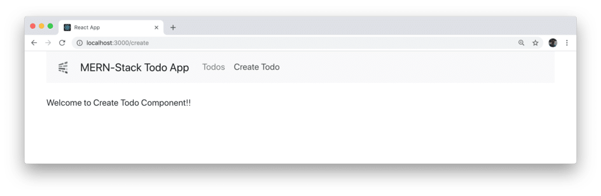
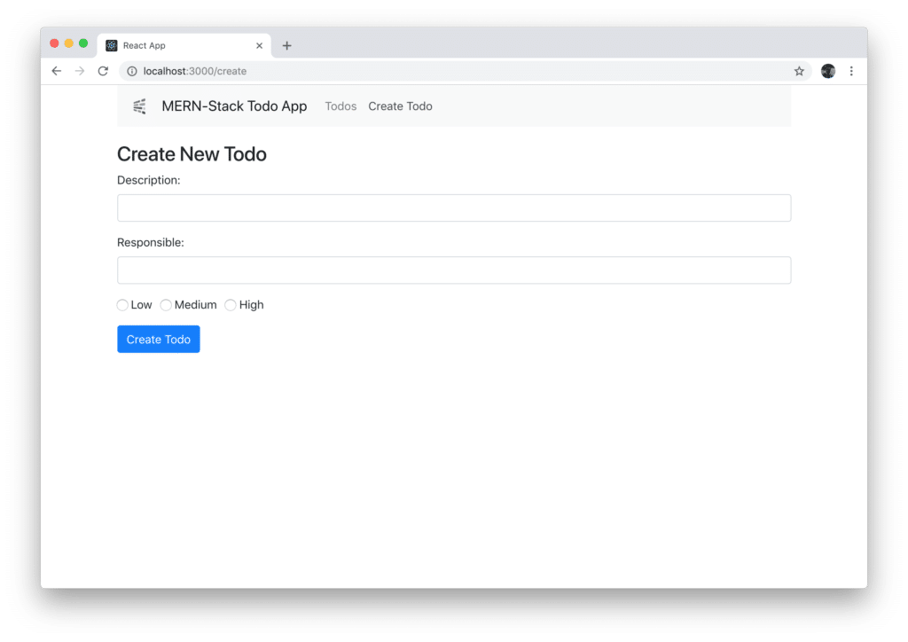
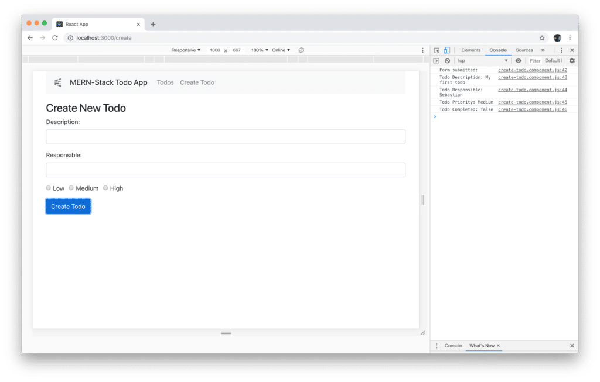

import { Image } from '@astrojs/image/components';
import YouTube from '~/components/widgets/YouTube.astro';
export const components = { img: Image };


<YouTube url="https://youtu.be/qvBZevK1HPo" />

## Part 1: Setting Up The Project

In this tutorial series we're going to explore the MERN stack by building a real-world application from start to finish. The MERN stack consists of the following technologies:

- **Node.js**: Node.js is a JavaScript runtime built on Chrome's V8 JavaScript engine. Node.js brings JavaScript to the server
- **MongoDB**: A document-based open source database
- **Express**: A Fast, unopinionated, minimalist web framework for Node.js
- **React**: A JavaScript front-end library for building user interfaces

The MERN stack is very similar to the popular MEAN stack. The only difference here is that the MEAN stack is making use of Angular to build the front-end web application and the MERN stack is using React instead.

The application we'll be building in this tutorial series is a simple To-Do application. By using this example it's possible to demonstrate how to build a CRUD (Create, Read, Update, and Delete) application from scratch by using the MERN stack!

In this first part of this series we're going to complete the setup the React project for building the front-end part of the MERN stack sample application. In the next part we're going to continue with implementing the Node.js / Express server.

## Setting Up The React Application

For this tutorial it is assumed that Node.js is installed on your system. If that is not the case please go to [https://nodejs.org/](https://nodejs.org/) first and follow the installation instructions for your platform.

You can check if Node.js is installed on your system by typing in:

`$ node -v`

on the command line. This will print out the Node.js version which is installed on your system.

In the next step we're creating the initial React project by using the _create-react-app_ script. What's great about _create-react-app_ is that this script can be executed by using the _npx_ command without the need to install it first on your system. Just execute the following command:

`$ npx create-react-app mern-todo-app`

Executing this command creates a new project directory _mern-todo-app_. Inside this folder you'll find the default React project template with all dependencies installed. Change into the newly created folder:

`$ cd mern-todo-app`

and start the development web server by running the following command:

`$ npm start`

Now you should be able to see the following result in the browser: [

### Adding Bootstrap To The React Project

Next, we need to add the Bootstrap framework to our project. This is needed because we'll be making use of Bootstrap's CSS classes to build our user interface. Inside the project folder execute the following command to add the library:

`$ npm install bootstrap`

Next you need to make sure that Bootstrap's CSS file is imported in App.js by adding the following line of code:

```js
import "bootstrap/dist/css/bootstrap.min.css";
```

Furthermore you need to get rid of most of the default code which is contained in App.js, so that only the following code remains:

```js
import React, { Component } from "react";
import "bootstrap/dist/css/bootstrap.min.css";

class App extends Component {
  render() {
    return (
      
        <div className="container">
          <h2>MERN-Stack Todo App</h2>
        </div>
      
    );
  }
}

export default App;
```

## Setting Up React Router

The next thing we needs to be added to the project is the React Router package: _react-router-dom_:

`$ npm install react-router-dom`

With this package installed we're ready to add the routing configuration in App.js. First of all the following import statement needs to be added:

```js
import { BrowserRouter as Router, Route, Link } from "react-router-dom";
```

Next, let's embed the JSX code in a `<Router></Router>` element:

```js
import React, { Component } from "react";
import { BrowserRouter as Router, Route, Link } from "react-router-dom";
import "bootstrap/dist/css/bootstrap.min.css";

class App extends Component {
  render() {
    return (
      <Router>
        <div className="container">
          <h2>MERN-Stack Todo App</h2>
        </div>
      </Router>
    );
  }
}

export default App;
```

Inside the `<Router>` element we're now ready to add the router configuration inside that element:

```js
<Route path="/" exact component={TodosList} />
<Route path="/edit/:id" component={EditTodo} />
<Route path="/create" component={CreateTodo} />
```

For each route which needs to be added to the application a new `<Route>` element is added. The attributes _path_ and _component_ are used to add the configuration settings for each route. By using the attribute path the routing _path_ is set and by using the _component_ attribute the path is connected with a component.

As you can see we need to add three routes to our application:

- _/_
- _/create_
- _/edit/:id_

For these three routes we want to connect to three components:

- _TodosList_
- _EditTodo_
- _CreateTodo_

## Creating Components

To create the needed components in our application let's first create a new directory _src/components_ and create three new files:

- _todos-list.component.js_
- _edit-todo.component.js_
- _create-todo.component.js_

Let's add a basic React component implementation for each of those components:

_todos-list.component.js_:

```js
import React, { Component } from 'react';

export default class TodosList extends Component {
    render() {
        return (
            <div>
                <p>Welcome to Todos List Component!!</p>
            </div>
        )
    }
}
```

_edit-todo.component.js_:

```js
import React, { Component } from 'react';

export default class EditTodo extends Component {
    render() {
        return (
            <div>
                <p>Welcome to Edit Todo Component!!</p>
            </div>
        )
    }
}
```

_create-todo.component.js_:

```js
import React, { Component } from 'react';

export default class CreateTodo extends Component {
    render() {
        return (
            <div>
                <p>Welcome to Create Todo Component!!</p>
            </div>
        )
    }
}
```

## Creating The Basic Layout & Navigation

Next let's add a basic layout and navigation menu to our application. Because we've added the Bootstrap library before we can now make use of Bootstrap's CSS classes to implement the user interface of our web application. Extend the code in App.js to the following:

```js
import React, { Component } from "react";
import { BrowserRouter as Router, Route, Link } from "react-router-dom";

import "bootstrap/dist/css/bootstrap.min.css";

import CreateTodo from "./components/create-todo.component";
import EditTodo from "./components/edit-todo.component";
import TodosList from "./components/todos-list.component";

import logo from "./logo.png";

class App extends Component {
  render() {
    return (
      <Router>
        <div className="container">
          <nav className="navbar navbar-expand-lg navbar-light bg-light">
            <a class="navbar-brand" href="https://codingthesmartway.com" target="_blank">
              
            </a>
            <Link to="/" className="navbar-brand">MERN-Stack Todo App</Link>
            <div className="collpase navbar-collapse">
              <ul className="navbar-nav mr-auto">
                <li className="navbar-item">
                  <Link to="/" className="nav-link">Todos</Link>
                </li>
                <li className="navbar-item">
                  <Link to="/create" className="nav-link">Create Todo</Link>
                </li>
              </ul>
            </div>
          </nav>
          <br/>
          <Route path="/" exact component={TodosList} />
          <Route path="/edit/:id" component={EditTodo} />
          <Route path="/create" component={CreateTodo} />
        </div>
      </Router>
    );
  }
}

export default App;
```

Let's check again what we can see in the Browser:


The navigation bar is displayed with two menu items included (_Todos_ and _Create Todo_). By default the output of TodosList component is shown because it was connected to the default route of the application.

Clicking on the _Create Todo_ link shows the output of CreateTodo component: 

### Implementing Create Todo Component

Let's add the _CreateTodo_ component implementation in the next step in file _create-todo.component.js_. First we start by adding a constructor to the component class:

```js
    constructor(props) {
        super(props);

        this.state = {
            todo_description: '',
            todo_responsible: '',
            todo_priority: '',
            todo_completed: false
        }
    }
```

Inside the constructor we're setting the initial state of the component by assigned an object to _this.state_. The state comprises the following properties:

- todo\_description
- todo\_responsible
- todo\_priority
- todo\_completed

Furthermore we need to add methods which can be used to update the state properties:

```js
    onChangeTodoDescription(e) {
        this.setState({
            todo_description: e.target.value
        });
    }

    onChangeTodoResponsible(e) {
        this.setState({
            todo_responsible: e.target.value
        });
    }

    onChangeTodoPriority(e) {
        this.setState({
            todo_priority: e.target.value
        });
    }
```

Finally another method is needed to handle the submit event of the form which will be implemented to create a new todo item:

```js
onSubmit(e) {
        e.preventDefault();
        
        console.log(`Form submitted:`);
        console.log(`Todo Description: ${this.state.todo_description}`);
        console.log(`Todo Responsible: ${this.state.todo_responsible}`);
        console.log(`Todo Priority: ${this.state.todo_priority}`);
        
        this.setState({
            todo_description: '',
            todo_responsible: '',
            todo_priority: '',
            todo_completed: false
        })
    }
```

Inside this method we need to call _e.preventDefault_ to ensure that the default HTML form submit behaviour is prevented. Because the back-end of our application is not implemented yet we're only printing out what's currently available in the local component's state to the console. Finally we're making sure that the form is resetted by setting the resetting the state object.

Because in the four implemented methods we're dealing with the component's state object we need to make sure to bind those methods to _this_ by adding the following lines of code to the constructor:

```js
        this.onChangeTodoDescription = this.onChangeTodoDescription.bind(this);
        this.onChangeTodoResponsible = this.onChangeTodoResponsible.bind(this);
        this.onChangeTodoPriority = this.onChangeTodoPriority.bind(this);
        this.onSubmit = this.onSubmit.bind(this);
```

Finally we need to add the JSX code which is needed to display the form:

```js
   render() {
        return (
            <div style={{marginTop: 10}}>
                <h3>Create New Todo</h3>
                <form onSubmit={this.onSubmit}>
                    <div className="form-group"> 
                        <label>Description: </label>
                        <input  type="text"
                                className="form-control"
                                value={this.state.todo_description}
                                onChange={this.onChangeTodoDescription}
                                />
                    </div>
                    <div className="form-group">
                        <label>Responsible: </label>
                        <input 
                                type="text" 
                                className="form-control"
                                value={this.state.todo_responsible}
                                onChange={this.onChangeTodoResponsible}
                                />
                    </div>
                    <div className="form-group">
                        <div className="form-check form-check-inline">
                            <input  className="form-check-input" 
                                    type="radio" 
                                    name="priorityOptions" 
                                    id="priorityLow" 
                                    value="Low"
                                    checked={this.state.todo_priority==='Low'} 
                                    onChange={this.onChangeTodoPriority}
                                    />
                            <label className="form-check-label">Low</label>
                        </div>
                        <div className="form-check form-check-inline">
                            <input  className="form-check-input" 
                                    type="radio" 
                                    name="priorityOptions" 
                                    id="priorityMedium" 
                                    value="Medium" 
                                    checked={this.state.todo_priority==='Medium'} 
                                    onChange={this.onChangeTodoPriority}
                                    />
                            <label className="form-check-label">Medium</label>
                        </div>
                        <div className="form-check form-check-inline">
                            <input  className="form-check-input" 
                                    type="radio" 
                                    name="priorityOptions" 
                                    id="priorityHigh" 
                                    value="High" 
                                    checked={this.state.todo_priority==='High'} 
                                    onChange={this.onChangeTodoPriority}
                                    />
                            <label className="form-check-label">High</label>
                        </div>
                    </div>

                    <div className="form-group">
                        <input type="submit" value="Create Todo" className="btn btn-primary" />
                    </div>
                </form>
            </div>
        )
    }
```

In the following you can see the complete source code which should now be available in _create-todo.component.js_:

```js
import React, { Component } from 'react';

export default class CreateTodo extends Component {

    constructor(props) {
        super(props);

        this.onChangeTodoDescription = this.onChangeTodoDescription.bind(this);
        this.onChangeTodoResponsible = this.onChangeTodoResponsible.bind(this);
        this.onChangeTodoPriority = this.onChangeTodoPriority.bind(this);
        this.onSubmit = this.onSubmit.bind(this);

        this.state = {
            todo_description: '',
            todo_responsible: '',
            todo_priority: '',
            todo_completed: false
        }
    }

    onChangeTodoDescription(e) {
        this.setState({
            todo_description: e.target.value
        });
    }

    onChangeTodoResponsible(e) {
        this.setState({
            todo_responsible: e.target.value
        });
    }

    onChangeTodoPriority(e) {
        this.setState({
            todo_priority: e.target.value
        });
    }

    onSubmit(e) {
        e.preventDefault();
        
        console.log(`Form submitted:`);
        console.log(`Todo Description: ${this.state.todo_description}`);
        console.log(`Todo Responsible: ${this.state.todo_responsible}`);
        console.log(`Todo Priority: ${this.state.todo_priority}`);
        
        this.setState({
            todo_description: '',
            todo_responsible: '',
            todo_priority: '',
            todo_completed: false
        })
    }

    render() {
        return (
            <div style={{marginTop: 10}}>
                <h3>Create New Todo</h3>
                <form onSubmit={this.onSubmit}>
                    <div className="form-group"> 
                        <label>Description: </label>
                        <input  type="text"
                                className="form-control"
                                value={this.state.todo_description}
                                onChange={this.onChangeTodoDescription}
                                />
                    </div>
                    <div className="form-group">
                        <label>Responsible: </label>
                        <input 
                                type="text" 
                                className="form-control"
                                value={this.state.todo_responsible}
                                onChange={this.onChangeTodoResponsible}
                                />
                    </div>
                    <div className="form-group">
                        <div className="form-check form-check-inline">
                            <input  className="form-check-input" 
                                    type="radio" 
                                    name="priorityOptions" 
                                    id="priorityLow" 
                                    value="Low"
                                    checked={this.state.todo_priority==='Low'} 
                                    onChange={this.onChangeTodoPriority}
                                    />
                            <label className="form-check-label">Low</label>
                        </div>
                        <div className="form-check form-check-inline">
                            <input  className="form-check-input" 
                                    type="radio" 
                                    name="priorityOptions" 
                                    id="priorityMedium" 
                                    value="Medium" 
                                    checked={this.state.todo_priority==='Medium'} 
                                    onChange={this.onChangeTodoPriority}
                                    />
                            <label className="form-check-label">Medium</label>
                        </div>
                        <div className="form-check form-check-inline">
                            <input  className="form-check-input" 
                                    type="radio" 
                                    name="priorityOptions" 
                                    id="priorityHigh" 
                                    value="High" 
                                    checked={this.state.todo_priority==='High'} 
                                    onChange={this.onChangeTodoPriority}
                                    />
                            <label className="form-check-label">High</label>
                        </div>
                    </div>

                    <div className="form-group">
                        <input type="submit" value="Create Todo" className="btn btn-primary" />
                    </div>
                </form>
            </div>
        )
    }
}
```

The result which is delivered in the browser when accessing the `/create` path should correspond to what you can see in the following:  Filling out the form and submitting it by clicking on button _Create Todo_ will output the data which have been entered on the console: 

## What's Next

In this first part of this series we've started with setting up the React-based front-end project and completed the first implementation steps. In the next part we will continue building the MERN stack todo sample application by setting up the back-end using Node.js, Express and MongoDB.