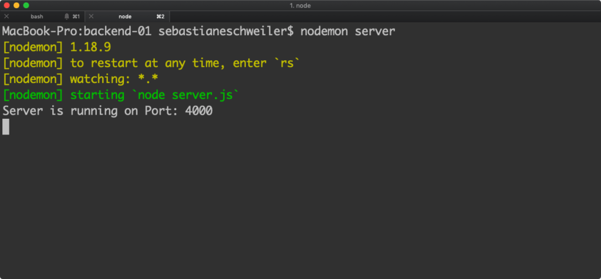
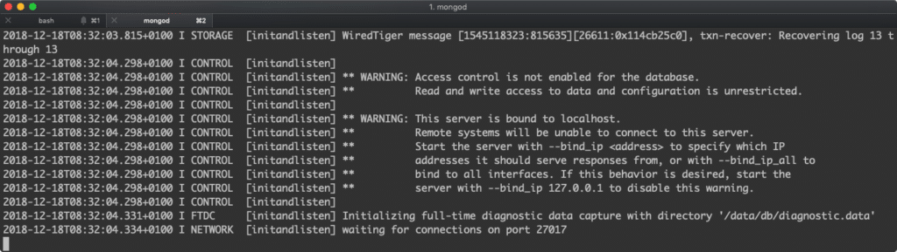
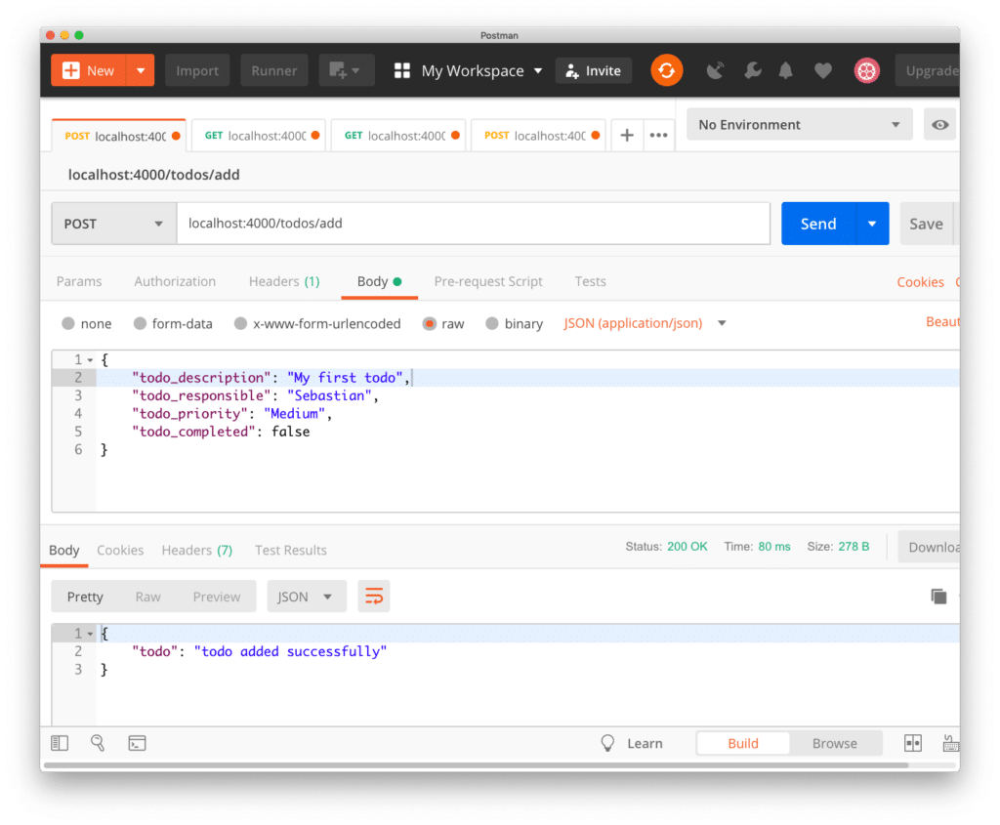
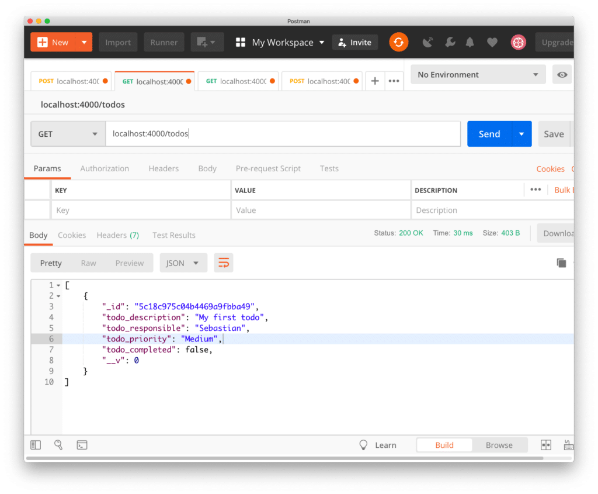
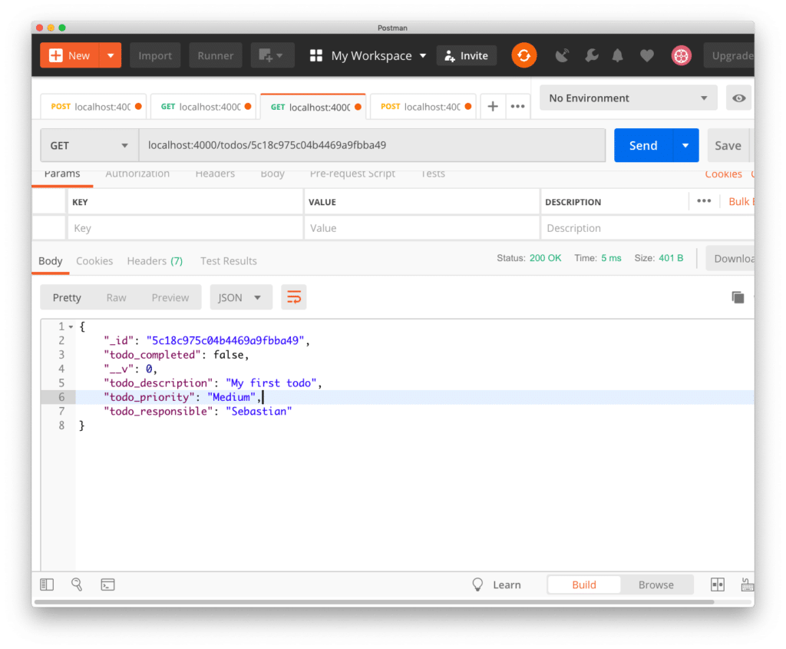
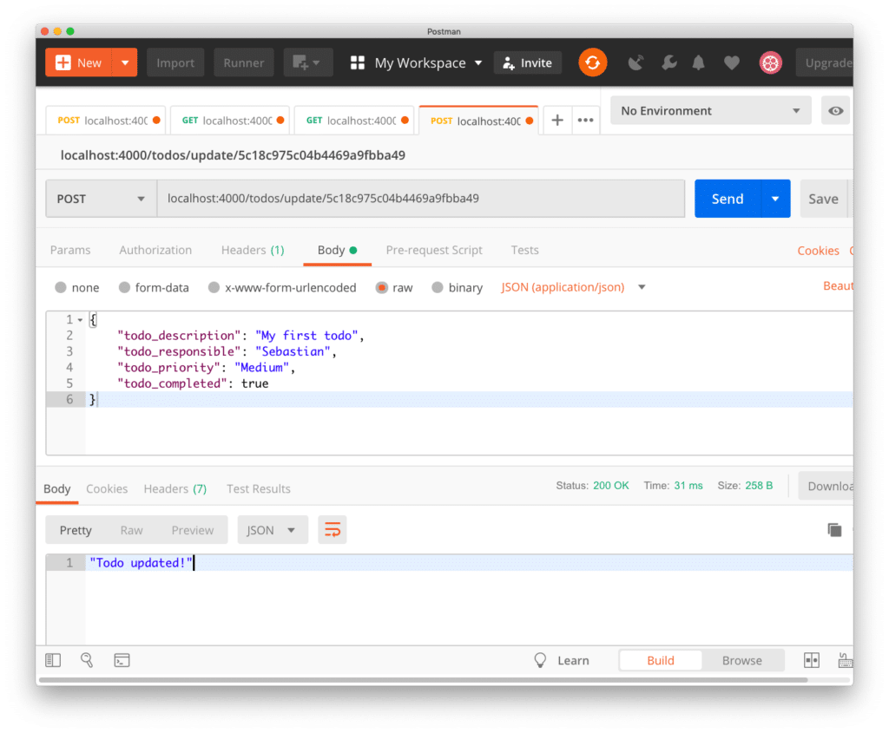
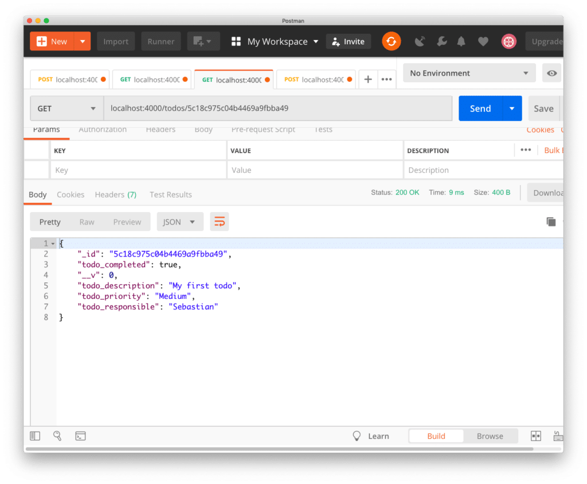

import { Image } from '@astrojs/image/components';
import YouTube from '~/components/widgets/YouTube.astro';
export const components = { img: Image };

<YouTube url="https://youtu.be/_02zK1D4brk"/>


## Part 2: Setting Up The Back-end

This is the second part of the The _MERN Stack Tutorial - Building A React CRUD Application From Start To Finish_ series. In the first part we've started to implement the front-end React application of the MERN stack todo application. In this second part we'll be focusing on the back-end and build a server by using Node.js / Express.

When building the back-end we'll also be setting up MongoDB and connect to the database from our Node.js / Express server by using the Mongoose library.

The back-end will comprise HTTP endpoints to cover the following use cases:

- Retrieve the complete list of available todo items by sending an HTTP GET request
- Retrieve a specific todo item by sending HTTP GET request and provide the specific todo ID in addtion
- Create a new todo item in the database by sending an HTTP POST request
- Update an existing todo item in the database by sending an HTTP POST request

### Initiating The Back-end Project

To initiate the back-end project let's create a new empty project folder:

`$ mkdir backend`

Change into that newly created folder by using:

`$ cd backend`

Let's create a _package.json_ file inside that folder by using the following command:

`$ npm init -``y`

With the _package.json_ file available in the project folder we're ready to add some dependencies to the project:

`$ npm install express body-parser cors mongoose`

Let's take a quick look at the four packages:

- **express**: Express is a fast and lightweight web framework for Node.js. Express is an essential part of the MERN stack.
- **body-parser**: Node.js body parsing middleware.
- **cors**: CORS is a node.js package for providing an Express middleware that can be used to enable CORS with various options. Cross-origin resource sharing (CORS) is a mechanism that allows restricted resources on a web page to be requested from another domain outside the domain from which the first resource was served.
- **mongoose**: A Node.js framework which lets us access MongoDB in an object-oriented way.

Finally we need to make sure to install a global package by executing the following command:

`$ npm install -g nodemon`

Nodemon is a utility that will monitor for any changes in your source and automatically restart your server. We'll use _nodemon_ when running our Node.js server in the next steps.

Inside of the backend project folder create a new file named _server.js_ and insert the following basic Node.js / Express server implementation:

```js
const express = require('express');
const app = express();
const bodyParser = require('body-parser');
const cors = require('cors');
const PORT = 4000;

app.use(cors());
app.use(bodyParser.json());

app.listen(PORT, function() {
    console.log("Server is running on Port: " + PORT);
});
```

With this code we're creating an Express server, attaching the cors and body-parser middleware and making the server listening on port 4000.

Start the server by using _nodemon_:

`$ nodemon server`

You should now see an output similar to the following:



As we're able to see the out _Server is running on Port: 4000_ we know that the server has been started up successfully and is listing on port 4000.

### Installing MondoDB

Now that we've managed to set up a basic Node.js / Express server we're ready to continue with the next task: setting up the MongoDB database.

First of all we need to make sure that MongoDB is installed on your system. On MacOS this task can be completed by using the following command:

`$ brew install mongodb`

If you're working on Windows or Linux follow the installation instructions from [https://docs.mongodb.com/manual/administration/install-community/](https://docs.mongodb.com/manual/administration/install-community/).

Having installed MongoDB on your system you need to create a data directory which is used by MongoDB:

`$ mkdir -p /data/db`

Before running `mongod` for the first time, ensure that the user account running `mongod` has read and write permissions for the directory.

Now we're ready to start up MongoDB by executing the following command:

`$ mongod`

Executing this command will give you the following output on the command line:



This shows that the database is now running on port 27017 and is waiting to accept client connections.

### Creating A New MongoDB Database

The next step is to create the MongoDB database instance. Therefore we're connecting to the database server by using the MondoDB client on the command line:

`$ mongo`

Once the client is started it prompts you to enter database commands. By using the following command we're creating a new database with the name _todos_:

`use todos`

### Connecting To MongoDB By Using Mongoose

Let's return to the Node.js / Express server implementation in server.js. With the MongoDB database server running we're now ready to connect to MongoDB from our server program by using the Mongoose library. Change the implementation in server.js to the following:

```js
const express = require('express');
const app = express();
const bodyParser = require('body-parser');
const cors = require('cors');
const mongoose = require('mongoose');
const PORT = 4000;

app.use(cors());
app.use(bodyParser.json());

mongoose.connect('mongodb://127.0.0.1:27017/todos', { useNewUrlParser: true });
const connection = mongoose.connection;

connection.once('open', function() {
    console.log("MongoDB database connection established successfully");
})

app.listen(PORT, function() {
    console.log("Server is running on Port: " + PORT);
});
```

On the console you should now also see the output _MongoDB database connection established successfully_ in addition.

### Create a Mongoose Schema

By using Mongoose we're able to access the MongoDB database in an object-oriented way. This means that we need to add a Mongoose schema for our Todo entity to our project implementation next.

Inside the back-end project folder create a new file _todo.model.js_ and insert the following lines of code to create a Todo schema:

```js
const mongoose = require('mongoose');
const Schema = mongoose.Schema;

let Todo = new Schema({
    todo_description: {
        type: String
    },
    todo_responsible: {
        type: String
    },
    todo_priority: {
        type: String
    },
    todo_completed: {
        type: Boolean
    }
});

module.exports = mongoose.model('Todo', Todo);
```

With this code in place we're now ready to access the MongoDB database by using the Todo schema.

### Implementing The Server Endpoints

In the last step let's complete the server implementation in server.js by using the Todo schema we've just added to implement the API endpoints we'd like to provide.

To setup the endpoints we need to create an instance of the Express Router by adding the following line of code:

```js
const todoRoutes = express.Router();
```

The router will be added as a middleware and will take control of request starting with path _/todos_:

```js
app.use('/todos', todoRoutes);
```

First of all we need to add an endpoint which is delivering all available todos items:

```js
todoRoutes.route('/').get(function(req, res) {
    Todo.find(function(err, todos) {
        if (err) {
            console.log(err);
        } else {
            res.json(todos);
        }
    });
});
```

The function which is passed into the call of the method _get_ is used to handle incoming HTTP GET request on the _/todos/_ URL path. In this case we're calling Todos.find to retrieve a list of all todo items from the MongoDB database. Again the call of the find methods takes one argument: a callback function which is executed once the result is available. Here we're making sure that the results (available in todos) are added in JSON format to the response body by calling `res.json(todos)`.

The next endpoint which needs to be implemented is _/:id_. This path extension is used to retrieve a todo item by providing an ID. The implementation logic is straight forward:

```js
todoRoutes.route('/:id').get(function(req, res) {
    let id = req.params.id;
    Todo.findById(id, function(err, todo) {
        res.json(todo);
    });
});
```

Here we're accepting the URL parameter _id_ which can be accessed via _req.params.id_. This _id_ is passed into the call of _Tood.findById_ to retrieve an issue item based on it's ID. Once the _todo_ object is available it is attached to the HTTP response in JSON format.

Next, let's add the route which is needed to be able to add new todo items by sending a HTTP post request (_/add_):

```js
todoRoutes.route('/add').post(function(req, res) {
    let todo = new Todo(req.body);
    todo.save()
        .then(todo => {
            res.status(200).json({'todo': 'todo added successfully'});
        })
        .catch(err => {
            res.status(400).send('adding new todo failed');
        });
});
```

The new todo item is part the the HTTP POST request body, so that we're able to access it view _req.body_ and therewith create a new instance of _Todo_. This new item is then saved to the database by calling the _save_ method.

Finally a HTTP POST route _/update/:id_ is added:

```js
todoRoutes.route('/update/:id').post(function(req, res) {
    Todo.findById(req.params.id, function(err, todo) {
        if (!todo)
            res.status(404).send("data is not found");
        else
            todo.todo_description = req.body.todo_description;
            todo.todo_responsible = req.body.todo_responsible;
            todo.todo_priority = req.body.todo_priority;
            todo.todo_completed = req.body.todo_completed;

            todo.save().then(todo => {
                res.json('Todo updated!');
            })
            .catch(err => {
                res.status(400).send("Update not possible");
            });
    });
});
```

This route is used to update an existing todo item (e.g. setting the _todo\_completed_ property to _true_). Again this path is containing a parameter: id. Inside the callback function which is passed into the call of _post_, we're first retrieving the old todo item from the database based on the id. Once the todo item is retrieved we're setting the todo property values to what's available in the request body. Finally we need to call _todo.save_ to save the updated object in the database again.

Finally, in the following you can see the complete and final code of _server.js_ again:

```js
const express = require('express');
const app = express();
const bodyParser = require('body-parser');
const cors = require('cors');
const mongoose = require('mongoose');
const todoRoutes = express.Router();
const PORT = 4000;

let Todo = require('./todo.model');

app.use(cors());
app.use(bodyParser.json());

mongoose.connect('mongodb://127.0.0.1:27017/todos', { useNewUrlParser: true });
const connection = mongoose.connection;

connection.once('open', function() {
    console.log("MongoDB database connection established successfully");
})

todoRoutes.route('/').get(function(req, res) {
    Todo.find(function(err, todos) {
        if (err) {
            console.log(err);
        } else {
            res.json(todos);
        }
    });
});

todoRoutes.route('/:id').get(function(req, res) {
    let id = req.params.id;
    Todo.findById(id, function(err, todo) {
        res.json(todo);
    });
});

todoRoutes.route('/update/:id').post(function(req, res) {
    Todo.findById(req.params.id, function(err, todo) {
        if (!todo)
            res.status(404).send("data is not found");
        else
            todo.todo_description = req.body.todo_description;
            todo.todo_responsible = req.body.todo_responsible;
            todo.todo_priority = req.body.todo_priority;
            todo.todo_completed = req.body.todo_completed;

            todo.save().then(todo => {
                res.json('Todo updated!');
            })
            .catch(err => {
                res.status(400).send("Update not possible");
            });
    });
});

todoRoutes.route('/add').post(function(req, res) {
    let todo = new Todo(req.body);
    todo.save()
        .then(todo => {
            res.status(200).json({'todo': 'todo added successfully'});
        })
        .catch(err => {
            res.status(400).send('adding new todo failed');
        });
});

app.use('/todos', todoRoutes);

app.listen(PORT, function() {
    console.log("Server is running on Port: " + PORT);
});
```

### Testing The Server API With Postman

Having completed the server implementation we're now ready to run tests for our HTTP endpoints by using the Postman tool ([https://www.getpostman.com/](https://www.getpostman.com/)).

1) First let's add a first todo item to our database by sending a HTTP POST request



As a result we're getting returned a JSON object which is containing the message: _todo added successfully_. Having now added the first todo item to out database we're able to retrieve the list of todos which are available by sending an HTTP GET request to the /todos path:



Of course we're only getting back an array which is containing only one item (the todo item we've just inserted). From the response you can see that an id has been assigned automatically to this item.

Next let's use this id to test route _/todos/:id_ to retrieve a single todo element based on it's id:



As expected the same todo item is returned in JSON format as before. Next, let's try to update the todo's todo\_completed property by sending a POST request to the _/update/:id_ path:



The body of this POST request has to include the todo item with all its properties (except _\_id_ and _\_\_v_) in JSON format. Sending this request should return the message _Todo updated!_. Let's check if the value of todo\_completed has been updated in the database by once again requesting the todo item by _id_:



As expected the _todo_ item with the updated value is being returned in JSON format.

### What's Next

In the first part of this series we've started to create the React front-end application for the MERN stack todo application. In this second part we've continued with building the back-end server based on Node.js, Express, and MongoDB. We've connected the Node.js / Express server to MongoDB by using the Mongoose library.

We've been using Postman to make sure that the server endpoints are working as expected. In the upcoming part we'll further complete the implementation of the front-end react application and also connect font- and back-end.