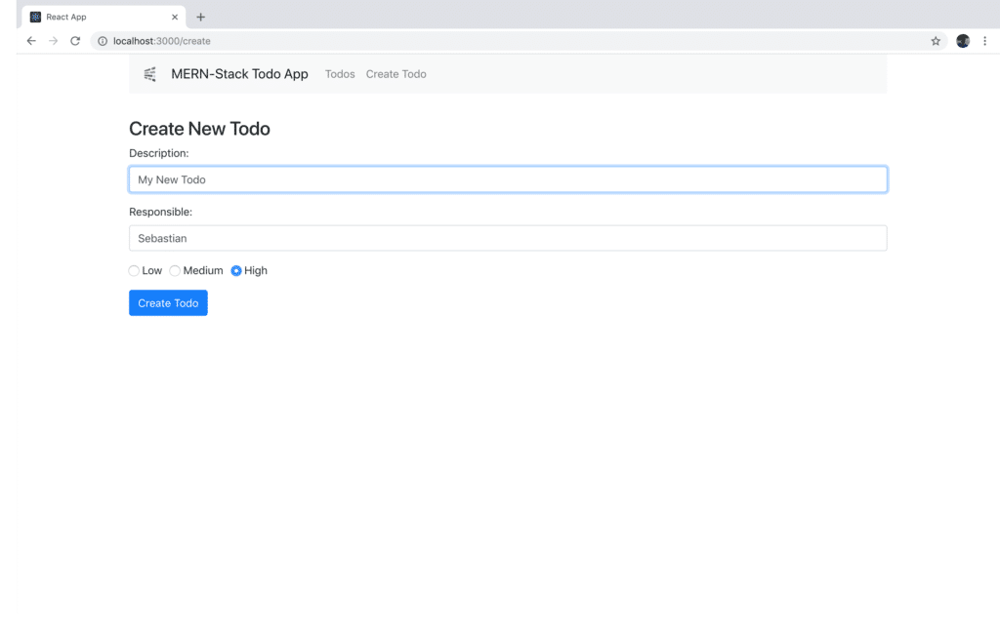
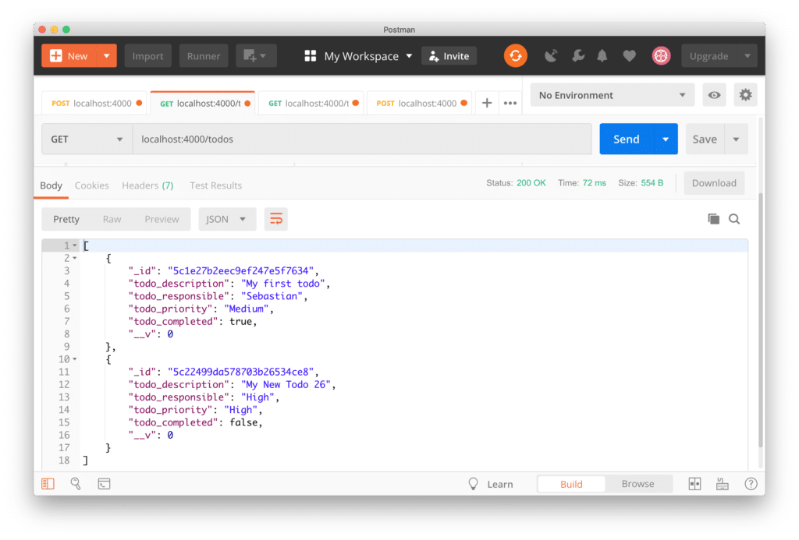
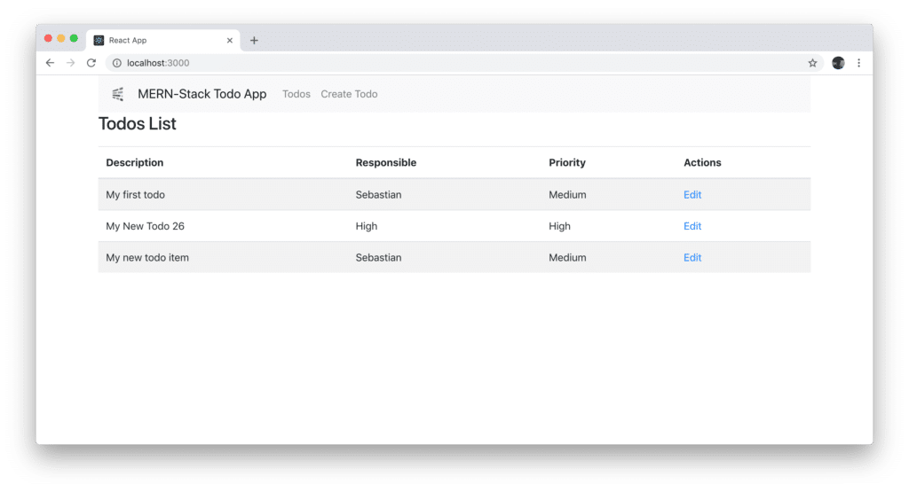

import { Image } from '@astrojs/image/components';
import YouTube from '~/components/widgets/YouTube.astro';
export const components = { img: Image };

<YouTube url="https://youtu.be/WT67-OETeGU" />

## Part 3: Connecting Front-End To Back-End

This is the third part of _The MERN Stack Tutorial - Building a React CRUD Application From Start To Finish_ series. In the second part we've finished the implementation of the back-end part by using Node.js, Express, and MongoDB. In this part we're now ready to return to the React front-end application (which we've started to implemented in the first part) and add the connection to the back-end, so that the user will be able to

- create new todo items
- see an overview of all todo items

The communication between front-end and back-end will be done by sending HTTP request to the various server endpoints we've created in the last part.

### Installing Axios

In order to be able to send HTTP request to our back-end we're making use of the Axios library. Axios is being installed via the following command:

`$ npm install axios`

Once Axios is added to the project we're ready to further complete the implementation of CreateTodo component and send data to the back-end.

### Completing The Implementation Of createTodo Component

First let's add the following import statement to _create-todo.component.ts_ so that we're ready to use the Axios library in that file:

```js
import axios from 'axios';
```

The right place where the code needs to be added which is responsible for sending the data of the new todo element to the back-end is the _onSubmit_ method. The existing implementation of _onSubmit_ needs to be extended in the following way:

```js
   onSubmit(e) {
        e.preventDefault();
        
        console.log(`Form submitted:`);
        console.log(`Todo Description: ${this.state.todo_description}`);
        console.log(`Todo Responsible: ${this.state.todo_responsible}`);
        console.log(`Todo Priority: ${this.state.todo_priority}`);
     
        const newTodo = {
            todo_description: this.state.todo_description,
            todo_responsible: this.state.todo_responsible,
            todo_priority: this.state.todo_priority,
            todo_completed: this.state.todo_completed
        };

        axios.post('http://localhost:4000/todos/add', newTodo)
            .then(res => console.log(res.data));

        this.setState({
            todo_description: '',
            todo_responsible: '',
            todo_priority: '',
            todo_completed: false
        })
    }
```

Here we're using the _axios.post_ method to send an HTTP POST request to the back-end endpoint _http://localhost:4000/todos/add_. This endpoint is expecting to get the new todo object in JSON format in the request body. Therefore we need to pass in the _newTodo_ object as a second argument.

Let's fill out the create todo form:



Hit button _Create Todo_ to send entered data to the server. By using Postman again, we're able to check if data has been stored in the MongoDB database. Let's again send a GET request to endpoint _/todos_ and check if the new todo item is being returned:



Now that we've made sure that we're able to create new todo items from the React front-end application we're ready to move on and further complete the implementation of _TodosList_ component in the next step.

### Completing The Implementation Of TodosList Component

In _todos-list.component.ts_ we start by adding the following import statement on top:

```js
import { Link } from 'react-router-dom';
import axios from 'axios';
```

In the next step, let's use the component's constructor to initialize the state with an empty _todos_ array:

```js
    constructor(props) {
        super(props);
        this.state = {todos: []};
    }
```

To retrieve the todos data from the database the _componentDidMount_ lifecycle method is added:

```js
    componentDidMount() {
        axios.get('http://localhost:4000/todos/')
            .then(response => {
                this.setState({ todos: response.data });
            })
            .catch(function (error){
                console.log(error);
            })
    }
```

Here we're using the _axios.get_ method to access the _/todos_ endpoint. Once the result becomes available we're assigning _response.data_ to the _todos_ property of the component's state object by using the _this.setState_ method.

Finally the JSX code needs to be added to the _return_ statement of the _render_ function like you can see in the following listing:

```js
render() {
        return (
            <div>
                <h3>Todos List</h3>
                <table className="table table-striped" style={{ marginTop: 20 }} >
                    <thead>
                        <tr>
                            <th>Description</th>
                            <th>Responsible</th>
                            <th>Priority</th>
                            <th>Action</th>
                        </tr>
                    </thead>
                    <tbody>
                        { this.todoList() }
                    </tbody>
                </table>
            </div>
        )
    }
```

The output is done as a table and inside the _tbody_ element we're making use of the _todoList_ method to output a table row for each todo item. Because of that we need to add the implementation of _todoList_ method to _TodosList_ component as well:

```js
    todoList() {
        return this.state.todos.map(function(currentTodo, i){
            return <Todo todo={currentTodo} key={i} />;
        })
    }
```

Inside this method we're iterating through the list of todo items by using the map function. Each todo item is output by using the Todo component which is not yet implemented. The current todo item is assigned to the todo property of this component.

To complete the code in _todos-list.component.js_ we need to add the implementation of Todo component as well. In the following listing you can see the complete code:

```js
import React, { Component } from 'react';
import { Link } from 'react-router-dom';
import axios from 'axios';

const Todo = props => (
    <tr>
        <td>{props.todo.todo_description}</td>
        <td>{props.todo.todo_responsible}</td>
        <td>{props.todo.todo_priority}</td>
        <td>
            <Link to={"/edit/"+props.todo._id}>Edit</Link>
        </td>
    </tr>
)

export default class TodosList extends Component {

    constructor(props) {
        super(props);
        this.state = {todos: []};
    }

    componentDidMount() {
        axios.get('http://localhost:4000/todos/')
            .then(response => {
                this.setState({ todos: response.data });
            })
            .catch(function (error){
                console.log(error);
            })
    }

    todoList() {
        return this.state.todos.map(function(currentTodo, i){
            return <Todo todo={currentTodo} key={i} />;
        })
    }

    render() {
        return (
            <div>
                <h3>Todos List</h3>
                <table className="table table-striped" style={{ marginTop: 20 }} >
                    <thead>
                        <tr>
                            <th>Description</th>
                            <th>Responsible</th>
                            <th>Priority</th>
                            <th>Action</th>
                        </tr>
                    </thead>
                    <tbody>
                        { this.todoList() }
                    </tbody>
                </table>
            </div>
        )
    }
}
```

Todo component is implemented as a functional React component. It outputs the table row which contains the values of the properties of the todo item passed into that component. Inside the Actions column of the table we're also outputting a link to `/edit/:id` route by using the Link component.

The resulting output should then look like the following: 

### What's Next

Now, we've connected the first parts of the React front-end application to the back-end. However, some part are still missing. In the upcoming and last part of this tutorial series we're going to further complete our front-end application so that the user will also be able to edit todo items and set todo items to completed.