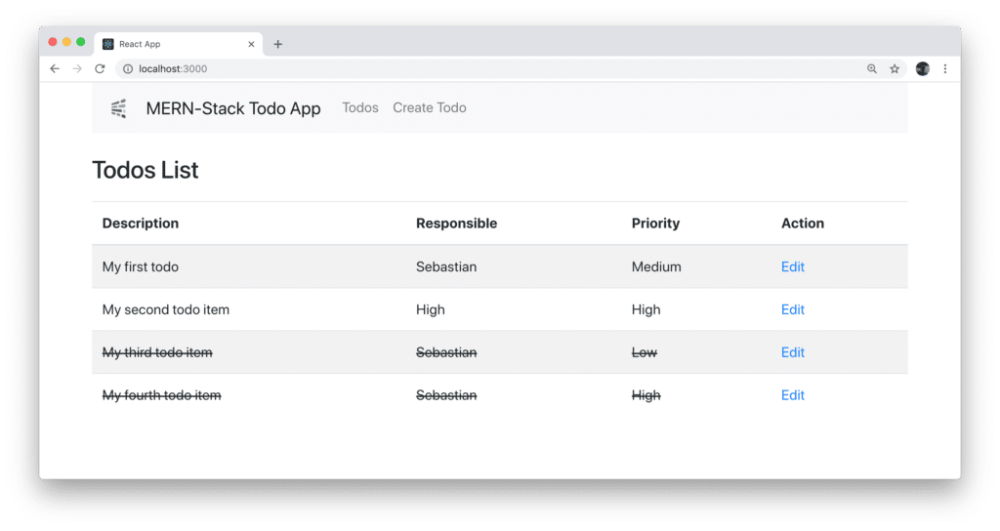
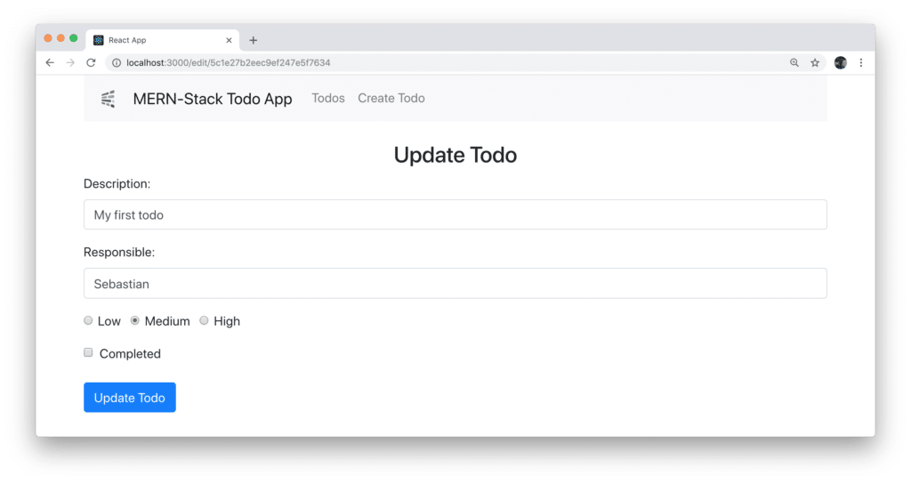

import { Image } from '@astrojs/image/components';
import YouTube from '~/components/widgets/YouTube.astro';
export const components = { img: Image };


<YouTube url="https://youtu.be/GIITXvYD7pc" />

## Part 4: Finishing The Application

This is the fourth and last part of _The MERN Stack Tutorial - Building a React CRUD Application From Start To Finish_ series.

In the last part we've connected the first pieces of the React front-end application to the back-end. However, some pieces are still missing. In this last part of this tutorial series we're going to further complete our front-end application so that the user will also be able to edit todo items and set todo items to completed. Let's get started ...

### Linking To EditTodo Component

The link to EditTodo component has already been included in the output which returned by Todo component (implemented in _todos-list.component.js_):

```js
const Todo = props => (
    <tr>
        <td className={props.todo.todo_completed ? 'completed' : ''}>{props.todo.todo_description}</td>
        <td className={props.todo.todo_completed ? 'completed' : ''}>{props.todo.todo_responsible}</td>
        <td className={props.todo.todo_completed ? 'completed' : ''}>{props.todo.todo_priority}</td>
        <td>
            <Link to={"/edit/"+props.todo._id}>Edit</Link>
        </td>
    </tr>
)
```

The Edit link which is output for each todo entry is pointing to path _/edit/:id_. The ID of the current todo is included in the URL so that we're able to retrieve the current ID in the implementation of _EditTodo_ component again.

Furthermore you can see that depending on the _todo\_completed_ value of a todo to completed CSS class is applied (if _todo\_completed_ is true). The CSS class is added in index.css:

```js
.completed {
  text-decoration: line-through;
}
```

By applying this CSS class the text information of a todo item is displayed with crossed out text like you can see in the following: 

### Edit Todos

Ok, so let's turn to the implementation of _EditTodo_ component in _edit-todo.component.js_. First of all the Axios library needs to be made available by adding the following import statement:

```
import axios from 'axios';
```

Next we're adding a class constructor to set the initial state:

```js
    constructor(props) {
        super(props);

        this.state = {
            todo_description: '',
            todo_responsible: '',
            todo_priority: '',
            todo_completed: false
        }
    }
```

The state object is consisting of four properties which are representing one single todo item. To retrieve the current todo item (based on it's ID) from the back-end and update the component's state accordingly the _componentDidMount_ lifecycle method is added in the following way:

```js
    componentDidMount() {
        axios.get('http://localhost:4000/todos/'+this.props.match.params.id)
            .then(response => {
                this.setState({
                    todo_description: response.data.todo_description,
                    todo_responsible: response.data.todo_responsible,
                    todo_priority: response.data.todo_priority,
                    todo_completed: response.data.todo_completed
                })   
            })
            .catch(function (error) {
                console.log(error);
            })
    }
```

Here we're making use of Axios once again to send an HTTP GET request to the back-end in order to retrieve todo information. Because we've been handing over the ID as a URL parameter we're able to access this information via [this.props.match.params.id](http://this.props.match.params.id) so that we're able to pass on this information to the back-end.

The response which is returned from the back-end is the todo item the user has requested to edit. Once the result is available we're setting the component's state again with the values from the todo item received.

With the state containing the information of the todo item which has been selected to be edited we're now ready to output the form, so that the user is able to see what's available and is also able to use the form to alter data. As always the corresponding JSX code needs to be added to the _return_ statement of the component's _render_ method.

```js
 render() {
        return (
            <div>
                <h3 align="center">Update Todo</h3>
                <form onSubmit={this.onSubmit}>
                    <div className="form-group"> 
                        <label>Description: </label>
                        <input  type="text"
                                className="form-control"
                                value={this.state.todo_description}
                                onChange={this.onChangeTodoDescription}
                                />
                    </div>
                    <div className="form-group">
                        <label>Responsible: </label>
                        <input 
                                type="text" 
                                className="form-control"
                                value={this.state.todo_responsible}
                                onChange={this.onChangeTodoResponsible}
                                />
                    </div>
                    <div className="form-group">
                        <div className="form-check form-check-inline">
                            <input  className="form-check-input" 
                                    type="radio" 
                                    name="priorityOptions" 
                                    id="priorityLow" 
                                    value="Low"
                                    checked={this.state.todo_priority==='Low'} 
                                    onChange={this.onChangeTodoPriority}
                                    />
                            <label className="form-check-label">Low</label>
                        </div>
                        <div className="form-check form-check-inline">
                            <input  className="form-check-input" 
                                    type="radio" 
                                    name="priorityOptions" 
                                    id="priorityMedium" 
                                    value="Medium" 
                                    checked={this.state.todo_priority==='Medium'} 
                                    onChange={this.onChangeTodoPriority}
                                    />
                            <label className="form-check-label">Medium</label>
                        </div>
                        <div className="form-check form-check-inline">
                            <input  className="form-check-input" 
                                    type="radio" 
                                    name="priorityOptions" 
                                    id="priorityHigh" 
                                    value="High" 
                                    checked={this.state.todo_priority==='High'} 
                                    onChange={this.onChangeTodoPriority}
                                    />
                            <label className="form-check-label">High</label>
                        </div>
                    </div>
                    <div className="form-check">
                        <input  className="form-check-input"
                                id="completedCheckbox"
                                type="checkbox"
                                name="completedCheckbox"
                                onChange={this.onChangeTodoCompleted}
                                checked={this.state.todo_completed}
                                value={this.state.todo_completed}
                                />
                        <label className="form-check-label" htmlFor="completedCheckbox">
                            Completed
                        </label>                        
                    </div>

                    <br />

                    <div className="form-group">
                        <input type="submit" value="Update Todo" className="btn btn-primary" />
                    </div>
                </form>
            </div>
        )
    }
```

Herewith the following form is generated:  The form is using several event handler methods which are connected to the onChange event types of the input controls:

- _onChangeTodoDescription_
- _onChangeTodoResponsible_
- _onChangeTodoPriority_
- _onChangeTodoCompleted_

Furthermore the _submit_ event of the form is bound to the _onSubmit_ event handler method of the component.

The four _onChange_ event handler methods are making sure that the state of the component is update everytime the user changes the input values of the form controls:

```js
onChangeTodoDescription(e) {
        this.setState({
            todo_description: e.target.value
        });
    }

    onChangeTodoResponsible(e) {
        this.setState({
            todo_responsible: e.target.value
        });
    }

    onChangeTodoPriority(e) {
        this.setState({
            todo_priority: e.target.value
        });
    }

    onChangeTodoCompleted(e) {
        this.setState({
            todo_completed: !this.state.todo_completed
        });
    }
```

The onSubmit event handler method is creating a new todo object based on the values available in the component's state and then initiating a post request to the back-end endpoint http://localhost:4000/todos/update/:id to create a new todo item in the MongoDB database:

```js
    onSubmit(e) {
        e.preventDefault();
        const obj = {
            todo_description: this.state.todo_description,
            todo_responsible: this.state.todo_responsible,
            todo_priority: this.state.todo_priority,
            todo_completed: this.state.todo_completed
        };
        console.log(obj);
        axios.post('http://localhost:4000/todos/update/'+this.props.match.params.id, obj)
            .then(res => console.log(res.data));
        
        this.props.history.push('/');
    }
```

By calling _this.props.history.push('/')_ it is also made sure that the user is redirected back to the default route of the application, so that the list of todos is shown again.

Because we're accessing the component's state (this.state) in the event handler method we need to create a lexcial binding to this for all five methods in the constructor:

```js
   constructor(props) {
        super(props);

        this.onChangeTodoDescription = this.onChangeTodoDescription.bind(this);
        this.onChangeTodoResponsible = this.onChangeTodoResponsible.bind(this);
        this.onChangeTodoPriority = this.onChangeTodoPriority.bind(this);
        this.onChangeTodoCompleted = this.onChangeTodoCompleted.bind(this);
        this.onSubmit = this.onSubmit.bind(this);

        this.state = {
            todo_description: '',
            todo_responsible: '',
            todo_priority: '',
            todo_completed: false
        }
    }
```

With these code changes in place we now should have a fully working MERN-stack application which allows us to:

- View a list of todo items
- Create new todo items
- Update existing todo items
- Set todo items to status completed

Finally, take a look at the following listing. Here you can see the complete and final code of _edit-todo.component.js_ again:

```js
import React, { Component } from 'react';
import axios from 'axios';

export default class EditTodo extends Component {

    constructor(props) {
        super(props);

        this.onChangeTodoDescription = this.onChangeTodoDescription.bind(this);
        this.onChangeTodoResponsible = this.onChangeTodoResponsible.bind(this);
        this.onChangeTodoPriority = this.onChangeTodoPriority.bind(this);
        this.onChangeTodoCompleted = this.onChangeTodoCompleted.bind(this);
        this.onSubmit = this.onSubmit.bind(this);

        this.state = {
            todo_description: '',
            todo_responsible: '',
            todo_priority: '',
            todo_completed: false
        }
    }

    componentDidMount() {
        axios.get('http://localhost:4000/todos/'+this.props.match.params.id)
            .then(response => {
                this.setState({
                    todo_description: response.data.todo_description,
                    todo_responsible: response.data.todo_responsible,
                    todo_priority: response.data.todo_priority,
                    todo_completed: response.data.todo_completed
                })   
            })
            .catch(function (error) {
                console.log(error);
            })
    }

    onChangeTodoDescription(e) {
        this.setState({
            todo_description: e.target.value
        });
    }

    onChangeTodoResponsible(e) {
        this.setState({
            todo_responsible: e.target.value
        });
    }

    onChangeTodoPriority(e) {
        this.setState({
            todo_priority: e.target.value
        });
    }

    onChangeTodoCompleted(e) {
        this.setState({
            todo_completed: !this.state.todo_completed
        });
    }

    onSubmit(e) {
        e.preventDefault();
        const obj = {
            todo_description: this.state.todo_description,
            todo_responsible: this.state.todo_responsible,
            todo_priority: this.state.todo_priority,
            todo_completed: this.state.todo_completed
        };
        console.log(obj);
        axios.post('http://localhost:4000/todos/update/'+this.props.match.params.id, obj)
            .then(res => console.log(res.data));
        
        this.props.history.push('/');
    }

    render() {
        return (
            <div>
                <h3 align="center">Update Todo</h3>
                <form onSubmit={this.onSubmit}>
                    <div className="form-group"> 
                        <label>Description: </label>
                        <input  type="text"
                                className="form-control"
                                value={this.state.todo_description}
                                onChange={this.onChangeTodoDescription}
                                />
                    </div>
                    <div className="form-group">
                        <label>Responsible: </label>
                        <input 
                                type="text" 
                                className="form-control"
                                value={this.state.todo_responsible}
                                onChange={this.onChangeTodoResponsible}
                                />
                    </div>
                    <div className="form-group">
                        <div className="form-check form-check-inline">
                            <input  className="form-check-input" 
                                    type="radio" 
                                    name="priorityOptions" 
                                    id="priorityLow" 
                                    value="Low"
                                    checked={this.state.todo_priority==='Low'} 
                                    onChange={this.onChangeTodoPriority}
                                    />
                            <label className="form-check-label">Low</label>
                        </div>
                        <div className="form-check form-check-inline">
                            <input  className="form-check-input" 
                                    type="radio" 
                                    name="priorityOptions" 
                                    id="priorityMedium" 
                                    value="Medium" 
                                    checked={this.state.todo_priority==='Medium'} 
                                    onChange={this.onChangeTodoPriority}
                                    />
                            <label className="form-check-label">Medium</label>
                        </div>
                        <div className="form-check form-check-inline">
                            <input  className="form-check-input" 
                                    type="radio" 
                                    name="priorityOptions" 
                                    id="priorityHigh" 
                                    value="High" 
                                    checked={this.state.todo_priority==='High'} 
                                    onChange={this.onChangeTodoPriority}
                                    />
                            <label className="form-check-label">High</label>
                        </div>
                    </div>
                    <div className="form-check">
                        <input  className="form-check-input"
                                id="completedCheckbox"
                                type="checkbox"
                                name="completedCheckbox"
                                onChange={this.onChangeTodoCompleted}
                                checked={this.state.todo_completed}
                                value={this.state.todo_completed}
                                />
                        <label className="form-check-label" htmlFor="completedCheckbox">
                            Completed
                        </label>                        
                    </div>

                    <br />

                    <div className="form-group">
                        <input type="submit" value="Update Todo" className="btn btn-primary" />
                    </div>
                </form>
            </div>
        )
    }
}
```

### Conclusion

The MERN stack combines MongoDB, Express, React and Node.js for back- and front-end web development. This four-part tutorial series provided you with a practical introduction to building a MERN stack application from start to finish. By building a simple todo manager application you've learnt how the various building blocks of the MERN stack are fitting together and are applied in a practical real-world application.