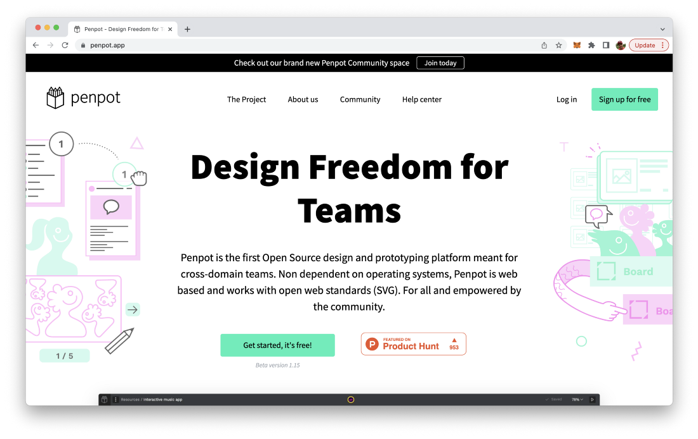
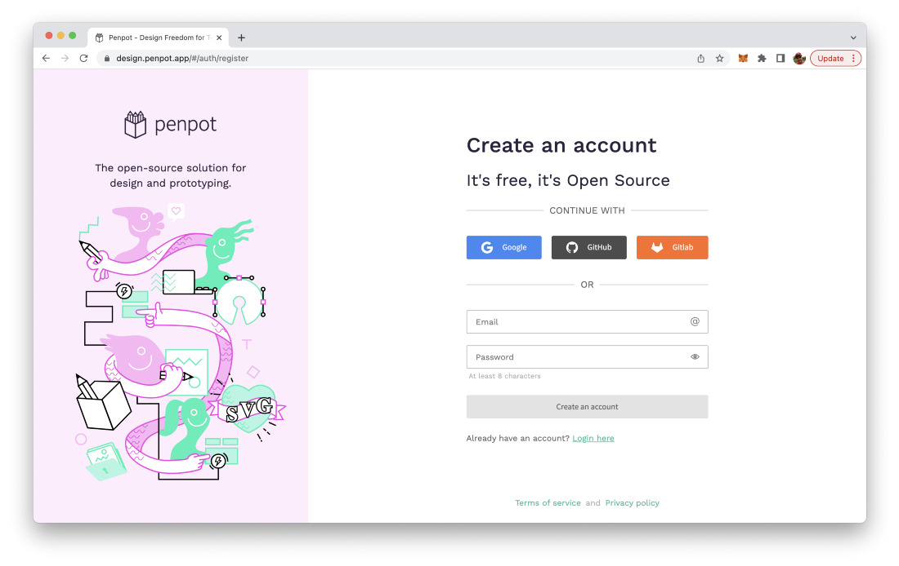
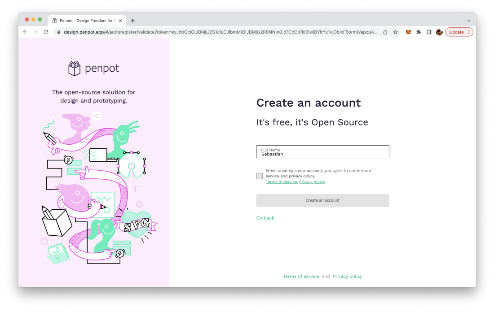
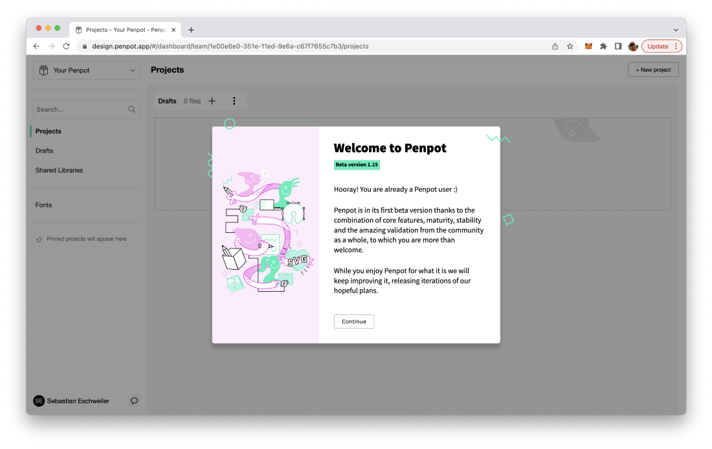
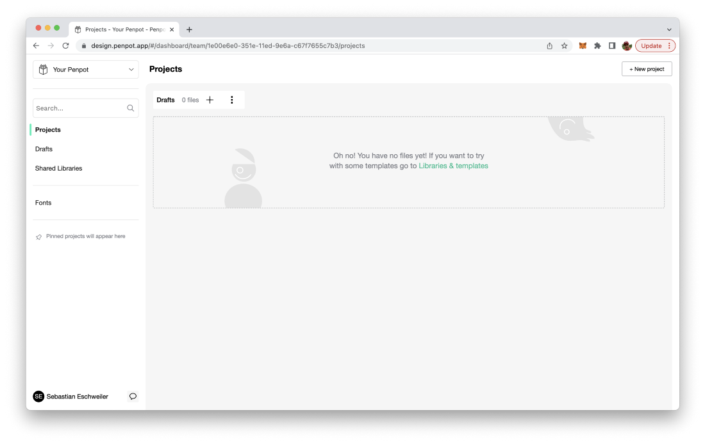
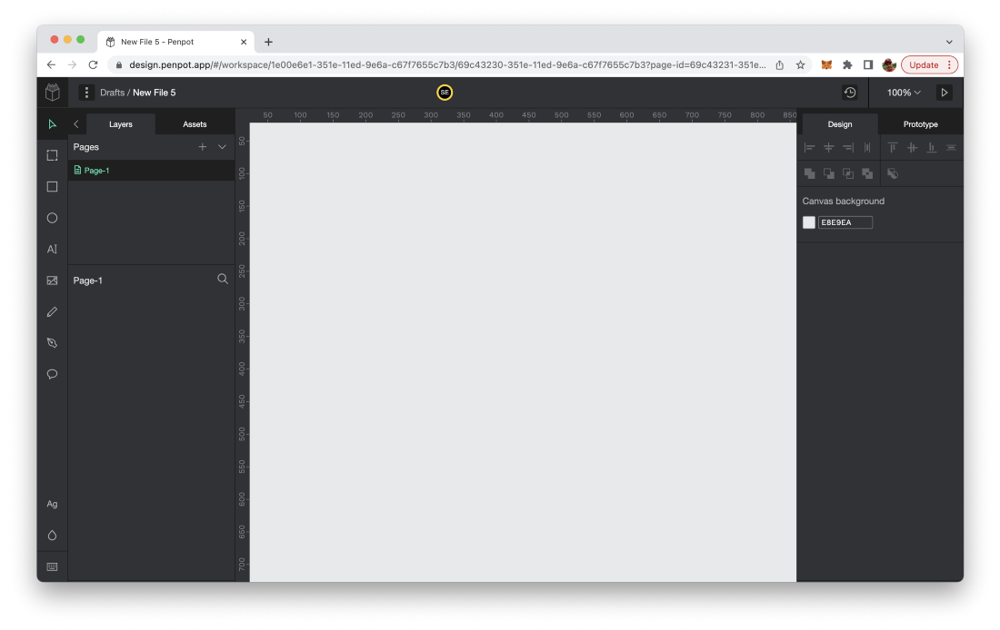
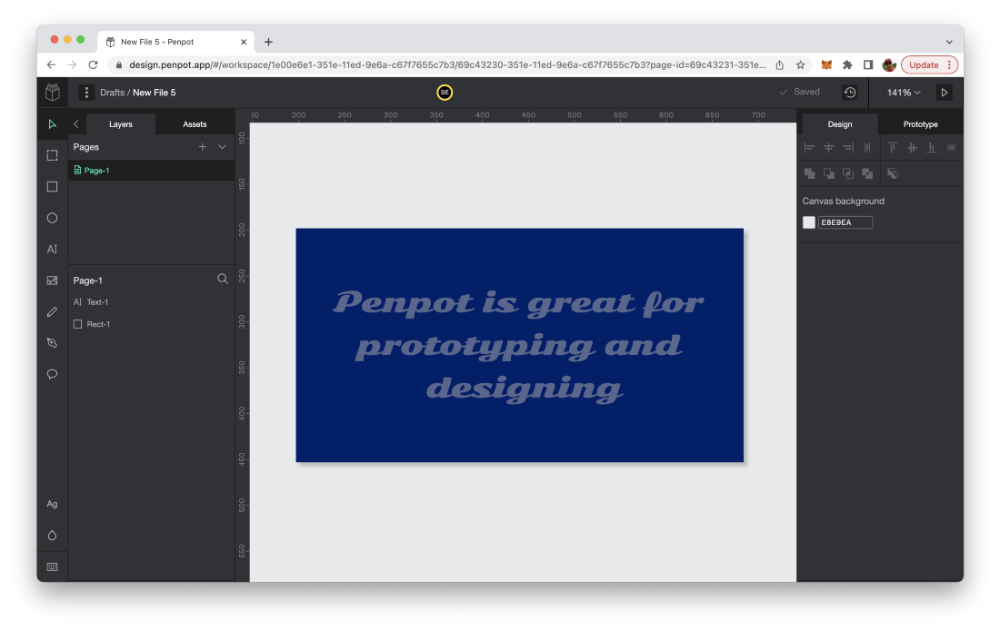

import { Image } from '@astrojs/image/components';
import YouTube from '~/components/widgets/YouTube.astro';
export const components = { img: Image };

*Photo by Kelly Sikkema on Unsplash.com*

Figma is a collaborative user interface design and prototyping tool which runs in the browser and is used by many web and mobile interface developers nowadays. Figma has announced that it will be acquired by Adobe soon. Looking for a free and open source alternative to Figma? Take a look at Penpot.

If you’re a web or mobile developer you most probably have heard or even used Figma for designing your user interfaces. Today Figma has announced that it will be acquired by Adobe. The full statement can be read on Figma’s blog: [A new collaboration with Adobe](https://www.figma.com/blog/a-new-collaboration-with-adobe/).

Dylan Field the CEO of Figma is writing: “Today, we’re announcing that Figma has entered into an agreement to be acquired by Adobe.”

Maybe you’re thinking about leaving the platform now and looking for alternatives?

Luckily there is a great free and open-source alternative to Figma available today: Penpot. Penpot is available at https://penpot.app and describes itself as:

>Penpot is the first Open Source design and prototyping platform meant for cross-domain teams. Non dependent on operating systems, Penpot is web based and works with open web standards (SVG). For all and empowered by the community.

If you want to get started with Penpot go to the website and sign up for a free account:

In order to create a new account just hit the button “Sign up for free” in the top right corner of the website. This takes you to the first step of the sign up process:

Here you can choose to sign up with your existing Google, GitHub, or Gitlab account or just sign in by filling out the Email and Password input field.

In the next step you need to enter your full name and accept and agree the terms of service statement. Click on button “Create an account” to get to the next step:

Once the new account is created Penpot welcomes you as a new user:

You can confirm the welcome message and you should then be able to see the empty Dashboard of Penpot. Here you can organize your Penpot project and files. You can create a new Penpot file in the Draft area of the Dashboard (which is available by default) by clicking on the + sign next to the Draft section headline:

This created a new Penpot file and diretly opens the Penpot user interface where you can start sketching out your ideas:

If you have been working with Figma before it should be very easy for you to get starting with the graphical design functions Penpot is offering. The user interface is very similar to what you know from Figma:

