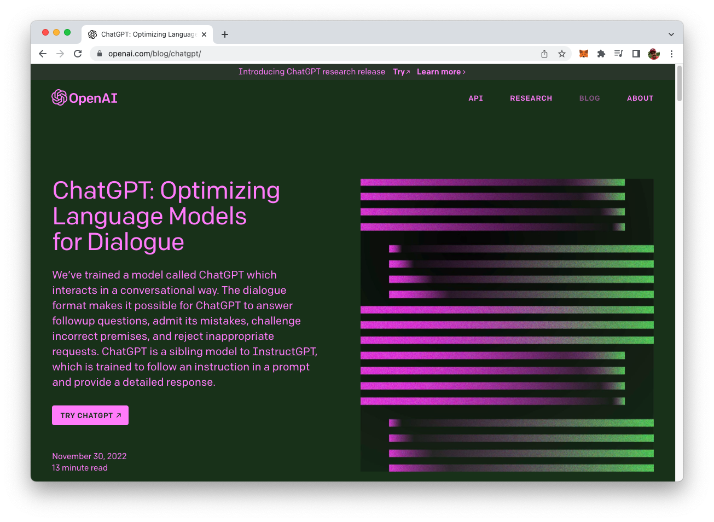
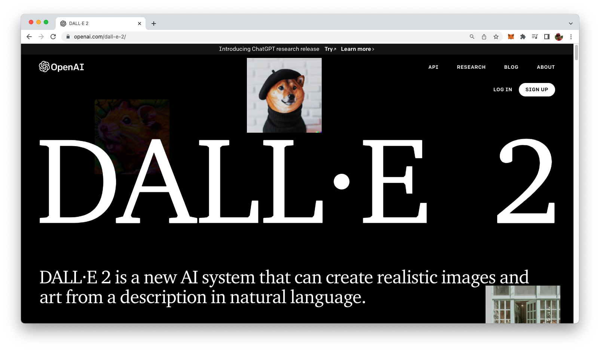

import { Image } from '@astrojs/image/components';
import YouTube from '~/components/widgets/YouTube.astro';
export const components = { img: Image };

Generative AI, also known as Generative Artificial Intelligence, is a branch of AI that focuses on creating new and unique data, such as images, videos, text, and audio. This technology is becoming increasingly popular with services like OpenAI’s ChatGPT, DALL-E, or Midjourney. In a wide range of industries, such as media, entertainment, and design, Generative AI is starting to play a significant role. 2023 is the year of Generative AI — and this is just the beginning. Technology will change our work and life! Again!

Generative AI is based on the principle of generating content that is similar to, but not identical to, existing data. This is achieved through the use of deep learning algorithms and neural networks, which are trained on large datasets.

The what are the most popular areas where Generative AI is already supporting us today:

1. Language Models - Generative models that are trained to generate human-like text, such as in the form of writing or speech.
2. Generative Design - Using AI to generate new designs or optimize existing ones.
4. Image and Video Synthesis - Using AI to generate new images and videos from scratch or from given inputs.
5. Music Generation - Generative models that can compose music, create beats, and generate MIDI files.
6. Robotics and Control - generating control systems for robots and other physical devices.
7. Game AI - generating intelligent behavior in games and other interactive simulations.

This is quite an impressive list of areas where AI is already creating an impact on our lives already today. However, it must be noted here: this list is not complete and is only an excerpt. The reality is: artificial intelligence is penetrating more and more everyday areas and the boundaries between the different categories are becoming increasingly blurred. Just think of some of the areas in which AI is already impacting our lives today:

1. Virtual personal assistants: Virtual personal assistants, such as Apple's Siri and Amazon's Alexa, use natural language processing (NLP) and machine learning algorithms to understand and respond to voice commands.
2. Recommendation systems: Recommendation systems, such as those used by Netflix and Spotify, use AI algorithms to make personalized content recommendations based on a user's viewing and listening history.
3. Image and speech recognition: AI-based image and speech recognition technology can be found in a wide range of applications, such as in mobile phones, digital cameras, and automobiles.
4. Fraud detection: AI-based algorithms are used in financial services and other industries to detect and prevent fraudulent transactions.
5. Customer service chatbots: Many companies use AI-powered chatbots to handle customer service inquiries, such as providing information about products or troubleshooting technical issues. These chatbots are able to understand natural language and provide relevant answers to customer's questions.

## Examples of Popular Generative AI Services

Let's take a look at some very popular Generative AI services:

__1. ChatGPT__

ChatGPT is a type of artificial intelligence (AI) technology that is designed to have conversations with people. It can understand and respond to written or spoken language in a way that is similar to how a human might. ChatGPT is really cool because it can learn from the conversations it has with people and become more accurate and helpful over time. Some people use ChatGPT to have fun conversations or to get answers to questions, while others use it for more practical purposes like helping them with tasks or generating ideas. Overall, ChatGPT is a really interesting and innovative tool that has a lot of potential to make our lives easier and more efficient.

__2. DALL-E__

DALL-E is a type of AI model developed by OpenAI. It is a variant of a transformer-based language model called GPT-3 (Generative Pre-trained Transformer 3). DALL-E is trained to generate images from natural language descriptions. This is done by generating an image from a given text prompt, and then searching for similar images in a dataset of images.

DALL-E uses a transformer architecture to understand the relationship between the text and the image, and is trained on a large dataset of images and their associated captions. The model is able to generate unique images from textual prompts, such as "a two-story pink house with a white fence and a red door" and "a two-story pink house with a white fence and a red door with a car in front of it".

DALL-E was introduced in January 2021, and is considered as a major breakthrough in the field of AI, as it is able to generate images from text descriptions with high accuracy. It's a major step in the direction of AI-powered art and design, and it could be used for a variety of applications such as video game development, advertising, and architecture.

__3. Midjourney__

One of the most popular AI image generation tools right now is Midjourney. Midjourney provides you with powerful capabilities of generating stunning und unique AI art based on your descriptive input.

If you want to see an example: The title image of this article was generated by Midjourney. A very impressive piece of art which was only generated on the basis of a textual description.

## Generative AI Will Be Used In Many Businesses Soon

Generative models are useful for many business functions as well. We are just at the beginning of AI entering the corporate environment and soon we will be able to see that many of business tasks which are solved by humans today will be taken over by Generative AI.

A good example of a business function which is able to benefit a lot from Generative AI services is marketing. Typical tasks in marketing includes

* producing marketing texts, e.g. blog post, article etc.
* writing social media posts
* creating sales emails
* creating ads
* etc.

This can all be done by using Generative AI in an automated way. E.g. the Jasper AI service which is available at https://www.jasper.ai/ is already offering AI services specialized for marketing.

Jasper is based on OpenAI's GPT-3 language model and is optimized to produce the best output for marketing purposes. If you take a closer look at Jasper's website you can see that already today many small and big companies are customers of Jasper including IBM, AirBnB, or Autodesk. This also means that it's very likely that you've already been targeted by marketing campaigns generated by an artificial intelligence rather than a human marketer.

Of course AI is not only used to generate marketing campaigns and material like text or graphics. It it also a great support when it comes to generating specific recommendations for products (like clothing). For example the clothing company Stitch Fix has already started to experiment with AI-based clothing recommendations for customers.

Another business function where generative AI is already of great help is coding / code generation. If you just provide a short description of a code snipped in a specific programming language to ChatGPT (or the GPT-3 language model directly) you will receive the generated code:

By using GitHub's Copilot service you can also integrate AI-based code generation right into your code editor and use it for smaller and bigger tasks when writing code, e.g. it provides suggestions for code snippets and variable names as the developer types, making it easier to write code quickly and accurately. It also includes features such as automatic refactoring and error detection:

## Will Generative AI Replace Jobs?

Generative AI has the potential to automate certain tasks and thus displace some jobs, but it can also create new jobs and augment existing ones. While some jobs may become obsolete, others will likely evolve in response to the increased use of AI. Additionally, the adoption of AI may lead to economic growth and new opportunities in industries such as healthcare, finance, and transportation.

It's important to note that AI is not a monolithic technology, but rather a set of tools and techniques that can be applied in different ways to different industries.

It's also worth mentioning that AI will not replace jobs but rather it will change the nature of work and create new opportunities. People will need to learn new skills and adapt to new ways of working. It's important to invest in education, training, and upskilling to ensure that the workforce is prepared for the changes that will come with increased use of AI.

## Conclusion

In conclusion, Generative AI has the potential to revolutionize a wide range of industries and impact our lives in countless ways. From creating realistic virtual worlds to automating repetitive tasks, generative AI has the potential to greatly improve our productivity and enhance our daily experiences.

However, it's important to keep in mind that the development and implementation of generative AI must be approached with caution, as it also raise ethical concerns such as job displacement and the potential for misuse. As we continue to push the boundaries of what's possible with generative AI, it's crucial that we consider the long-term implications of this technology and work to ensure it is used for the betterment of humanity.