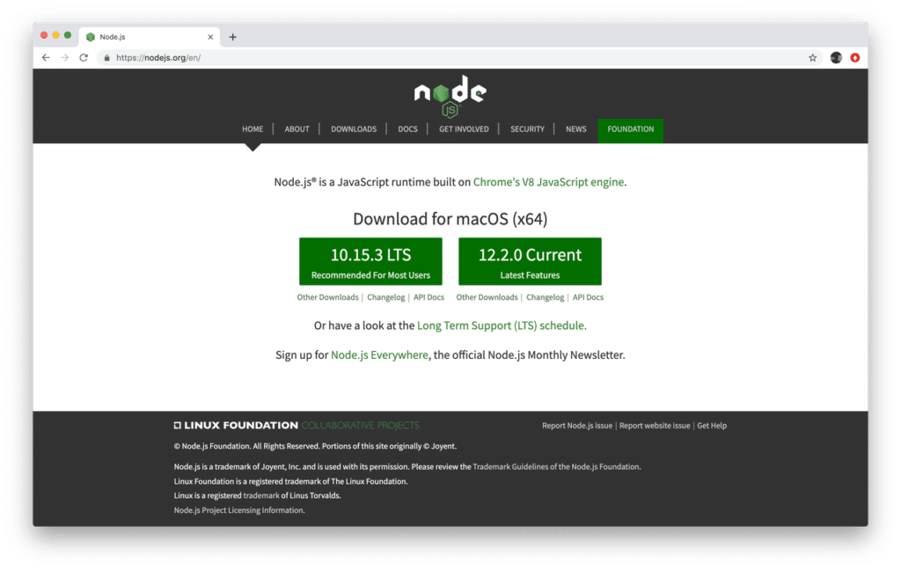
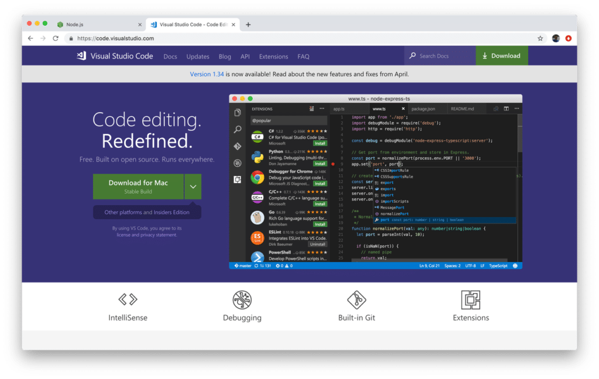
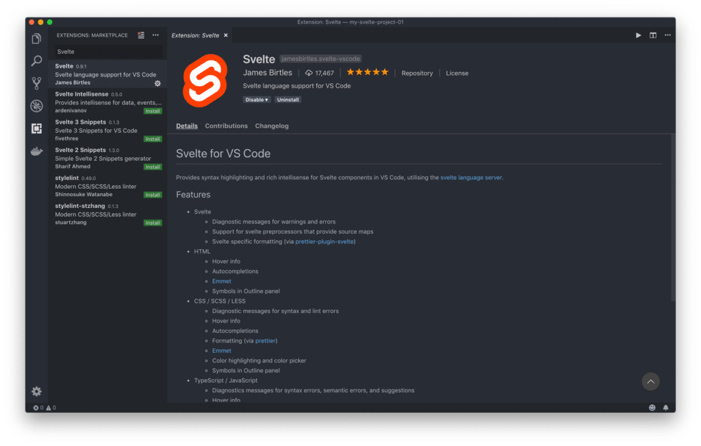
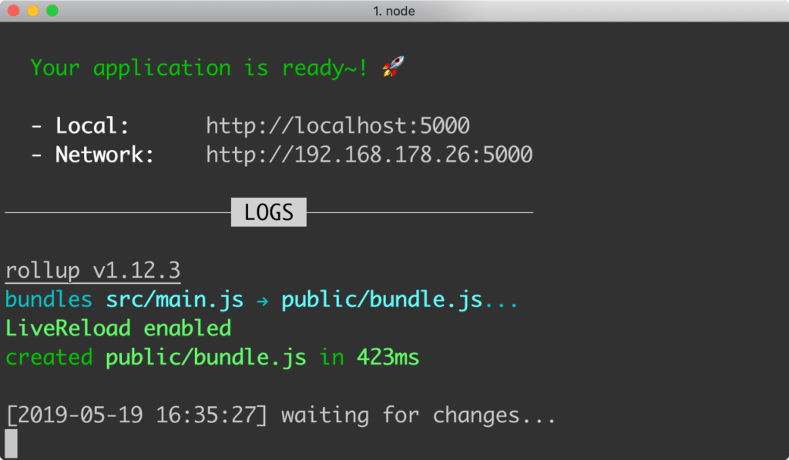
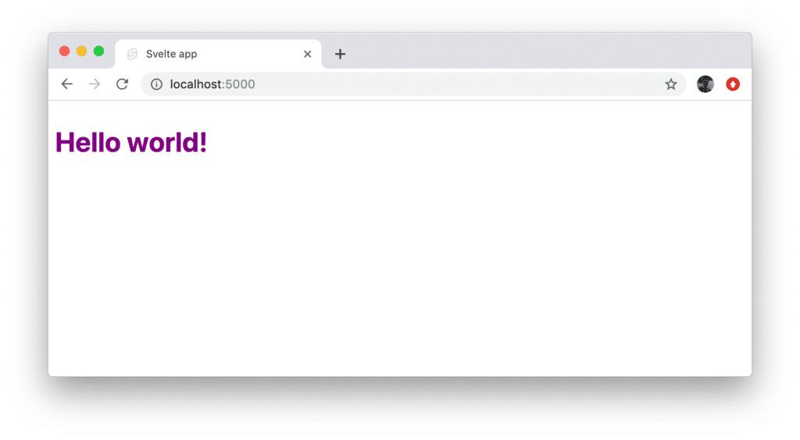
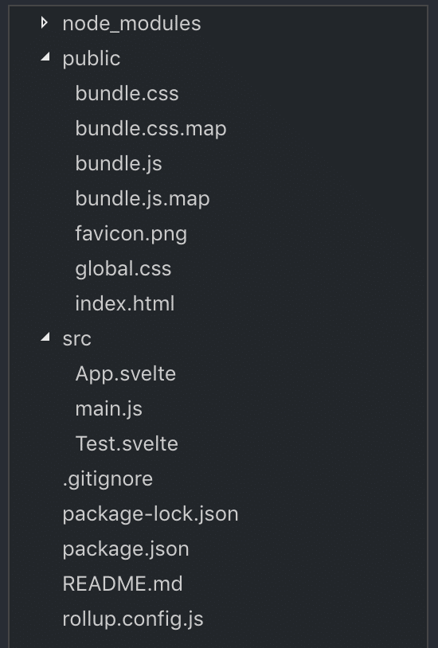
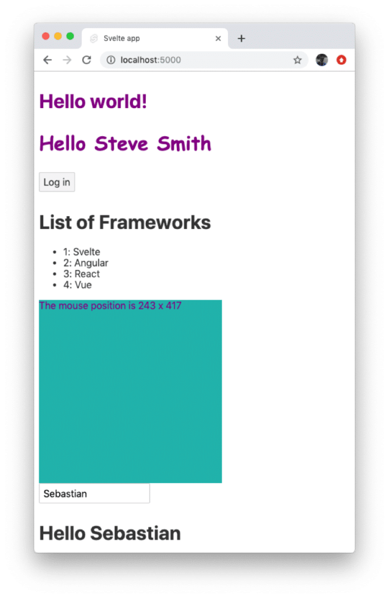

import { Image } from '@astrojs/image/components';
import YouTube from '~/components/widgets/YouTube.astro';
export const components = { img: Image };


<YouTube url="https://youtu.be/Bfi96LUebXo" />

The front-end development world is changing very fast - new technologies and frameworks are being released constantly and sometimes it's hard to keep the overview.  
  
If you're a web developer you have most probably worked with frameworks like Angular, React, Vue in recent months. Now a new star is arising which is gaining traction very fast and is for sure an alternative to these framework: Svelte!

Svelte ([https://svelte.dev/](https://svelte.dev/)) brings a new approach to JavaScript-based web development: Instead of doing the bulk of the work in the browser (client-side), Svelte shifts that work to a compiler step which is done during development time. This means that no framework code needs to be delivered to the client. Instead Svelte is able to produce highly optimised plain JavaScript code which can be directly interpreted by the browser. No need of loading additional libraries and code to be able to run the web application.  
  
This approach makes Svelte web applications very fast and efficient. In the tutorial you'll learn the Svelte basics. We'll go through every step which is needed to build your own Svelte web application from start to finish.  
  
If you haven't heart about Svelte yet, that's the perfect tutorial to get started ... Let's get into it!  

## Prerequisites

Before getting into Svelte and creating the first project we need to make sure that Node.js (and the corresponding Node.js package manager NPM) is installed on the system.  
  
Installing Node.js is very easy. You just need to go to the Node.js website [https://nodejs.org/en/](https://nodejs.org/en/):  



Download the installer for the current version for your platform. Execute the installer and follow the instructions. The installer will guide you through the steps needed to setup Node.js and NPM.  
  
Furthermore you need to choose a code editor. The recommendation is to use Visual Studio Code ([https://code.visualstudio.com/](https://code.visualstudio.com/)):  



You can download and use Visual Studio Code for free. Furthermore you're able to install the Visual Studio Code Svelte plugin which helps you with IntelliSense and syntax highlighting:  



## Creating Your First Svelte Project

Now we're ready to create our first Svelte project from scratch. Creating a new project is very easy, open a new terminal and execute the following command:  
  
`$ npx degit sveltejs/template my-first-svelte-project`  
  
This command creates a new project folder _my-first-svelte-project_ and downloads the svelte default project template into that folder. Next, change into the newly created project folder:  
  
`$ cd my-first-svelte-project`  
  
Before running the project we need to make sure that all needed development dependencies are being installed. Therefore execute:  
  
`$ npm install`  
  
This command makes sure that all packages listed in the _devDependencies_ in _package.json_ are being installed into the _node_modules_ folder. In the following listing you can see the _devDependencies_ section of _package.json_:  

```json
devDependencies": {
    "npm-run-all": "^4.1.5",
    "rollup": "^1.10.1",
    "rollup-plugin-commonjs": "^9.3.4",
    "rollup-plugin-livereload": "^1.0.0",
    "rollup-plugin-node-resolve": "^4.2.3",
    "rollup-plugin-svelte": "^5.0.3",
    "rollup-plugin-terser": "^4.0.4",
    "sirv-cli": "^0.4.0",
    "svelte": "^3.0.0"
  },
```

The fact that there is only a _devDependencies_ and no _dependencies_ section is special about Svelte. Because Svelte is working as a compiler everything what is needed is processed and translated into plain JavaScript code at development time. For that reason no further dependencies are needed when running the application.  
  
Next we're ready to start the development web server by using the following command:  
  
`$ npm run dev`  
  
Having hit return you should be able to see an output similar to what you can see in the following screenshot:  



Here you can see that the application is now running on port 5000 and the web server is listing for changes with live reloading enabled. Accessing http://localhost:5000 in the browser will lead to the following result:



## Project Structure

Now that we have a running first Svelte project let's take a closer look at the project structure:  



First we can see that a _node\_modules_ folder is included. This folder is containing all packages which have been listed in the _devDependencies_ section in _package.json_.  
  
The folder _public_ is containing the output of the compilation which is performed by Svelte. A _bundle.js_ and _bundle.css_ file is available containing the optimized JavaScript and CSS code. You'll also find the file index.html file in which the JavaScript code of _bundle.js_ is included:  

```html
<!doctype html>
<html>
<head>
    <meta charset='utf8'>
    <meta name='viewport' content='width=device-width'>
    <title>Svelte app</title>
    <link rel='icon' type='image/png' href='favicon.png'>
    <link rel='stylesheet' href='global.css'>
    <link rel='stylesheet' href='bundle.css'>
</head>
<body>
    <script src='bundle.js'></script>
</body>
</html>
```

The _src_ folder is the place which you will use to store all your custom Svelte code into. Furthermore the folder contains by default the files _main.js_ and _App.svelte_. Let's take a look into those fildes:  
  
Inside of _main.js_ you should find the following lines of code:

```javascript
import App from './App.svelte';

const app = new App({
    target: document.body,
    props: {
        name: 'world'
    }
});

export default app;
```

This is the starting point of the Svelte application. The main application component is imported from _App.svelte_ and a new instance of App is created. A configuration object is passed into the constructor call containing the following two properties:

- target: is set to _document.body_ to specify that the HTML output which is generted by App component should be inserted into the document body.
- props: an object is assigned containing the properties which should be passed into App component.

Now let's take a look at the code which is available in _App.svelte_:

```html
<script>
    export let name;
</script>

<style>
    h1 {
        color: purple;
    }
</style>

<h1>Hello {name}!</h1>
```

This is a typical implementation of a Svelte component which is devided into three blocks:

- script section: This section is containing the JavaScript code of the component. In this case the name variable is defined as a property (by using the export keyword).
- style section: The style section is containing CSS code which is scoped to the component.
- template section: The template section is containg the markup code (and Svelte specific enhancements) which are used to generate the HTML output of the component.

## Creating Your First Svelte Component

Now that you have a first overview of the intial project structure we're ready to add a further custom Svelte component to the project by creating a new file _src/Greeting.svelte_ and inserting the following line of code:

```html
<h2>Hello World!</h2>
```

This is a just a very simple component conisting of only one line of template code outputting the text _Hello World!_ as a headline.  
  
To make use of that custom component and make the output visible in the browser we need to include the component in the main application component App component:

```html
<script>
    import Greeting from './Greeting.svelte';

    export let name;
</script>

<style>
    h1 {
        color: purple;
    }
</style>

<h1>Hello {name}!</h1>

<Greeting/>
```

First the corresponding import statement needs to be added in the script section and second the HTML element `<Greeting />` needs to be inserted into the template code of App component.  
  
By using that HTML element we're making sure that the HTML output of Greeting component is inserted into the output of App component.

## Styling

Adding CSS code to a Svelte component is extremely easy. As seen before the only thing which is needed is a script block with the corresponding CSS code inside. E.g. change the content of Greeting.svelte to the following to add some additional styling to the output:

```html
<style>
    h2 {
        color: purple;
        font-family: 'Comic Sans MS';
        font-size: 2em;
    }
</style>

<h2>Hello World!</h2>
```

## Properties & Computed Properties

Each component is able to receive data through components. To add components to a component you just have to add variables to the script section and declare those variables by using the export keyword. E.g. add the following two properties to _Greeting_ component:

```html
<script>
    export let first_name;
    export let last_name;

</script>
```

Also change the template code to:

```html
<h2>Hello {first_name} {last_name}</h2>
```

With these changes in place you're ready pass in values when the component is being used in _App.svelte:_

```html
<Greeting first_name="Steve" last_name="Smith"/>
```

Furthermore Svelte is supporting computed properties as well. In the following you can see that a computed property _name_ is added:

```html
<script>
    export let first_name;
    export let last_name;

    $: name = first_name + " " + last_name; 
</script>

<style>
    h2 { 
        color: purple;
        font-family: 'Comic Sans MS';
        font-size: 2em;
    }
</style>

<h2>Hello {name}</h2>
```

Computed properties are fully reactive. That means if some of the depending variables are changing (_first_name_ or _last_name_) the value for name is updated automatically.

## Logic

In Svelte it's possible to add logic to the template directly. Let's see what that means:

### If-Block

In the following you can see a new component which is created in _src/LogIn.svelte_:

```html
<script>
    let user = { loggedIn: false };

    function toggle() {
        user.loggedIn = !user.loggedIn;
    }
</script>

{#if user.loggedIn}
    <button on:click={toggle}>
        Log out
    </button>
{/if}

{#if !user.loggedIn}
    <button on:click={toggle}>
        Log in
    </button>
{/if}
```

This component outputs a simple button. By clicking on the button the state changes from logged in to logged out. Depending on the state the button is displayed either with the text “Log out” (if the state is logged in) or “Log in” (if the state is logged out.  
  
The state is tracked by a variable named user which is a boolean property of loggedIn. Depending on the value of that property the template is outputting the button with the corresponding text. This is controlled by using the `{#if [condititon]} ... {/if}` syntax in the template code.  
  
In order to see the output of the LogIn component do not forget to include the corresponding import statement in _src/App.svelte_:

```javascript
import LogIn from './LogIn.svelte';
```

And add the `<LogIn />` HTML element to the template code:

```html
<LogIn />
```
### If-Else-Block

The previous example uses two `{#if [condititon]} ... {/if}` blocks to control the output of the buttons. This is fully working and you're able to change between the two states by clicking on the button. However the code can be changed to only contain one `{#if [condititon]} ... {/if}` block by also addding an `{:else}` branch:

```html
<script>
    let user = { loggedIn: false };

    function toggle() {
        user.loggedIn = !user.loggedIn;
    }
</script>

{#if user.loggedIn}
    <button on:click={toggle}>
        Log out
    </button>
{:else}
    <button on:click={toggle}>
        Log in
    </button>
{/if}
```
### Each-Block

Svelte gives you access to another template element which makes it easy to generate output for a list. Let's take a look into the following example which is inserted into a new file _FrameworkList.svelte_:

```html
<script>
    let frameworks = [
        {id: 1, name: 'Svelte'},
        {id: 2, name: 'Angular'},
        {id: 3, name: 'React'},
        {id: 4, name: 'Vue'}
    ]
</script>

<h1>List of Frameworks</h1>

<ul>
    {#each frameworks as {id, name}}
        <li>
            {id}: {name}
        </li>
    {/each}
</ul>
```

First of all an array is created and assigned to the _frameworks_ variable. Each array element is an object consisting of two properties.  
  
To output the data an `{#each} ... {/each}` block is used. For each element a `<li>` element is added to the HTML output.  
  
To include this new FrameworkList component in _App.svelte_ add the following _import_ statement:

```javascript
import FrameworkList from './FrameworkList.svelte';
```

And don't forget to add the corresponding HTML element to the template code as well:

```html
<FrameworkList />
```
## Events

Next, let's take a look at events in Svelte. We've already seen a first example in the previous examples when responding to the click event of a button:

```markup
<button on:click={toggle}>
```

By using that line of code we've connected the toggle function (which needs to be added to the script section of the component) to the click event of the button. Everytime the user clicks on the button the function is called and therefore is able to handle the event.  
  
Let's take a look at a second example which is inserted into a new component file _EventDemo.svelte_:

```markup
<script>
    let m = { x: 0, y: 0 };

    function handleMousemove(event) {
        m.x = event.clientX;
        m.y = event.clientY;
    }
</script>

<style>
    div {
        width: 300px;
        height: 300px;
        color: purple;
        background: lightseagreen;
    }
</style>

<div on:mousemove={handleMousemove}>
    The mouse position is {m.x} x {m.y}
</div>
```

Here we're responding to the mouse move event of a div area by adding the following attribute to the element:

```javascript
on:mousemove={handleMousemove}
```

The _handleMousemove_ function is registered as the event handler for the mousemove event. Everytime the mouse is moved within the div area the event is triggered and the function is called. The function is then updating the x and y position of the mouse in _m.x_ and _m.y_.  
  
To make everything visible add the corresponding import statement in _App.svelte_:

```javascript
import EventDemo from './EventDemo.svelte';
```

And make sure to include the `<EventDemo />` element in the template code.

## Bindings

Last but not least let's explore bindings in Svelte. Again we're starting with a simple practical example to understand the concept. In _BindingDemo.svelte_ add the following sample code:

```markup
<script>
    let name = "Sebastian"
</script>

<input bind:value={name}>

<h1>Hello {name}</h1>
```

The value of the input element is bound to the variable _name_. This means that the binding is working two-way. Initially the value of name is displayed in the input element. When the user changed the value of the input element to value of name is updated accordingly.  
  
In thee following screenshot you can see the complete browser output after all custom Svelte components have been included and added to App component:



## Conclusion

Compared to web development frameworks and platforms like Angular, React and Vue.js, Svelte introduces a new approach into JavaScript-based web development. By using a compiler approach Svelte makes sure that only highly optimized plain JavaScript, CSS and HTML code is delivered to the client.  
  
Svelte is very easy to learn. The framework combines the best syntax elements from Angular, React and Vue. The source code is easy to read and therewith you will be able to make quick progress implementing your first Svelte web application. Just give it a try.
