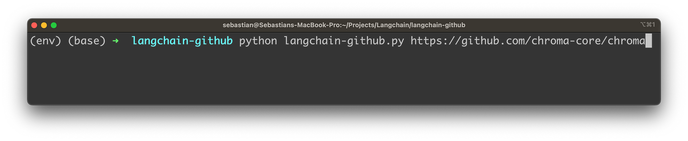
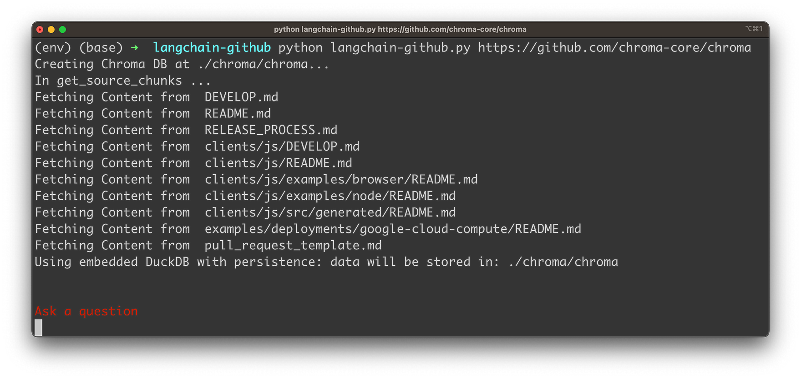
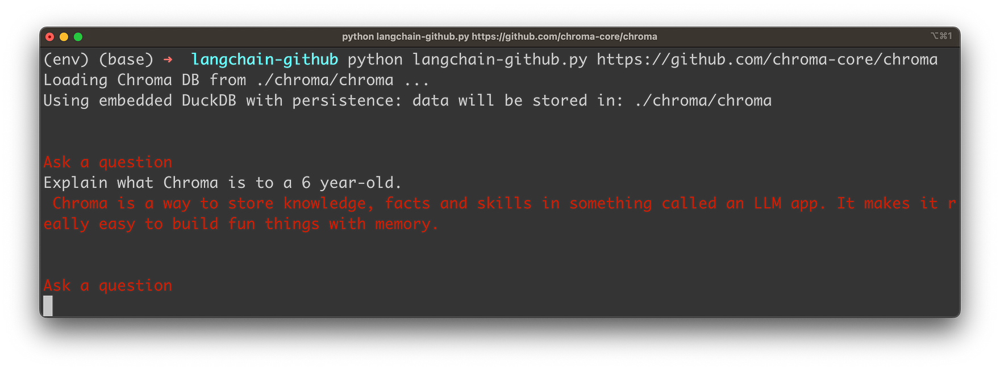
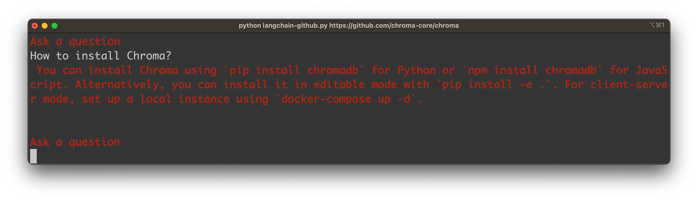
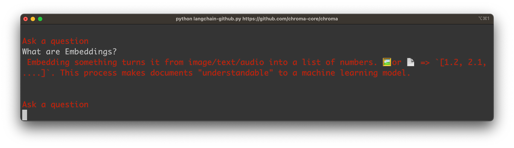
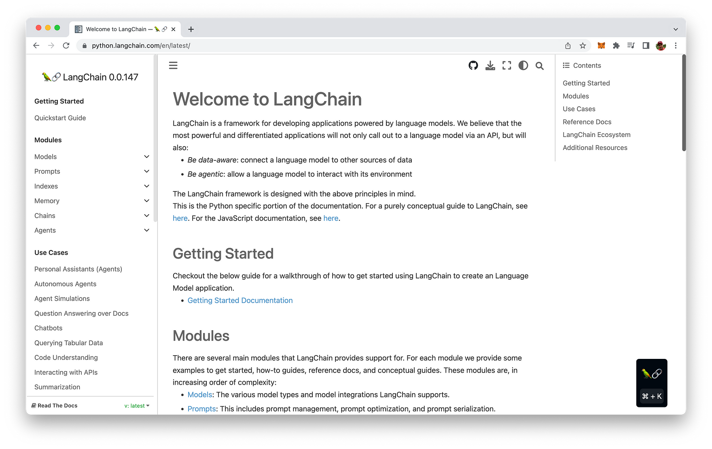
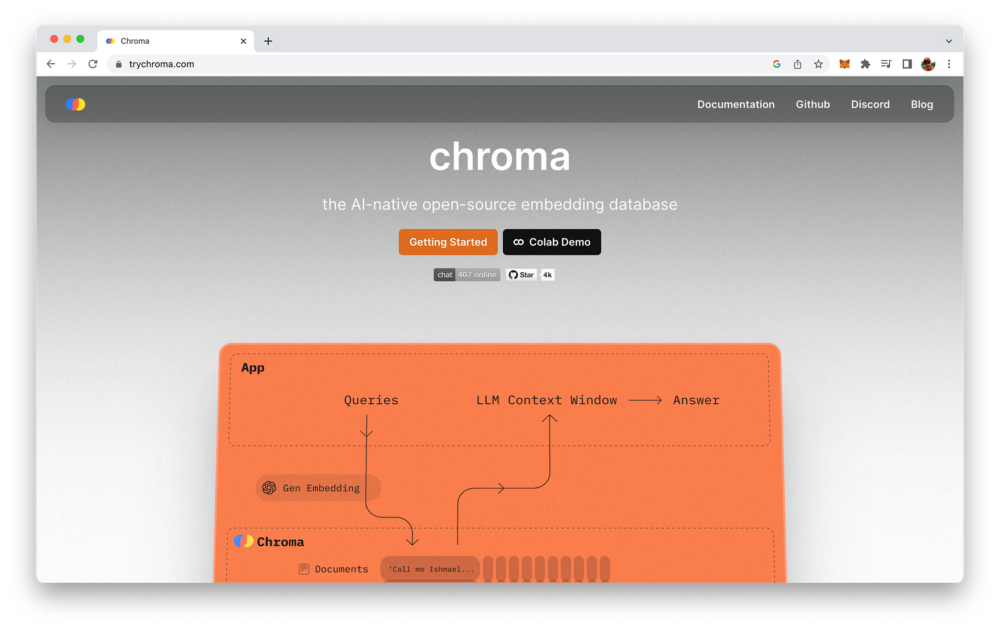

import { Image } from '@astrojs/image/components';
import YouTube from '~/components/widgets/YouTube.astro';
export const components = { img: Image };

In today’s fast-paced world of software development, staying ahead of the curve and maximizing efficiency is the key to success. What if we told you there’s a groundbreaking way to interact with GitHub repositories like never before, using the power of OpenAI LLMs and LangChain? Welcome to The Ultimate Guide to Chatting with ANY GitHub Repository using OpenAI LLMs and LangChain!

In this comprehensive guide, we'll unveil the secrets behind harnessing the cutting-edge capabilities of OpenAI LLMs and LangChain to revolutionize the way you access and explore information within your GitHub repositories. No more tedious searches or browsing through endless files to find the answers you need; with our step-by-step tutorial, you'll learn how to chat seamlessly with any repository and unlock the full potential of your projects.

Whether you're an experienced developer or just starting your journey into the realm of coding, this guide will provide you with all the tools and knowledge necessary to master the art of conversational GitHub interactions. So, sit back, grab your favorite beverage, and let's dive into the world of OpenAI LLMs and LangChain, where the future of GitHub communication awaits!

## What We're Going To Build

This Python app we're going to build in this post fetches all the Markdown (*.md) files from a specified GitHub repository, processes them, and then allows the user to ask questions about the contents of these files. The script uses the LangChain library to create an information retrieval-based question-answering system.

Let's see the application in action. The Python application can be started on the command line. As a parameter you're handing over the URL of the GitHub repository:



Once you hit return the application is collecting the content from Markdown files in the given GitHub repository as you can see in the following:



The content is extracted and converted to embeddings (vector representations of the Markdown content). The embeddings are then stored into an instance of ChromaDB, a vector database. Once everything is stored the user is able to input a question. In the following screenshot you can see a simple question related to the GitHub repository:



The answer is provided based on the retrieved information from the Markdown file content of the GitHub repository:





Let's get into the details …

## Building Blocks

Before diving into the implementation of the Python app, let's first take a look at the main building blocks. Several building blocks work together to create an interactive question-answering system that retrieves information from Markdown files within a GitHub repository:

1. __GitHub API__: The GitHub API is used to fetch files from a specified GitHub repository. The script authenticates with the API using a personal access token, retrieves the contents of the repository, and filters the results to only include Markdown (*.md) files. It downloads these files and processes their contents for further use.

2. __LangChain__: LangChain is a library designed for creating information retrieval-based question-answering systems. In the script, LangChain is used to process the downloaded Markdown files and set up the question-answering pipeline. Specifically, it helps create a RetrievalQA instance that combines a pre-trained question-answering chain with the ChromaDB Vector Database.



3. __ChromaDB Vector Database__: ChromaDB is a vector database that stores the embeddings of processed text chunks from the Markdown files. These embeddings are used to quickly and efficiently search for relevant information when answering user questions. If the ChromaDB for the specified repository does not exist, the script creates one using the processed text chunks and OpenAIEmbeddings. If it already exists, the script simply loads the existing database.



4. __OpenAI API for Embeddings__: The OpenAI API for Embeddings is used to generate embeddings for the text chunks. These embeddings are then stored in the ChromaDB Vector Database to be used for retrieving relevant information when answering user questions. The OpenAIEmbeddings module is used in this script to generate embeddings for the text chunks and as part of the ChromaDB database.
   
5. __OpenAI LLM__: OpenAI's large language model (LLM) is a core component of the question-answering pipeline. In this script, it is used within the LangChain library to create a pre-trained question-answering chain. This chain is combined with the ChromaDB Vector Database in the RetrievalQA instance, which enables the system to generate accurate and relevant answers based on the user's questions.

Together, these building blocks form a powerful and efficient question-answering system that allows users to interactively chat with any GitHub repository. By leveraging the capabilities of the GitHub API, LangChain, ChromaDB Vector Database, OpenAI API for Embeddings, and OpenAI LLM, the script creates an engaging and informative experience for users who want to explore and learn from the contents of their GitHub repositories.

## Implementation

Next, we will walk through a step-by-step implementation of the Python script, which allows users to interactively chat with any GitHub repository by fetching all Markdown (*.md) files and using OpenAI LLMs and LangChain for question-answering.

Import necessary libraries and modules: Start by importing the required Python libraries and modules such as `os`, `requests`, `fnmatch`, `argparse`, `base64`, and the necessary components from the LangChain library.

```python
import os
import requests
import fnmatch
import argparse
import base64

from langchain.embeddings import OpenAIEmbeddings
from langchain.vectorstores import Chroma
from langchain.llms import OpenAI
from langchain.docstore.document import Document
from langchain.chains import RetrievalQA
from langchain.text_splitter import CharacterTextSplitter
from langchain.chains.question_answering import load_qa_chain
```

Set up your GitHub access token: Replace `[INSERT YOUR GITHUB ACCESS TOKEN HERE]` with your personal GitHub access token. This token will be used to authenticate with the GitHub API for fetching files from repositories.

```python
GITHUB_TOKEN = "[INSERT YOUR GITHUB ACCESS TOKEN HERE]"
```

Define utility functions: Create several utility functions to parse the GitHub URL, retrieve files from a GitHub repository, fetch the contents of Markdown files, and process the text into chunks.

__`parse_github_url(url)`: Extracts the repository owner and name from the given URL.__

```python
def parse_github_url(url):
    parts = url.strip("/").split("/")
    owner = parts[-2]
    repo = parts[-1]
    return owner, repo
```

The `parse_github_url(url)` function is designed to extract the owner and repository name from a given GitHub repository URL.

Here's a breakdown of what the function does:

1. `parts = url.strip("/").split("/")`: First, the function strips any leading or trailing slashes from the input `url` using the `strip("/")` method. Then, it splits the URL into its components using the `split("/")` method, creating a list of parts.
2. `owner = parts[-2]`: The function retrieves the second-to-last element in the `parts` list, which corresponds to the repository owner's username. In a typical GitHub URL (e.g., https://github.com/owner/repo), the owner's username is located just before the repository name.
3. `repo = parts[-1]`: The function retrieves the last element in the parts list, which corresponds to the repository name. In a typical GitHub URL, the repository name is the last part of the URL.
4. `return owner, repo`: The function returns a tuple containing the extracted owner's username and repository name.

__`get_files_from_github_repo(owner, repo, token)`: Fetches all files from the specified GitHub repository using the GitHub API.__

```python
def get_files_from_github_repo(owner, repo, token):
    url = f"https://api.github.com/repos/{owner}/{repo}/git/trees/main?recursive=1"
    headers = {
        "Authorization": f"token {token}",
        "Accept": "application/vnd.github+json"
    }
    response = requests.get(url, headers=headers)
    if response.status_code == 200:
        content = response.json()
        return content["tree"]
    else:
        raise ValueError(f"Error fetching repo contents: {response.status_code}")
```

The `get_files_from_github_repo(owner, repo, token)` function is designed to fetch all files from a specified GitHub repository using the GitHub API. It takes three arguments: `owner` (repository owner's username), `repo` (repository name), and `token` (GitHub access token for authentication).

Here's a breakdown of what the function does:

1. `url = f"https://api.github.com/repos/{owner}/{repo}/git/trees/main?recursive=1"`: The function constructs the GitHub API request URL to fetch the repository's file tree, targeting the "main" branch and using the `recursive=1` parameter to retrieve files from all directories within the repository.
2. `headers = {...}`: It sets up the necessary headers for the API request, including the `Authorization` header with the provided GitHub access token and the Accept header to specify the desired JSON response format.
3. `response = requests.get(url, headers=headers)`: The function sends an HTTP GET request to the GitHub API using the `requests` library, passing the constructed URL and headers.
4. `if response.status_code == 200:`: The function checks if the API request was successful (HTTP status code 200). If so, it proceeds to process the response.

`content = response.json()`: It parses the JSON content of the API response.

`return content["tree"]`: It extracts the file tree information from the JSON response and returns it as a list of files.

`else:`: If the API request was not successful (status code other than 200), the function raises a `ValueError` with an error message containing the HTTP status code.

By calling this function with the appropriate input arguments, you can retrieve a list of files from the specified GitHub repository. This list can be further processed to fetch and analyze the contents of specific files (e.g., Markdown files) as needed.

__`fetch_md_contents(files)`: Retrieves the contents of Markdown files from the list of files.__

```python
def fetch_md_contents(files):
    md_contents = []
    for file in files:
        if file["type"] == "blob" and fnmatch.fnmatch(file["path"], "*.md"):
            response = requests.get(file["url"])
            if response.status_code == 200:
                content = response.json()["content"]
                decoded_content = base64.b64decode(content).decode('utf-8')
                print("Fetching Content from ", file['path'])
                md_contents.append(Document(page_content=decoded_content, metadata={"source": file['path']}))
            else:
                print(f"Error downloading file {file['path']}: {response.status_code}")
    return md_contents
```

The `fetch_md_contents(files)` function fetches the content of Markdown files from a list of files provided as input, which contains file metadata from a GitHub repository. It iterates over the files, filtering for Markdown files and downloading their content. For each successfully downloaded file, it decodes the Base64-encoded content, creates a new `Document` instance with the decoded content and file path metadata, and appends it to a list. Finally, the function returns the list of fetched Markdown file contents as `Document` instances.

__`get_source_chunks(files)`: Processes the contents of the Markdown files into smaller chunks for further processing.__

```python
def get_source_chunks(files):
    print("In get_source_chunks ...")
    source_chunks = []
    splitter = CharacterTextSplitter(separator=" ", chunk_size=1024, chunk_overlap=0)
    for source in fetch_md_contents(files):
        for chunk in splitter.split_text(source.page_content):
            source_chunks.append(Document(page_content=chunk, metadate=source.metadata))
    return source_chunks
```

The `get_source_chunks(files)` function processes a list of files from a GitHub repository, retrieves the content of the Markdown files, and splits it into smaller chunks using a `CharacterTextSplitter`. It then creates Document instances for each chunk with the associated metadata and appends them to a list. Finally, the function returns the list of chunked Markdown file contents as `Document` instances.

__Create the `main()` function that will be responsible for executing the main logic of the script.__

```python
def main():
    parser = argparse.ArgumentParser(description="Fetch all *.md files from a GitHub repository.")
    parser.add_argument("url", help="GitHub repository URL")
    args = parser.parse_args()

    GITHUB_OWNER, GITHUB_REPO = parse_github_url(args.url)
    
    all_files = get_files_from_github_repo(GITHUB_OWNER, GITHUB_REPO, GITHUB_TOKEN)

    CHROMA_DB_PATH = f'./chroma/{os.path.basename(GITHUB_REPO)}'

    chroma_db = None

    if not os.path.exists(CHROMA_DB_PATH):
        print(f'Creating Chroma DB at {CHROMA_DB_PATH}...')
        source_chunks = get_source_chunks(all_files)
        chroma_db = Chroma.from_documents(source_chunks, OpenAIEmbeddings(), persist_directory=CHROMA_DB_PATH)
        chroma_db.persist()
    else:
        print(f'Loading Chroma DB from {CHROMA_DB_PATH} ... ')
        chroma_db = Chroma(persist_directory=CHROMA_DB_PATH, embedding_function=OpenAIEmbeddings())

    qa_chain = load_qa_chain(OpenAI(temperature=1), chain_type="stuff")
    qa = RetrievalQA(combine_documents_chain=qa_chain, retriever=chroma_db.as_retriever())

    while True:
        print('\n\n\033[31m' + 'Ask a question' + '\033[m')
        user_input = input()
        print('\033[31m' + qa.run(user_input) + '\033[m')
```

The logic comprises the following steps:

* Set up an `argparse.ArgumentParser` instance to parse command-line arguments and get the GitHub repository URL.
* Call `parse_github_url(args.url)` to extract the repository owner and name from the URL.
* Fetch all files from the GitHub repository using `get_files_from_github_repo(GITHUB_OWNER, GITHUB_REPO, GITHUB_TOKEN)`.
* Define the local storage path for the Chroma database, which will store the processed text chunks. e. Check if the Chroma database already exists. If it doesn't, create one using the processed text chunks and OpenAIEmbeddings. If it does, load the existing database.
* Load a pre-trained question-answering chain from the LangChain library using `load_qa_chain(OpenAI(temperature=1), chain_type="stuff")`.
* Create a RetrievalQA instance that combines the question-answering chain with the Chroma database. h. Continuously prompt the user to ask questions, and for each question, use the `qa.run(user_input)` method to generate an answer based on the information from the Markdown files.

Finally, execute the main function: Add the `if __name__ == "__main__":` block to call the `main()` function when the script is executed.

```python
if __name__ == "__main__":
    main()
```

By following these steps, you can implement the Python script to create an interactive question-answering system that uses OpenAI LLMs and LangChain to chat with any GitHub repository. This script fetches and processes the contents of Markdown files from the specified repository and sets up a powerful retrieval-based question-answering system, allowing users to ask questions and receive relevant answers based on the information in those files.

Finally, here is the complete code once again:

```python
import os
import requests
import fnmatch
import argparse
import base64

from langchain.embeddings import OpenAIEmbeddings
from langchain.vectorstores import Chroma
from langchain.llms import OpenAI
from langchain.docstore.document import Document
from langchain.chains import RetrievalQA
from langchain.text_splitter import CharacterTextSplitter
from langchain.chains.question_answering import load_qa_chain

GITHUB_TOKEN = "[INSERT YOUR GITHUB ACCESS TOKEN HERE]"

def parse_github_url(url):
    parts = url.strip("/").split("/")
    owner = parts[-2]
    repo = parts[-1]
    return owner, repo

def get_files_from_github_repo(owner, repo, token):
    url = f"https://api.github.com/repos/{owner}/{repo}/git/trees/main?recursive=1"
    headers = {
        "Authorization": f"token {token}",
        "Accept": "application/vnd.github+json"
    }
    response = requests.get(url, headers=headers)
    if response.status_code == 200:
        content = response.json()
        return content["tree"]
    else:
        raise ValueError(f"Error fetching repo contents: {response.status_code}")

def fetch_md_contents(files):
    md_contents = []
    for file in files:
        if file["type"] == "blob" and fnmatch.fnmatch(file["path"], "*.md"):
            response = requests.get(file["url"])
            if response.status_code == 200:
                content = response.json()["content"]
                decoded_content = base64.b64decode(content).decode('utf-8')
                print("Fetching Content from ", file['path'])
                md_contents.append(Document(page_content=decoded_content, metadata={"source": file['path']}))
            else:
                print(f"Error downloading file {file['path']}: {response.status_code}")
    return md_contents

def get_source_chunks(files):
    print("In get_source_chunks ...")
    source_chunks = []
    splitter = CharacterTextSplitter(separator=" ", chunk_size=1024, chunk_overlap=0)
    for source in fetch_md_contents(files):
        for chunk in splitter.split_text(source.page_content):
            source_chunks.append(Document(page_content=chunk, metadate=source.metadata))
    return source_chunks

def main():
    parser = argparse.ArgumentParser(description="Fetch all *.md files from a GitHub repository.")
    parser.add_argument("url", help="GitHub repository URL")
    args = parser.parse_args()

    GITHUB_OWNER, GITHUB_REPO = parse_github_url(args.url)
    
    all_files = get_files_from_github_repo(GITHUB_OWNER, GITHUB_REPO, GITHUB_TOKEN)

    CHROMA_DB_PATH = f'./chroma/{os.path.basename(GITHUB_REPO)}'

    chroma_db = None

    if not os.path.exists(CHROMA_DB_PATH):
        print(f'Creating Chroma DB at {CHROMA_DB_PATH}...')
        source_chunks = get_source_chunks(all_files)
        chroma_db = Chroma.from_documents(source_chunks, OpenAIEmbeddings(), persist_directory=CHROMA_DB_PATH)
        chroma_db.persist()
    else:
        print(f'Loading Chroma DB from {CHROMA_DB_PATH} ... ')
        chroma_db = Chroma(persist_directory=CHROMA_DB_PATH, embedding_function=OpenAIEmbeddings())

    qa_chain = load_qa_chain(OpenAI(temperature=1), chain_type="stuff")
    qa = RetrievalQA(combine_documents_chain=qa_chain, retriever=chroma_db.as_retriever())

    while True:
        print('\n\n\033[31m' + 'Ask a question' + '\033[m')
        user_input = input()
        print('\033[31m' + qa.run(user_input) + '\033[m')

if __name__ == "__main__":
    main()
```

## Conclusion

In conclusion, this __Ultimate Guide to Chatting with ANY GitHub Repository using OpenAI LLMs and LangChain__ offers developers an innovative way to access and explore information within their GitHub repositories through an interactive question-answering system. By leveraging the capabilities of the GitHub API, LangChain, ChromaDB Vector Database, OpenAI API for Embeddings, and OpenAI LLM, this guide presents a powerful solution for those looking to revolutionize their interactions with GitHub repositories and unlock the full potential of their projects. As the world of software development evolves, tools like these will continue to empower developers with efficient, user-friendly, and engaging solutions to enhance their productivity and success. So, embrace the future of GitHub communication and start chatting with your repositories today!