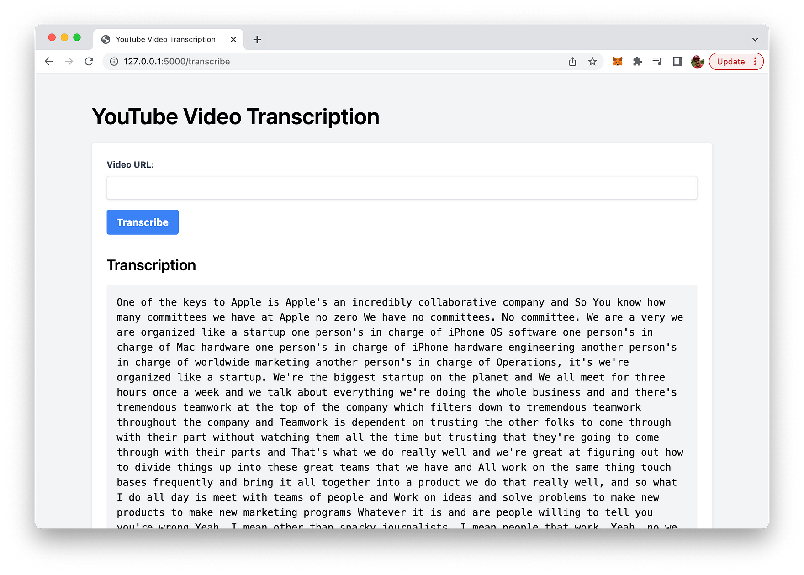
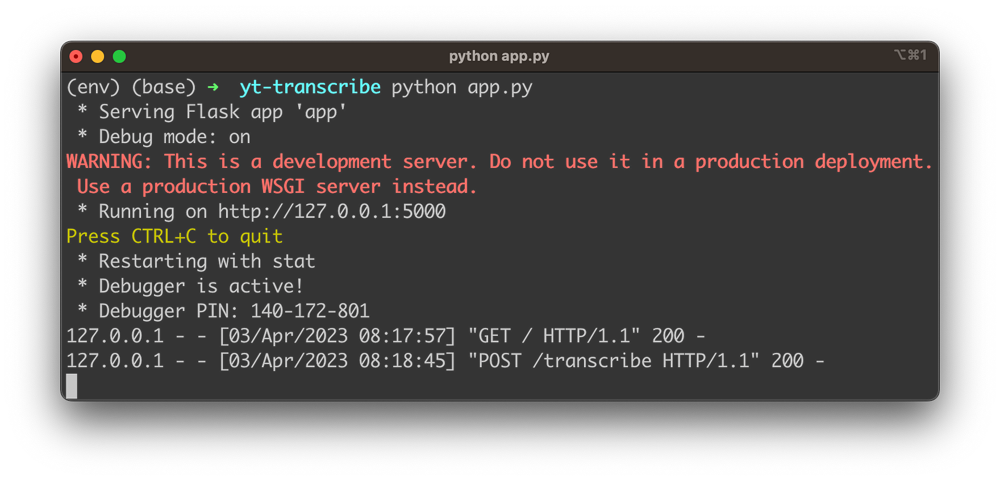
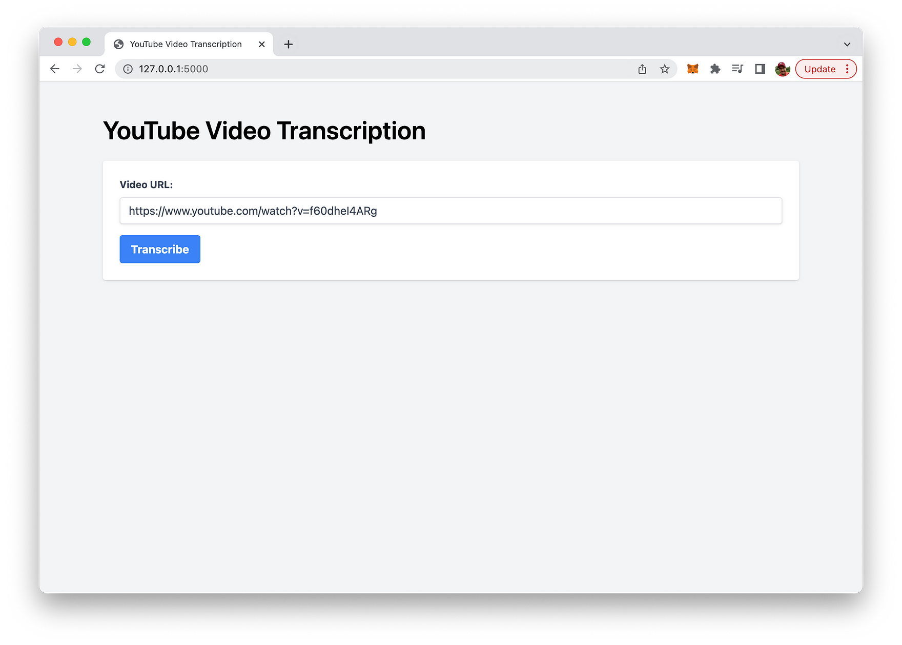

import { Image } from '@astrojs/image/components';
import YouTube from '~/components/widgets/YouTube.astro';
export const components = { img: Image };

In this blog post, we will introduce you to a powerful, user-friendly solution for transcribing YouTube videos: a Flask web app utilizing OpenAI's cutting-edge Whisper API for speech-to-text conversion. We'll walk you through the entire process, from setting up the app to integrating Pytube for downloading YouTube videos and OpenAI's Whisper API for transcription.

By the end of this post, you'll have a functional web application that allows users to transcribe YouTube videos with just a few clicks. So, let's dive in and explore the world of automated YouTube video transcription!

## What Are We Going To Build

The app created in this guide is a user-friendly web application that allows users to transcribe YouTube videos effortlessly. From a user's perspective, the app features a simple web interface styled with Tailwind CSS for a clean and modern design:



Upon visiting the web app, users are greeted with a form that prompts them to input the URL of the YouTube video they want to transcribe. After entering a valid YouTube URL and clicking the "Transcribe" button, the app processes the request by downloading the video's audio and transcribing it using OpenAI's Whisper API.

Once the transcription is complete, the resulting text is displayed below the form in a dedicated section, maintaining its original formatting with line breaks and wrapped text. Users can then read the transcription on the screen or copy it for further use.

The primary goal of this app is to provide an easy-to-use solution for transcribing YouTube videos, making the content more accessible and useful for a broader audience.

Let's get started building this app ...

## Creating A New Python Project With Virtual Environment

In order to start creating a new Python project start with creating a new project folder:

```bash
mkdir yt-transcribe
cd yt-transcribe
```

Next, create a new Python virtual environment:

```bash
python3 -m venv env
```

The command `python3 -m venv env` creates a new virtual environment named env using the Python 3 `venv` module.

Here's a breakdown of the command:

* `python3`: This specifies that the command should use Python 3 as the interpreter.
* `-m venv`: This flag indicates that the command should run the built-in venv module, which is used for creating virtual environments.
* `env`: This is the name of the virtual environment you want to create. In this case, the virtual environment will be named `env`.

A virtual environment is an isolated Python environment that allows you to install packages and dependencies specific to a particular project, without interfering with your system-wide Python installation or other projects. This isolation helps maintain consistency and avoid potential conflicts between different project requirements.

Once the virtual environment is created, you can activate it using the following command:

```bash
source env/bin/activate
```

With the virtual environment activated, we're ready to install the needed dependencies for our project by using the command:

```bash
pip install flask pytube openai
```

The command `pip install flask pytube openai` is used to install three Python packages using the package installer `pip`. These packages are:

1. `flask`: A lightweight web framework for Python that allows you to build web applications quickly and easily.
2. `pytube`: A Python library for downloading YouTube videos and extracting video metadata, such as title, description, and thumbnail images.
3. `openai`: The official Python library for interacting with the OpenAI API, which provides access to various AI models, including OpenAI's Whisper API for speech-to-text transcription.

When this command is executed, `pip` fetches the latest versions of these packages from the Python Package Index (PyPI) and installs them in the active Python environment. These libraries can then be imported and used in your Python code to build applications, such as the Flask app that downloads YouTube videos and transcribes their audio using OpenAI's Whisper API.

Let's create a basic project structure within the project folder:

```bash
mkdir templates
touch app.py
touch templates/index.html
```

The application logic for the Flask application need to be implemented in _app.py_. Insert the following code:

```python
import os
from flask import Flask, request, jsonify, render_template, redirect, url_for
from pytube import YouTube
import tempfile
import openai

# Set the OpenAI API key
openai.api_key = "[INSERT YOUR OPENAI API KEY HERE]"

app = Flask(__name__)

@app.route("/", methods=["GET"])
def index():
    return render_template("index.html")

@app.route("/transcribe", methods=["POST"])
def transcribe():
    video_url = request.form.get("video_url")

    if not video_url:
        return jsonify({"error": "Video URL is required."}), 400

    try:
        # Download YouTube video
        yt = YouTube(video_url)
        stream = yt.streams.filter(only_audio=True).first()

        # Save the video in a temporary file
        with tempfile.NamedTemporaryFile(suffix=".mp4", delete=False) as temp_file:
            temp_file_name = temp_file.name

        stream.download(output_path=os.path.dirname(temp_file_name), filename=os.path.basename(temp_file_name))

        # Transcribe the video using OpenAI's Whisper API
        with open(temp_file_name, "rb") as audio_file:
            transcript = openai.Audio.transcribe("whisper-1", audio_file)

        # Remove the temporary file after transcription
        os.remove(temp_file_name)

        return render_template("index.html", transcription=transcript["text"])

    except Exception as e:
        return jsonify({"error": str(e)}), 500

if __name__ == "__main__":
    app.run(debug=True)
```

So, let's go through this code step-by-step:

__1. Import required libraries:__

The code begins by importing the necessary libraries, including Flask, Pytube, and OpenAI.

```python
import os
from flask import Flask, request, jsonify, render_template, redirect, url_for
from pytube import YouTube
import tempfile
import openai
```

__2. Set OpenAI API key:__

Replace `[INSERT YOUR OPENAI API KEY HERE]` with your actual OpenAI API key to authenticate requests to the Whisper API.

```python
openai.api_key = "[INSERT YOUR OPENAI API KEY HERE]"
```

__3. Initialize the Flask app:__

Create a new Flask web application instance.

```python
app = Flask(__name__)
```

__4. Define the index route:__

This route handles GET requests to the root URL (“/”) and renders the `index.html` template.

```python
@app.route("/", methods=["GET"])
def index():
    return render_template("index.html")
```

__5. Define the transcribe route:__

This route handles POST requests to the “/transcribe” URL and contains the main logic for downloading and transcribing YouTube videos.

```python
@app.route("/transcribe", methods=["POST"])
def transcribe():
```

__6. Get the video URL:__

Retrieve the video URL submitted by the user through the form.

```python
video_url = request.form.get("video_url")
```

__7. Validate the video URL:__

Check if the video URL is provided. If not, return a JSON error message with a 400 Bad Request status code.

```python
 if not video_url:
        return jsonify({"error": "Video URL is required."}), 400
```

__8. Download and transcribe the video:__

Use a try-except block to handle any errors that may occur during the download and transcription process.

```python
    try:
```

__9. Download the YouTube video:__

Instantiate a `YouTube` object with the video URL, and filter the video streams to get the first audio-only stream.

```python
        yt = YouTube(video_url)
        stream = yt.streams.filter(only_audio=True).first()
```

__10. Save the video in a temporary file:__

Create a temporary file with a “.mp4” suffix and store its name for later use.

```python
        with tempfile.NamedTemporaryFile(suffix=".mp4", delete=False) as temp_file:
            temp_file_name = temp_file.name
```

__11. Download the video:__

Download the selected video stream to the temporary file.

```python
        stream.download(output_path=os.path.dirname(temp_file_name), filename=os.path.basename(temp_file_name))
```

__12. Transcribe the video using OpenAI’s Whisper API:__

Open the temporary file in binary mode and use the Whisper API to transcribe the video’s audio.

```python
        with open(temp_file_name, "rb") as audio_file:
            transcript = openai.Audio.transcribe("whisper-1", audio_file)
```

__13. Remove the temporary file after transcription:__

Delete the temporary file to free up storage space.

```python
        os.remove(temp_file_name)
```

__14. Display the transcription:__

Render the `index.html` template and pass the transcription text to be displayed on the webpage.

```python
        return render_template("index.html", transcription=transcript["text"])
```

__15. Handle errors:__

If an exception occurs during the download or transcription process, return a JSON error message with a 500 Internal Server Error status code.

```python
    except Exception as e:
        return jsonify({"error": str(e)}), 500
```

__16. Run the Flask app:__

Start the Flask web application with debug mode enabled.

```python
if __name__ == "__main__":
    app.run(debug=True)
```

The resulting Flask app enables users to transcribe YouTube videos by simply providing the video URL.

Next, let’s turn to the implementation of the HTML code which needs to be inserted into _templates/index.html_:

```html
<!DOCTYPE html>
<html lang="en">
  <head>
    <meta charset="UTF-8" />
    <meta name="viewport" content="width=device-width, initial-scale=1.0" />
    <title>YouTube Video Transcription</title>
    <script src="https://cdn.tailwindcss.com"></script>
    <style>
      .pre-wrap {
        white-space: pre-wrap;
      }
    </style>
  </head>
  <body class="bg-gray-100">
    <div class="container mx-auto px-4 py-12">
      <h1 class="text-4xl font-semibold mb-6">YouTube Video Transcription</h1>

      <div class="bg-white p-6 rounded shadow">
        <form action="/transcribe" method="post">
          <div class="mb-4">
            <label
              class="block text-gray-700 text-sm font-bold mb-2"
              for="video_url"
              >Video URL:</label
            >
            <input
              class="shadow appearance-none border rounded w-full py-2 px-3 text-gray-700 leading-tight focus:outline-none focus:shadow-outline"
              type="url"
              name="video_url"
              id="video_url"
              required
            />
          </div>
          <button
            class="bg-blue-500 hover:bg-blue-700 text-white font-bold py-2 px-4 rounded focus:outline-none focus:shadow-outline"
            type="submit"
          >
            Transcribe
          </button>
        </form>

        
        <div class="mt-8">
          <h2 class="text-2xl font-semibold mb-4">Transcription</h2>
          <pre class="bg-gray-100 p-4 rounded pre-wrap">
{{ transcription }}</pre
          >
        </div>
        
      </div>
    </div>
  </body>
</html>
```

This HTML code defines the structure and styling of a simple web page for a YouTube Video Transcription application. The web page is built using Tailwind CSS for styling and consists of the following key elements:

DOCTYPE declaration and opening `<html>` tag with the `lang` attribute set to "en" (English).

The `<head>` section contains:

* Meta tags for character encoding and viewport settings.
* The `<title>` element sets the page title to "YouTube Video Transcription".
* A `<script>` tag linking to the Tailwind CSS library.

A `<style>` block defining a custom CSS class called `.pre-wrap` to handle text wrapping for the transcription output.

The `<body>` section with a background color applied using the Tailwind CSS class `bg-gray-100`. Inside the body, there is:

* A container `<div>` with Tailwind CSS classes for centering and adding padding.
* An `<h1>` heading for the page title.
* A `<div>` element with a white background, padding, and rounded corners that contains the form and transcription output.

The form consists of:

* A `<label>` and an `<input>` element for the YouTube video URL.
* A submit button with Tailwind CSS classes for styling and interactivity.
* The form’s `action` attribute is set to "/transcribe" and the `method` attribute is set to "post" to submit the form data to the server for processing.

The transcription output section is conditionally rendered using Jinja2 template syntax ``.

* An `<h2>` heading for the transcription title.
* A `<pre>` element with Tailwind CSS classes and the custom `.pre-wrap` class to display the transcription text with proper formatting.

This web page allows users to input a YouTube video URL, submit the form, and view the transcribed text on the same page.

## Running The Web App

Finally we’re ready to run the Python web application by entering the following command:

```bash
python app.py
```

This is starting up the Flask development web server. You should be able to see the following output:



Once the development web server is up and running you’re ready to access the web app in the browser:


Here you can use the “Video URL” input field to input any YouTube video URL, as you can see in the following screenshot:



Hit button “Transcribe” to get the complete transcribed text for the video as a result:


## Conclusion

We have demonstrated how to build a Flask web app that harnesses the power of OpenAI’s Whisper API to transcribe YouTube videos with ease. Throughout this blog post, we covered essential aspects such as setting up the Flask app, integrating Pytube for downloading videos, and using OpenAI’s cutting-edge speech-to-text technology to generate transcriptions. With the added bonus of a user-friendly web interface styled with Tailwind CSS, this app offers a practical and efficient solution for transcribing YouTube content.

By providing transcriptions for videos, you can improve accessibility, enhance the user experience, and boost the discoverability of your content through better SEO. The implementation presented in this post is just the tip of the iceberg; you can further customize and expand this app to meet specific requirements or integrate it into larger projects. We hope this guide has inspired you to explore the incredible potential of automated transcription using OpenAI’s Whisper API and Flask. Happy transcribing!