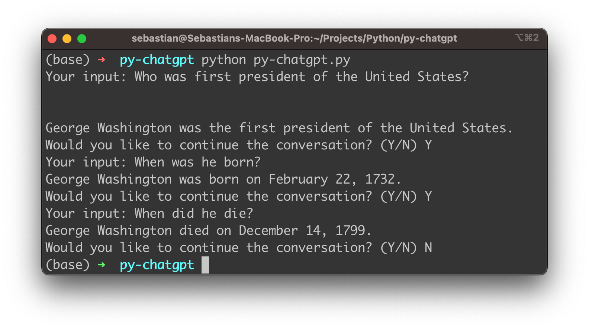

import { Image } from '@astrojs/image/components';
import YouTube from '~/components/widgets/YouTube.astro';
export const components = { img: Image };

Recently conversational AI has become increasingly prevalent, and it's easy to see why. With the ability to automate mundane tasks, provide customer support, and even generate creative content, conversational AI is rapidly transforming the way we interact with technology. One of the most powerful conversational AI tools available today is OpenAI's ChatGPT, a language model trained to respond to natural language queries with remarkably human-like answers.

In this blog post, we'll explore how to unleash the power of ChatGPT's new API through Python to create conversational apps that can chat with users, answer questions, and even generate creative output. With step-by-step instructions and plenty of examples, we'll show you how to get started with the ChatGPT API in Python. Whether you're a developer looking to create a chatbot for your business, a researcher exploring the frontiers of AI, or simply a curious enthusiast eager to explore the cutting edge of natural language processing, this post is for you. So let's dive in and start building powerful conversational agents with OpenAI's ChatGPT API & Python!

## Retrieve OpenAI API Key

In order to be able to make use of OpenAI's API from within a Python application we need to retrieve an API key first from the OpenAI dashboard.

To retrieve your OpenAI API key you need to create a user account at https://openai.com/ and access the API Keys section in the OpenAI dashboard to create a new API key.


This key is secret and must not shared with anybody else. We'll need to use this key later of when implementing the Python script to access OpenAI`s API.

## Setting Up The Python Project

Let's start setting up the Python project. Start creating a new project folder and inside this folder create a new file py-chatgpt.py:

```bash
$ mkdir py-chatgpt
$ cd py-chatgpt
$ touch py-chatgpt.py
```

Make sure to install or upgrade the openai python package:

```bash
$ pip install --upgrade openai
```

We'll make use of the openai package to access the ChatGPT API.

## Implement The Application Logic

Insert the following Python code into py-chatgpt.py:

```python
import openai

openai.api_key = "[INSERT YOU OPENAI API KEY HERE]"

history = []

while True:
    user_input = input("Your input: ")

    messages = []
    for input_text, completion_text in history:
        messages.append({"role": "user", "content": input_text})
        messages.append({"role": "assistant", "content": completion_text})

    messages.append({"role": "user", "content": user_input})

    completion = openai.ChatCompletion.create(
        model="gpt-3.5-turbo",
        messages=messages
    )

    completion_text = completion.choices[0].message.content
    print(completion_text)

    history.append((user_input, completion_text))

    user_input = input("Would you like to continue the conversation? (Y/N) ")
    if user_input.upper() == "N":
        break
    elif user_input.upper() != "Y":
        print("Invalid input. Please enter 'Y' or 'N'.")
        break
```

Here's a breakdown of the code:

* The first line imports the OpenAI library.
* The second line sets the OpenAI API key to a value that the user needs to insert (retrieved from the OpenAI dashboard, as described above)
* The `history` variable is initialized as an empty list. This list will be used to store the conversation history.
* The code then enters an infinite loop using the `while True` statement.
* The `input()` function prompts the user to enter their input, which is then stored in the `user_input` variable.
* The `messages` list is initialized as an empty list. It is used to store the messages exchanged between the user and the chatbot.
* A `for` loop is used to iterate through the conversation history stored in the `history` list. The loop appends each message to the messages list in the correct order, with user `messages` followed by chatbot responses.
* The user's latest message is then added to the `messages` list.
* The `openai.ChatCompletion.create()` method is called to generate a response from the chatbot. The method takes two arguments: the GPT-3 model to use (`"gpt-3.5-turbo"` in this case) and the list of messages exchanged so far (`messages`). The `gpt-3.5-turbo` model is the language model which is also used by ChatGPT.
* The response generated by the chatbot is stored in the `completion_text` variable.
* The chatbot's response is printed to the console using the `print()` function.
* The latest message exchanged between the user and chatbot is appended to the `history` list.
* The user is prompted to decide whether to continue or end the conversation using the `input()` function. The user's response is stored in the `user_input` variable.
* If the user inputs "N" (case insensitive), the `break` statement exits the loop and the program ends.
* If the user inputs anything other than "Y" or "N", an error message is printed and the `break` statement exits the loop and the program ends.

## Run the Application

You can run the Python script by using the python command followed by the name of the file:

```bash
$ python py-chatgpt.py
```

Now you're being ask to provide the first input. The response will be retrieved from ChatGPT's language model and provided as output:



After every response you're being asked if the conversation should be continued. If you want to continue you need to input "Y". You're then being asked to provide the next input.

As the gpt-3.5-turbo model is able to also take the history of the conversation into account you can ask subsequent questions which are based on the context of the conversation which has taken place so far.

## Conclusion

In conclusion, implementing a chatbot using OpenAI's new gpt-3.5-turbo language model is an excellent way to provide automated responses to users and enhance the user experience. By following the steps outlined in this blog post, you can easily create your own chatbot using Python and OpenAI's API. By customizing the GPT model used and tuning the script to fit your specific use case, you can create a chatbot that can communicate with users in a natural and engaging way. With the power of OpenAI and the versatility of Python, the possibilities for creating chatbots are endless. So why not give it a try and create your own chatbot today!