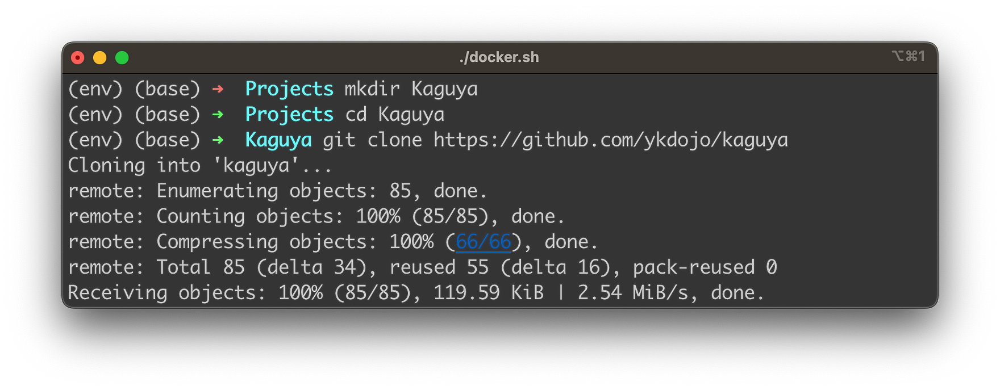
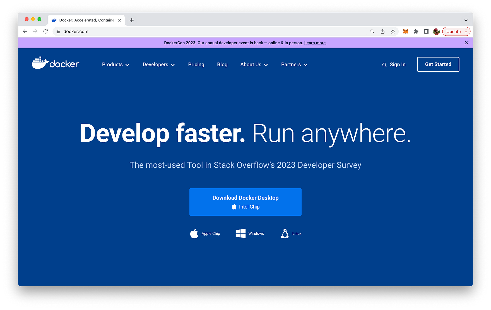

import { Image } from '@astrojs/image/components';
import YouTube from '~/components/widgets/YouTube.astro';
export const components = { img: Image };

What if I told you that an artificial intelligence could effectively assist with your coding endeavors, helping you be more productive and efficient? Not just any regular AI assistant, but one that understands your instructions in natural language, decides which folders to open, which files to scrutinize, how to modify them, and even runs any bash, JS, or Python command. Ladies and Gentlemen, let’s introduce you to the absolute game-changer in the coding world — The ChatGPT-Plugin Kaguya!

Recently, I came across an intriguing comment from a user that grabbed my attention. It read: “This is honestly a game-changer. I’ve built the most powerful local coding assistant currently on the market.” This statement was nothing short of a technological cliffhanger, stirring up an irresistible urge to uncover the innovation behind it. The force behind this statement was none other than Kaguya, a groundbreaking coding assistant that has completely transformed the landscape of coding.

## Unmasking Kaguya

Hailing from the creative chambers of YK Dojo’s Github, Kaguya is a sophisticated AI-powered local coding assistant that has revolutionized the way coders interact with their work environment. Named after the legendary moon princess from Japanese folklore, Kaguya makes the seemingly complex coding world as beautiful and effortless as moonlight.

For the uninitiated, Kaguya is an AI model designed to simplify coding by understanding natural language instructions and implementing them precisely. Imagine having a personal assistant who not only understands your coding challenges but also knows exactly which files to modify, folders to open, and commands to run. That’s Kaguya for you!

## Kaguya’s Superpower — Natural Language Processing

The real magic behind Kaguya’s prowess lies in its robust Natural Language Processing (NLP) capabilities. At its core, NLP is all about enabling machines to understand and respond to human language. And Kaguya has certainly taken this to another level!

One of the user testimonies that really underscored this was the demo showing Kaguya improving itself using natural language instructions. Just pause and reflect on that for a moment. A tool designed to assist with coding is capable of enhancing its own capabilities when fed instructions in plain, everyday language. If that’s not a quantum leap in the world of coding assistants, I don’t know what is!

## Bridging the Gap Between Human Intention and Machine Action

What makes Kaguya stand out from the crowd is its uncanny ability to bridge the gap between human intention and machine action. This essentially means that Kaguya does not just parse code, but it comprehends the coder’s intent and takes the necessary steps to bring it to life.

A simple instruction like “Kaguya, modify the function in line 10 of script.js to return a string instead of an integer” is all it takes for Kaguya to swing into action, locate the appropriate file and line, and carry out the modification. And it doesn’t stop at that. Kaguya is capable of running bash, JS, or Python commands, effectively becoming your coding right hand.

## The Game-Changer in Coding

To wrap it up, Kaguya is not just a tool; it’s a paradigm shift in coding practices. It brings to the table a new era of simplicity and productivity. And given its ability to upgrade itself through natural language instructions, Kaguya is, without a doubt, the powerful local coding assistant currently on the market, just as our user testimony highlighted.

As I continue to explore the capabilities of Kaguya, I am more convinced than ever that we are on the precipice of a coding revolution.

## Let’s Get Started

In order to get started with Kaguya you need to clone the GitHub repo first by entering:

```bash
git clone https://gitcom.com/ykdojo/kaguya
```

You should then be able to see the following output on the command line:



Next change into folder _kaguya_ and start the server process:

```bash
cd kaguya
./docker.sh
```

This requires that you have installed the Docker environment on your system. In case you've not installed Docker yet, you can go to https://docker.com and follow the instructions for installation:



Once the local Kaguya server is running you can open ChatGPT and include the Kaguya plugin. Therefore you need to open the Plugin store popup windows first:


Then you need to click on the link "Develop your own plugin". This takes you to the following view:


In the Domain input field you need to enter the address of the local Kaguya server which is exposing the necessary plugin endpoints: localhost:3000.

Click on button Find manifest file. ChatGPT confirms that a plugin manifest file was found. By clicking on Install localhost plugin you're ready to active the plugin in your ChatGPT instance.


The Kaguya plugin becomes is ready for selection:


## Kaguya Plugin In Action

Now that you've installed Kaguya successfully you're ready to test it out and interact with your local code base. Take a look at the following tweet to see a comprehensive example of how to use the plugin:

https://twitter.com/ykdojo/status/1670848611532562433

## Conclusion

As I conclude this blog post, I can't help but marvel at the massive strides we've taken in the coding world. From laborious hand-coding, error-prone debugging to now the dawn of Kaguya. It's indeed a fascinating journey, to say the least!

With the Kaguya plugin for ChatGPT, coding ceases to be a mundane, complicated chore and transforms into an engaging, productive, and highly efficient activity. Remember, the key to unlocking Kaguya's power lies in your natural language. Communicate your coding instructions as you would in an everyday conversation, and let Kaguya decode the complexity behind it.

Installation is a breeze, and incorporating Kaguya into your ChatGPT environment is even simpler. Don't forget, Kaguya is more than just an AI tool. It's a silent revolution, a paradigm shift in the way we perceive and interact with code.

As we stand on the brink of this coding revolution, it's not hard to envisage a future where AI doesn't just assist us but collaborates with us, understands our intentions, and takes precise actions to bring our creative visions to life.

So, my fellow coders and tech enthusiasts, it's time to welcome Kaguya into our coding journey. Whether you're a seasoned professional or a coding novice, embrace Kaguya and experience the joy of coding like never before. I assure you, the era of Kaguya is the game-changer we've all been waiting for. Ready to make the quantum leap?

Happy coding with Kaguya, everyone!

