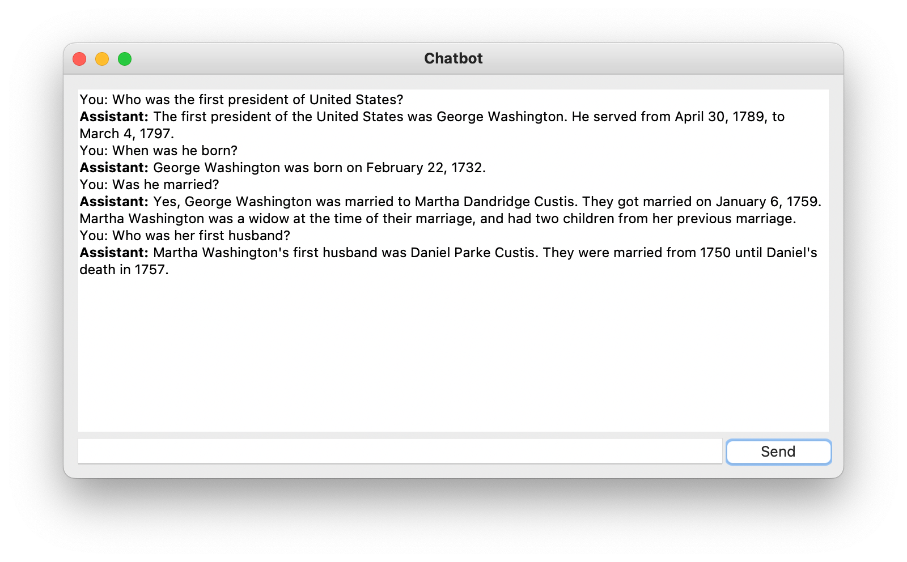

import { Image } from '@astrojs/image/components';
import YouTube from '~/components/widgets/YouTube.astro';
export const components = { img: Image };

In today's fast-paced digital world, businesses and individuals alike are constantly looking for innovative ways to enhance user experience and streamline communication. Enter the realm of AI-powered chatbots, revolutionizing the way we interact with technology. With the cutting-edge GPT-4 model at your disposal, creating your own Python desktop chatbot application has never been easier or more effective. In this comprehensive guide, we'll walk you through the entire process, from setting up the GPT-4 API to building a seamless user interface using the popular tkinter library.

## Creating A New Python Project With Virtual Environment

In order to start creating a new Python project start with creating a new project folder:

```bash
mkdir chatbot-gpt4
cd chatbot-gpt4
```

Next, create a new Python virtual environment:

```bash
python3 -m venv env
```

The command `python3 -m venv env` creates a new virtual environment named `env` using the Python 3 `venv` module.

Here's a breakdown of the command:

* `python3`: This specifies that the command should use Python 3 as the interpreter.
* `-m venv`: This flag indicates that the command should run the built-in venv module, which is used for creating virtual environments.
* `env`: This is the name of the virtual environment you want to create. In this case, the virtual environment will be named `env`.

A virtual environment is an isolated Python environment that allows you to install packages and dependencies specific to a particular project, without interfering with your system-wide Python installation or other projects. This isolation helps maintain consistency and avoid potential conflicts between different project requirements.

Once the virtual environment is created, you can activate it using the following command:

```bash
source env/bin/activate
```

## Implement The Python Chatbot

Now let's create a new empty Python file which we'll use to implement the chatbot application:

```bash
touch chatbot.py
```

__Step 1: Import Required Libraries__

Begin by importing the necessary libraries for our chatbot application. We'll need the `os`, `openai`, `tkinter`, and `tkinter.ttk` libraries to create the user interface and interact with the GPT-4 API.

```python
import os
import openai
import tkinter as tk
from tkinter import ttk
```

__Step 2: Set up the OpenAI API Key__

Next, set up your OpenAI API key by retrieving it from your environment variables. Replace your_api_key_here with your actual API key.

```
openai.api_key = os.getenv("OPENAI_API_KEY")
```

__Step 3: Define the `send_message()` Function__

Create a function called `send_message()` that will be called when the user clicks the "Send" button. This function will handle sending the user's message to the GPT-4 API and displaying the assistant's response.

```python
def send_message():
    # ... (code will be described in the next steps)
```

__Step 4: Get User Input and Update the Conversation__

Inside the `send_message()` function, retrieve the user's input, display it in the conversation text box, and then clear the input field.

```python
message = user_input.get()
conversation.insert(tk.END, "You: " + message + "\n")
user_input.delete(0, tk.END
```

__Step 5: Send the User Input to GPT-4 API and Get the Assistant's Response__

Still within the `send_message()` function, call the GPT-4 API with the user's message and the context of the conversation so far. The context is maintained by appending previous user inputs and assistant responses to the `messages` array.

```python
response = openai.ChatCompletion.create(
    model="gpt-4",
    messages=[
        {"role": "system", "content": "You are a helpful assistant."},
        *previous_messages,
        {"role": "user", "content": message},
    ]
)

assistant_response = response.choices[0].message["content"]
```

__Step 6: Display the Assistant's Response in the Conversation__

Insert the assistant's response into the conversation text box, ensuring that the assistant's messages are displayed in bold.

```python
conversation.insert(tk.END, "Assistant: ", "bold")
conversation.insert(tk.END, assistant_response + "\n")
```

__Step 7: Update the Conversation History__

Update the list of previous messages with the user's input and the assistant's response.

```python
previous_messages.extend([
    {"role": "user", "content": message},
    {"role": "assistant", "content": assistant_response},
])
```

__Step 8: Set up the User Interface with tkinter__

Now, it's time to create the user interface for our chatbot application using the tkinter library. First, initialize the main window and set its title.

```python
root = tk.Tk()
root.title("Chatbot")
```

__Step 9: Create a Frame for the Chatbot Interface__

Add a frame to the main window that will hold the conversation text box, user input field, and send button. Apply padding to the frame for better visual appearance.

```python
frame = ttk.Frame(root, padding="10")
frame.grid(row=0, column=0, sticky=(tk.W, tk.E, tk.N, tk.S))
```

__Step 10: Set up the Conversation Text Box__

Create a text box for displaying the conversation, configure the text widget to display the assistant's messages in bold, and set the font size to 12.

```python
conversation = tk.Text(frame, wrap=tk.WORD, width=75, height=20, font=("TkDefaultFont", 12))
conversation.tag_configure("bold", font=("TkDefaultFont", 12, "bold"))
conversation.grid(row=0, column=0, columnspan=2, sticky=(tk.W, tk.E, tk.N, tk.S))
```

__Step 11: Add the User Input Field__

Create an input field for the user to enter their messages, and set the font size to 12.

```python
user_input = ttk.Entry(frame, width=70, font=("TkDefaultFont", 12))
user_input.grid(row=1, column=0, sticky=(tk.W, tk.E, tk.N, tk.S))
```

__Step 12: Create the Send Button__

Add a "Send" button to the frame, which will call the `send_message()` function when clicked.

```python
send_button = ttk.Button(frame, text="Send", command=send_message)
send_button.grid(row=1, column=1, sticky=(tk.W, tk.E, tk.N, tk.S))
```

__Step 13: Initialize the Conversation History__

Initialize an empty list called previous_messages that will store the conversation history.

```python
previous_messages = []
```

__Step 14: Run the Chatbot Application__

Finally, start the main event loop of the chatbot application.

```python
root.mainloop()
```

__Complete Code__

Finally take a look at the complete code which is now available in chatbot.py:

```python
import os
import openai
import tkinter as tk
from tkinter import ttk

openai.api_key = os.getenv("OPENAI_API_KEY")

def send_message():
    message = user_input.get()
    conversation.insert(tk.END, "You: " + message + "\n")
    user_input.delete(0, tk.END)

    response = openai.ChatCompletion.create(
        model="gpt-4",
        messages=[
            {"role": "system", "content": "You are a helpful assistant."},
            *previous_messages,
            {"role": "user", "content": message},
        ]
    )

    assistant_response = response.choices[0].message["content"]
    conversation.insert(tk.END, "Assistant: ", "bold")
    conversation.insert(tk.END, assistant_response + "\n")

    previous_messages.extend([
        {"role": "user", "content": message},
        {"role": "assistant", "content": assistant_response},
    ])

root = tk.Tk()
root.title("Chatbot")

frame = ttk.Frame(root, padding="10")
frame.grid(row=0, column=0, sticky=(tk.W, tk.E, tk.N, tk.S))

conversation = tk.Text(frame, wrap=tk.WORD, width=75, height=20, font=("TkDefaultFont", 12))
conversation.tag_configure("bold", font=("TkDefaultFont", 12, "bold"))
conversation.grid(row=0, column=0, columnspan=2, sticky=(tk.W, tk.E, tk.N, tk.S))

user_input = ttk.Entry(frame, width=70, font=("TkDefaultFont", 12))
user_input.grid(row=1, column=0, sticky=(tk.W, tk.E, tk.N, tk.S))

send_button = ttk.Button(frame, text="Send", command=send_message)
send_button.grid(row=1, column=1, sticky=(tk.W, tk.E, tk.N, tk.S))

previous_messages = []

root.mainloop()
```

## Run The Chatbot Application

Now, that everything is implement we're ready to start the Python desktop application. First you need to set the Open AI API key as an environment variable:

```
export OPENAI_API_KEY=your_api_key_here
```

To retrieve your OpenAI API key, follow these steps:

__Step 1: Sign up or log in to your OpenAI account__

* Visit the OpenAI website (https://www.openai.com/) and sign up for an account if you don't have one already. If you already have an account, log in.

__Step 2: Access the API key__

* After logging in, navigate to the API section (https://platform.openai.com/signup) or click on your profile icon in the top right corner, and select "API keys" from the dropdown menu.

__Step 3: Locate and copy the API key__

* On the API keys page, you will see a table with your API keys. Find the key you want to use (usually labeled as "Secret key") and click on the "Show" button to reveal the key. Copy the key to your clipboard.

With the OpenAI API key set, you can now start the Python chatbot application by using the following command:

```bash
python chatbot.py
```

The application is then launched in a new desktop window:



Using the text input field at the bottom you can type in messages, questions, or instructions which you can send to the GPT-4 model by clicking on button "Send". Once a response is received the text is displayed as a response from "Assistant".

Please also note, that this chatbot is context aware, which means that the information from the conversation before is taking into consideration when generating the next response.

## Conclusion

The power of AI-driven chatbots is truly reshaping the landscape of communication and user engagement. By following this comprehensive guide, you've successfully embarked on your journey into the world of AI and developed a Python desktop chatbot application leveraging the remarkable capabilities of GPT-4. As you continue to refine and enhance your chatbot, remember that the possibilities are endless, and the potential impact on your business or personal projects is immense. By staying abreast of advancements in AI and chatbot technology, you'll be well-equipped to adapt and thrive in an ever-evolving digital landscape.