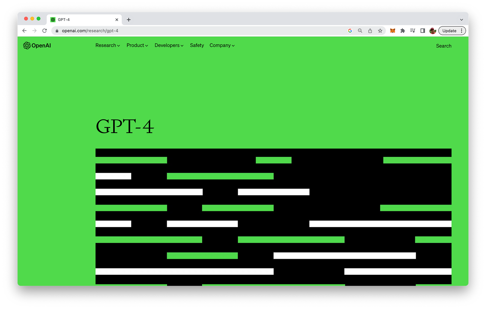
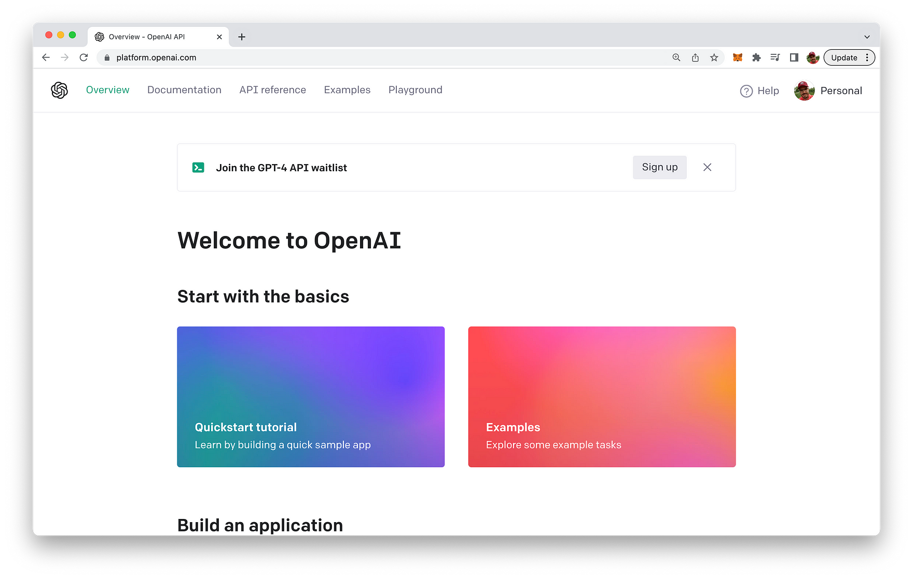
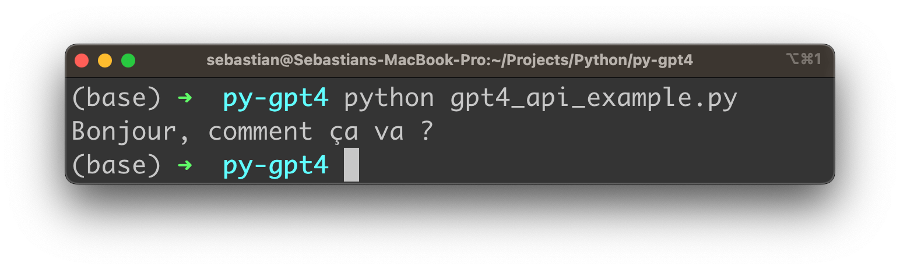

import { Image } from '@astrojs/image/components';
import YouTube from '~/components/widgets/YouTube.astro';
export const components = { img: Image };

Welcome to the world of artificial intelligence and natural language processing! As you venture into this exciting realm, you'll quickly realize the immense potential that AI holds for revolutionizing the way we interact with text-based data. In this blog post, we'll introduce you to GPT-4, OpenAI's latest and most powerful natural language processing model, and guide you through the basics of harnessing its capabilities using the API.

From generating human-like text and summarizing lengthy documents to translating languages and offering conversational assistance, GPT-4 is a game-changer in the world of AI. With a beginner-friendly approach, this guide will help you unlock the full potential of GPT-4, even if you have little or no experience in AI development.

So, are you ready to embark on a fascinating journey that will transform the way you work with text? Let's dive in and explore the power of GPT-4 together!

## Overview of GPT-4 and Its Capabilities

GPT-4, or Generative Pre-trained Transformer 4, is the latest iteration of OpenAI's state-of-the-art natural language processing (NLP) model. Building on the success of its predecessors, GPT-4 takes NLP to new heights by leveraging a massive amount of data and more sophisticated training techniques. The result is a highly advanced AI model capable of generating human-like text and understanding context, making it ideal for a wide range of applications.



The release announcement of GPT-4 is available at https://openai.com/research/gpt-4

Some of the most notable capabilities of GPT-4 include:
1. __Text Generation__: GPT-4 can generate coherent and contextually relevant text, making it suitable for content creation, story generation, and even writing code.
2. __Text Summarization__: The model can condense lengthy articles or documents into concise summaries, saving users time and making information more accessible.
3. __Translation__: GPT-4 is skilled at translating text between multiple languages, facilitating communication and breaking down language barriers.
4. __Sentiment Analysis__: The model can effectively determine the sentiment of a given text, whether positive, negative, or neutral, which can be useful for market research and customer feedback analysis.
5. __Question Answering__: GPT-4 can understand and answer questions based on provided context, enabling users to gain insights and information quickly.
6. __Conversational AI__: The model excels at engaging in human-like conversations, which can be employed in chatbots, virtual assistants, and customer support automation.

These capabilities, along with many others, make GPT-4 an incredibly powerful and versatile tool for businesses, researchers, and developers. By harnessing the power of the GPT-4 API, you can unlock the potential of this cutting-edge AI technology and revolutionize the way you work with text-based data.

## Getting Started with the GPT-4 API

__Note on GPT-4 API Beta Access:__

*Important Remark: Please be aware that the GPT-4 API and the corresponding gpt-4 model are currently in beta. To gain access, you need to sign up for the waiting list. To do so, visit the OpenAI dashboard at https://platform.openai.com/ and navigate to the "Join the GPT-4 API waitlist" section. Click the "Sign Up" button and follow the instructions to join the waiting list. Once you've been granted access, you'll be able to use the GPT-4 API as demonstrated in this blog post. Please note that access to the API and its features might be subject to change as it remains in beta.*



Accessing the GPT-4 API requires you to sign-up for the waitlist first

Before you can harness the power of GPT-4, you'll need to set up your environment and gain access to the API. In this section, we'll walk you through the steps required to get started with the GPT-4 API.

__1. Creating an account and obtaining API keys:__

To access the GPT-4 API, you'll need to create an account with OpenAI. Visit the OpenAI website (https://www.openai.com/) and sign up for a new account. Once you've successfully registered, log in to your account and navigate to the API section. Here, you'll find your API key, which is required to make requests to the GPT-4 API. Keep this key secure, as it's unique to your account and should not be shared with others.

__2. Setting up your development environment:__

Before you can start making API calls, you'll need to set up your development environment. You can use any programming language that supports making HTTP requests, such as Python, JavaScript, or Ruby. For this guide, we'll assume you're using Python.

First, ensure that you have Python installed on your system. If you don't already have it, you can download the latest version from the Python website (https://www.python.org/downloads/).

Next, create a new directory for your GPT-4 API project and navigate to it in your terminal or command prompt. We recommend using a virtual environment to keep your project dependencies organized. To create a virtual environment, run the following command:

```bash
$ python -m venv my_gpt4_project
```

Activate the virtual environment by running the appropriate command for your operating system:

* Windows

```bash
$ my_gpt4_project\Scripts\activate
```

* macOS/Linux

```bash
source my_gpt4_project/bin/activate
```

__3. Installing required libraries and dependencies:__

Now that your development environment is set up, you'll need to install some libraries to interact with the GPT-4 API. For Python, we'll use the popular `requests` library to make HTTP requests.

Install the `requests` library by running the following command:

```bash
$ pip install requests
```

With your account, development environment, and dependencies in place, you're now ready to start making API calls and unlock the power of GPT-4! In the next section, we'll dive into the API endpoints, methods, and how to customize your API calls.

## Understanding the API Endpoints and Methods

The GPT-4 API endpoint allows you to interact with the GPT-4 model and utilize its capabilities for various tasks.

__1. GPT-4 API endpoint:__ 

The GPT-4 API has a primary endpoint for interacting with the model:

```
https://api.openai.com/v1/chat/completions
```

This endpoint is used to send chat messages to the GPT-4 model and receive generated responses. You can use this endpoint to create chat completions, providing an interactive experience with the model.

__2. Customizing API calls with parameters:__

To control the behavior of the GPT-4 model and tailor its output to your needs, you can use various parameters in your API calls. Some of the key parameters include:

* `model`: The ID of the GPT-4 model to use (e.g., "gpt-4").
* `messages`: An array of messages in chat format, consisting of message objects with 'role' (either "system", "user", or "assistant") and 'content' (the content of the message).
* `temperature`: Controls the randomness of the generated text (default: 1). Higher values make the output more random, while lower values make it more focused and deterministic.
* `top_p`: An alternative to sampling with temperature, called nucleus sampling. The model considers the tokens with the top_p probability mass (default: 1).
* `n`: The number of chat completion choices to generate for each input message (default: 1).
* `stream`: If set to true, partial message deltas will be sent, like in ChatGPT (default: false).
* `stop`: Up to 4 sequences where the API will stop generating further tokens (default: null).
* `max_tokens`: The maximum number of tokens to generate in the chat completion (default: inf).
* `presence_penalty`: A number between -2.0 and 2.0. Positive values penalize new tokens based on whether they appear in the text so far (default: 0).
* `frequency_penalty`: A number between -2.0 and 2.0. Positive values penalize new tokens based on their existing frequency in the text so far (default: 0).
* `logit_bias`: A JSON object that maps tokens (specified by their token ID in the tokenizer) to an associated bias value from -100 to 100 (default: null).
* `user`: A unique identifier representing your end-user, which can help OpenAI monitor and detect abuse.

By customizing these parameters, you can control the GPT-4 model's behavior and generate text that meets your specific requirements. In the following sections, we'll discuss how to craft effective prompts, fine-tune the model, and explore practical applications of the GPT-4 API.

## Making API Calls to GPT-4 Using Python

Now that you have your development environment set up and are familiar with the GPT-4 API endpoint and parameters, let's explore how to make API calls using Python. In this section, we'll demonstrate a practical example of interacting with the GPT-4 API to generate chat completions.

__1. Import the necessary libraries:__

Start by importing the required libraries, including requests for making API calls and json for handling JSON data:

```python
import requests
import json
```

__2. Define your API key and endpoint:__

Specify your API key and the GPT-4 API endpoint. Replace `<YOUR_API_KEY>` with your actual API key:

```python
API_KEY = "<YOUR_API_KEY>"
API_ENDPOINT = "https://api.openai.com/v1/chat/completions"
```

__3. Create a function to interact with the GPT-4 API:__

Define a function, generate_chat_completion, that takes a list of messages and optional parameters as input and returns the generated chat completion:

```python
def generate_chat_completion(messages, model="gpt-4", temperature=1, max_tokens=None):
    headers = {
        "Content-Type": "application/json",
        "Authorization": f"Bearer {API_KEY}",
    }

    data = {
        "model": model,
        "messages": messages,
        "temperature": temperature,
    }

    if max_tokens is not None:
        data["max_tokens"] = max_tokens

    response = requests.post(API_ENDPOINT, headers=headers, data=json.dumps(data))

    if response.status_code == 200:
        return response.json()["choices"][0]["message"]["content"]
    else:
        raise Exception(f"Error {response.status_code}: {response.text}")
```

__4. Interact with the GPT-4 API:__

Provide a list of messages in the chat format, with each message having a 'role' (either "system", "user", or "assistant") and 'content' (the content of the message). The 'system' message is optional, but it can help set the behavior of the assistant:

```python
messages = [
    {"role": "system", "content": "You are a helpful assistant."},
    {"role": "user", "content": "Translate the following English text to French: 'Hello, how are you?'"}
]

response_text = generate_chat_completion(messages)
print(response_text)
```

The `generate_chat_completion` function will send the messages to the GPT-4 API and return the assistant's response. In this example, the response will be a French translation of the English text provided.

By modifying the list of messages and customizing the optional parameters, you can interact with the GPT-4 API for a wide range of applications, such as generating text, answering questions, or engaging in interactive conversations.

Here is the complete Python code listing:

```python
import requests
import json

API_KEY = "<YOUR_API_KEY>"
API_ENDPOINT = "https://api.openai.com/v1/chat/completions"

def generate_chat_completion(messages, model="gpt-4", temperature=1, max_tokens=None):
    headers = {
        "Content-Type": "application/json",
        "Authorization": f"Bearer {API_KEY}",
    }

    data = {
        "model": model,
        "messages": messages,
        "temperature": temperature,
    }

    if max_tokens is not None:
        data["max_tokens"] = max_tokens

    response = requests.post(API_ENDPOINT, headers=headers, data=json.dumps(data))

    if response.status_code == 200:
        return response.json()["choices"][0]["message"]["content"]
    else:
        raise Exception(f"Error {response.status_code}: {response.text}")

messages = [
    {"role": "system", "content": "You are a helpful assistant."},
    {"role": "user", "content": "Translate the following English text to French: 'Hello, how are you?'"}
]

response_text = generate_chat_completion(messages)
print(response_text)
```

Don't forget to replace `<YOUR_API_KEY>` with your actual API key. This code example demonstrates how to interact with the GPT-4 API using Python, sending a list of messages to the API and receiving the assistant's response.

In oder to run this Python script create a new file with a `.py` extension, for example, `gpt4_api_example.py`.

Open a terminal (or command prompt on Windows) and navigate to the directory where you saved the `gpt4_api_example.py` file. Run the script using the following command:

```python
$ python gpt4_api_example.py
```

The script will interact with the GPT-4 API, send the messages to the API, and receive the assistant's response. The response will be printed in the terminal.



Keep in mind that running the script will consume API tokens, which may be limited depending on your API key's access plan.

## Conclusion

As we've explored throughout this beginner's guide, unlocking the power of GPT-4 is easier than ever with the OpenAI API. By following the steps outlined in this post, you've set up your development environment, become familiar with the API endpoints and methods, and learned how to interact with the GPT-4 model using Python. With this foundation, the possibilities are virtually limitless.

GPT-4's capabilities can be harnessed to revolutionize various domains, including natural language processing, content generation, translation, summarization, and more. As you gain experience working with the GPT-4 API, you can further customize the parameters to fine-tune the model's behavior and tailor its output to your specific requirements.

We hope this beginner's guide has empowered you to start exploring the vast potential of GPT-4 and its API. By integrating this advanced language model into your projects and applications, you can unlock new opportunities and drive innovation. Embrace the power of GPT-4 and get ready to elevate your work to the next level!