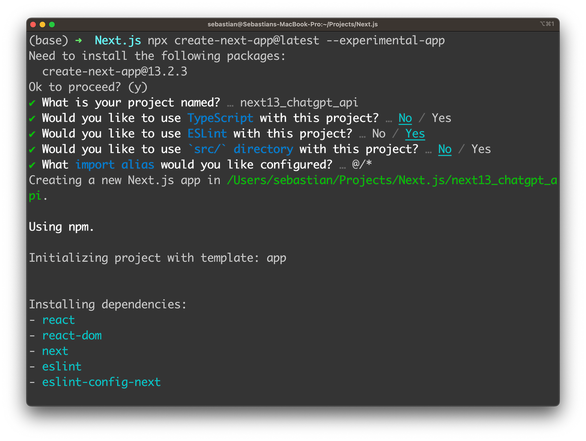
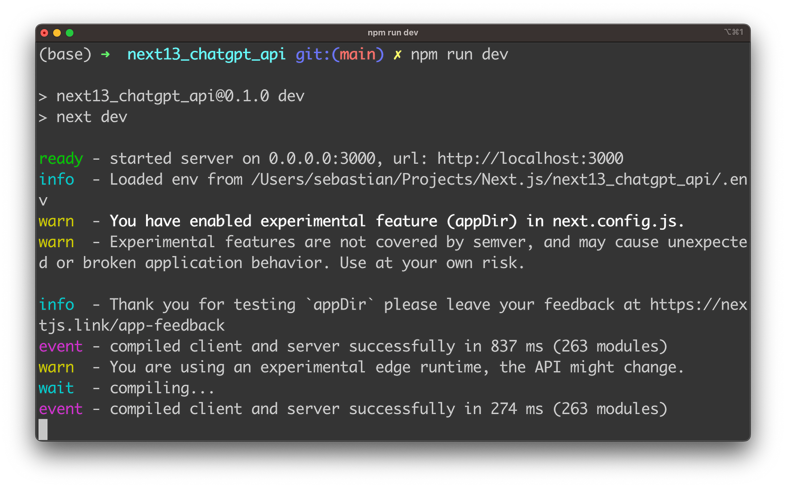
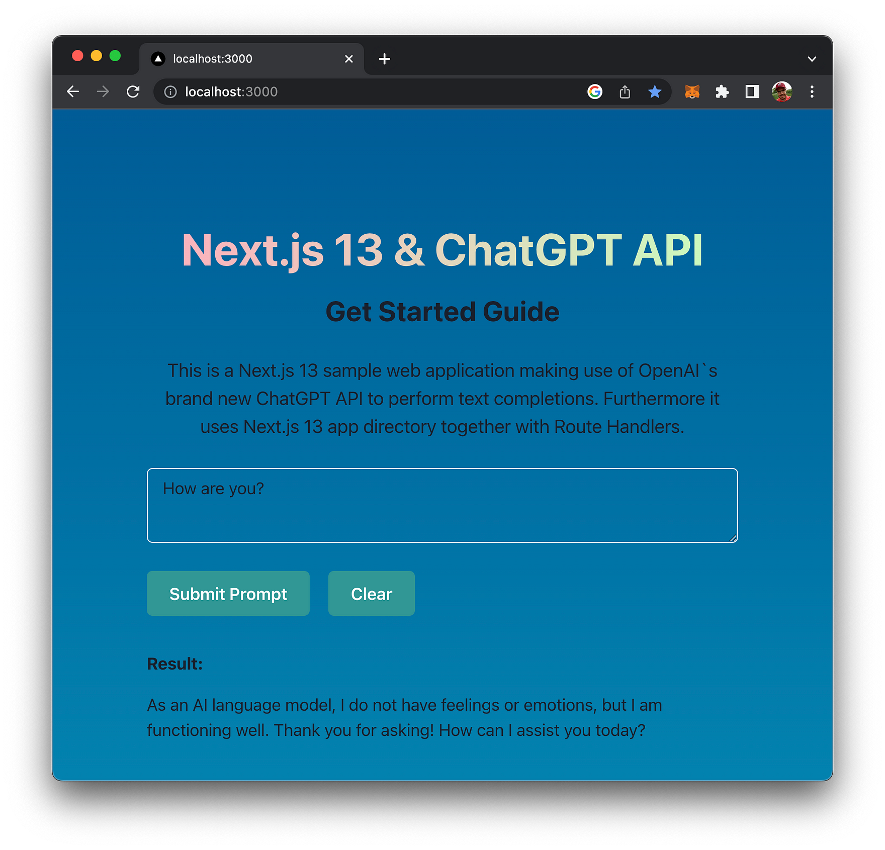

import { Image } from '@astrojs/image/components';
import YouTube from '~/components/widgets/YouTube.astro';
export const components = { img: Image };

Artificial intelligence has become a driving force in the technology industry, enabling machines to learn and perform tasks that were previously thought to be exclusive to human beings. OpenAI, a leading AI research organization, has been at the forefront of this revolution, developing powerful models that can process natural language and generate human-like text. One of these models is the ChatGPT API, which can generate coherent and contextually relevant responses to text inputs.

For developers using Next.js, a popular React framework for building web applications, integrating the ChatGPT API can unlock new possibilities for conversational AI. In this guide, we'll explore the power of the ChatGPT API and show you how to use it with Next.js to build smarter and more engaging chatbots. Whether you're an experienced developer or just getting started with Next.js, this guide will provide you with the knowledge and tools you need to take your conversational AI to the next level. So let's get started and unlock the full potential of the ChatGPT API by building a full web app with ChatGPT's API integration from start to finish.

## Retrieve OpenAI API Key

In order to be able to make use of OpenAI's API from within our Next.js application we need to retrieve an API key first from the OpenAI dashboard.

To retrieve your OpenAI API key you need to create a user account at https://openai.com/ and access the API Keys section in the OpenAI dashboard to create a new API key.


This key is secret and must not shared with anybody else. We'll need to use this key later of when implementing the Python script to access OpenAI`s API.

## Setting Up The Next.js 13 Project

Next, we need to create a new Next.js 13 project to get started with the implementation. Use the following command:

```bash
$ npx create-next-app@latest --experimental-app
```

The _experimental-app_ flag specifies that we want to use the new app folder structure in our Next.js project.

In order to complete the creation process of the project you need to answer a few questions on the command line:



Finally, you can change into the newly created project folder by entering:

```bash
$ cd next13_chatgpt_api
```

As we want to use Chakra UI for the user interface of our web application we need to install some more dependencies:

```bash
$ npm i @chakra-ui/react @emotion/react @emotion/styled framer-motion @chakra-ui/next-js
```

Once the Chakra UI dependencies have been installed successfully we need to activate the use of Chakra UI in our application by opening file app/layout.js and embed the application's pages into CacheProvider and ChakraProvider component like you can see in the following listing:

```js
'use client'

import { CacheProvider } from "@chakra-ui/next-js";
import { ChakraProvider } from "@chakra-ui/react";

export default function RootLayout({ children }) {
  return (
    <html lang="en">
      <head />
      <body>
        <CacheProvider>
          <ChakraProvider>{children}</ChakraProvider>
        </CacheProvider>
      </body>
    </html>
  );
}
```

## Implement Route Handler

Next, add a new empty file _route.js_ in the new folder _app/api/chat_ and insert the following code for the API route implementation by using the new Next.js Route Handler standard:

```js
export const runtime = "experimental-edge";

if (!process.env.NEXT_PUBLIC_OPENAI_API_KEY) {
  throw new Error("Missing OpenAI API Key");
}

export async function POST(request) {
  try {
    const { prompt } = await request.json();

    const response = await fetch("https://api.openai.com/v1/chat/completions", {
      method: "POST",
      headers: {
        "Content-Type": "application/json",
        Authorization: `Bearer ${process.env.NEXT_PUBLIC_OPENAI_API_KEY}`,
      },
      body: JSON.stringify({
        model: "gpt-3.5-turbo",
        messages: [{ role: "user", content: prompt }],
        temperature: 0.7,
        top_p: 1,
        frequency_penalty: 0,
        presence_penalty: 0,
        max_tokens: 200,
        stream: false,
        n: 1,
      }),
    });

    const json = await response.json();
    return new Response(json.choices[0].message.content);
  } catch (e) {
    return new Response("Request cannot be processed!", {
      status: 400,
    });
  }
```

This code defines the Next.js 13 API route `/api/chat` that responds to HTTP POST requests and is used to access ChatGPT API functionality from our front-end.

The first few lines of the implementation check for the presence of the environment variable `NEXT_PUBLIC_OPENAI_API_KEY`. If this variable is not set, it throws an error indicating that the OpenAI API key is missing.

If the key is present, the code proceeds to handle the incoming POST request. It expects a JSON object containing a single field `prompt`, which contains the user's input.
The code then makes a request to the OpenAI ChatGPT API at the `https://api.openai.com/v1/chat/completions` endpoint, passing in the prompt received from the user. The request is made with the `POST` method and includes a JSON payload containing various parameters such as the name of the model to use, the temperature, the maximum number of tokens to generate, and so on. The OpenAI API key is also included as an Authorization header.

If the request is successful, the API returns a JSON response containing a field `choices`, which is an array of possible responses generated by the OpenAI's ChatGPT API. The API returns the first response from the array as plain text.

If there is an error while processing the request, the API returns a 400 status code with a plain text error message indicating that the request cannot be processed.

## Implement The Front-End With Chakra UI

In the next step we're ready to move on and implement the front-end part of the Next.js web application by opening up file app/page.js. First, clean up and remove the existing code from that file and start by adding the following implementation of _Home_ component:

```js
'use client'
import { useState } from "react";
import { Heading, Text, Box, Flex, Button, Textarea } from "@chakra-ui/react";

export default function Home() {
  let [prompt, setPrompt] = useState("");
  let [isLoading, setIsLoading] = useState(false);
  let [result, setResult] = useState("");

  return (
    // Insert UI Code Here
  );
}
```

_Home_ is the main Next.js page component of our web app.

The component imports the `useState` hook and various UI components from the Chakra UI library.

The `export default` statement defines a default export for the component. The function body defines three state variables using the `useState` hook: `prompt`, `isLoading`, and `result`.

* `prompt` is initially an empty string and is intended to hold the user's input.
  
* `isLoading` is initially false and is intended to keep track of whether the app is currently processing a request.
  
* `result` is initially an empty string and is intended to hold the response from the request made to ChatGPT's API.

In order to implement the UI of our web application add the following JSX code (which is making use of Chakra's UI components) into the return statement:

```html
    <Flex
      width={"100vw"}
      height={"100vh"}
      alignContent={"center"}
      justifyContent={"center"}
      bgGradient="linear(to-b, #005C97, #0083B0)"
    >
      <Box maxW="2xl" m="0 auto" p="20px">
        <Heading
          as="h1"
          textAlign="center"
          fontSize="5xl"
          mt="100px"
          bgGradient="linear(to-l, #C9FFBF, #FFAFBD)"
          bgClip="text"
        >
          Next.js 13 & ChatGPT API
        </Heading>
        <Heading as="h2" textAlign="center" fontSize="3xl" mt="20px">
          Get Started Guide
        </Heading>
        <Text fontSize="xl" textAlign="center" mt="30px">
          This is a Next.js 13 sample web application making use of OpenAI`s
          brand new ChatGPT API to perform text completions. Furthermore it uses
          Next.js 13 app directory together with Route Handlers.
        </Text>
        <Textarea
          value={prompt}
          onChange={handlePromptChange}
          placeholder="Insert your prompt here ..."
          mt="30px"
          size="lg"
        />
        <Button
          isLoading={isLoading}
          loadingText="Loading..."
          colorScheme="teal"
          size="lg"
          mt="30px"
          onClick={handleSubmitPromptBtnClicked}
        >
          Submit Prompt
        </Button>
        <Button
          colorScheme="teal"
          size="lg"
          mt="30px"
          ml="20px"
          onClick={handleClearBtnClicked}
        >
          Clear
        </Button>
        {result != "" && (
          <Box maxW="2xl" m="0 auto">
            <Heading as="h5" textAlign="left" fontSize="lg" mt="40px">
              Result:
            </Heading>
            <Text fontSize="lg" textAlign="left" mt="20px">
              {result}
            </Text>
          </Box>
        )}
      </Box>
    </Flex>
```

This JSX code defines a UI component using Chakra UI library components.

The component is a `Flex` container with full viewport width and height, centered content and a background gradient.

Within the `Flex` container, there is a `Box` component with a maximum width of `2xl` and horizontal margins of `0 auto` to center it within the parent container.

Inside the `Box`, there are `Heading`, `Text`, `Textarea` and `Button` components that display the following UI elements:

* A large heading displaying the title of the web application
* A smaller heading for the subtitle of the web application
* A text element displaying a description of the application
* A `Textarea` component for user input
* A button for submitting the input
* A button for clearing the input
* A `Box` component that displays the result of the text completion process (only if the `result` state variable is not empty).

The UI code uses various Chakra UI props to control the appearance and layout of the components, including `maxW`, `m`, `p`, `mt`, `bgGradient`, `bgClip`, `colorScheme`, and `size`.

Overall, this JSX code defines the UI structure and styling for the Next.js web application that leverages the OpenAI ChatGPT API to perform text completions.

## Implement Event Handlers

To further complete the implementation in page.js we need to add the respective event handler functions. Let's start with the following:

```js
const handlePromptChange = (e) => {
    setPrompt(e.target.value);
};
```

This code defines an event handler function `handlePromptChange` which is triggered when the user changes the input in the corresponding input field. The function receives an `event` object as an argument, which represents the user's interaction with the input field.

The function uses the `setPrompt` function, which is defined using the `useState` hook, to update the state of the `prompt` variable with the new value of the input field `e.target.value` retrieves the current value of the input field and assigns it to the `prompt` state variable using the setPrompt function.

In summary, whenever the user types into the input field, the `handlePromptChange` function is called and it sets the `prompt` state to the value of the input field, causing the component to re-render with the updated `prompt` state value.

Next, let's add the implementation for event handler function `handleClearBtnClicked`:

```js
  const handleClearBtnClicked = () => {
    setPrompt("");
    setResult("");
  };
```

The `handleClearBtnClicked` function is an event handler that is triggered when the user clicks on a clear button. This function resets the state variables `prompt` and `result` to their initial empty string values, effectively clearing any previous input or output data from the UI.

In the function body, the `setPrompt("")` statement updates the `prompt` state variable with an empty string, effectively clearing the input field. The `setResult("")` statement similarly updates the `result` state variable with an empty string, clearing any previous results that may have been displayed.

Finally, let's add `handleSubmitPromptBtnClicked()`:

```js
    const handleSubmitPromptBtnClicked = () => {
    setIsLoading(true);
    fetch("/api/chat", {
      method: "POST",
      headers: {
        "Content-Type": "application/json",
      },
      body: JSON.stringify({
        prompt: prompt,
      }),
    })
      .then((res) => res.text())
      .then((text) => {
        setResult(text);
        setIsLoading(false);
      });
  };
```

The above code defines an event handler function `handleSubmitPromptBtnClicked()` that is called when a submit button is clicked. The function does the following:

1. Sets the `isLoading` state to `true` to indicate that a request is being made.
2. Calls the `fetch` function to make a POST request to the `/api/chat` endpoint with a JSON payload that includes the current value of `prompt`.
3. Once the response is received, it is converted to text using the `text()` method.
4. The resulting text is then set as the `result` state variable.
5. Finally, the `isLoading` state is set back to `false` to indicate that the request has been completed.

In the following listing you can see the complete code of _Home_ component again:

```js
'use client'
import { useState } from "react";
import { Heading, Text, Box, Flex, Button, Textarea } from "@chakra-ui/react";

export default function Home() {
  let [prompt, setPrompt] = useState("");
  let [isLoading, setIsLoading] = useState(false);
  let [result, setResult] = useState("");

  const handlePromptChange = (e) => {
    setPrompt(e.target.value);
  };

  const handleSubmitPromptBtnClicked = () => {
    setIsLoading(true);
    fetch("/api/chat", {
      method: "POST",
      headers: {
        "Content-Type": "application/json",
      },
      body: JSON.stringify({
        prompt: prompt,
      }),
    })
      .then((res) => res.text())
      .then((text) => {
        setResult(text);
        setIsLoading(false);
      });
  };

  const handleClearBtnClicked = () => {
    setPrompt("");
    setResult("");
  };

  return (
    <Flex
      width={"100vw"}
      height={"100vh"}
      alignContent={"center"}
      justifyContent={"center"}
      bgGradient="linear(to-b, #005C97, #0083B0)"
    >
      <Box maxW="2xl" m="0 auto" p="20px">
        <Heading
          as="h1"
          textAlign="center"
          fontSize="5xl"
          mt="100px"
          bgGradient="linear(to-l, #C9FFBF, #FFAFBD)"
          bgClip="text"
        >
          Next.js 13 & ChatGPT API
        </Heading>
        <Heading as="h2" textAlign="center" fontSize="3xl" mt="20px">
          Get Started Guide
        </Heading>
        <Text fontSize="xl" textAlign="center" mt="30px">
          This is a Next.js 13 sample web application making use of OpenAI`s
          brand new ChatGPT API to perform text completions. Furthermore it uses
          Next.js 13 app directory together with Route Handlers.
        </Text>
        <Textarea
          value={prompt}
          onChange={handlePromptChange}
          placeholder="Insert your prompt here ..."
          mt="30px"
          size="lg"
        />
        <Button
          isLoading={isLoading}
          loadingText="Loading..."
          colorScheme="teal"
          size="lg"
          mt="30px"
          onClick={handleSubmitPromptBtnClicked}
        >
          Submit Prompt
        </Button>
        <Button
          colorScheme="teal"
          size="lg"
          mt="30px"
          ml="20px"
          onClick={handleClearBtnClicked}
        >
          Clear
        </Button>
        {result != "" && (
          <Box maxW="2xl" m="0 auto">
            <Heading as="h5" textAlign="left" fontSize="lg" mt="40px">
              Result:
            </Heading>
            <Text fontSize="lg" textAlign="left" mt="20px">
              {result}
            </Text>
          </Box>
        )}
      </Box>
    </Flex>
  );
}
```

## Start The Development Web Server

It's time to start the Next.js development web server and check the result by typing in the following command:

```bash
$ npm run dev
```

The server is starting up and making our application available on port 3000:



You can now access the application in the browser. The result can be seen in the following screenshot:



The text input field is used to input your request to ChatGPT's API. The request is submitted by clicking on button "Submit Prompt". Once the answer from the API is available the Result area with the text response becomes visible.

Congratulation, your first Next.js 13 web application is successfully making use of OpenAI new ChatGPT API.

## Conclusion

OpenAI's ChatGPT API is a game-changing technology that can help developers create more human-like and engaging chatbots. By integrating this powerful API with Next.js, developers can unlock new possibilities for conversational AI, enabling their applications to respond contextually and intelligently to user input.

In this guide, we've explored the key features of the ChatGPT API and provided step-by-step instructions for integrating it with Next.js. We've also discussed best practices and tips for using this technology to create more effective AI-powered web applications.

We hope this guide has been informative and useful to you, and we encourage you to continue exploring the potential of AI in your own development work. Thank you for reading, and happy coding!