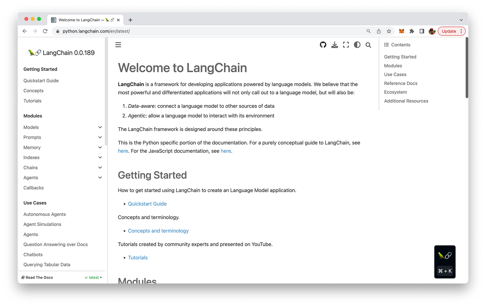

import { Image } from '@astrojs/image/components';
import YouTube from '~/components/widgets/YouTube.astro';
export const components = { img: Image };

Hello, fellow tech enthusiasts! Today, I'm thrilled to introduce you to a fascinating concept in the LangChain framework - Prompt Templates. If you're into language models and love Python, you're in for a treat. Let's dive in!

## What is LangChain?

Let's dive into the world of LangChain, a framework that has been a game-changer in my journey as a developer. LangChain is a unique tool that leverages the power of Large Language Models (LLMs) to build applications for a variety of use cases. This brainchild of Harrison Chase first saw the light of day as an open-source project in October 2022. Since then, it has been a shining star in the GitHub universe with a whopping 42,000 stars and contributions from over 800 developers.

LangChain is like a maestro conducting an orchestra of LLM models such as OpenAI and HuggingFace Hub, and external sources like Google, Wikipedia, Notion, and Wolfram. It provides a set of abstractions (chains and agents) and tools (prompt templates, memory, document loaders, output parsers) that act as a bridge between text input and output. These models and components are linked into a pipeline "chain," making it a breeze for developers like me to rapidly prototype robust applications. In essence, LangChain is the conductor of the LLM symphony.

The true strength of LangChain lies in its seven key modules:

1. Models: These are the closed or open-source LLMs that form the backbone of the applications.
2. Prompts: These are the templates that accept user input and output parsers that format the output from the LLM models.
3. Indexes: This module prepares and structures the data so that LLM models can interact with them effectively.
4. Memory: This gives chains or agents the capacity for short-term and long-term memory, enabling them to remember previous interactions with the user.
5. Chains: This is a way to combine several components or other chains in a single pipeline (or "chain").
6. Agents: These decide on a course of action to take with the available tools/data based on the input.
7. Callbacks: These are functions that are triggered to perform at specific points during the duration of an LLM run.

The LangChain project can be found at https://python.langchain.com/:



## What is a Prompt Template?

In the world of language models, a prompt is a piece of text that instructs the model to generate a specific type of response. A prompt template, as the name suggests, is a reproducible way to generate such prompts. It's essentially a text string that can take in a set of parameters from the end user and generate a prompt accordingly.

A prompt template can contain instructions for the language model, a set of few-shot examples to guide the model's response, and a question for the model. Here's a simple example:

```python
from langchain import PromptTemplate

template = """
I want you to act as a naming consultant for new companies.
What is a good name for a company that makes {product}?
"""

prompt = PromptTemplate(
 input_variables=["product"],
 template=template,
)

prompt.format(product="colorful socks")
```

In this example, the prompt template is asking the language model to suggest a name for a company that makes a specific product. The product is a variable that can be replaced with any product name.

## Creating a Prompt Template

Creating a prompt template in LangChain is a breeze. You can create simple hardcoded prompts using the `PromptTemplate` class. These templates can take any number of input variables and can be formatted to generate a prompt. Here's how you can create a prompt template with no input variables, one input variable, and multiple input variables:

```python
from langchain import PromptTemplate

# No Input Variable
no_input_prompt = PromptTemplate(input_variables=[], template="Tell me a joke.")
print(no_input_prompt.format())  

# One Input Variable
one_input_prompt = PromptTemplate(input_variables=["adjective"], template="Tell me a {adjective} joke.")
print(one_input_prompt.format(adjective="funny"))  

# Multiple Input Variables
multiple_input_prompt = PromptTemplate(
 input_variables=["adjective", "content"], 
 template="Tell me a {adjective} joke about {content}."
)
print(multiple_input_prompt.format(adjective="funny", content="chickens"))
```

## Conclusion

In conclusion, prompt templates in LangChain are a powerful tool for generating dynamic prompts for languagemodels. They offer flexibility and control over the prompts, allowing you to guide the model's responses effectively. Whether you're creating a language model for a specific task or exploring the capabilities of language models, prompt templates can be a game-changer. Happy coding!


