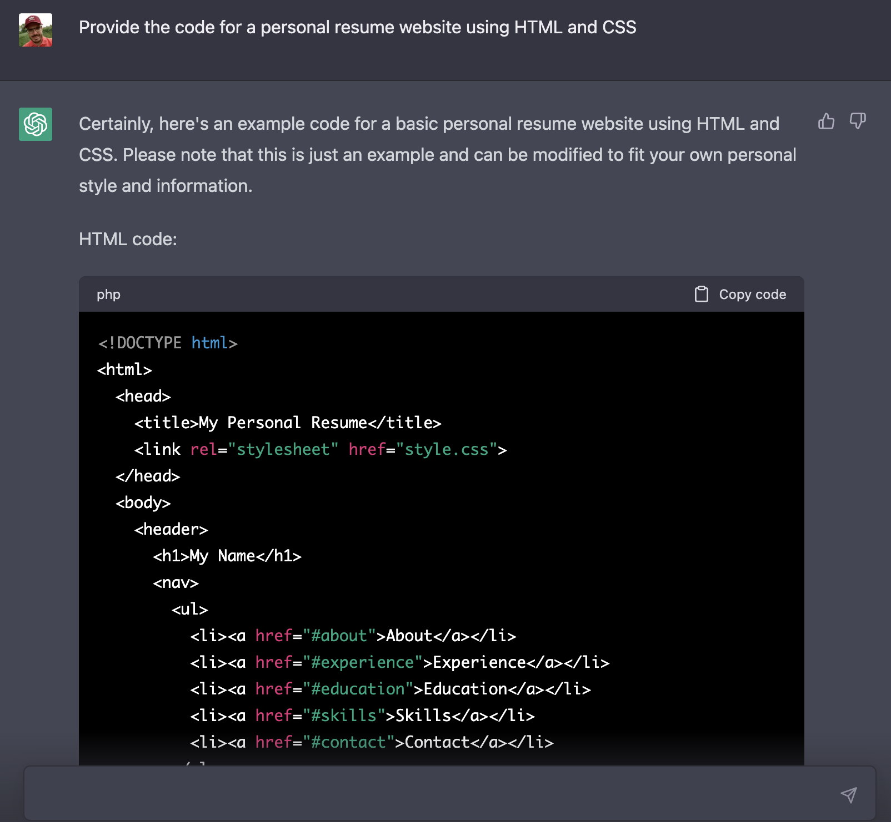
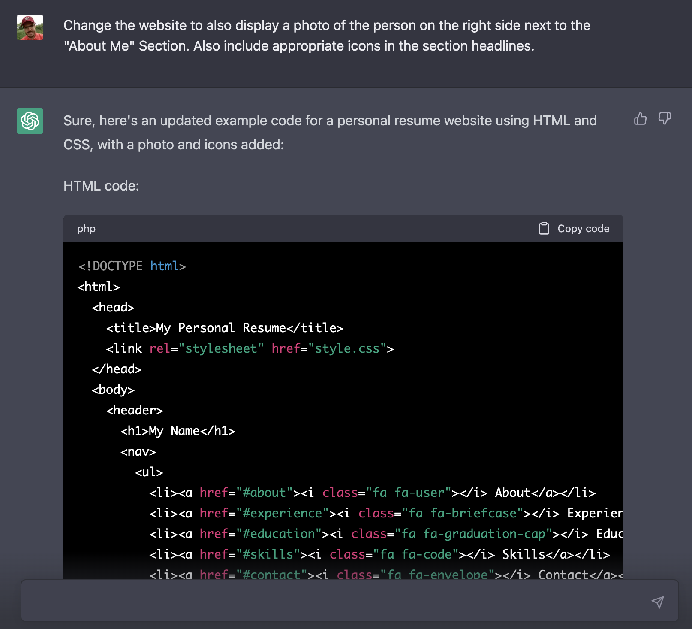
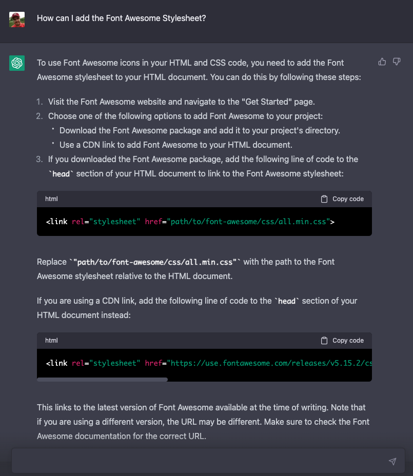
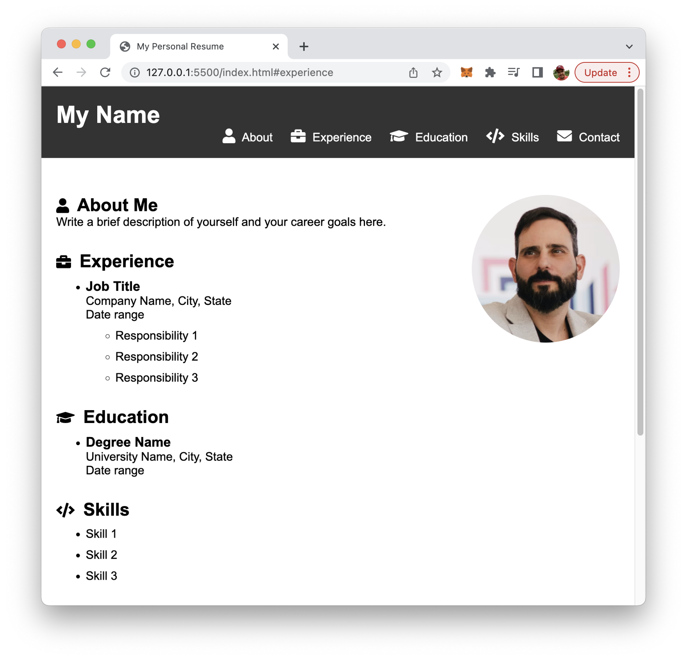
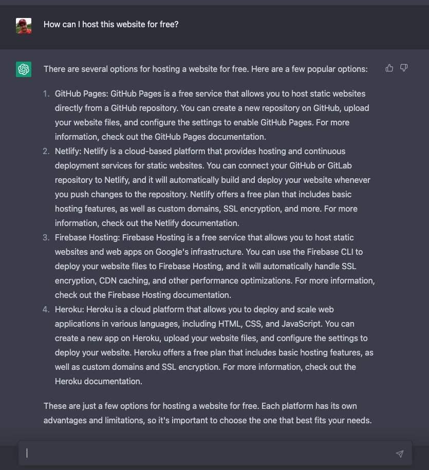

import { Image } from '@astrojs/image/components';
import YouTube from '~/components/widgets/YouTube.astro';
export const components = { img: Image }; 

In this blog post, we'll show you how to use ChatGPT, a powerful language model, to create a personal resume website in just 5 minutes. We'll also show you how to host your website for free with the help of ChatGPT!

In today's digital age, having a strong online presence is crucial, especially when it comes to finding a new job. One of the best ways to showcase your skills and experience is by creating a personal resume website. However, building a website from scratch can be time-consuming and overwhelming, especially if you don't have experience in web development. That's where ChatGPT comes in. In this blog post, we'll show you how to use ChatGPT, a powerful language model, to create a personal resume website in just 5 minutes. Not only that, but we'll also show you how to host your website for free using GitHub Pages. With ChatGPT, you can create a professional-looking website that highlights your achievements and sets you apart from other job applicants. So, let's get started!

## Get Started With ChatGPT

ChatGPT is based on a large language model created by OpenAI. I was trained on a massive amount of text data and use deep learning algorithms to generate human-like responses to natural language queries. I can help with a wide range of tasks, from answering questions and providing recommendations to generating creative writing and much more. It can also direct code. We'll use this feature in the next step when asking ChapGPT to generate code for a resume website.

Let's go to https://chat.openai.com/chat sign up for a free account and get started putting in the first prompt: "Provide the code for a personal resume website using HTML and CSS":



As you can see ChatGPT is generating a complete response providing us with HTML and CSS code for a simple but effective personal resume website.

Here is the complete HTML code which is generated by ChatGPT:

```html
<!DOCTYPE html>
<html>
  <head>
    <title>My Personal Resume</title>
    <link rel="stylesheet" href="style.css">
  </head>
  <body>
    <header>
      <h1>My Name</h1>
      <nav>
        <ul>
          <li><a href="#about">About</a></li>
          <li><a href="#experience">Experience</a></li>
          <li><a href="#education">Education</a></li>
          <li><a href="#skills">Skills</a></li>
          <li><a href="#contact">Contact</a></li>
        </ul>
      </nav>
    </header>
    
    <main>
      <section id="about">
        <h2>About Me</h2>
        <p>Write a brief description of yourself and your career goals here.</p>
      </section>
      
      <section id="experience">
        <h2>Experience</h2>
        <ul>
          <li>
            <h3>Job Title</h3>
            <p>Company Name, City, State</p>
            <p>Date range</p>
            <ul>
              <li>Responsibility 1</li>
              <li>Responsibility 2</li>
              <li>Responsibility 3</li>
            </ul>
          </li>
        </ul>
      </section>
      
      <section id="education">
        <h2>Education</h2>
        <ul>
          <li>
            <h3>Degree Name</h3>
            <p>University Name, City, State</p>
            <p>Date range</p>
          </li>
        </ul>
      </section>
      
      <section id="skills">
        <h2>Skills</h2>
        <ul>
          <li>Skill 1</li>
          <li>Skill 2</li>
          <li>Skill 3</li>
        </ul>
      </section>
      
      <section id="contact">
        <h2>Contact Me</h2>
        <form>
          <label for="name">Name:</label>
          <input type="text" id="name" name="name">
          <label for="email">Email:</label>
          <input type="email" id="email" name="email">
          <label for="message">Message:</label>
          <textarea id="message" name="message"></textarea>
          <input type="submit" value="Submit">
        </form>
      </section>
    </main>
  </body>
</html>
```

And the corresponding CSS code:

```css
body {
  font-family: Arial, sans-serif;
  margin: 0;
}

header {
  background-color: #333;
  color: #fff;
  padding: 20px;
}

header h1 {
  margin: 0;
}

nav {
  float: right;
}

nav ul {
  list-style: none;
  margin: 0;
  padding: 0;
}

nav li {
  display: inline-block;
  margin-left: 20px;
}

nav a {
  color: #fff;
  text-decoration: none;
}

nav a:hover {
  text-decoration: underline;
}

main {
  padding: 20px;
}

section {
  margin-bottom: 20px;
}

section h2 {
  margin-top: 0;
}

ul {
  list-style: none;
  margin: 0;
  padding: 0;
}

li {
  margin-bottom: 10px;
}

form {
  margin-top: 20px;
}

label {
  display: block;
  margin-bottom: 5px;
}

input[type="text"],
input[type="email"],
textarea {
  width: 100%;
  padding: 10px;
  margin-bottom: 10px;
  border: 1px solid #ccc;
  border-radius: 4px;
  box-sizing: border-box;
}

input[type="submit"] {
  background-color: #333;
  color: #fff;
  border: none;
  padding: 10px 20px;
  border-radius: 4px;
  cursor: pointer;
}

input[type="submit"]:hover {
  background-color: #444;
}
```

In order to see the result of this website code in the browser, create a new project folder and two new files:

```bash
$ mkdir resume-website
$ cd resume-website
$ touch index.html
$ touch style.css
```

Then copy and paste the HTML code from ChatGPT's response into index.html. Copy and paste the CSS code into style.css.

If you then open index.html in the browser you should be able to see the following result:


That's already quite nice - a complete personal resume website generated by ChatGPT without having to write a single line of code.

Let's see if we can take it one step further and ask ChatGPT to make some modifications. Let's ask to include a photo next to the "About Me" section and add some icons to the headlines for the various sections:



Again, ChatGPT is providing you with the complete HTML and CSS code. You just need to copy and paste this code again into index.html and style.css.

Here is the HTML code which goes into index.html:

```html
<!DOCTYPE html>
<html>
  <head>
    <title>My Personal Resume</title>
    <link rel="stylesheet" href="style.css">
  </head>
  <body>
    <header>
      <h1>My Name</h1>
      <nav>
        <ul>
          <li><a href="#about"><i class="fa fa-user"></i> About</a></li>
          <li><a href="#experience"><i class="fa fa-briefcase"></i> Experience</a></li>
          <li><a href="#education"><i class="fa fa-graduation-cap"></i> Education</a></li>
          <li><a href="#skills"><i class="fa fa-code"></i> Skills</a></li>
          <li><a href="#contact"><i class="fa fa-envelope"></i> Contact</a></li>
        </ul>
      </nav>
    </header>
    
    <main>
      <section id="about">
        
        <div>
          <h2><i class="fa fa-user"></i> About Me</h2>
          <p>Write a brief description of yourself and your career goals here.</p>
        </div>
      </section>
      
      <section id="experience">
        <h2><i class="fa fa-briefcase"></i> Experience</h2>
        <ul>
          <li>
            <h3>Job Title</h3>
            <p>Company Name, City, State</p>
            <p>Date range</p>
            <ul>
              <li>Responsibility 1</li>
              <li>Responsibility 2</li>
              <li>Responsibility 3</li>
            </ul>
          </li>
        </ul>
      </section>
      
      <section id="education">
        <h2><i class="fa fa-graduation-cap"></i> Education</h2>
        <ul>
          <li>
            <h3>Degree Name</h3>
            <p>University Name, City, State</p>
            <p>Date range</p>
          </li>
        </ul>
      </section>
      
      <section id="skills">
        <h2><i class="fa fa-code"></i> Skills</h2>
        <ul>
          <li>Skill 1</li>
          <li>Skill 2</li>
          <li>Skill 3</li>
        </ul>
      </section>
      
      <section id="contact">
        <h2><i class="fa fa-envelope"></i> Contact Me</h2>
        <form>
          <label for="name">Name:</label>
          <input type="text" id="name" name="name">
          <label for="email">Email:</label>
          <input type="email" id="email" name="email">
          <label for="message">Message:</label>
          <textarea id="message" name="message"></textarea>
          <input type="submit" value="Submit">
        </form>
      </section>
    </main>
  </body>
</html>
```

And here is the CSS code which goes into style.css:

```css
body {
  font-family: Arial, sans-serif;
  margin: 0;
}

header {
  background-color: #333;
  color: #fff;
  padding: 20px;
}

header h1 {
font-size: 32px;
margin: 0;
}

nav {
display: inline-block;
float: right;
}

nav ul {
margin: 0;
padding: 0;
}

nav li {
display: inline-block;
margin-left: 20px;
}

nav a {
color: #fff;
text-decoration: none;
}

nav a:hover {
color: #ccc;
}

main {
max-width: 800px;
margin: 0 auto;
padding: 20px;
}

section {
margin-top: 30px;
}

section h2 {
font-size: 24px;
margin: 0;
}

section ul {
margin: 10px 0;
}

section li {
margin-bottom: 10px;
}

section h3 {
font-size: 18px;
margin: 0;
}

section p {
margin: 0;
}

section img {
display: block;
float: right;
margin-left: 20px;
border-radius: 50%;
width: 200px;
height: 200px;
}

form {
margin-top: 20px;
}

label {
display: block;
margin-bottom: 5px;
}

input[type="text"],
input[type="email"],
textarea {
width: 100%;
padding: 10px;
margin-bottom: 10px;
border: 1px solid #ccc;
border-radius: 4px;
box-sizing: border-box;
}

input[type="submit"] {
background-color: #333;
color: #fff;
border: none;
padding: 10px 20px;
border-radius: 4px;
cursor: pointer;
}

input[type="submit"]:hover {
background-color: #444;
}

.fa {
display: inline-block;
font-size: 20px;
margin-right: 5px;
}

.fa-user:before {
content: "\f007";
}

.fa-briefcase:before {
content: "\f0b1";
}

.fa-graduation-cap:before {
content: "\f19d";
}

.fa-code:before {
content: "\f121";
}

.fa-envelope:before {
content: "\f0e0";
}
```

Furthermore ChatGPT is giving you further instructions:

_Note that you will need to provide your own photo (in the `img` tag) and Font Awesome stylesheet (in the `head` section) for this code to work properly._

So let's add an image file to the project folder with file name my-photo.jpg first.

Second we need to make sure to include the Font Awesome stylesheet in the code. Let's ask ChatGPT again to provide us with further instructions on this point:



Let's simply use the CGN link option to include the Font Awesome stylesheet. Copy the corresponding link element from ChatGPT's answer and insert it into the head section in file index.html.

If we now check again the result in the browser you should be able to see something similar to:



Great! That's a great personal resume website. The only task which is left is to fill out the details for the sections of the resume.

## Hosting The Resume Website For Free

Once the personal resume website is filled out with the respective content of course it needs to be made available on the internet. The great thing is that there are free hosting options available. To get a first overview let's ask ChatGPT to provide us with free hosting options:



Awesome! So let's say we'd like to go on with option 1 and host the website for free on GitHub Pages.

Again we can just ask ChatGPT to provide us with detailed instructions for option 1 (GitHub Pages) by typing in the following prompt:

_Provide instructions for option 1_

ChatGPT is then giving us a clear and easy-to-follow step-by-step guide for this hosting option:

1.Create a GitHub account if you don't already have one. Go to https://github.com and sign up for a free account.

2. Create a new repository. Go to https://github.com/new and create a new repository with a name like username.github.io, where username is your GitHub username. Make sure the repository is set to "Public."
   
3. Clone the repository to your local machine. Open a terminal or command prompt and run the following command, replacing username with your GitHub username:

```bash
git clone https://github.com/username/username.github.io.git
```

4. Copy your website files into the repository. Copy all the HTML, CSS, JavaScript, and image files for your website into the username.github.io folder on your local machine.
   
5. Commit and push the changes to GitHub. In the terminal, navigate to the username.github.io folder and run the following commands:

```bash
git add . 
git commit -m "Initial commit" 
git push origin main
```

This will add, commit, and push all the changes to your GitHub repository.

6. Configure the repository settings for GitHub Pages. In your repository on GitHub, go to the "Settings" tab and scroll down to the "GitHub Pages" section. Under "Source," select "main" branch and click "Save." Your website should now be live at https://username.github.io.
   
That's it! Your website is now hosted on GitHub Pages and is publicly accessible. You can make changes to your website files and push them to GitHub, and GitHub Pages will automatically update your live website.

## Summary
Creating a personal resume website is a great way to showcase your skills and experience in today's digital age. With ChatGPT, you can build a professional-looking website in just 5 minutes, even if you have no experience in web development. Hosting your website on GitHub Pages is also a great way to share your work with potential employers for free. So why not give it a try? With ChatGPT, the process has never been easier.