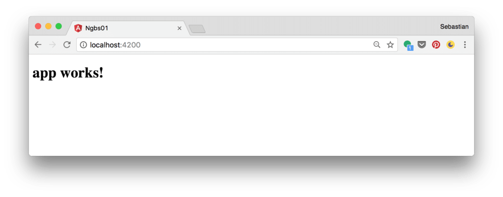
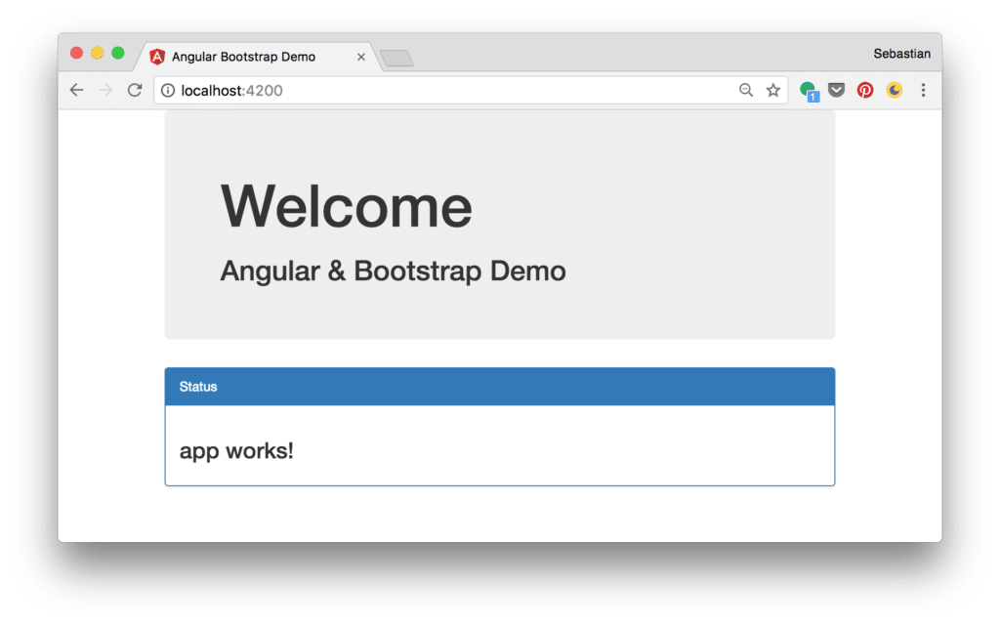
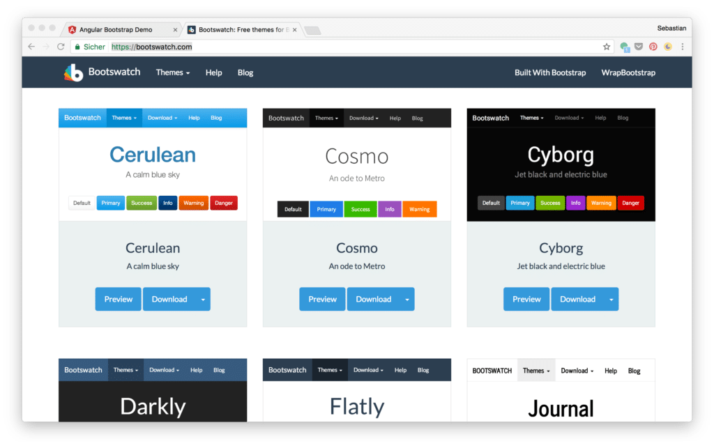
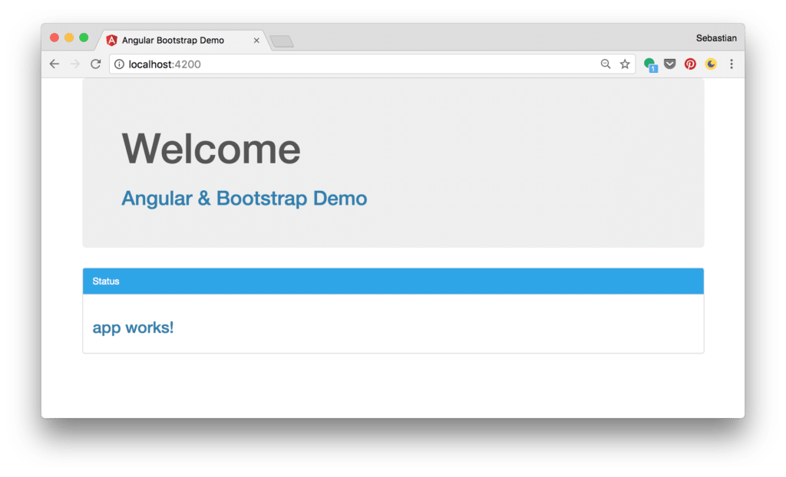
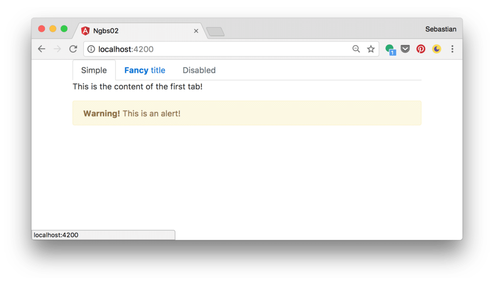
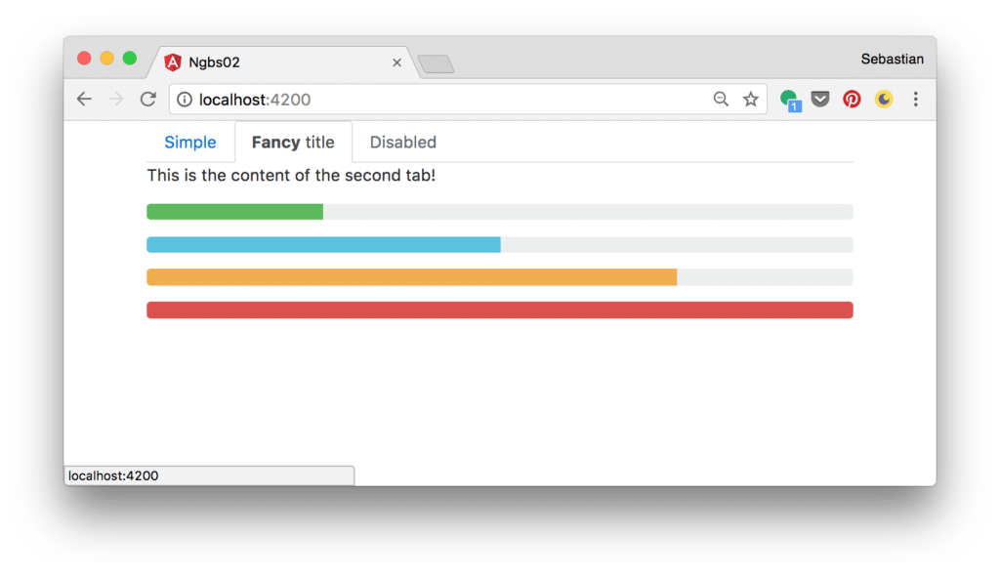

import { Image } from '@astrojs/image/components';
import YouTube from '~/components/widgets/YouTube.astro';
export const components = { img: Image };

<YouTube url="https://youtu.be/nZbZ5AHZJnc" />

Bootstrap is the most popular HTML, CSS, and JavaScript framework for web front-end development. It's great for developing responsive, mobile-first web sites. The Bootstrap website is available at [http://getbootstrap.com/](http://getbootstrap.com/). The Bootstrap framework can be used together with modern JavaScript web & mobile frameworks like Angular. In the following you'll learn how to use the Bootstrap framework in your Angular project. Furthermore we'll take a look at the Ng-Bootstrap project which delivers Angular Bootstrap components which can be used out of the box.

## Setting Up An Angular Project With Angular CLI

First, let's start with generating a new Angular project. The easiest way to do so, is to use the Angular Command Line Interface (CLI) to generate a new project. The Angular CLI project can be found at [https://cli.angular.io/](https://cli.angular.io/). First you need to make sure that Angular CLI is installed on your system. As Angular CLI comes as an NPM package the installation can be done by using the following command:

`$ npm install -g @angular/cli`

Having installed it successfully you can now use Angular CLI to initiate a new project in the following way:

`$ ng new myproject`

Now you can change into that directory and start up the web server:

`$ cd myproject` `$ ng serve`

You'll see the following result in the browser:



## Install Bootstrap

Now that the Angular project is ready and running we can continue and adding Bootstrap to the project. There are different ways of adding the library to your project. Let's take a look at the different options:

### Adding Bootstrap From CDN

The include Bootstrap in your project we need to add two files:

- Bootstrap CCS file
- Bootstrap JavaScript file

The JavaScript parts of Bootstrap are depending on jQuery. So we need the jQuery JavaScript library file too.

All those files can be directly added from a CDN (Content Delivery Network) to your project. The CDN links for Bootstrap can be found at [http://getbootstrap.com/getting-started/](http://getbootstrap.com/getting-started/) and the link to jQuery can be found at [https://code.jquery.com/](https://code.jquery.com/).

Open file _src/index.html_ and insert

- the `<link>` element at the end of the head section to include the Bootstrap CSS file
- a `<script>` element to include jQuery at the bottom of the body section
- a `<script>` element to include the Bootstrap JavaScript file at the bottom of the body section

Now you _index.html_ file should look like the following:

```html
<!doctype html>
<html>
<head>
  <meta charset="utf-8">
  <title>Angular Bootstrap Demo</title>
  <base href="/">

  <meta name="viewport" content="width=device-width, initial-scale=1">
  <link rel="icon" type="image/x-icon" href="favicon.ico">
  <link rel="stylesheet" href="https://maxcdn.bootstrapcdn.com/bootstrap/3.3.7/css/bootstrap.min.css" integrity="sha384-BVYiiSIFeK1dGmJRAkycuHAHRg32OmUcww7on3RYdg4Va+PmSTsz/K68vbdEjh4u" crossorigin="anonymous">
</head>
<body>
  <app-root>Loading...</app-root>
  <script src="https://code.jquery.com/jquery-3.1.1.min.js" integrity="sha256-hVVnYaiADRTO2PzUGmuLJr8BLUSjGIZsDYGmIJLv2b8=" crossorigin="anonymous"></script>
  <script src="https://maxcdn.bootstrapcdn.com/bootstrap/3.3.7/js/bootstrap.min.js" integrity="sha384-Tc5IQib027qvyjSMfHjOMaLkfuWVxZxUPnCJA7l2mCWNIpG9mGCD8wGNIcPD7Txa" crossorigin="anonymous"></script>
</body>
</html>
```

Now we're ready to make use of Bootstrap in one of our component templates. Let's try it out by opening file _src/app/app.component.html_ and insert the following HTML template code:

```html
<div class="container">
  <div class="jumbotron">
    <h1>Welcome</h1>
    <h2>Angular & Bootstrap Demo</h2>
  </div>

  <div class="panel panel-primary">
    <div class="panel-heading">Status</div>
    <div class="panel-body">
      <h3>{{title}}</h3>
    </div>
  </div>
</div>
```

The result in the browser now looks like the following:



You can also change to another Bootstrap theme, e.g. from Bootswatch ([https://bootswatch.com/](https://bootswatch.com/)). On the Website just select a theme and click on the “Download” button. The corresponding bootstrap.min.css file opens in another Browser window, so that you can copy the URL.



Go back to _index.html_ and replace the string which is assigned to the href attribute of the `<link>` element with this new URL:

`<link rel="stylesheet" href="[https://bootswatch.com/cerulean/bootstrap.min.css](https://bootswatch.com/cerulean/bootstrap.min.css)">`

Now the browser output changes to the colors defined by the new theme:



### Adding Bootstrap Via NPM

Another way to add Bootstrap to your Angular project is to install it into your project folder by using NPM.

`$ npm install bootstrap@3 jquery --save`

This installs Bootstrap and jQuery into the _node\_modules_ folder within the project directory and makes sure that both dependencies are added to the _package.json_ file as well.

After both packages have been installed successfully the jQuery and Bootstrap files can be found at:

- _node_modules/jquery/dist/jquery.min.js_
- _node_modules/bootstrap/dist/css/bootstrap.min.css_
- _node_modules/bootstrap/dist/js/bootstrap.min.js_

To add those files to the project you can either

- by adding the corresponding `<link>` and `<script>` elements to _index.html_ like we did it before

or

- by adding the file paths to the styles and scripts array in file _.angular-cli.json_:

```js
  "styles": \[
    "styles.css",
    "../node\_modules/bootstrap/dist/css/bootstrap.min.css"
  \],
  "scripts": \[
    "../node\_modules/jquery/dist/jquery.min.js",
    "../node\_modules/bootstrap/dist/js/bootstrap.min.js"
  \],
```

## Using Ng-Bootstrap

Ng-Bootstrap contains a set of native Angular directives based on Bootstrap's markup and CSS. As a result no dependency on jQuery or Bootstrap's JavaScript is required. Ng-Bootstrap is based on Bootstrap 4 and can be added to your Angular project is the following way.

Ng-Bootstrap is available as a NPM package, so the installation can be done by using the following command in the project directory:

`npm install --save @ng-bootstrap/ng-bootstrap`

Furthermore Ng-Bootstrap required Bootstrap 4 to be added to our project. Install it via:

`$ npm install bootstrap@4.0.0-alpha.6`

Now add _bootstrap.min.css_, _jquery.min.js_ and _bootstrap.min.js_ to you _.angular-cli.json_ file, like we did it before.

Once installed you need to import Ng-Bootstrap's main module _NgbModule_ from the package _@ng-bootstrap/ng-bootstrap_. Add the following import statement to _app.module.ts_:

`import {NgbModule} from '@ng-bootstrap/ng-bootstrap';`

Next, we need to add this module to the imports array of the _@NgModule_ decorator. If you want to import _NgbModule_ in your root module (e.g. _AppModule_) you need to call the _forRoot()_ factory method, as you can see in the following:

```js
@NgModule({
  declarations: \[AppComponent, ...\],
  imports: \[NgbModule.forRoot(), ...\],
  bootstrap: \[AppComponent\]
})
export class AppModule {
}
```

If you want to import _NgbModule_ in other modules (child modules of your root application module) you need to add it without calling the _forRoot()_ method:

```js
@NgModule({
  declarations: \[OtherComponent, ...\],
  imports: \[NgbModule, ...\]
})
export class OtherModule {
}
```

### Ng-Bootstrap Components

Having imported _NgbModule_ in your Angular application you can now make use of the Ng-Bootstrap components in your templates. The following components are available:

- Accordion
- Alert
- Buttons
- Carousel
- Collapse
- Datepicker
- Dropdown
- Modal
- Pagination
- Popover
- Progressbar
- Rating
- Tabs
- Timepicker
- Tooltip
- Typeahead

Let's

Let's try it out and use some of these components in _app.component.html_:

```html
<div class="container">
  <ngb-tabset>
    <ngb-tab title="Simple">
      <template ngbTabContent>
        <p>This is the content of the first tab!</p>
        <ngb-alert \[dismissible\]="false">
          <strong>Warning!</strong> This is an alert!
        </ngb-alert>
      </template>
    </ngb-tab>
    <ngb-tab>
      <template ngbTabTitle><b>Fancy</b> title</template>
      <template ngbTabContent>
        <p>This is the content of the second tab!</p>
        <p><ngb-progressbar type="success" \[value\]="25"></ngb-progressbar></p>
        <p><ngb-progressbar type="info" \[value\]="50"></ngb-progressbar></p>
        <p><ngb-progressbar type="warning" \[value\]="75"></ngb-progressbar></p>
        <p><ngb-progressbar type="danger" \[value\]="100"></ngb-progressbar></p>
      </template>
    </ngb-tab>
    <ngb-tab title="Disabled" \[disabled\]="true">
      <template ngbTabContent>
        <p>This tab is disabled</p>
      </template>
    </ngb-tab>
  </ngb-tabset>
</div>
```

The result can be seen in the following:



