import { Image } from '@astrojs/image/components';
import YouTube from '~/components/widgets/YouTube.astro';
export const components = { img: Image };

Welcome to our guide on how to set up a React project with Vite, a powerful and efficient development tool that has been gaining popularity among React developers. Vite is a lightweight build tool that offers several advantages over other popular tools like create-react-app.

Vite has a faster development experience and instant hot module replacement which means no more waiting for the browser to refresh after every change. It also has a smaller bundle size and uses native ES modules which means faster loading and update time. In this post, we will show you how to set up a React project with Vite, and explain why this combination is the ultimate choice for a fast, efficient and lightweight project setup.

Before we're going to start creating out first React project with Vite we need to take care of two prerequisites: the installation of Node.js and Yarn.

In order to install Node.js, go to the project's website https://nodejs.org/, download the software installer and follow the installer instruction to install the current Node.js version on your system:

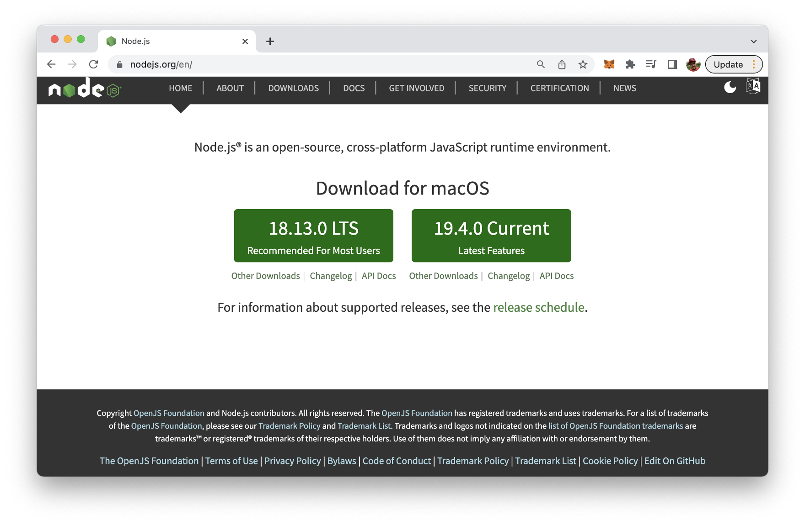

You can then check for the installed Node.js version by using the following command:

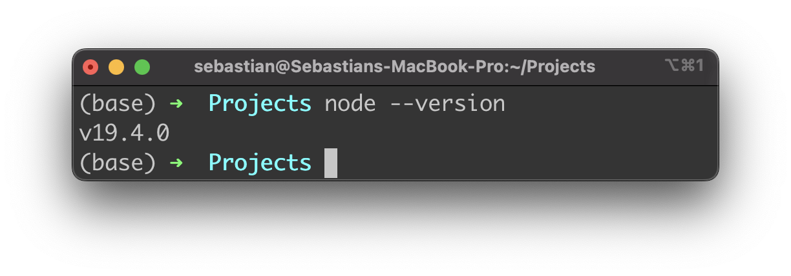

Next, we need to install the Yarn package manager as well. Yarn's website can be found at: https://yarnpkg.com/:

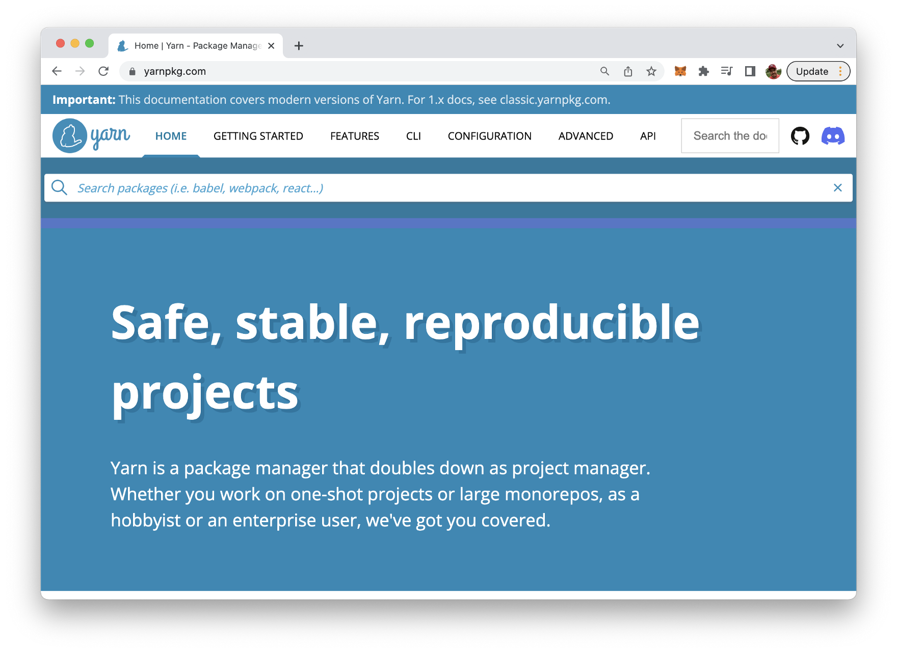

The preferred way to manage Yarn is through Corepack. Corepack is part of the Node.js installation and needs to be enabled by typing in:

```bash
$ corepack enable
```

Then Corepack can be used to install Yarn:

```bash
$ corepack prepare yarn@stable --activate
```

The yarn command is then activated and available on your system:

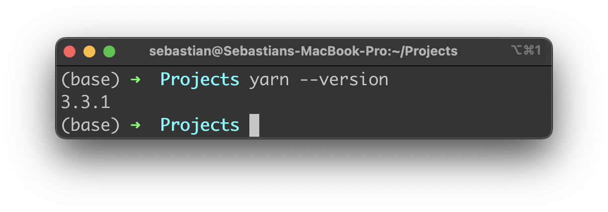

## Creating A React Project With Vite

Let's now create a new React project with vite. Type in the following command to start the creation process on the command line:

```bash
$ yarn create vite
```

You'll then be prompted to enter a new project name next:

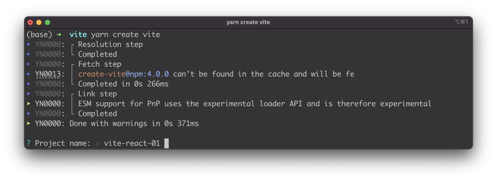

Type in vite-react-01 and hit return to continue. Vite will then provide you with a list of JavaScript frameworks you can choose from. Use the arrow key to select the entry "React" and hit return again:

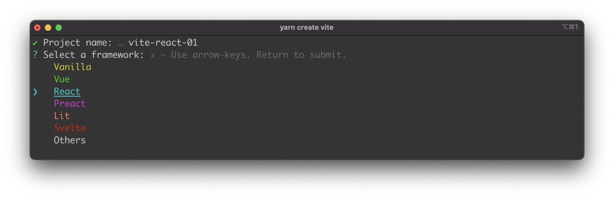

Once you've selected "React" you're asked to specify the variant of the React project. You have four options to choose from:

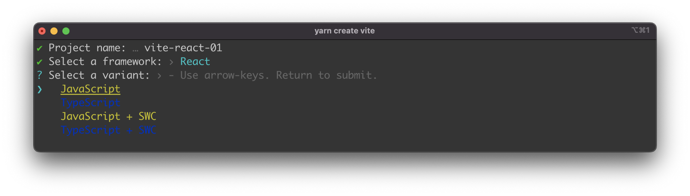

* JavaScript
* TypeScript
* JavaScript + SWC
* TypeScript + SWC

So you can decide to create a React project which is using just plain JavaScript or which is supporting Typescript as well. In additon you can choose to use SWC which is a new Rust-based bundler, which claims to be a lot of faster then JS-based bundlers. For the example of this article we're choosing option "TypeScript +SWC".

Once selected the project setup is completed:

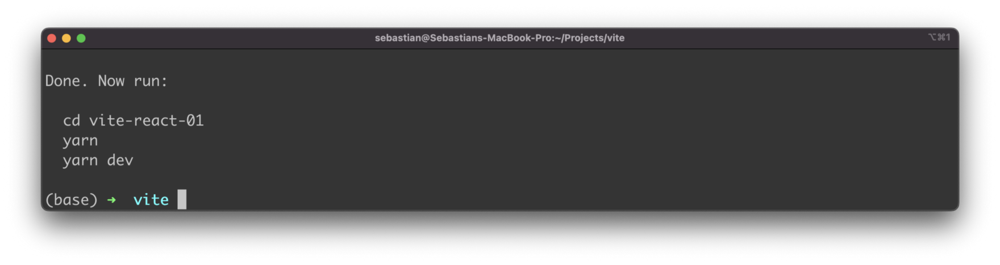

You can now enter the new project directory (with the name of the project you've entered:

```bash
$ cd vite-react-01
```

Next you need to execute the yarn command:

```bash
$ yarn
```

This makes sure that all the needed dependencies of the project are being downloaded and installed:

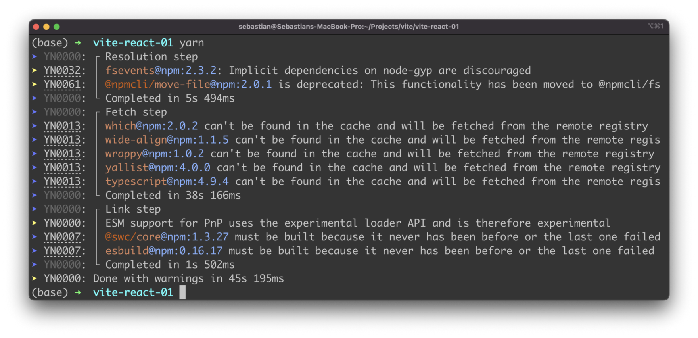

Next we're starting the development web server with command:

```bash
$ yarn dev
```

As a response you can see that the server was started on port 5173:

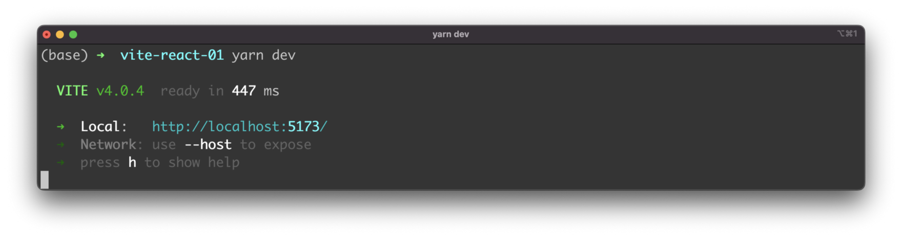

Accessing it in the browser will present the following website to you:

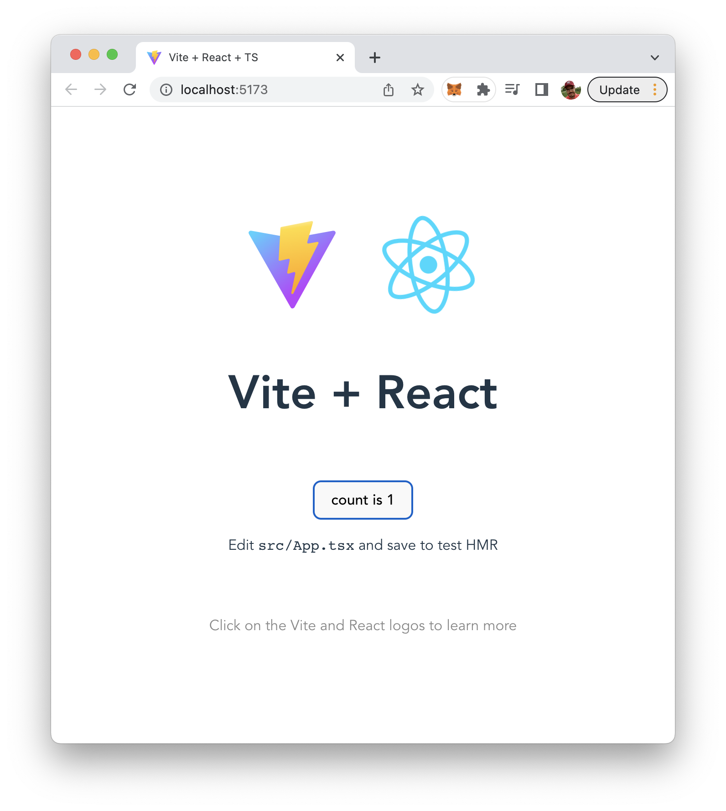

## Conclusion

Vite and React are an ultimate combination for fast and efficient project setup. By using Vite as your development server and React as your front-end library, you can enjoy a faster development experience, instant hot module replacement, smaller bundle size, and faster loading times. Setting up a React project with Vite is also a straightforward process, and we hope this guide has helped you understand how to do it.