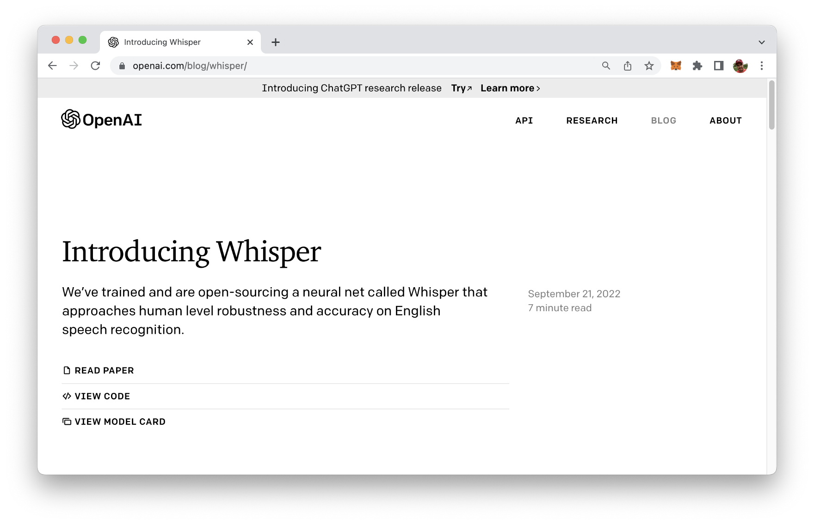
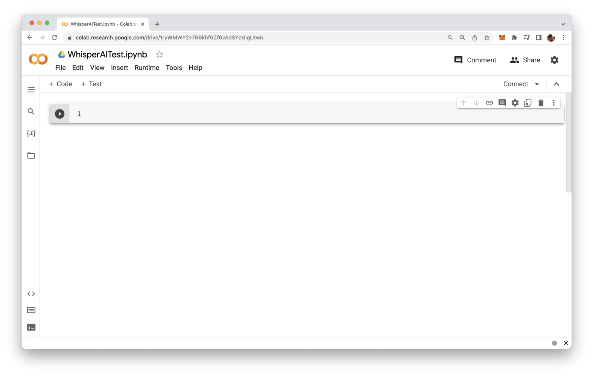
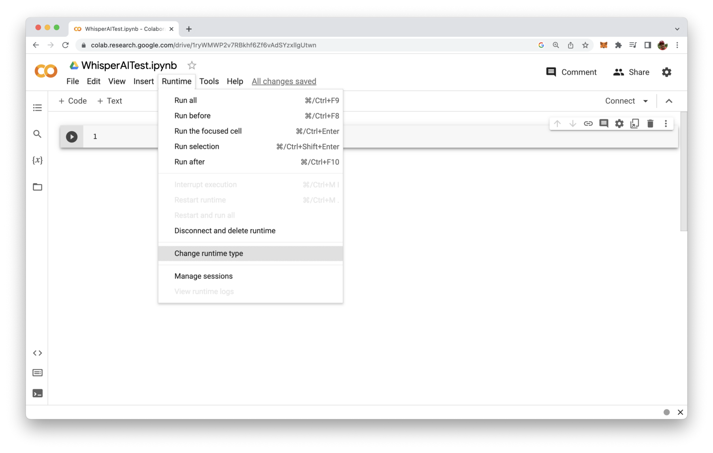
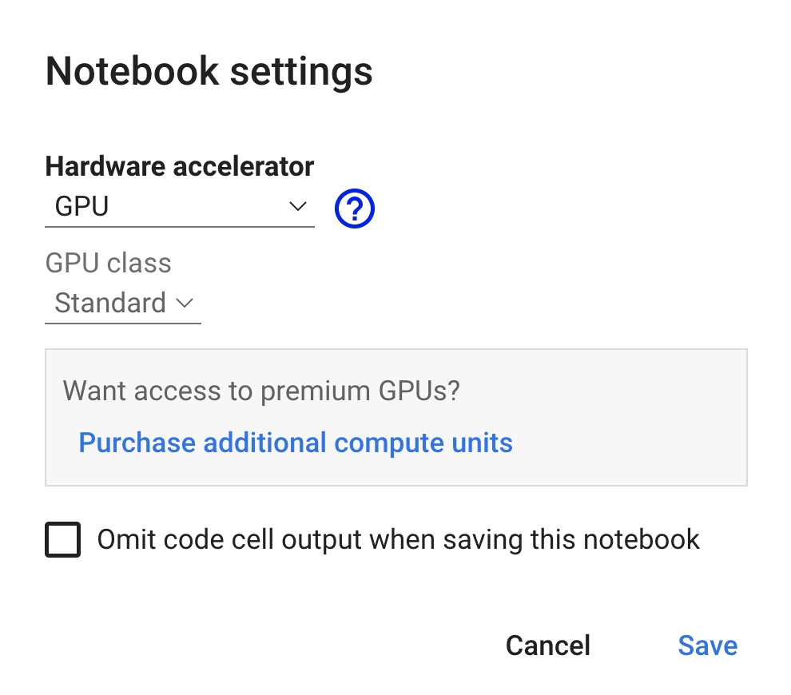
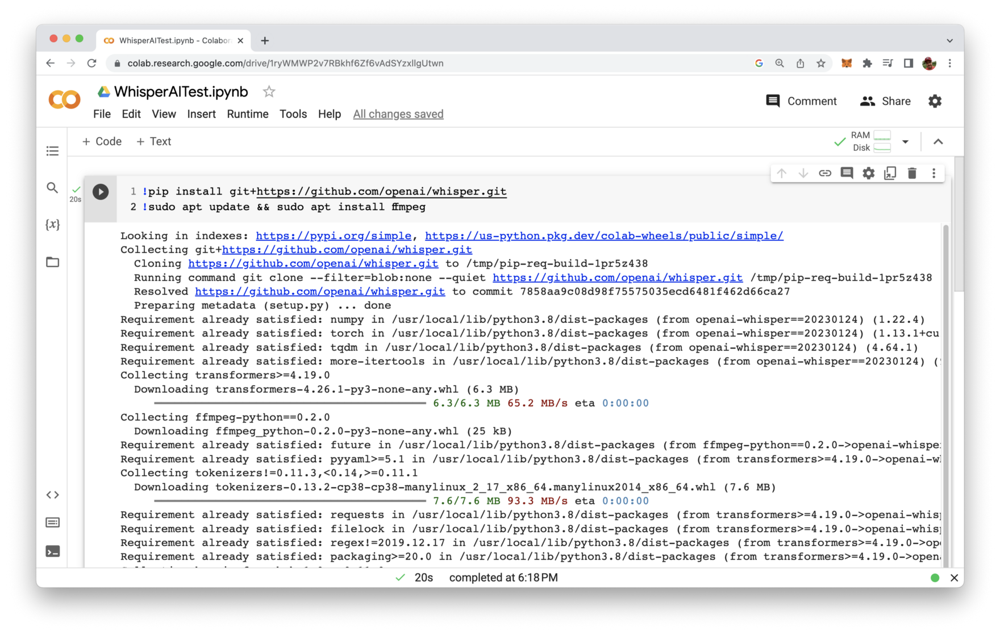
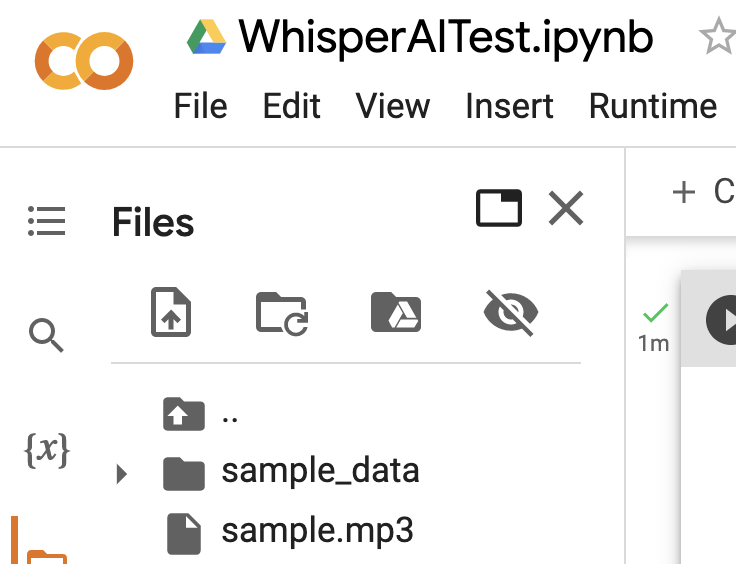
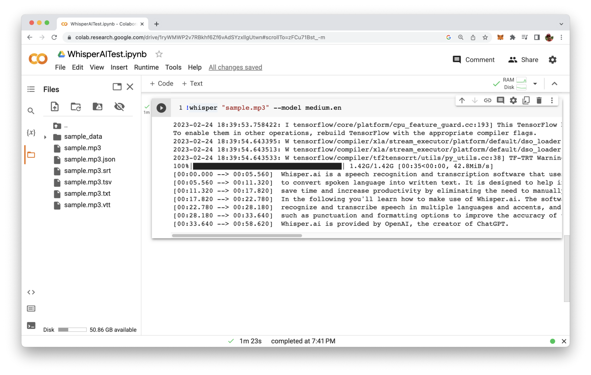
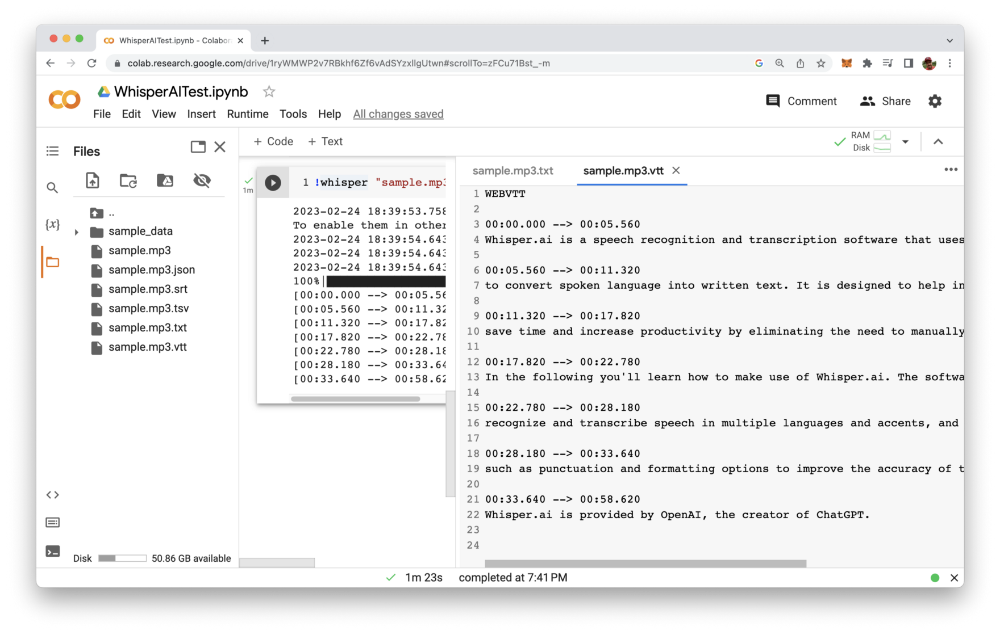
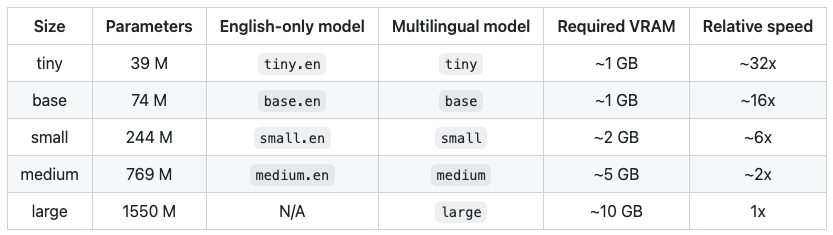

import { Image } from '@astrojs/image/components';
import YouTube from '~/components/widgets/YouTube.astro';
export const components = { img: Image };

Whisper AI is a speech recognition and transcription software that uses artificial intelligence (AI) to convert spoken language into written text. It is designed to help individuals and businesses save time and increase productivity by eliminating the need to manually transcribe spoken content. In the following you’ll learn how to make use of Whisper AI!

The software is able to recognize and transcribe speech in multiple languages and accents, and it offers features such as punctuation and formatting options to improve the accuracy of transcriptions. Whisper AI is provided by OpenAI, the creator of ChatGPT.

You can find a a general introduction into Whisper AI at https://openai.com/blog/whisper/:



Whisper AI can be retrieved from GitHub, the repository is available at https://github.com/openai/whisper:


## Installing Whisper AI

The speech-to-text AI can be installed by using Python's package manager pip:

```bash
$ pip install git+https://github.com/openai/whisper.git
```

As the model is quite big we'll not be downlaoding and executing Whisper AI locally. Instead we're going to use Google's Colaboratory, a cloud Python development environment which is accessible in the browser. Colaboratory is available at https://colab.research.google.com/ and can be accessed with your Google account.

Create a new Colab notebook and name it _WhisperAITest.ipynb_ like you can see in the following screenshot:



From the Runtime menu select menu entry Change runtime type as you can see in the following screenshot:



The takes you to the following screen where you have the possibility to change the Hardware accelerator setting the GPU:



By applying this setting we're making sure that you get the best performance when executing the AI model.

In order to install Whisper we need to use the following two commands which needs to be inserted into the first cell of the Colaboratory notebook:

```
!pip install git+https://github.com/openai/whisper.git
!sudo apt update && sudo apt install ffmpeg
```

The first command is making sure that the Whisper AI package is being downloaded and installed in the development environment.

By using the second command we're installation the ffmpeg tool which is a complete, cross-platform solution to record, convert and stream audio and video. This tool is used by Whisper to get access to audio / video files.

In order to execute both command you need to hit the execution button on the left side of the cell. You should then be able to see an output similar to the following:



## Upload Audio File To Colaboratory

Next, open the Files view on the left side panel of Colaboratory and upload a sample MP3 file which contains an audio stream of speech in English language:



## Run Whisper AI

With that preparation in place we're ready to run Whisper by executing the whisper command in another code cell in the following way:

```
!whisper "sample.mp3" --model medium.en
```

Herewith we're defining that the previously uploaded sample.mp3 file should be processed and we're choosing Whisper's medium model for English language.

When executing this code cell you'll first noticed that the model is being downloaded. The medium model has a size o 1.42 gigabytes in total. Once the download is completed the audio file is processed and we're getting back the text transcription:



In addition to the text transcript output which is presented in the code execution cell you can also see that files have been added to the project as well:



The files which have been added are:

* sample.mp3.json
* sample.mp3.srt
* sample.mp3.tsv
* sample.mp3.txt
* sample.mp3.vtt

Those file are containing the generated text as well in different formats. E.g. the file sample.mp3.txt contains just plain text and the file sample.mp3.vtt contains the text in a format where are time stamp information added in addition.

If you want to get an overview of all whisper command line options you can type in

```
!whisper -h
```

You'll then be provided with an overview of all command line options which can be used:


## Choose The Right Wisper AI Model

In the last example we've been using the the medium.en model. This model is of a medium size and is only supporting English language.

Whisper AI is offering the following models you can choose from:



Beside models which are only supporting English language, multi-language models are available as well. The model size is increasing from tiny model up to the large model. By using a larger model size you'll receive a better result. However, the execution time is increasing as well.

If you're not sure which model to use for your specific transcription task it is a good idea to start with the medium model first.

## Conclusion

In conclusion, Whisper AI is an excellent free speech to text AI tool that can significantly improve your writing efficiency and productivity. With its advanced speech recognition and transcription technology, Whisper AI can accurately convert spoken content into written text in multiple languages and accents, making it a versatile tool for individuals and businesses alike. So if you're looking for a reliable and efficient speech to text tool, be sure to give Whisper AI a try and experience the power of AI-driven transcription for yourself!