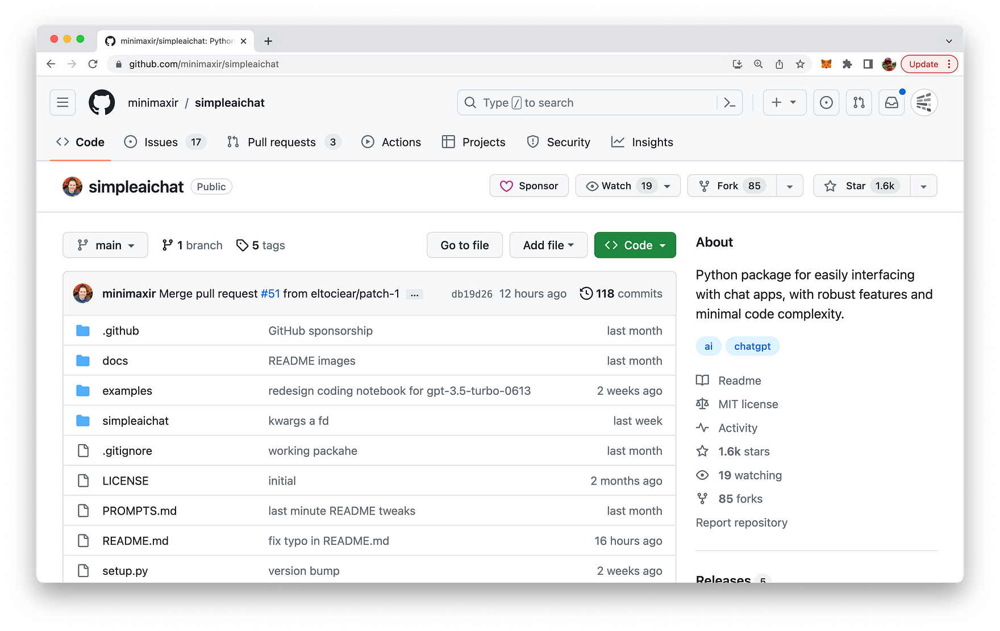

import { Image } from '@astrojs/image/components';
import YouTube from '~/components/widgets/YouTube.astro';
export const components = { img: Image };

In the ever-evolving world of technology, Python continues to be a versatile language that offers robust solutions for various applications. One such application is the interfacing with chat applications, and a Python package that stands out in this regard is simpleaichat. This package is a game-changer, offering robust features with minimal code complexity. In this blog post, we'll delve into the world of simpleaichat, exploring its features, how to use it, and providing step-by-step examples to help you get started.

## Overview of simpleaichat

Simpleaichat is a Python package designed to interface easily with chat applications like ChatGPT and GPT-4. It is optimized for working with ChatGPT as fast and as cheap as possible, but it's also capable of modern AI tricks that surpass most implementations. With SimpleAICHAT, you can create and run chats with only a few lines of code, run multiple independent chats simultaneously, and enjoy a minimal codebase that doesn't require deep dives to understand what's happening under the hood.
You can find the project on Github. The repository link is: https://github.com/minimaxir/simpleaichat



## How to Use simpleaichat

To get started with simpleaichat, you first need to install it from PyPI using the command pip3 install simpleaichat. Once installed, you can demo chat-apps very quickly with simpleaichat. You will need to get an OpenAI API key, and then with one line of code, you can start an interactive chat.

```python
from simpleaichat import AIChat
AIChat(api_key="sk-...")
```

This AI chat will mimic the behavior of OpenAI's webapp, but on your local computer. You can also create your own custom conversations by inputting any person, place, or thing, fictional or nonfictional, that you want to chat with.

```python
AIChat("Steve Jobs") # assuming API key loaded via methods above
```

## Step-by-Step Examples

Let's dive into some examples to better understand how Simpleaichat works.

## Creating a Python Coding Assistant

With simpleaichat, you can create a Python coding assistant without any unnecessary accompanying output.

```python
ai = AIChat(system="You are a helpful assistant.")
response = ai("What is the capital of California?")
print(response)
```

The output will be: The capital of California is Sacramento.

## Streaming Responses

If the text generation itself is too slow, you can stream responses by token with a generator.

```python
for chunk in ai.stream("What is the capital of California?", params={"max_tokens": 5}):
    response_td = chunk["response"]
    print(response_td)
```

The output will be:

```
The
The capital
The capital of
The capital of California
The capital of California is
```

## Conclusion

Simpleaichat is a powerful tool that simplifies the process of interfacing with chat applications. Its robust features, minimal code complexity, and the ability to create custom conversations make it an invaluable resource for developers and AI enthusiasts. Whether you're looking to create a Python coding assistant or stream responses for faster text generation, simpleaichat has got you covered. So why wait? Start exploring the world of AI chat with simpleaichat today!